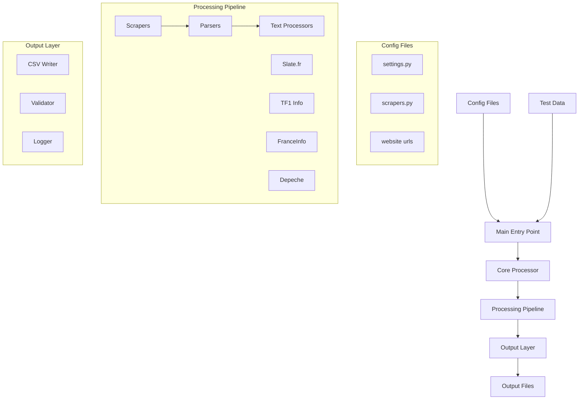

# French Article Scraper - Complete System Documentation

> [!abstract] System Overview
> A modular French news article scraper designed for language learning and vocabulary analysis. Supports multiple sources, concurrent processing, and structured output.

## Table of Contents
- [[#Overview|Overview]]
- [[#Architecture Diagram|Architecture Diagram]]  
- [[#Directory Structure|Directory Structure]]
- [[#System Flow|System Flow]]
- [[#Core Components|Core Components]]
- [[#Configuration System|Configuration System]]
- [[#Data Flow|Data Flow]]
- [[#Testing Framework|Testing Framework]]
- [[#Development Workflow|Development Workflow]]
- [[#Adding New Features|Adding New Features]]
- [[#Troubleshooting|Troubleshooting]]
- [[#Performance Considerations|Performance Considerations]]

## Overview

This is a **French Article Scraper** system designed to collect French news articles from multiple sources, process them for vocabulary learning, and output structured data. The system is built for language learners who want to analyze French text patterns and word frequencies.

> [!tip] Key Features
> - **Multi-source scraping**: Supports multiple French news websites
> - **Concurrent processing**: Handles multiple sources simultaneously  
> - **Offline testing**: Can work with local test data
> - **Word frequency analysis**: Extracts vocabulary with context
> - **CSV export**: Structured output for further analysis
> - **Robust error handling**: Graceful degradation when sources fail

> [!note] Target Use Case
> Language learners who want to:
> 1. Collect authentic French content
> 2. Analyze word frequency patterns  
> 3. Build vocabulary with real context
> 4. Track language learning progress

---

## Architecture Diagram



> [!info] Architecture Overview
> The system follows a modular pipeline architecture with clear separation of concerns:

┌─────────────────┐    ┌─────────────────┐    ┌─────────────────┐
│   CONFIG FILES  │    │   MAIN ENTRY    │    │   TEST DATA     │
│                 │    │                 │    │                 │
│ • settings.py   │───▶│   main.py       │◀───│ • test_data/    │
│ • scrapers.py   │    │                 │    │ • fixtures/     │
│ • website urls  │    │ ┌─────────────┐ │    │ • offline mode  │
└─────────────────┘    │ │OFFLINE/LIVE │ │    └─────────────────┘
                       │ │   SWITCH    │ │
                       │ └─────────────┘ │
                       └─────────┬───────┘
                                 │
                                 ▼
┌─────────────────────────────────────────────────────────────────┐
│                   CORE PROCESSOR                                │
│                                                                 │
│  ┌─────────────┐    ┌─────────────┐    ┌─────────────┐        │
│  │   IMPORT    │    │  PROCESS    │    │    SAVE     │        │
│  │   CLASSES   │───▶│   SOURCES   │───▶│   RESULTS   │        │
│  │             │    │             │    │             │        │
│  └─────────────┘    └─────────────┘    └─────────────┘        │
│                                                                 │
└─────────────────────┬───────────────────────────────────────────┘
                      │
                      ▼
┌─────────────────────────────────────────────────────────────────┐
│                  PROCESSING PIPELINE                            │
│                                                                 │
│ ┌──────────────┐   ┌──────────────┐   ┌──────────────┐        │
│ │   SCRAPERS   │   │   PARSERS    │   │  PROCESSORS  │        │
│ │              │   │              │   │              │        │
│ │ • Slate.fr   │──▶│ • Extract    │──▶│ • Clean text │        │
│ │ • TF1 Info   │   │   titles     │   │ • Tokenize   │        │
│ │ • FranceInfo │   │ • Extract    │   │ • Count freq │        │
│ │ • Depeche    │   │   content    │   │ • Add context│        │
│ │              │   │ • Extract    │   │              │        │
│ │ (concurrent) │   │   metadata   │   │              │        │
│ └──────────────┘   └──────────────┘   └──────────────┘        │
└─────────────────────┬───────────────────────────────────────────┘
                      │
                      ▼
┌─────────────────────────────────────────────────────────────────┐
│                     OUTPUT LAYER                                │
│                                                                 │
│ ┌──────────────┐   ┌──────────────┐   ┌──────────────┐        │
│ │ CSV WRITER   │   │  VALIDATOR   │   │   LOGGER     │        │
│ │              │   │              │   │              │        │
│ │ • Daily files│   │ • Data check │   │ • Structured │        │
│ │ • Word rows  │   │ • URL check  │   │ • Debug info │        │
│ │ • Contexts   │   │ • Text check │   │ • Error track│        │
│ │ • Thread-safe│   │              │   │              │        │
│ └──────────────┘   └──────────────┘   └──────────────┘        │
└─────────────────────────────────────────────────────────────────┘

                              │
                              ▼
                    ┌─────────────────┐
                    │ OUTPUT FILES    │
                    │                 │
                    │ • YYYY-MM-DD.csv│
                    │ • logs/         │
                    │ • debug info    │
                    └─────────────────┘
```

---

## Directory Structure

> [!example]- File Tree Structure
> ```
> publicite_francais/
> ├── 📁 src/                          # Main source code
> │   ├── 📁 config/                   # Configuration files
> │   │   ├── settings.py              # Global settings (OFFLINE, DEBUG)
> │   │   └── website_parser_scrapers_config.py  # Source configurations
> │   │
> │   ├── 📁 core/                     # Core business logic
> │   │   └── processor.py             # Main orchestrator class
> │   │
> │   ├── 📁 scrapers/                 # URL discovery components
> │   │   ├── slate_fr_scraper.py      # Slate.fr URL extractor
> │   │   ├── france_info_scraper.py   # FranceInfo URL extractor
> │   │   ├── tf1_info_scraper.py      # TF1 Info URL extractor
> │   │   └── ladepeche_fr_scraper.py  # Depeche URL extractor
> │   │
> │   ├── 📁 parsers/                  # Content extraction components
> │   │   ├── base_parser.py           # Abstract base parser class
> │   │   ├── slate_fr_parser.py       # Slate.fr content extractor
> │   │   ├── france_info_parser.py    # FranceInfo content extractor
> │   │   ├── tf1_info_parser.py       # TF1 Info content extractor
> │   │   └── ladepeche_fr_parser.py   # Depeche content extractor
> │   │
> │   ├── 📁 utils/                    # Utility modules
> │   │   ├── csv_writer.py            # CSV output handler
> │   │   ├── french_text_processor.py # Text processing & analysis
> │   │   ├── structured_logger.py     # Logging system
> │   │   └── validators.py            # Data validation
> │   │
> │   ├── 📁 test_data/               # Test data for offline mode
> │   │   └── raw_url_soup/           # Cached HTML files
> │   │       ├── slate_fr/           # Slate.fr test files
> │   │       ├── france_info/        # FranceInfo test files
> │   │       ├── tf1_fr/             # TF1 test files
> │   │       └── depeche_fr/         # Depeche test files
> │   │
> │   ├── 📁 output/                  # Generated output files
> │   └── 📁 logs/                    # System logs
> │
> ├── 📁 tests/                       # Test suite
> │   ├── 📁 integration/             # Integration tests
> │   │   ├── test_basic_functionality.py
> │   │   └── test_offline_mode.py
> │   ├── 📁 fixtures/                # Test fixtures
> │   ├── test_essential.py           # Core functionality tests
> │   └── conftest.py                 # Pytest configuration
> │
> ├── 📁 .github/                     # GitHub automation
> │   └── workflows/
> │       └── tests.yml               # CI/CD pipeline
> │
> ├── Makefile                        # Development commands
> ├── requirements.txt                # Python dependencies
> ├── Dockerfile                      # Container configuration
> └── SYSTEM_DOCUMENTATION.md         # This file
> ```

---

## System Flow

> [!summary] High-Level Flow
> ```mermaid
> flowchart LR
>     A[START] --> B[Load Config]
>     B --> C[Initialize Components]
>     C --> D[Process Sources]
>     D --> E[Save Results]
>     E --> F[END]
> ```

> [!example]- Detailed Processing Flow
> ```
> 1. INITIALIZATION
>    ├── Load settings (OFFLINE mode, DEBUG flags)
>    ├── Load scraper configurations
>    └── Setup logging
> 
> 2. COMPONENT CREATION (for each source)
>    ├── Import scraper class dynamically
>    ├── Import parser class dynamically
>    ├── Create instances with configuration
>    └── Handle import errors gracefully
> 
> 3. CONTENT ACQUISITION
>    ├── IF OFFLINE MODE:
>    │   └── Load cached HTML files from test_data/
>    └── IF LIVE MODE:
>        ├── Scraper discovers article URLs
>        ├── Fetch HTML content from URLs
>        └── Handle network errors
> 
> 4. CONTENT PROCESSING (concurrent)
>    ├── Parser extracts article content
>    ├── Text processor cleans and tokenizes
>    ├── Calculate word frequencies
>    └── Extract word contexts
> 
> 5. OUTPUT GENERATION
>    ├── Validate processed data
>    ├── Write to daily CSV file
>    └── Log processing statistics
> 
> 6. ERROR HANDLING (throughout)
>    ├── Log errors with context
>    ├── Continue processing other sources
>    └── Graceful degradation
> ```

---

## Core Components

### 1. Main Entry Point (`src/main.py`)

**Purpose**: Orchestrates the entire system execution.

**Key Functions**:
```python
def main():
    # 1. Setup logging
    # 2. Load configurations
    # 3. Process all enabled sources concurrently
    # 4. Log final statistics
```

**How it works**:
1. Determines if running in OFFLINE or LIVE mode
2. Loads all scraper configurations
3. Processes each enabled source using ThreadPoolExecutor
4. Aggregates and logs final results

### 2. Core Processor (`src/core/processor.py`)

**Purpose**: Central orchestrator that manages the entire pipeline for each news source.

**Key Methods**:
```python
class ArticleProcessor:
    @staticmethod
    def import_class(class_path: str) -> type:
        # Dynamically imports classes from string paths
        
    @classmethod  
    def process_source(cls, config: ScraperConfig) -> Tuple[int, int]:
        # Main processing pipeline for a single source
        # Returns (processed_count, attempted_count)
```

**Processing Steps**:
1. **Dynamic Import**: Loads scraper and parser classes from configuration
2. **Content Acquisition**: Gets URLs (live) or files (offline)
3. **Processing Pipeline**: Extracts and processes article content
4. **Output**: Saves results to CSV
5. **Error Handling**: Logs errors, continues processing

### 3. Scrapers (`src/scrapers/`)

**Purpose**: Discover article URLs from news website homepages.

**Base Pattern**:
```python
class NewsSourceScraper:
    def __init__(self, debug=None):
        self.logger = get_structured_logger(self.__class__.__name__)
        self.base_url = "https://example.com/"
        self.headers = {"User-Agent": "..."}
        
    def get_article_urls(self, max_articles=8) -> List[str]:
        # 1. Fetch homepage HTML
        # 2. Parse for article links
        # 3. Return list of URLs
```

**Current Scrapers**:
- **SlateFrURLScraper**: Extracts from Slate.fr homepage
- **FranceInfoURLScraper**: Extracts from FranceInfo homepage  
- **TF1InfoURLScraper**: Extracts from TF1 Info homepage
- **LadepecheFrURLScraper**: Extracts from Depeche homepage

### 4. Parsers (`src/parsers/`)

**Purpose**: Extract article content (title, text, date) from individual article pages.

**Base Pattern**:
```python
class NewsSourceParser(BaseParser):
    def parse_article(self, soup: BeautifulSoup) -> Optional[Dict[str, Any]]:
        # 1. Extract article title
        # 2. Extract article content
        # 3. Extract publication date
        # 4. Return structured data
        
        return {
            "title": title,
            "full_text": content, 
            "article_date": date,
            "date_scraped": datetime.now().strftime("%Y-%m-%d"),
            "num_paragraphs": len(paragraphs)
        }
```

### 5. Text Processor (`src/utils/french_text_processor.py`)

**Purpose**: Processes French text for vocabulary analysis.

**Key Functions**:
```python
class FrenchTextProcessor:
    def process(self, text: str, top_n: int = 10) -> Dict[str, Any]:
        # Complete processing pipeline
        
    def clean_text(self, text: str) -> str:
        # Remove extra whitespace, normalize
        
    def tokenize(self, text: str) -> List[str]:
        # Split into words, lowercase, remove punctuation
        
    def remove_stopwords(self, tokens: List[str]) -> List[str]:
        # Filter out common French words
        
    def count_words(self, tokens: List[str]) -> Dict[str, int]:
        # Calculate word frequencies
```

### 6. CSV Writer (`src/utils/csv_writer.py`)

**Purpose**: Thread-safe CSV output for vocabulary data.

**Key Features**:
- **Daily files**: Creates files named `YYYY-MM-DD.csv`
- **Word-based rows**: Each row represents one word occurrence
- **Duplicate detection**: Prevents re-processing same articles
- **Thread safety**: Safe for concurrent access

**CSV Format**:
```csv
word,context,source,article_date,scraped_date,title,frequency
bonjour,"bonjour le monde",slate.fr,2025-07-14,2025-07-14,"Article Title",3
monde,"bonjour le monde",slate.fr,2025-07-14,2025-07-14,"Article Title",2
```

---

## Configuration System

### 1. Global Settings (`src/config/settings.py`)

**Purpose**: System-wide configuration flags.

```python
# Core settings
OFFLINE = True  # Use test data instead of live scraping
DEBUG = True    # Enable detailed logging

# Paths
OUTPUT_DIR = "output"
LOG_DIR = "logs"
```

### 2. Source Configuration (`src/config/website_parser_scrapers_config.py`)

**Purpose**: Defines which news sources to process and how.

```python
@dataclass
class ScraperConfig:
    name: str                    # Display name
    enabled: bool               # Whether to process
    scraper_class: str          # Full path to scraper class
    parser_class: str           # Full path to parser class
    scraper_kwargs: Optional[Dict] = None
    parser_kwargs: Optional[Dict] = None

SCRAPER_CONFIGS = [
    ScraperConfig(
        name="Slate.fr",
        enabled=True,
        scraper_class="scrapers.slate_fr_scraper.SlateFrURLScraper",
        parser_class="parsers.slate_fr_parser.SlateFrArticleParser",
        scraper_kwargs={"debug": True},
    ),
    # ... more sources
]
```

---

## Data Flow

### Input Data Flow
```
LIVE MODE:
Website Homepage ──▶ Scraper ──▶ Article URLs ──▶ HTTP Fetch ──▶ HTML Content

OFFLINE MODE:  
Test Data Files ──▶ Local File Read ──▶ HTML Content
```

### Processing Data Flow
```
HTML Content ──▶ Parser ──▶ Article Data ──▶ Text Processor ──▶ Word Analysis
                    │              │                │               │
                    ▼              ▼                ▼               ▼
                 Title         Full Text        Clean Text     Word Frequencies
                 Date          Metadata         Tokens         Contexts
```

### Output Data Flow
```
Word Analysis ──▶ Validator ──▶ CSV Writer ──▶ Daily CSV File
      │                           │               │
      ▼                           ▼               ▼
  Structured                Thread-Safe       YYYY-MM-DD.csv
  Word Data                  File Write       with word rows
```

---

## Testing Framework

### Test Structure
```
tests/
├── test_essential.py           # 9 core functionality tests
├── integration/
│   ├── test_basic_functionality.py  # 8 integration tests
│   └── test_offline_mode.py         # 6 offline mode tests
└── conftest.py                 # Shared fixtures
```

### Test Categories

**1. Essential Tests** (9 tests - fast)
- Component initialization
- Configuration loading  
- Basic functionality
- Import validation

**2. Integration Tests** (8 tests - comprehensive)
- End-to-end pipelines
- Component interactions
- Directory structure
- Concurrent processing

**3. Offline Mode Tests** (6 tests - critical)
- **Equivalent to `make run-offline`**
- System health validation
- Error handling
- Performance checks

### Running Tests
```bash
make tests           # All 23 tests (~1 minute)
make test-essential  # Core 9 tests (~2 seconds)  
make test-integration # Integration tests (~50 seconds)
make test-offline    # Offline mode test (~10 seconds)
```

---

## Development Workflow

### Daily Development
```bash
# 1. Make code changes
vim src/some_file.py

# 2. Quick test
make test-essential

# 3. Full validation  
make test-offline

# 4. Commit changes
git add . && git commit -m "Description"

# 5. Push (triggers GitHub Actions)
git push
```

### Available Commands
```bash
# Execution
make run             # Run with current settings
make run-live        # Force live mode
make run-offline     # Force offline mode

# Testing  
make tests           # Run all tests
make test-essential  # Quick smoke test
make test-offline    # Test offline functionality

# Code Quality
make lint            # Check code style
make format          # Auto-format code
make clean           # Remove cache files

# Docker
make docker-build    # Build container
make docker-run      # Run in container
```

### GitHub Actions
**Automatic CI/CD** runs on every commit:
1. **Matrix testing**: Python 3.11 & 3.12
2. **Full test suite**: All 23 tests
3. **Code linting**: flake8 checks
4. **Build validation**: Ensure system works

---

## Adding New Features

### Adding a New News Source

**1. Create Scraper** (`src/scrapers/new_source_scraper.py`)
```python
class NewSourceURLScraper:
    def __init__(self, debug=None):
        self.logger = get_structured_logger(self.__class__.__name__)
        self.base_url = "https://newsource.com/"
        self.headers = {"User-Agent": "..."}
        
    def get_article_urls(self, max_articles=8) -> List[str]:
        # 1. Fetch homepage
        response = requests.get(self.base_url, headers=self.headers)
        soup = BeautifulSoup(response.content, "html.parser")
        
        # 2. Find article links (customize selector)
        articles = soup.find_all("article")
        urls = []
        for article in articles:
            link = article.find("a")
            if link and link.has_attr("href"):
                url = urljoin(self.base_url, link["href"])
                urls.append(url)
                
        return urls[:max_articles]
```

**2. Create Parser** (`src/parsers/new_source_parser.py`)
```python
from parsers.base_parser import BaseParser

class NewSourceArticleParser(BaseParser):
    def __init__(self):
        super().__init__(site_domain="newsource.com")
        
    def parse_article(self, soup: BeautifulSoup) -> Optional[Dict[str, Any]]:
        try:
            # Extract title (customize selector)
            title_tag = soup.find("h1", class_="article-title")
            title = title_tag.get_text(strip=True) if title_tag else "Unknown"
            
            # Extract content (customize selector) 
            content_div = soup.find("div", class_="article-content")
            if not content_div:
                return None
                
            paragraphs = [p.get_text(strip=True) 
                         for p in content_div.find_all("p")]
            full_text = "\n\n".join(paragraphs)
            
            # Extract date (customize selector)
            date_tag = soup.find("time")
            date = self._parse_date(date_tag) if date_tag else datetime.now().strftime("%Y-%m-%d")
            
            return {
                "title": title,
                "full_text": full_text, 
                "article_date": date,
                "date_scraped": datetime.now().strftime("%Y-%m-%d"),
                "num_paragraphs": len(paragraphs)
            }
            
        except Exception as e:
            self.logger.error(f"Error parsing article: {e}")
            return None
```

**3. Add to Configuration** (`src/config/website_parser_scrapers_config.py`)
```python
SCRAPER_CONFIGS = [
    # ... existing sources ...
    ScraperConfig(
        name="New Source",
        enabled=True,
        scraper_class="scrapers.new_source_scraper.NewSourceURLScraper",
        parser_class="parsers.new_source_parser.NewSourceArticleParser",
        scraper_kwargs={"debug": True},
    ),
]
```

**4. Test the New Source**
```bash
# Test with your new source
make test-offline

# Check logs for any errors
cat src/logs/latest.log
```

### Adding New Text Processing Features

**Extend FrenchTextProcessor** (`src/utils/french_text_processor.py`)
```python
class FrenchTextProcessor:
    def extract_adjectives(self, tokens: List[str]) -> List[str]:
        """Extract French adjectives from tokens."""
        # Add your implementation
        pass
        
    def find_conjugated_verbs(self, tokens: List[str]) -> Dict[str, List[str]]:
        """Find verb conjugations in text."""
        # Add your implementation  
        pass
        
    def process(self, text: str, top_n: int = 10) -> Dict[str, Any]:
        # Extend existing method
        result = super().process(text, top_n)
        
        # Add your new features
        result["adjectives"] = self.extract_adjectives(tokens)
        result["verbs"] = self.find_conjugated_verbs(tokens)
        
        return result
```

### Adding New Output Formats

**Create New Writer** (`src/utils/json_writer.py`)
```python
class JSONWriter:
    def __init__(self, output_dir="output"):
        self.output_dir = output_dir
        self.logger = get_structured_logger(self.__class__.__name__)
        
    def write_article(self, parsed_data: dict, url: str, word_data: dict):
        """Write article data to JSON format."""
        filename = f"{datetime.now().strftime('%Y-%m-%d')}.json"
        filepath = os.path.join(self.output_dir, filename)
        
        # Your JSON output logic here
        pass
```

**Integrate in Core Processor** (`src/core/processor.py`)
```python
from utils.json_writer import JSONWriter

class ArticleProcessor:
    @classmethod
    def process_source(cls, config: ScraperConfig) -> Tuple[int, int]:
        # ... existing code ...
        
        # Add additional output formats
        csv_writer = DailyCSVWriter()
        json_writer = JSONWriter()  # New format
        
        # Save in multiple formats
        csv_writer.write_article(parsed_data, url, word_freqs, word_contexts)
        json_writer.write_article(parsed_data, url, word_data)
```

---

## Troubleshooting

### Common Issues

**1. "Module not found" errors**
```bash
# Check PYTHONPATH
echo $PYTHONPATH

# Run from project root with correct path
PYTHONPATH=src python -m main
```

**2. Network errors in live mode**
```bash
# Switch to offline mode for testing
make run-offline

# Or set environment variable
OFFLINE=True make run
```

**3. Empty output files**
```bash
# Check if sources are enabled
grep "enabled.*True" src/config/website_parser_scrapers_config.py

# Check logs for errors
tail -f src/logs/latest.log
```

**4. Test failures**
```bash
# Run specific test category
make test-essential

# Check test output for specific failures
make test-offline -v
```

### Debug Mode

**Enable detailed logging**:
```python
# In src/config/settings.py
DEBUG = True
```

**Check logs**:
```bash
# View latest logs
tail -f src/logs/latest.log

# Search for errors
grep -i error src/logs/*.log
```

### Performance Issues

**1. Slow processing**
- Check if running too many sources concurrently
- Verify network connectivity in live mode
- Consider reducing `max_articles` parameter

**2. Memory usage**
- Large text processing can use significant memory
- Monitor with `top` or `htop` during execution
- Consider processing smaller batches

---

## Performance Considerations

### System Limits
- **Concurrent sources**: 4 sources process simultaneously
- **Articles per source**: 8 articles maximum (configurable)
- **Request delays**: Built-in delays prevent rate limiting
- **Memory usage**: ~50-100MB typical, ~200MB peak

### Optimization Tips

**1. Offline Mode for Development**
```bash
# Use offline mode for faster iteration
make run-offline  # ~10 seconds vs ~60 seconds live
```

**2. Selective Source Processing**
```python
# Disable sources in config for testing
ScraperConfig(
    name="Heavy Source",
    enabled=False,  # Temporarily disable
    # ...
)
```

**3. Reduced Article Counts**
```python
# In scraper initialization
def get_article_urls(self, max_articles=3):  # Reduce from 8
```

**4. Logging Level Control**
```python
# In src/config/settings.py
DEBUG = False  # Reduce log verbosity for production
```

### Monitoring

**Resource Usage**:
```bash
# Monitor during execution
watch -n 1 'ps aux | grep python'

# Check output file sizes
ls -lh src/output/
```

**Processing Statistics**:
- Logged at end of each run
- Shows articles processed per source
- Includes timing information
- Available in log files

---

## Conclusion

This French Article Scraper is a **modular, extensible system** designed for:
- **Language learners** who want authentic French content
- **Developers** who need a robust web scraping framework
- **Researchers** who want to analyze French text patterns

The architecture supports easy extension with new sources, processing algorithms, and output formats while maintaining reliability through comprehensive testing and error handling.

**Key Strengths**:
- ✅ **Modular design**: Easy to extend and modify
- ✅ **Robust error handling**: Graceful degradation
- ✅ **Comprehensive testing**: 23 tests with CI/CD
- ✅ **Offline development**: Fast iteration with test data
- ✅ **Clear documentation**: This guide helps you understand everything

**Next Steps**:
1. **Explore the code**: Start with `src/main.py` and follow the flow
2. **Run tests**: `make tests` to see everything working
3. **Try offline mode**: `make run-offline` for safe experimentation
4. **Add a new source**: Follow the guide above
5. **Customize processing**: Extend text analysis features

Happy coding! 🚀