# System Architecture - Complete System Overview

> [!abstract] Overview
> This document provides a comprehensive overview of how all components of the French article scraper system work together. It serves as the entry point for understanding the complete architecture, data flow, and component interactions across the entire system.

## Table of Contents
- [[#System Architecture Overview|System Architecture Overview]]
- [[#Component Integration Map|Component Integration Map]]
- [[#Data Flow Through the System|Data Flow Through the System]]
- [[#Processing Pipeline|Processing Pipeline]]
- [[#Component Interactions|Component Interactions]]
- [[#System Lifecycle|System Lifecycle]]
- [[#Operational Modes|Operational Modes]]
- [[#Quality Assurance Pipeline|Quality Assurance Pipeline]]
- [[#Performance and Monitoring|Performance and Monitoring]]
- [[#Error Handling and Recovery|Error Handling and Recovery]]
- [[#Extension Points|Extension Points]]

---

## System Architecture Overview

The French article scraper is a **modular, pipeline-based system** designed for extracting and analyzing French vocabulary from news articles. The system follows a clean architecture pattern with clear separation of concerns across six main component categories.

### High-Level Architecture

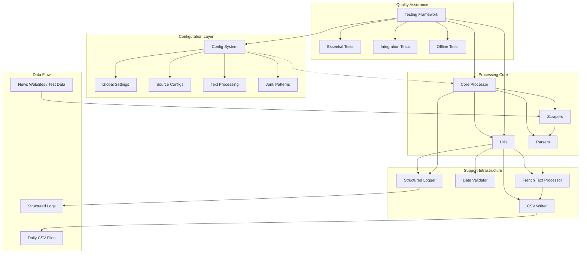

### System Components

> [!note] Six Core Component Categories
> 1. **[[01-Scrapers|Scrapers]]** - URL discovery from news homepages
> 2. **[[02-Parsers|Parsers]]** - Content extraction from article pages  
> 3. **[[03-Processor|Processor]]** - Central orchestration and pipeline management
> 4. **[[04-Testing|Testing]]** - Comprehensive test framework and quality assurance
> 5. **[[05-Utils|Utils]]** - Support infrastructure (CSV writing, text processing, validation)
> 6. **[[06-Config|Config]]** - Configuration management and system settings

---

## Component Integration Map

### Integration Architecture

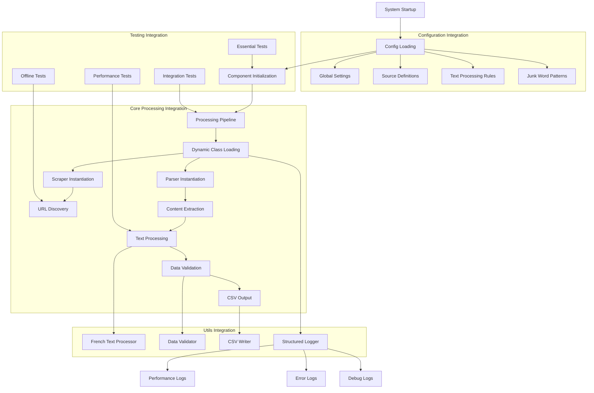

### Integration Patterns

> [!tip] Key Integration Mechanisms
> - **Configuration-Driven Loading**: Components loaded based on string paths in config
> - **Dependency Injection**: Parameters injected through configuration system
> - **Event-Driven Logging**: All components emit structured logs for monitoring
> - **Pipeline Processing**: Data flows through well-defined processing stages
> - **Error Propagation**: Errors handled at appropriate levels with recovery
> - **Concurrent Execution**: Thread-safe operations across all components

---

## Data Flow Through the System

### Complete Data Journey

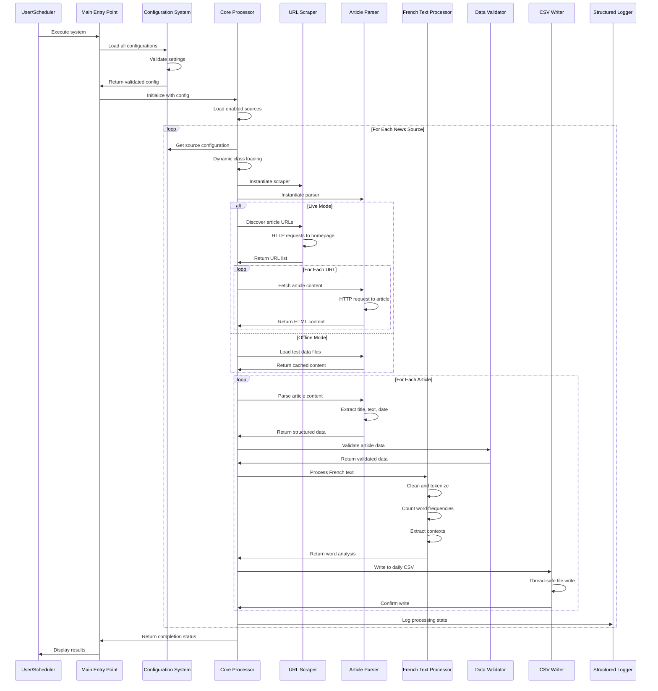

### Data Transformation Stages

> [!example] Data Transformation Pipeline
> ```
> 1. RAW INPUT DATA
>    ├── Live Mode: News website homepages → Article URLs → HTML content
>    └── Offline Mode: Cached test files → HTML content
> 
> 2. CONTENT EXTRACTION (Parsers)
>    ├── HTML parsing with BeautifulSoup
>    ├── Title extraction using CSS selectors
>    ├── Content extraction from article bodies
>    ├── Date parsing and normalization
>    └── Metadata collection
> 
> 3. DATA VALIDATION (Utils/Validator)
>    ├── Content quality assessment
>    ├── Required field validation
>    ├── Data type checking
>    ├── Length and format validation
>    └── Error filtering and logging
> 
> 4. FRENCH TEXT PROCESSING (Utils/TextProcessor)
>    ├── Text cleaning and normalization
>    ├── French accent handling (à→a, é→e)
>    ├── Stopword filtering (134 French stopwords)
>    ├── Junk pattern removal (parsing artifacts)
>    ├── Word frequency counting
>    ├── Context sentence extraction
>    └── Quality filtering (spam detection)
> 
> 5. OUTPUT GENERATION (Utils/CSVWriter)
>    ├── Daily CSV file creation (YYYY-MM-DD.csv)
>    ├── Word-based row generation
>    ├── Duplicate detection and prevention
>    ├── Thread-safe file writing
>    └── Backup and recovery mechanisms
> 
> 6. MONITORING AND LOGGING (Utils/Logger)
>    ├── Structured JSON logs for analysis
>    ├── Human-readable console output
>    ├── Performance metrics collection
>    ├── Error tracking and reporting
>    └── Component-specific log levels
> ```

---

## Processing Pipeline

### Pipeline Architecture

The system operates as a **multi-stage processing pipeline** with each stage having specific responsibilities:

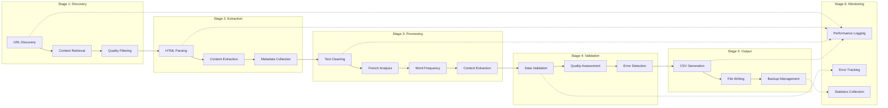

### Pipeline Characteristics

> [!info] Pipeline Features
> - **Streaming Processing**: Data flows through stages without intermediate storage
> - **Error Isolation**: Failures in one article don't affect others
> - **Concurrent Execution**: Multiple articles processed simultaneously
> - **Quality Gates**: Validation at each stage ensures data quality
> - **Monitoring Integration**: Performance and error tracking throughout
> - **Graceful Degradation**: System continues despite individual failures

---

## Component Interactions

### Inter-Component Communication

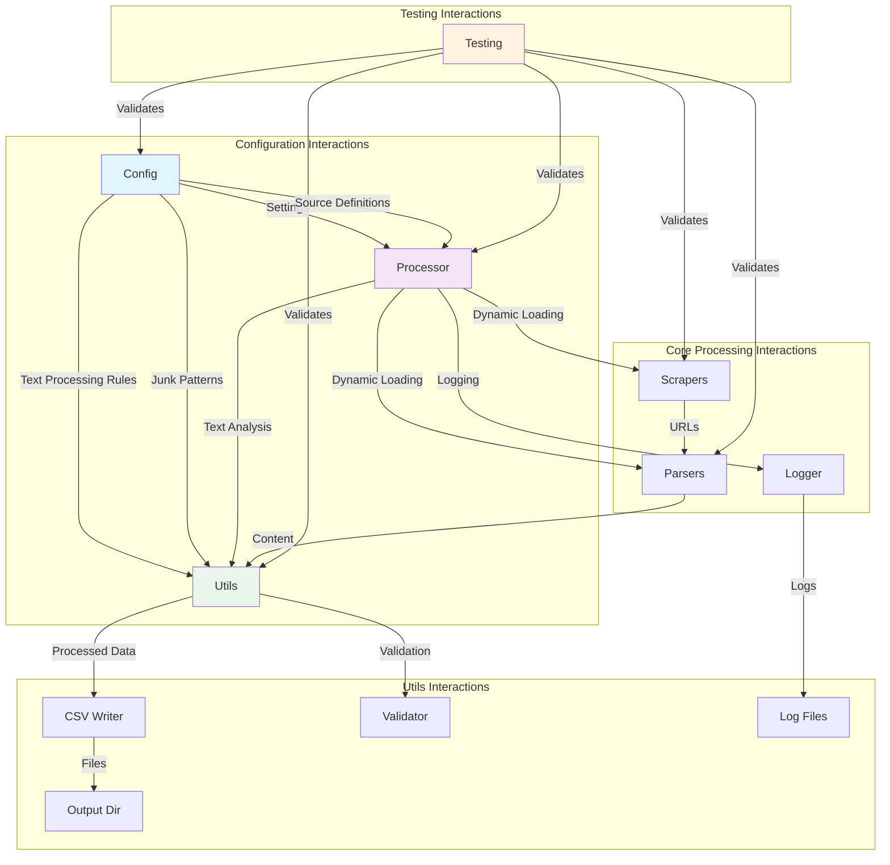

### Communication Patterns

> [!note] Inter-Component Communication
> - **Configuration Push**: Config system pushes settings to all components
> - **Data Pull**: Processor pulls data through the pipeline
> - **Event Broadcasting**: Logger receives events from all components
> - **Validation Requests**: Components request validation from utils
> - **Error Propagation**: Errors bubble up through the call stack
> - **Performance Reporting**: All components report metrics to logger

---

## System Lifecycle

### Complete System Execution Flow

```mermaid
stateDiagram-v2
    [*] --> Initialization
    
    state Initialization {
        [*] --> LoadConfig
        LoadConfig --> ValidateConfig
        ValidateConfig --> InitComponents
        InitComponents --> [*]
    }
    
    Initialization --> Processing
    
    state Processing {
        [*] --> SourceIteration
        
        state SourceIteration {
            [*] --> LoadSource
            LoadSource --> CheckEnabled
            CheckEnabled --> CreateComponents
            CreateComponents --> ProcessArticles
            
            state ProcessArticles {
                [*] --> DiscoverURLs
                DiscoverURLs --> ExtractContent
                ExtractContent --> ProcessText
                ProcessText --> ValidateData
                ValidateData --> WriteOutput
                WriteOutput --> [*]
            }
            
            ProcessArticles --> LogResults
            LogResults --> NextSource
            NextSource --> LoadSource
            NextSource --> [*]
        }
    }
    
    Processing --> Completion
    
    state Completion {
        [*] --> CollectStats
        CollectStats --> FinalLogging
        FinalLogging --> Cleanup
        Cleanup --> [*]
    }
    
    Completion --> [*]
    
    Processing --> ErrorHandling
    ErrorHandling --> Processing : Retry
    ErrorHandling --> Completion : Fatal Error
```

### Lifecycle Phases

> [!example] System Lifecycle Phases
> ```
> 1. INITIALIZATION PHASE
>    ├── Load global settings (OFFLINE, DEBUG)
>    ├── Load source configurations
>    ├── Load text processing rules
>    ├── Load junk word patterns
>    ├── Validate all configurations
>    ├── Initialize logging system
>    └── Setup output directories
> 
> 2. PROCESSING PHASE
>    ├── Iterate through enabled sources
>    ├── Dynamic component loading
>    ├── URL discovery or test data loading
>    ├── Concurrent article processing
>    ├── Text analysis and validation
>    ├── CSV output generation
>    └── Performance monitoring
> 
> 3. COMPLETION PHASE
>    ├── Collect processing statistics
>    ├── Generate final reports
>    ├── Clean up temporary resources
>    ├── Flush logs and buffers
>    └── Return completion status
> 
> 4. ERROR HANDLING (Throughout)
>    ├── Component initialization errors
>    ├── Network and parsing errors
>    ├── Validation and quality errors
>    ├── File system and permission errors
>    └── Recovery and graceful degradation
> ```

---

## Operational Modes

The system supports two primary operational modes with different data sources and behaviors:

### Live Mode vs Offline Mode

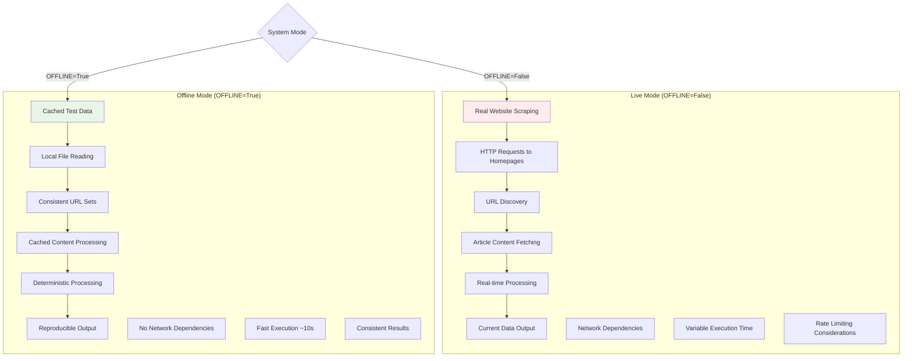

### Mode Comparison

| Aspect | Live Mode | Offline Mode |
|--------|-----------|--------------|
| **Data Source** | Live websites | Cached test files |
| **Network** | Required | Not required |
| **Execution Time** | ~60 seconds | ~10 seconds |
| **Consistency** | Variable | Deterministic |
| **Development** | Integration testing | Unit/offline testing |
| **Content** | Current articles | Fixed test articles |
| **Rate Limiting** | Required | Not applicable |
| **Error Types** | Network + parsing | Parsing only |

### Debug Mode Integration

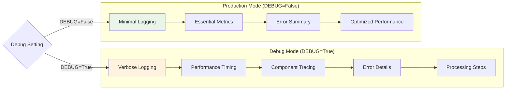

---

## Quality Assurance Pipeline

### Multi-Layer Quality Assurance

```mermaid
graph TD
    subgraph "Configuration Quality"
        Q1[Config Validation]
        Q2[Schema Checking]
        Q3[Default Fallbacks]
    end
    
    subgraph "Data Quality"
        Q4[Input Validation]
        Q5[Content Assessment]
        Q6[Spam Detection]
        Q7[French Language Validation]
    end
    
    subgraph "Processing Quality"
        Q8[Pipeline Monitoring]
        Q9[Error Rate Tracking]
        Q10[Performance Bounds]
    end
    
    subgraph "Output Quality"
        Q11[CSV Validation]
        Q12[Duplicate Detection]
        Q13[Data Integrity Checks]
    end
    
    subgraph "Testing Quality"
        Q14[Essential Tests (9)]
        Q15[Integration Tests (8)]
        Q16[Offline Tests (6)]
        Q17[Performance Tests]
    end
    
    Q1 --> Q4 --> Q8 --> Q11 --> Q14
    Q2 --> Q5 --> Q9 --> Q12 --> Q15
    Q3 --> Q6 --> Q10 --> Q13 --> Q16
    Q7 --> Q17
    
    style Q14 fill:#e8f5e8
    style Q15 fill:#e3f2fd
    style Q16 fill:#fff3e0
    style Q17 fill:#fce4ec
```

### Quality Metrics

> [!warning] Quality Assurance Metrics
> - **Configuration Validation**: 100% config validation before startup
> - **Data Quality**: Multi-stage validation with spam detection
> - **Processing Success Rate**: Target >80% article processing success
> - **Test Coverage**: 23 tests covering all major components
> - **Error Recovery**: Graceful handling of all error types
> - **Performance Bounds**: Processing time and memory usage monitoring

---

## Performance and Monitoring

### Performance Architecture

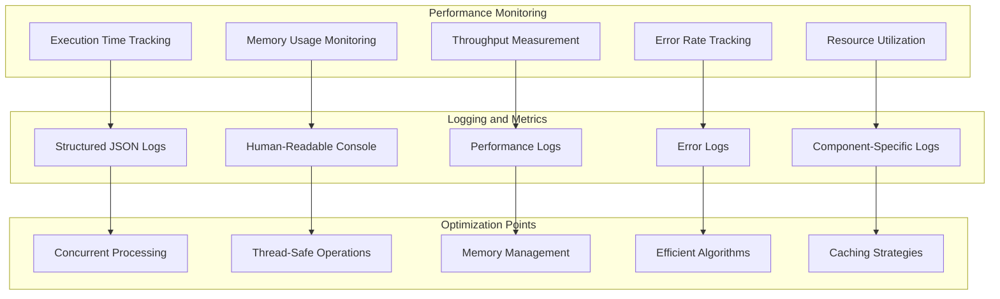

### Performance Characteristics

> [!info] System Performance Metrics
> - **Live Mode**: ~60 seconds for 4 sources, 8 articles each
> - **Offline Mode**: ~10 seconds for same workload  
> - **Memory Usage**: ~50-100MB typical, ~200MB peak
> - **Concurrency**: 3-4 concurrent URLs per source
> - **Throughput**: ~0.5-1 articles per second in live mode
> - **Success Rate**: >80% article processing success rate
> - **File I/O**: Thread-safe CSV writing with backup/recovery

---

## Error Handling and Recovery

### Comprehensive Error Strategy

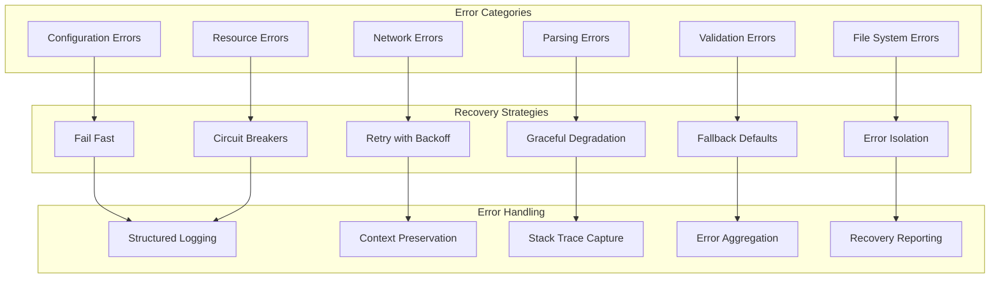

### Error Recovery Matrix

| Error Type | Recovery Strategy | Impact | Recovery Time |
|------------|------------------|---------|---------------|
| **Config Invalid** | Fail fast + defaults | High | Immediate |
| **Network Timeout** | Retry + circuit breaker | Medium | 30-60s |
| **Parse Failure** | Skip article + continue | Low | Immediate |
| **Validation Error** | Log + discard | Low | Immediate |
| **File Permission** | Backup restore | Medium | 5-10s |
| **Memory Exhaustion** | Reduce batch size | High | 10-30s |

---

## Extension Points

The system is designed for extensibility through well-defined extension points:

### Adding New Components

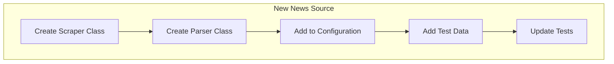

### Extension Guidelines

> [!tip] Extension Best Practices
> 1. **Follow Existing Patterns**: Use established interfaces and conventions
> 2. **Add Configuration**: Make extensions configurable and optional
> 3. **Include Tests**: Add comprehensive tests for new functionality
> 4. **Update Documentation**: Document new components and their usage
> 5. **Maintain Compatibility**: Ensure changes don't break existing functionality
> 6. **Add Validation**: Include appropriate validation for new data types
> 7. **Consider Performance**: Monitor impact on system performance

### Current System Extension

> [!example] How New Sources Can Be Added
> The system is designed to support additional news sources following the established pattern of the current 4 sources (Slate.fr, FranceInfo.fr, TF1 Info, Depeche.fr):
> 
> 1. Create scraper class following existing pattern
> 2. Create parser class with site-specific selectors  
> 3. Add configuration to website_parser_scrapers_config.py
> 4. Add test data to test_data/raw_url_soup/
> 5. Update tests with new source validation

---

## Conclusion

The French article scraper system represents a **well-architected, modular solution** that effectively combines six specialized component categories into a cohesive, high-performance system for French language content analysis.

**System Strengths**:
- ✅ **Modular Architecture**: Clear separation of concerns with well-defined interfaces
- ✅ **Configuration-Driven**: Highly configurable without code changes
- ✅ **Quality Assurance**: Multi-layer validation and comprehensive testing
- ✅ **Performance Optimized**: Concurrent processing with monitoring and optimization
- ✅ **Error Resilient**: Comprehensive error handling and recovery mechanisms
- ✅ **Extensible Design**: Easy to add new sources, formats, and functionality
- ✅ **Production Ready**: Robust logging, monitoring, and operational features

**Technical Excellence**:
- **Pipeline Architecture**: Streaming data processing with quality gates
- **Concurrent Processing**: Thread-safe operations with resource management
- **French Language Specialization**: Optimized for French text analysis
- **Dual Mode Operation**: Seamless switching between live and offline processing
- **Comprehensive Testing**: 23 tests covering all major functionality
- **Advanced Logging**: Structured JSON logs with human-readable console output

**Integration Benefits**:
- **Developer Experience**: Clear documentation and easy debugging
- **Operational Reliability**: Production-ready with monitoring and error handling
- **Maintainability**: Well-structured code with comprehensive documentation
- **Extensibility**: Easy to add new sources and functionality
- **Quality Assurance**: Multiple validation layers ensure data integrity

This comprehensive system architecture enables reliable, scalable French content analysis while maintaining high code quality and providing excellent developer experience for ongoing maintenance and enhancement.