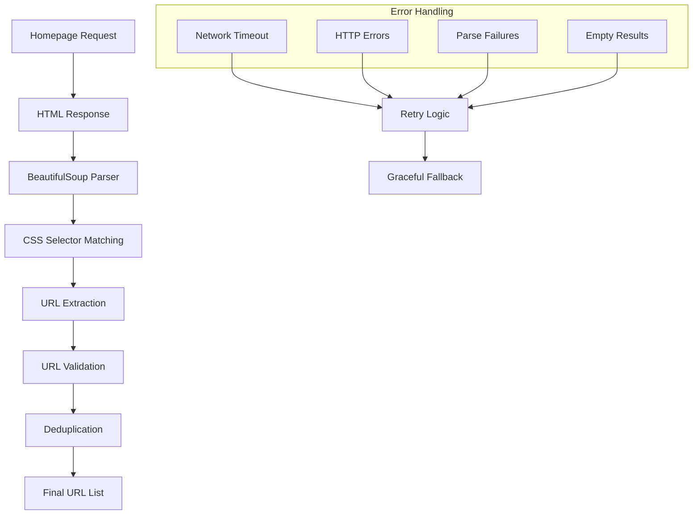
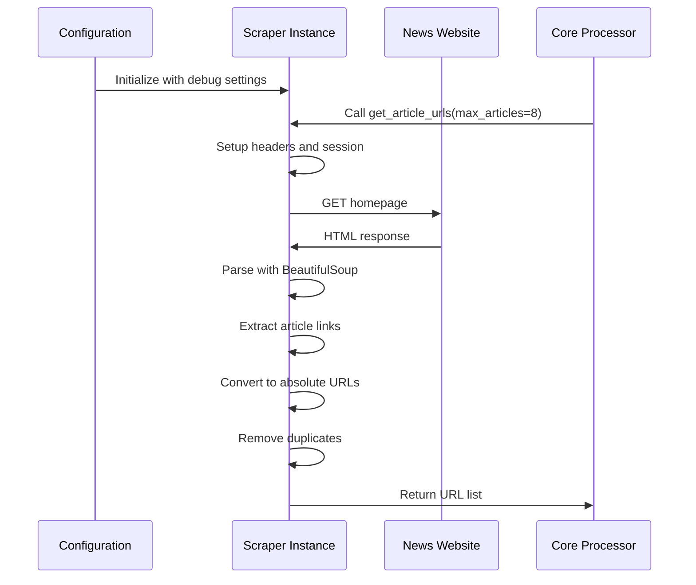
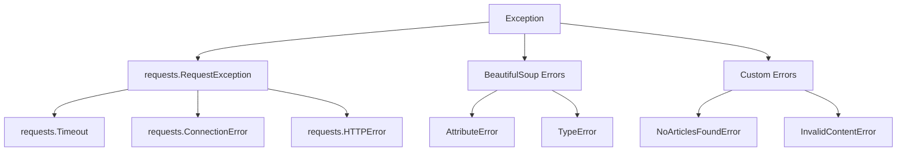

# Scrapers - URL Discovery System

> [!abstract] Overview
> Scrapers are responsible for discovering article URLs from French news website homepages. They navigate to each source's homepage, parse the HTML structure, and extract links to individual articles. This document provides a comprehensive understanding of how the scraping system works.

## Table of Contents
- [[#Architecture Overview|Architecture Overview]]
- [[#Base Scraper Pattern|Base Scraper Pattern]]
- [[#Individual Scrapers|Individual Scrapers]]
- [[#HTTP Request Handling|HTTP Request Handling]]
- [[#Error Handling Strategy|Error Handling Strategy]]
- [[#URL Processing|URL Processing]]
- [[#Performance Optimization|Performance Optimization]]
- [[#Adding New Scrapers|Adding New Scrapers]]
- [[#Troubleshooting|Troubleshooting]]

---

## Architecture Overview

> [!info] Scraper System Design
> The scraper system follows a consistent pattern across all news sources while allowing customization for each site's unique HTML structure.



### Core Responsibilities

> [!tip] What Scrapers Do
> 1. **HTTP Requests**: Fetch homepage HTML content
> 2. **HTML Parsing**: Navigate DOM structure with BeautifulSoup
> 3. **Link Discovery**: Find article URLs using CSS selectors
> 4. **URL Processing**: Convert relative links to absolute URLs
> 5. **Deduplication**: Remove duplicate article links
> 6. **Error Handling**: Manage network and parsing failures
> 7. **Rate Limiting**: Respect website request limits

### Data Flow



---

## Base Scraper Pattern

All scrapers follow a consistent pattern that ensures reliability and maintainability:

### Standard Structure

```python
class NewsSourceScraper:
    def __init__(self, debug=None):
        """Initialize scraper with logging and configuration."""
        self.logger = get_structured_logger(self.__class__.__name__)
        self.debug = debug if debug is not None else DEBUG
        self.base_url = "https://newsource.com/"
        self.headers = {
            "User-Agent": "Mozilla/5.0 (Windows NT 10.0; Win64; x64) AppleWebKit/537.36"
        }
    
    def get_article_urls(self, max_articles=8) -> List[str]:
        """Main entry point for URL discovery."""
        try:
            # 1. Rate limiting delay
            time.sleep(random.uniform(1, 3))
            
            # 2. HTTP request with error handling
            response = requests.get(self.base_url, headers=self.headers, timeout=10)
            response.raise_for_status()
            
            # 3. Parse HTML content
            soup = BeautifulSoup(response.content, "html.parser")
            
            # 4. Site-specific URL extraction
            urls = self._extract_urls(soup, max_articles)
            
            # 5. Post-processing
            urls = self._process_urls(urls)
            
            return urls
            
        except Exception as e:
            self.logger.error(f"Failed to scrape {self.base_url}: {e}")
            return []
```

### Key Design Principles

> [!note] Design Principles
> 1. **Defensive Programming**: Always expect failures
> 2. **Graceful Degradation**: Return empty list on errors
> 3. **Structured Logging**: Log everything with context
> 4. **Rate Limiting**: Respect website resources
> 5. **Timeout Handling**: Don't hang indefinitely
> 6. **User Agent Rotation**: Appear as legitimate browser

### Error Handling Philosophy

```python
def get_article_urls(self, max_articles=8) -> List[str]:
    try:
        # Main processing logic
        return self._scrape_urls(max_articles)
    except requests.exceptions.Timeout:
        self.logger.warning(f"Timeout accessing {self.base_url}")
        return []
    except requests.exceptions.ConnectionError:
        self.logger.warning(f"Connection failed to {self.base_url}")
        return []
    except requests.exceptions.HTTPError as e:
        self.logger.warning(f"HTTP error {e.response.status_code} from {self.base_url}")
        return []
    except Exception as e:
        self.logger.error(f"Unexpected error scraping {self.base_url}: {e}")
        return []
```

---

## Individual Scrapers

### 1. Slate.fr Scraper

> [!example] Slate.fr Implementation
> **File**: `src/scrapers/slate_fr_scraper.py`
> **Target**: https://www.slate.fr/
> **Strategy**: Extract from homepage article cards

```python
class SlateFrURLScraper:
    def __init__(self, debug=None):
        self.logger = get_structured_logger(self.__class__.__name__)
        self.debug = debug if debug is not None else DEBUG
        self.base_url = "https://www.slate.fr/"
        self.headers = {
            "User-Agent": "Mozilla/5.0 (Windows NT 10.0; Win64; x64) AppleWebKit/537.36 (KHTML, like Gecko) Chrome/91.0.4472.124 Safari/537.36"
        }

    def get_article_urls(self, max_articles=8) -> List[str]:
        try:
            # Rate limiting
            time.sleep(random.uniform(1, 3))
            
            # Fetch homepage
            response = requests.get(self.base_url, headers=self.headers, timeout=10)
            response.raise_for_status()

            # Parse HTML
            soup = BeautifulSoup(response.content, "html.parser")
            
            # Slate-specific: Find article containers
            article_cards = soup.find_all("article", class_="node node--type-article")
            
            if not article_cards:
                self.logger.warning("No article cards found on Slate.fr homepage")
                return []

            urls = []
            for card in article_cards[:max_articles]:
                if isinstance(card, Tag):
                    # Look for links within article body
                    link_container = card.find("div", class_="node__body")
                    if link_container:
                        link = link_container.find("a")
                        if link and link.has_attr("href"):
                            url = str(link["href"])
                            # Convert relative to absolute URL
                            if not url.startswith("http"):
                                url = urljoin(self.base_url, url)
                            urls.append(url)

            # Remove duplicates while preserving order
            seen = set()
            unique_urls = [url for url in urls if not (url in seen or seen.add(url))]

            self.logger.info(f"Extracted {len(unique_urls)} URLs from Slate.fr")
            return unique_urls

        except Exception as e:
            self.logger.error(f"Failed to scrape Slate.fr: {e}")
            return []
```

**HTML Structure Analysis**:
```html
<!-- Slate.fr Homepage Structure -->
<article class="node node--type-article">
    <div class="node__body">
        <a href="/story/article-slug">Article Title</a>
    </div>
</article>
```

### 2. FranceInfo Scraper

> [!example] FranceInfo Implementation
> **File**: `src/scrapers/france_info_scraper.py`
> **Target**: https://www.franceinfo.fr/
> **Strategy**: Extract from card-based layout

```python
class FranceInfoURLScraper:
    def __init__(self, debug=None):
        self.logger = get_structured_logger(self.__class__.__name__)
        self.debug = debug if debug is not None else DEBUG
        self.base_url = "https://www.franceinfo.fr/"
        self.headers = {
            "User-Agent": "Mozilla/5.0 (Windows NT 10.0; Win64; x64) AppleWebKit/537.36"
        }

    def get_article_urls(self, max_articles=8) -> List[str]:
        try:
            time.sleep(random.uniform(1, 3))
            response = requests.get(self.base_url, headers=self.headers, timeout=10)
            response.raise_for_status()

            soup = BeautifulSoup(response.content, "html.parser")
            
            # FranceInfo-specific: Find article cards with data attribute
            article_cards = soup.find_all("article", {"data-cy": "card-article-m"})

            if not article_cards:
                self.logger.warning("No article cards found on FranceInfo homepage")
                return []

            urls = []
            for card in article_cards[:max_articles]:
                if isinstance(card, Tag):
                    # Look for specific link class
                    link = card.find("a", class_="card-article-m__link")
                    if link and isinstance(link, Tag) and link.has_attr("href"):
                        url = str(link["href"])
                        if not url.startswith("http"):
                            url = urljoin(self.base_url, url)
                        urls.append(url)

            # Deduplication
            seen = set()
            unique_urls = [url for url in urls if not (url in seen or seen.add(url))]

            self.logger.info(f"Found {len(unique_urls)} article URLs from FranceInfo")
            return unique_urls

        except Exception as e:
            self.logger.error(f"Failed to fetch URL: {self.base_url} | Error: {e}")
            return []
```

**HTML Structure Analysis**:
```html
<!-- FranceInfo Homepage Structure -->
<article data-cy="card-article-m">
    <a class="card-article-m__link" href="/article/path">
        Article Title
    </a>
</article>
```

### 3. TF1 Info Scraper

> [!example] TF1 Info Implementation
> **File**: `src/scrapers/tf1_info_scraper.py`
> **Target**: https://www.tf1info.fr/
> **Strategy**: Extract from teaser components

```python
class TF1InfoURLScraper:
    def __init__(self, debug=None):
        self.logger = get_structured_logger(self.__class__.__name__)
        self.debug = debug if debug is not None else DEBUG
        self.base_url = "https://www.tf1info.fr/"
        self.headers = {
            "User-Agent": "Mozilla/5.0 (Windows NT 10.0; Win64; x64) AppleWebKit/537.36"
        }

    def get_article_urls(self, max_articles=8) -> List[str]:
        try:
            time.sleep(random.uniform(1, 3))
            response = requests.get(self.base_url, headers=self.headers, timeout=10)
            response.raise_for_status()

            soup = BeautifulSoup(response.content, "html.parser")
            
            # TF1-specific: Find article teasers
            article_teasers = soup.find_all("div", {"data-model": "ArticleTeaser"})

            if not article_teasers:
                self.logger.warning("No article teasers found on TF1Info homepage")
                return []

            urls = []
            for teaser in article_teasers[:max_articles]:
                if isinstance(teaser, Tag):
                    link = teaser.find("a")
                    if link and isinstance(link, Tag) and link.has_attr("href"):
                        url = str(link["href"])
                        if not url.startswith("http"):
                            url = urljoin(self.base_url, url)
                        urls.append(url)

            # Remove duplicates
            unique_urls = list(dict.fromkeys(urls))

            self.logger.info(f"Extracted {len(unique_urls)} URLs from TF1Info")
            return unique_urls

        except Exception as e:
            self.logger.error(f"TF1Info scraping failed: {e}")
            return []
```

### 4. Depeche Scraper

> [!example] Depeche Implementation
> **File**: `src/scrapers/ladepeche_fr_scraper.py`
> **Target**: https://www.ladepeche.fr/
> **Strategy**: Extract from article title containers

```python
class LadepecheFrURLScraper:
    def __init__(self, debug=None):
        self.logger = get_structured_logger(self.__class__.__name__)
        self.debug = debug if debug is not None else DEBUG
        self.base_url = "https://www.ladepeche.fr/"
        self.headers = {
            "User-Agent": "Mozilla/5.0 (Windows NT 10.0; Win64; x64) AppleWebKit/537.36"
        }

    def get_article_urls(self, max_articles=8) -> List[str]:
        try:
            time.sleep(random.uniform(1, 3))
            response = requests.get(self.base_url, headers=self.headers, timeout=10)
            response.raise_for_status()

            soup = BeautifulSoup(response.content, "html.parser")
            
            # Depeche-specific: Find articles with title class
            articles = soup.find_all("article")
            
            if not articles:
                self.logger.warning("No articles found on Depeche homepage")
                return []

            urls = []
            for article in articles[:max_articles]:
                if isinstance(article, Tag):
                    # Look for title container
                    title_div = article.find("div", class_="actu-title")
                    if title_div:
                        link = title_div.find("a")
                        if link and isinstance(link, Tag) and link.has_attr("href"):
                            url = str(link["href"])
                            if not url.startswith("http"):
                                url = urljoin(self.base_url, url)
                            urls.append(url)

            # Deduplication
            unique_urls = list(set(urls))

            self.logger.info(f"Found {len(unique_urls)} article URLs from Depeche")
            return unique_urls

        except Exception as e:
            self.logger.error(f"Depeche scraping error: {e}")
            return []
```

---

## HTTP Request Handling

### Request Configuration

> [!tip] HTTP Best Practices
> Every scraper implements robust HTTP handling to ensure reliability and respectful crawling.

```python
class HTTPHandler:
    def __init__(self):
        self.session = requests.Session()
        self.session.headers.update({
            'User-Agent': 'Mozilla/5.0 (Windows NT 10.0; Win64; x64) AppleWebKit/537.36 (KHTML, like Gecko) Chrome/91.0.4472.124 Safari/537.36',
            'Accept': 'text/html,application/xhtml+xml,application/xml;q=0.9,image/webp,*/*;q=0.8',
            'Accept-Language': 'fr-FR,fr;q=0.8,en-US;q=0.5,en;q=0.3',
            'Accept-Encoding': 'gzip, deflate',
            'DNT': '1',
            'Connection': 'keep-alive',
            'Upgrade-Insecure-Requests': '1',
        })
        
    def get_with_retry(self, url, max_retries=3):
        """Make HTTP request with retry logic."""
        for attempt in range(max_retries):
            try:
                response = self.session.get(url, timeout=10)
                response.raise_for_status()
                return response
            except requests.exceptions.RequestException as e:
                if attempt == max_retries - 1:
                    raise
                time.sleep(2 ** attempt)  # Exponential backoff
```

### Rate Limiting Strategy

```python
def apply_rate_limit(self):
    """Apply random delay to respect website resources."""
    # Random delay between 1-3 seconds
    delay = random.uniform(1, 3)
    time.sleep(delay)
    
    if self.debug:
        self.logger.debug(f"Applied {delay:.2f}s rate limit delay")
```

### Error Response Handling

```python
def handle_http_errors(self, response):
    """Handle different HTTP error codes appropriately."""
    if response.status_code == 403:
        self.logger.warning("Access forbidden - possible rate limiting")
        time.sleep(10)  # Longer delay for rate limiting
    elif response.status_code == 404:
        self.logger.warning("Homepage not found - URL may have changed")
    elif response.status_code >= 500:
        self.logger.warning(f"Server error {response.status_code} - temporary issue")
    else:
        response.raise_for_status()
```

---

## URL Processing

### Relative to Absolute URL Conversion

```python
from urllib.parse import urljoin, urlparse

def process_url(self, url, base_url):
    """Convert relative URLs to absolute and validate."""
    # Handle relative URLs
    if not url.startswith(('http://', 'https://')):
        url = urljoin(base_url, url)
    
    # Validate URL structure
    parsed = urlparse(url)
    if not parsed.netloc:
        return None
        
    # Clean up URL (remove fragments, etc.)
    clean_url = f"{parsed.scheme}://{parsed.netloc}{parsed.path}"
    if parsed.query:
        clean_url += f"?{parsed.query}"
        
    return clean_url
```

### URL Validation

```python
def validate_article_url(self, url):
    """Ensure URL points to an article, not homepage or category."""
    # Skip homepage URLs
    if url.rstrip('/') == self.base_url.rstrip('/'):
        return False
        
    # Skip category pages
    category_patterns = ['/category/', '/tag/', '/author/', '/page/']
    if any(pattern in url for pattern in category_patterns):
        return False
        
    # Ensure URL has article indicators
    article_patterns = ['/article/', '/story/', '/news/', '/actualite/']
    if not any(pattern in url for pattern in article_patterns):
        # Some sites don't use these patterns, so this is just a hint
        pass
        
    return True
```

### Deduplication Logic

```python
def deduplicate_urls(self, urls):
    """Remove duplicate URLs while preserving order."""
    seen = set()
    unique_urls = []
    
    for url in urls:
        # Normalize URL for comparison
        normalized = url.lower().rstrip('/')
        
        if normalized not in seen:
            seen.add(normalized)
            unique_urls.append(url)
            
    return unique_urls
```

---

## Error Handling Strategy

### Exception Hierarchy



### Error Recovery Patterns

```python
class ScraperErrorHandler:
    def __init__(self, scraper):
        self.scraper = scraper
        self.error_counts = defaultdict(int)
        
    def handle_error(self, error, context):
        """Centralized error handling with recovery strategies."""
        error_type = type(error).__name__
        self.error_counts[error_type] += 1
        
        if isinstance(error, requests.Timeout):
            return self._handle_timeout(error, context)
        elif isinstance(error, requests.ConnectionError):
            return self._handle_connection_error(error, context)
        elif isinstance(error, requests.HTTPError):
            return self._handle_http_error(error, context)
        else:
            return self._handle_generic_error(error, context)
            
    def _handle_timeout(self, error, context):
        """Handle timeout errors with retry logic."""
        if self.error_counts['Timeout'] < 3:
            self.scraper.logger.warning(f"Timeout occurred, retrying...")
            time.sleep(5)
            return True  # Indicate retry
        else:
            self.scraper.logger.error("Too many timeouts, giving up")
            return False
            
    def _handle_connection_error(self, error, context):
        """Handle connection errors."""
        self.scraper.logger.error(f"Connection failed: {error}")
        return False  # Don't retry connection errors
        
    def _handle_http_error(self, error, context):
        """Handle HTTP status errors."""
        status_code = error.response.status_code
        
        if status_code == 429:  # Rate limited
            self.scraper.logger.warning("Rate limited, waiting...")
            time.sleep(60)
            return True
        elif status_code >= 500:  # Server error
            self.scraper.logger.warning(f"Server error {status_code}, retrying...")
            time.sleep(10)
            return True
        else:
            self.scraper.logger.error(f"HTTP error {status_code}")
            return False
```

---

## Performance Optimization

### Concurrent Processing Considerations

> [!warning] Concurrency Limits
> Scrapers are designed to be called concurrently by the core processor, but each scraper instance should not make concurrent requests to avoid overwhelming servers.

```python
class ScraperPool:
    def __init__(self, max_workers=4):
        self.max_workers = max_workers
        self.executor = ThreadPoolExecutor(max_workers=max_workers)
        
    def scrape_all_sources(self, scraper_configs):
        """Process multiple sources concurrently."""
        futures = []
        
        for config in scraper_configs:
            if config.enabled:
                future = self.executor.submit(self._scrape_source, config)
                futures.append(future)
                
        results = []
        for future in as_completed(futures):
            try:
                result = future.result(timeout=120)  # 2 minute timeout
                results.extend(result)
            except TimeoutError:
                logger.error("Scraper timed out")
            except Exception as e:
                logger.error(f"Scraper failed: {e}")
                
        return results
```

### Memory Management

```python
def optimize_memory_usage(self):
    """Optimize memory usage during scraping."""
    # Clear BeautifulSoup objects explicitly
    if hasattr(self, '_soup'):
        self._soup.decompose()
        del self._soup
        
    # Force garbage collection for large pages
    import gc
    gc.collect()
    
    # Limit response content size
    def get_with_size_limit(self, url, max_size=5*1024*1024):  # 5MB limit
        response = requests.get(url, stream=True)
        
        content = b''
        for chunk in response.iter_content(chunk_size=8192):
            content += chunk
            if len(content) > max_size:
                raise ValueError("Response too large")
                
        return content
```

### Caching Strategy

```python
class URLCache:
    def __init__(self, cache_duration=3600):  # 1 hour cache
        self.cache = {}
        self.cache_duration = cache_duration
        
    def get_cached_urls(self, source_name):
        """Get cached URLs if still valid."""
        if source_name in self.cache:
            cached_time, urls = self.cache[source_name]
            if time.time() - cached_time < self.cache_duration:
                return urls
        return None
        
    def cache_urls(self, source_name, urls):
        """Cache URLs with timestamp."""
        self.cache[source_name] = (time.time(), urls)
```

---

## Adding New Scrapers

### Step-by-Step Guide

> [!example] Adding a New News Source
> Follow this comprehensive guide to add support for a new French news website.

#### Step 1: Analyze Target Website

```python
# First, manually inspect the target website
# 1. Visit the homepage
# 2. View page source (Ctrl+U)
# 3. Identify article containers
# 4. Find link patterns
# 5. Test CSS selectors in browser console

# Note: For examples of how to add new scrapers, refer to the existing implementations
# The system currently includes working scrapers for:
# - Slate.fr (src/scrapers/slate_fr_scraper.py)
# - FranceInfo.fr (src/scrapers/france_info_scraper.py) 
# - TF1 Info (src/scrapers/tf1_info_scraper.py)
# - Depeche.fr (src/scrapers/ladepeche_fr_scraper.py)
#
# These serve as templates for adding additional French news sources.

---

## Troubleshooting

### Common Issues

> [!bug] Frequent Problems and Solutions

#### 1. No URLs Extracted

**Symptoms**: Scraper returns empty list
**Causes**:
- Website changed HTML structure
- CSS selectors no longer match
- Anti-bot protection activated
- Network connectivity issues

**Debugging**:
```python
def debug_extraction(self):
    """Debug why URLs aren't being extracted."""
    response = requests.get(self.base_url, headers=self.headers)
    soup = BeautifulSoup(response.content, "html.parser")
    
    # Check if page loaded correctly
    print(f"Page title: {soup.title.string if soup.title else 'No title'}")
    print(f"Page length: {len(str(soup))}")
    
    # Check for anti-bot indicators
    if "captcha" in str(soup).lower():
        print("⚠️  CAPTCHA detected")
    if "bot" in str(soup).lower():
        print("⚠️  Bot detection possible")
    
    # Test selectors
    selectors = ["article", "div[data-model]", ".article", ".news-item"]
    for selector in selectors:
        elements = soup.select(selector)
        print(f"Selector '{selector}': {len(elements)} matches")
```

#### 2. Rate Limiting

**Symptoms**: HTTP 429 errors or timeouts
**Solutions**:
```python
def handle_rate_limiting(self):
    """Enhanced rate limiting strategy."""
    # Longer delays
    time.sleep(random.uniform(3, 8))
    
    # Vary user agents
    user_agents = [
        "Mozilla/5.0 (Windows NT 10.0; Win64; x64) AppleWebKit/537.36",
        "Mozilla/5.0 (Macintosh; Intel Mac OS X 10_15_7) AppleWebKit/537.36",
        "Mozilla/5.0 (X11; Linux x86_64) AppleWebKit/537.36"
    ]
    self.headers["User-Agent"] = random.choice(user_agents)
    
    # Add session cookies if needed
    self.session.cookies.update({"lang": "fr", "region": "FR"})
```

#### 3. Invalid Article URLs

**Symptoms**: URLs point to non-article pages
**Solutions**:
```python
def validate_article_url_strict(self, url):
    """More strict URL validation."""
    # Must contain article indicators
    required_patterns = ['/article/', '/actualite/', '/news/']
    if not any(pattern in url for pattern in required_patterns):
        return False
    
    # Must not contain exclusion patterns
    exclusion_patterns = [
        '/category/', '/tag/', '/author/', '/page/',
        '/newsletter/', '/subscription/', '/rss/',
        '/sitemap/', '/search/', '/contact/'
    ]
    if any(pattern in url for pattern in exclusion_patterns):
        return False
        
    # Check URL length (too short likely not article)
    if len(url) < 30:
        return False
        
    return True
```

### Monitoring and Alerts

```python
class ScraperMonitor:
    def __init__(self):
        self.metrics = {
            'requests_made': 0,
            'successful_extractions': 0,
            'errors_encountered': 0,
            'avg_response_time': 0,
            'urls_extracted': 0
        }
    
    def log_metrics(self):
        """Log scraper performance metrics."""
        success_rate = (
            self.metrics['successful_extractions'] / 
            max(self.metrics['requests_made'], 1) * 100
        )
        
        logger.info(f"Scraper Performance Summary:", extra_data={
            'success_rate': f"{success_rate:.1f}%",
            'total_requests': self.metrics['requests_made'],
            'urls_extracted': self.metrics['urls_extracted'],
            'avg_response_time': f"{self.metrics['avg_response_time']:.2f}s"
        })
```

---

## Conclusion

The scraper system provides a robust foundation for discovering French news articles across multiple sources. Its modular design allows easy extension while maintaining reliability through comprehensive error handling and respectful crawling practices.

> [!success] Key Takeaways
> - **Consistent Pattern**: All scrapers follow the same structure
> - **Error Resilience**: Comprehensive error handling ensures system stability
> - **Respectful Crawling**: Rate limiting and proper headers respect website resources
> - **Easy Extension**: Adding new sources requires minimal code changes
> - **Monitoring**: Built-in logging provides visibility into scraper performance

The system balances effectiveness with responsibility, ensuring reliable article discovery while being respectful to news websites' resources and infrastructure.