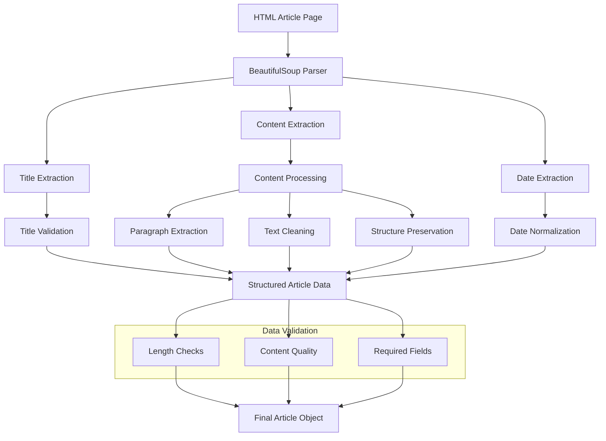
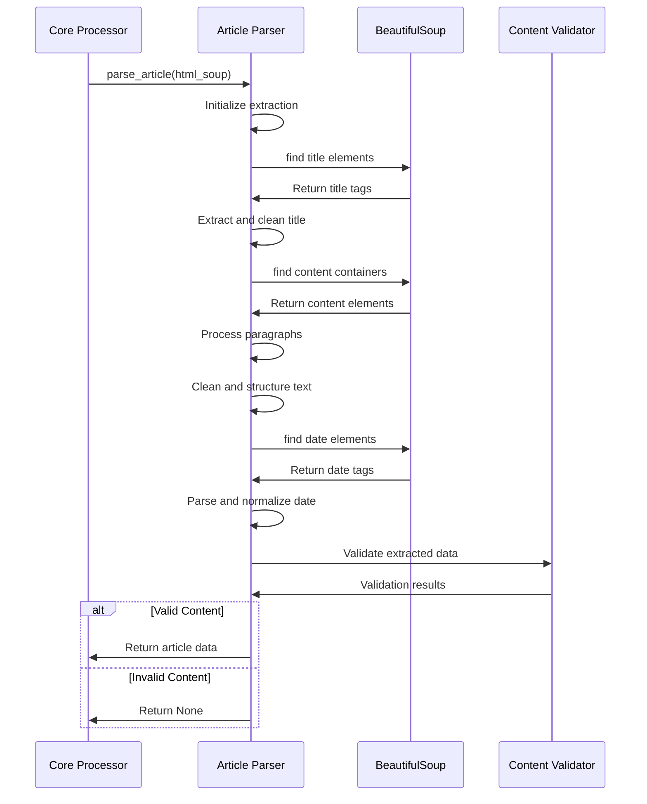
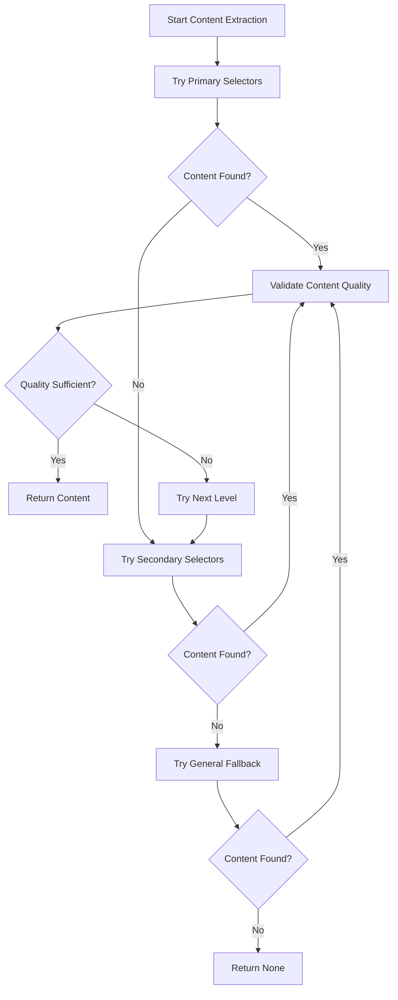
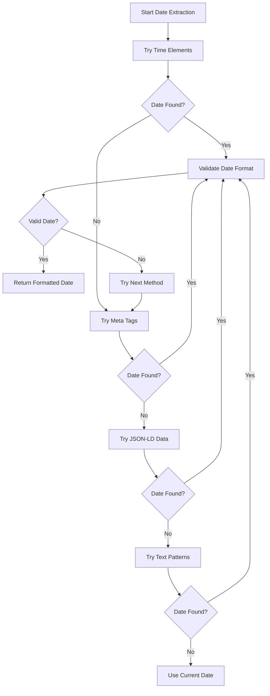

# Parsers - Content Extraction System

> [!abstract] Overview
> Parsers are responsible for extracting structured content from French news article HTML pages. They navigate complex DOM structures, identify article content, and transform raw HTML into clean, structured data suitable for vocabulary analysis. This document provides comprehensive understanding of the parsing system architecture and implementation.

## Table of Contents
- [[#Architecture Overview|Architecture Overview]]
- [[#Base Parser Framework|Base Parser Framework]]
- [[#Individual Parser Implementations|Individual Parser Implementations]]
- [[#Content Extraction Strategies|Content Extraction Strategies]]
- [[#Text Processing Pipeline|Text Processing Pipeline]]
- [[#Metadata Extraction|Metadata Extraction]]
- [[#Error Handling and Validation|Error Handling and Validation]]
- [[#Performance Optimization|Performance Optimization]]
- [[#Adding New Parsers|Adding New Parsers]]
- [[#Testing and Debugging|Testing and Debugging]]

---

## Architecture Overview

> [!info] Parser System Design
> The parser system transforms HTML article pages into structured data through a multi-stage extraction and cleaning process.



### Core Responsibilities

> [!tip] What Parsers Do
> 1. **HTML Navigation**: Parse complex DOM structures with BeautifulSoup
> 2. **Content Identification**: Locate article text within page layout
> 3. **Text Extraction**: Extract clean text from HTML elements
> 4. **Structure Preservation**: Maintain paragraph breaks and headers
> 5. **Metadata Extraction**: Extract titles, dates, and other metadata
> 6. **Data Validation**: Ensure extracted content meets quality standards
> 7. **Error Recovery**: Handle malformed HTML and missing elements

### Parsing Flow



---

## Base Parser Framework

### Abstract Base Class

> [!example] BaseParser Implementation
> **File**: `src/parsers/base_parser.py`
> **Purpose**: Provides common functionality and enforces consistent interface

```python
from abc import ABC, abstractmethod
from typing import Dict, Any, Optional, List
from bs4 import BeautifulSoup, Tag
import requests
import time
import random
from datetime import datetime
from utils.structured_logger import get_structured_logger

class BaseParser(ABC):
    """
    Abstract base class for all article parsers.
    
    Provides common functionality while enforcing implementation
    of site-specific parsing logic through abstract methods.
    """
    
    def __init__(self, site_domain: str):
        """
        Initialize base parser with site-specific configuration.
        
        Args:
            site_domain: Domain name for logging and identification
        """
        self.site_domain = site_domain
        self.logger = get_structured_logger(f"{self.__class__.__name__}")
        self.session = requests.Session()
        self._setup_session()
        
    def _setup_session(self):
        """Configure HTTP session with appropriate headers."""
        self.session.headers.update({
            'User-Agent': 'Mozilla/5.0 (Windows NT 10.0; Win64; x64) AppleWebKit/537.36 (KHTML, like Gecko) Chrome/91.0.4472.124 Safari/537.36',
            'Accept': 'text/html,application/xhtml+xml,application/xml;q=0.9,image/webp,*/*;q=0.8',
            'Accept-Language': 'fr-FR,fr;q=0.8,en-US;q=0.5,en;q=0.3',
            'Accept-Encoding': 'gzip, deflate',
            'DNT': '1',
            'Connection': 'keep-alive',
            'Upgrade-Insecure-Requests': '1',
        })

    @abstractmethod
    def parse_article(self, soup: BeautifulSoup) -> Optional[Dict[str, Any]]:
        """
        Parse article content from BeautifulSoup object.
        
        This method must be implemented by each site-specific parser
        to handle the unique HTML structure of each news source.
        
        Args:
            soup: BeautifulSoup object containing article HTML
            
        Returns:
            Dictionary containing structured article data, or None if parsing fails
            
        Expected return format:
        {
            'title': str,           # Article title
            'full_text': str,       # Complete article content
            'article_date': str,    # Publication date (YYYY-MM-DD format)
            'date_scraped': str,    # Scraping date (YYYY-MM-DD format)
            'num_paragraphs': int   # Number of content paragraphs
        }
        """
        pass

    def get_soup_from_url(self, url: str) -> Optional[BeautifulSoup]:
        """
        Fetch and parse HTML from URL.
        
        Args:
            url: Article URL to fetch
            
        Returns:
            BeautifulSoup object or None if request fails
        """
        try:
            self.apply_request_delay()
            
            response = self.session.get(url, timeout=15)
            response.raise_for_status()
            
            # Detect encoding
            response.encoding = response.apparent_encoding or 'utf-8'
            
            soup = BeautifulSoup(response.content, 'html.parser')
            return soup
            
        except requests.exceptions.RequestException as e:
            self.logger.error(f"Failed to fetch {url}: {e}")
            return None
        except Exception as e:
            self.logger.error(f"Unexpected error parsing {url}: {e}")
            return None

    def apply_request_delay(self, min_delay: float = 1.0, max_delay: float = 3.0):
        """
        Apply random delay to respect website resources.
        
        Args:
            min_delay: Minimum delay in seconds
            max_delay: Maximum delay in seconds
        """
        delay = random.uniform(min_delay, max_delay)
        time.sleep(delay)
        
        if hasattr(self, 'debug') and self.debug:
            self.logger.debug(f"Applied {delay:.2f}s request delay")

    def clean_text(self, text: str) -> str:
        """
        Clean and normalize extracted text.
        
        Args:
            text: Raw text to clean
            
        Returns:
            Cleaned text
        """
        if not text:
            return ""
            
        import re
        
        # Remove extra whitespace
        text = re.sub(r'\s+', ' ', text)
        
        # Remove leading/trailing whitespace
        text = text.strip()
        
        # Remove special characters that interfere with processing
        text = re.sub(r'[\u200b\u200c\u200d\ufeff]', '', text)  # Zero-width characters
        
        # Normalize quotes
        text = re.sub(r'[""''']', '"', text)
        text = re.sub(r'[''']', "'", text)
        
        return text

    def extract_text_from_element(self, element: Tag, separator: str = " ") -> str:
        """
        Extract clean text from BeautifulSoup element.
        
        Args:
            element: BeautifulSoup Tag object
            separator: String to join text with
            
        Returns:
            Extracted and cleaned text
        """
        if not element:
            return ""
            
        # Get text with specified separator
        text = element.get_text(separator=separator, strip=True)
        
        # Clean the text
        return self.clean_text(text)

    def validate_parsed_data(self, data: Dict[str, Any]) -> tuple[bool, List[str]]:
        """
        Validate extracted article data.
        
        Args:
            data: Dictionary containing article data
            
        Returns:
            Tuple of (is_valid, list_of_errors)
        """
        errors = []
        
        # Check required fields
        required_fields = ['title', 'full_text', 'article_date', 'date_scraped']
        for field in required_fields:
            if field not in data:
                errors.append(f"Missing required field: {field}")
            elif not data[field]:
                errors.append(f"Empty required field: {field}")
        
        # Validate content length
        if 'full_text' in data:
            text_length = len(data['full_text'])
            if text_length < 100:
                errors.append(f"Article text too short: {text_length} characters")
            elif text_length > 50000:
                errors.append(f"Article text too long: {text_length} characters")
        
        # Validate title length
        if 'title' in data:
            title_length = len(data['title'])
            if title_length < 5:
                errors.append(f"Title too short: {title_length} characters")
            elif title_length > 500:
                errors.append(f"Title too long: {title_length} characters")
        
        # Validate date format
        if 'article_date' in data:
            try:
                datetime.strptime(data['article_date'], '%Y-%m-%d')
            except ValueError:
                errors.append(f"Invalid date format: {data['article_date']}")
        
        return len(errors) == 0, errors

    def get_test_sources_from_directory(self, source_name: str) -> List[str]:
        """
        Get test HTML files for offline processing.
        
        Args:
            source_name: Name of the news source
            
        Returns:
            List of test file paths
        """
        import os
        
        test_data_dir = os.path.join(
            os.path.dirname(__file__), 
            '..', 
            'test_data', 
            'raw_url_soup', 
            source_name
        )
        
        if not os.path.exists(test_data_dir):
            self.logger.warning(f"Test data directory not found: {test_data_dir}")
            return []
        
        test_files = []
        for file in os.listdir(test_data_dir):
            if file.endswith(('.html', '.htm')):
                test_files.append(os.path.join(test_data_dir, file))
                
        self.logger.info(f"Found {len(test_files)} test files for {source_name}")
        return test_files
```

### Common Parsing Utilities

```python
class ParsingUtils:
    """Utility methods for common parsing tasks."""
    
    @staticmethod
    def find_article_container(soup: BeautifulSoup, selectors: List[str]) -> Optional[Tag]:
        """
        Find article content container using multiple selectors.
        
        Args:
            soup: BeautifulSoup object
            selectors: List of CSS selectors to try
            
        Returns:
            First matching container or None
        """
        for selector in selectors:
            container = soup.select_one(selector)
            if container:
                return container
        return None
    
    @staticmethod
    def extract_paragraphs(container: Tag, min_words: int = 5) -> List[str]:
        """
        Extract meaningful paragraphs from content container.
        
        Args:
            container: BeautifulSoup Tag containing article content
            min_words: Minimum words required for paragraph inclusion
            
        Returns:
            List of paragraph texts
        """
        paragraphs = []
        
        for element in container.find_all(['p', 'h2', 'h3', 'h4', 'li']):
            if element.name in ['h2', 'h3', 'h4']:
                text = element.get_text(strip=True)
                if text:
                    paragraphs.append(f"\n## {text} ##\n")
            else:
                text = element.get_text(separator=" ", strip=True)
                # Clean up whitespace
                text = re.sub(r'\s+', ' ', text).strip()
                # Check minimum word count
                if text and len(text.split()) >= min_words:
                    paragraphs.append(text)
                    
        return paragraphs
    
    @staticmethod
    def extract_date_from_meta(soup: BeautifulSoup) -> Optional[str]:
        """
        Extract publication date from meta tags.
        
        Args:
            soup: BeautifulSoup object
            
        Returns:
            Date string in YYYY-MM-DD format or None
        """
        # Try different meta tag patterns
        meta_selectors = [
            'meta[property="article:published_time"]',
            'meta[name="publish-date"]',
            'meta[name="publication-date"]',
            'meta[property="og:published_time"]',
            'meta[name="date"]'
        ]
        
        for selector in meta_selectors:
            meta_tag = soup.select_one(selector)
            if meta_tag and meta_tag.get('content'):
                date_str = meta_tag['content']
                parsed_date = ParsingUtils.parse_date_string(date_str)
                if parsed_date:
                    return parsed_date
                    
        return None
    
    @staticmethod
    def parse_date_string(date_str: str) -> Optional[str]:
        """
        Parse various date formats to YYYY-MM-DD.
        
        Args:
            date_str: Date string in various formats
            
        Returns:
            Normalized date string or None
        """
        import re
        from datetime import datetime
        
        if not date_str:
            return None
            
        # Remove timezone info for simpler parsing
        date_str = re.sub(r'[+-]\d{2}:?\d{2}$', '', date_str.strip())
        date_str = date_str.replace('Z', '')
        
        # Try different date formats
        formats = [
            '%Y-%m-%dT%H:%M:%S',     # ISO format
            '%Y-%m-%d %H:%M:%S',     # SQL datetime
            '%Y-%m-%d',              # Simple date
            '%d/%m/%Y',              # French format
            '%d-%m-%Y',              # Alternative French
            '%Y/%m/%d',              # US format
            '%B %d, %Y',             # English long format
            '%d %B %Y',              # French long format
        ]
        
        for fmt in formats:
            try:
                dt = datetime.strptime(date_str, fmt)
                return dt.strftime('%Y-%m-%d')
            except ValueError:
                continue
                
        return None
```

---

## Individual Parser Implementations

### 1. Slate.fr Parser

> [!example] Slate.fr Parser Implementation
> **File**: `src/parsers/slate_fr_parser.py`
> **Target**: Article pages from slate.fr
> **Strategy**: Extract from specific Slate.fr content containers

```python
from datetime import datetime
import re
from typing import Dict, Any, List, Optional

from bs4 import BeautifulSoup, Tag
from parsers.base_parser import BaseParser

class SlateFrArticleParser(BaseParser):
    """
    Parser for Slate.fr articles.
    
    Handles the specific HTML structure used by Slate.fr
    for article content, titles, and metadata.
    """
    
    def __init__(self) -> None:
        super().__init__(site_domain="slate.fr")

    def parse_article(self, soup: BeautifulSoup) -> Optional[Dict[str, Any]]:
        """
        Parse Slate.fr article content.
        
        Args:
            soup: BeautifulSoup object of Slate.fr article page
            
        Returns:
            Dictionary with article data or None if parsing fails
        """
        try:
            # Extract title
            title = self._extract_title(soup)
            if not title or title == "Unknown title":
                self.logger.warning("Failed to extract valid title from Slate.fr article")
                return None
            
            # Extract main content
            content = self._extract_content(soup)
            if not content:
                self.logger.warning("Failed to extract content from Slate.fr article")
                return None
                
            # Extract metadata
            article_date = self._extract_date(soup)
            paragraphs = self._split_content_into_paragraphs(content)
            
            # Validate extracted data
            article_data = {
                "title": title,
                "full_text": content,
                "article_date": article_date,
                "date_scraped": datetime.now().strftime("%Y-%m-%d"),
                "num_paragraphs": len(paragraphs)
            }
            
            is_valid, errors = self.validate_parsed_data(article_data)
            if not is_valid:
                self.logger.warning(f"Validation failed for Slate.fr article: {errors}")
                return None
                
            self.logger.info(f"Successfully parsed Slate.fr article: '{title[:50]}...'")
            return article_data
            
        except Exception as e:
            self.logger.error(f"Error parsing Slate.fr article: {e}")
            return None

    def _extract_title(self, soup: BeautifulSoup) -> str:
        """
        Extract article title from Slate.fr page.
        
        Slate.fr uses various title selectors depending on article type.
        """
        # Primary selectors for Slate.fr titles
        title_selectors = [
            'h1.article-title',
            'h1[data-article-title]',
            'h1.slate-headline',
            '.article-header h1',
            'h1'  # Fallback
        ]
        
        for selector in title_selectors:
            title_element = soup.select_one(selector)
            if title_element:
                title = self.extract_text_from_element(title_element)
                if title and len(title) > 5:
                    return title
                    
        # Additional fallback - check meta tags
        meta_title = soup.select_one('meta[property="og:title"]')
        if meta_title and meta_title.get('content'):
            title = meta_title['content'].strip()
            if title and len(title) > 5:
                return title
                
        return "Unknown title"

    def _extract_content(self, soup: BeautifulSoup) -> str:
        """
        Extract main article content from Slate.fr page.
        
        Slate.fr content is typically in specific containers
        with class names that may vary by article type.
        """
        # Primary content selectors for Slate.fr
        content_selectors = [
            '.body.field.field--name-body',  # Main content class
            '.article-content',
            '.field--name-body',
            '.article-body',
            '[data-article-content]'
        ]
        
        for selector in content_selectors:
            content_container = soup.select_one(selector)
            if content_container:
                content = self._process_content_container(content_container)
                if content and len(content) > 100:  # Minimum content length
                    return content
                    
        # Fallback - try to find content by looking for multiple paragraphs
        return self._extract_content_fallback(soup)

    def _process_content_container(self, container: Tag) -> str:
        """
        Process Slate.fr content container to extract clean text.
        
        Args:
            container: BeautifulSoup Tag containing article content
            
        Returns:
            Processed article content
        """
        paragraphs = []
        
        # Extract different types of content elements
        for element in container.find_all(['p', 'h2', 'h3', 'h4', 'blockquote', 'li']):
            if element.name in ['h2', 'h3', 'h4']:
                # Headers
                text = element.get_text(strip=True)
                if text and len(text) > 2:
                    paragraphs.append(f"\n## {text} ##\n")
                    
            elif element.name == 'blockquote':
                # Quotes
                text = element.get_text(separator=" ", strip=True)
                text = re.sub(r'\s+', ' ', text)
                if text and len(text.split()) > 3:
                    paragraphs.append(f"> {text}")
                    
            elif element.name == 'li':
                # List items
                text = element.get_text(separator=" ", strip=True)
                text = re.sub(r'\s+', ' ', text)
                if text and len(text.split()) > 3:
                    paragraphs.append(f"• {text}")
                    
            else:  # paragraphs
                text = element.get_text(separator=" ", strip=True)
                text = re.sub(r'\s+', ' ', text)
                
                # Filter out very short paragraphs
                if text and len(text.split()) > 5:
                    paragraphs.append(text)
        
        return "\n\n".join(paragraphs)

    def _extract_content_fallback(self, soup: BeautifulSoup) -> str:
        """
        Fallback content extraction for Slate.fr when primary selectors fail.
        
        Args:
            soup: BeautifulSoup object of article page
            
        Returns:
            Extracted content or empty string
        """
        # Look for paragraphs that are likely article content
        all_paragraphs = soup.find_all('p')
        
        if len(all_paragraphs) < 3:
            return ""
            
        content_paragraphs = []
        for p in all_paragraphs:
            text = p.get_text(strip=True)
            
            # Skip very short paragraphs
            if len(text.split()) < 8:
                continue
                
            # Skip navigation/menu text
            if any(skip_word in text.lower() for skip_word in 
                   ['menu', 'navigation', 'footer', 'header', 'cookie', 'privacy']):
                continue
                
            content_paragraphs.append(text)
            
            # Limit fallback extraction
            if len(content_paragraphs) >= 10:
                break
                
        return "\n\n".join(content_paragraphs)

    def _extract_date(self, soup: BeautifulSoup) -> str:
        """
        Extract publication date from Slate.fr article.
        
        Slate.fr uses various date formats and locations.
        """
        # Try meta tags first
        meta_date = self.extract_date_from_meta(soup)
        if meta_date:
            return meta_date
            
        # Try time elements
        time_selectors = [
            'time[datetime]',
            '.article-date time',
            '[data-publication-date]',
            '.publication-date'
        ]
        
        for selector in time_selectors:
            time_element = soup.select_one(selector)
            if time_element:
                # Try datetime attribute
                if time_element.has_attr('datetime'):
                    date_str = time_element['datetime']
                    parsed_date = self.parse_date_string(date_str)
                    if parsed_date:
                        return parsed_date
                        
                # Try element text
                date_text = time_element.get_text(strip=True)
                if date_text:
                    parsed_date = self.parse_date_string(date_text)
                    if parsed_date:
                        return parsed_date
        
        # Fallback to current date
        return datetime.now().strftime("%Y-%m-%d")

    def _split_content_into_paragraphs(self, content: str) -> List[str]:
        """
        Split content text into individual paragraphs.
        
        Args:
            content: Full article content
            
        Returns:
            List of paragraph strings
        """
        if not content:
            return []
            
        # Split on double newlines (paragraph breaks)
        paragraphs = content.split('\n\n')
        
        # Filter out empty paragraphs and headers
        filtered_paragraphs = []
        for para in paragraphs:
            para = para.strip()
            if para and not para.startswith('##') and len(para) > 20:
                filtered_paragraphs.append(para)
                
        return filtered_paragraphs
```

### 2. FranceInfo Parser

> [!example] FranceInfo Parser Implementation
> **File**: `src/parsers/france_info_parser.py`
> **Target**: Article pages from franceinfo.fr

```python
from datetime import datetime
import re
from typing import Dict, Any, List, Optional

from bs4 import BeautifulSoup, Tag
from parsers.base_parser import BaseParser

class FranceInfoArticleParser(BaseParser):
    """
    Parser for FranceInfo articles.
    
    Handles the specific HTML structure used by FranceInfo.fr
    for article content, titles, and metadata.
    """
    
    def __init__(self) -> None:
        super().__init__(site_domain="franceinfo.fr")

    def parse_article(self, soup: BeautifulSoup) -> Optional[Dict[str, Any]]:
        """
        Parse FranceInfo article content.
        
        FranceInfo has a relatively clean structure with
        consistent class names for content containers.
        """
        try:
            # FranceInfo main content container
            content_div = soup.find("div", class_="c-body")
            if not content_div or not isinstance(content_div, Tag):
                self.logger.warning("No main content container found in FranceInfo article")
                return None

            # Extract paragraphs from content
            paragraphs = self._extract_paragraphs(content_div)
            full_text = "\n\n".join(paragraphs) if paragraphs else ""

            if not full_text or len(full_text) < 100:
                self.logger.warning("Insufficient content extracted from FranceInfo article")
                return None

            # Extract other components
            title = self._extract_title(soup)
            article_date = self._extract_date(soup)
            
            article_data = {
                "full_text": full_text,
                "num_paragraphs": len(paragraphs),
                "title": title,
                "article_date": article_date,
                "date_scraped": datetime.now().strftime("%Y-%m-%d"),
            }
            
            # Validate data
            is_valid, errors = self.validate_parsed_data(article_data)
            if not is_valid:
                self.logger.warning(f"FranceInfo article validation failed: {errors}")
                return None
                
            return article_data

        except Exception as e:
            self.logger.error(f"Error parsing FranceInfo article: {e}")
            return None

    def _extract_paragraphs(self, content_div: Tag) -> List[str]:
        """
        Extract paragraphs from FranceInfo content container.
        
        FranceInfo content includes paragraphs, headers, and lists
        that need to be processed appropriately.
        """
        paragraphs: List[str] = []
        
        for element in content_div.find_all(["p", "h2", "h3", "li"]):
            if isinstance(element, Tag):
                if element.name in ["h2", "h3"]:
                    # Headers - format with markers
                    text = element.get_text(strip=True)
                    if text and len(text) > 2:
                        paragraphs.append(f"\n## {text} ##\n")
                        
                elif element.name in ["p", "li"]:
                    # Paragraphs and list items
                    text = element.get_text(separator=" ", strip=True)
                    text = re.sub(r"\s+", " ", text).strip()
                    
                    # Quality filter - minimum word count
                    if text and len(text.split()) > 3:
                        # Special formatting for list items
                        if element.name == "li":
                            text = f"• {text}"
                        paragraphs.append(text)
                        
        return paragraphs

    def _extract_title(self, soup: BeautifulSoup) -> str:
        """Extract title from FranceInfo article page."""
        # FranceInfo typically uses h1 for article titles
        title_selectors = [
            'h1.article-title',
            'h1',
            '.content-title h1',
            'meta[property="og:title"]'
        ]
        
        for selector in title_selectors:
            if selector.startswith('meta'):
                meta_tag = soup.select_one(selector)
                if meta_tag and meta_tag.get('content'):
                    return meta_tag['content'].strip()
            else:
                title_tag = soup.select_one(selector)
                if title_tag and isinstance(title_tag, Tag):
                    title = title_tag.get_text(strip=True)
                    if title and len(title) > 5:
                        return title
                        
        return "Unknown title"

    def _extract_date(self, soup: BeautifulSoup) -> str:
        """
        Extract publication date from FranceInfo article.
        
        FranceInfo typically includes dates in time elements
        with datetime attributes.
        """
        # Try time element with datetime attribute
        time_tag = soup.find("time")
        if time_tag and isinstance(time_tag, Tag) and time_tag.has_attr("datetime"):
            date_str = str(time_tag["datetime"])
            try:
                # Parse ISO format date
                if 'T' in date_str:
                    dt_obj = datetime.fromisoformat(date_str.replace('Z', '+00:00'))
                    return dt_obj.strftime("%Y-%m-%d")
                else:
                    # Try parsing as simple date
                    dt_obj = datetime.strptime(date_str, "%Y-%m-%d")
                    return dt_obj.strftime("%Y-%m-%d")
            except ValueError:
                self.logger.debug(f"Could not parse FranceInfo date: {date_str}")
                # Return original if parsing fails
                return date_str if date_str else datetime.now().strftime("%Y-%m-%d")

        # Try meta tags
        meta_date = self.extract_date_from_meta(soup)
        if meta_date:
            return meta_date
            
        # Fallback to current date
        return datetime.now().strftime("%Y-%m-%d")
```

### 3. TF1 Info Parser

> [!example] TF1 Info Parser Implementation  
> **File**: `src/parsers/tf1_info_parser.py`

```python
from datetime import datetime
import re
from typing import Dict, Any, List, Optional

from bs4 import BeautifulSoup, Tag
from parsers.base_parser import BaseParser

class TF1InfoArticleParser(BaseParser):
    """
    Parser for TF1 Info articles.
    
    TF1 Info uses a content management system with
    specific container classes for article content.
    """
    
    def __init__(self) -> None:
        super().__init__(site_domain="tf1info.fr")

    def parse_article(self, soup: BeautifulSoup) -> Optional[Dict[str, Any]]:
        """Parse TF1 Info article content."""
        try:
            # TF1 Info content container
            content_selectors = [
                '.wysiwyg',  # Primary content class
                '.article-content',
                '.content-body',
                '[data-article-content]'
            ]
            
            content_div = None
            for selector in content_selectors:
                content_div = soup.select_one(selector)
                if content_div:
                    break
                    
            if not content_div:
                self.logger.warning("No content container found in TF1 Info article")
                return None

            # Process content
            paragraphs = self._process_tf1_content(content_div)
            full_text = "\n\n".join(paragraphs) if paragraphs else ""

            if not full_text or len(full_text) < 50:
                self.logger.warning("Insufficient content in TF1 Info article")
                return None

            # Extract metadata
            title = self._extract_title(soup)
            article_date = self._extract_date(soup)
            
            return {
                "title": title,
                "full_text": full_text,
                "article_date": article_date,
                "date_scraped": datetime.now().strftime("%Y-%m-%d"),
                "num_paragraphs": len(paragraphs)
            }

        except Exception as e:
            self.logger.error(f"Error parsing TF1 Info article: {e}")
            return None

    def _process_tf1_content(self, content_div: Tag) -> List[str]:
        """Process TF1 Info content container."""
        paragraphs = []
        
        for element in content_div.find_all(['p', 'h2', 'h3', 'h4']):
            if element.name in ['h2', 'h3', 'h4']:
                text = element.get_text(strip=True)
                if text:
                    paragraphs.append(f"\n## {text} ##\n")
            else:
                text = element.get_text(separator=" ", strip=True)
                text = re.sub(r'\s+', ' ', text)
                if text and len(text.split()) > 4:
                    paragraphs.append(text)
                    
        return paragraphs

    def _extract_title(self, soup: BeautifulSoup) -> str:
        """Extract title from TF1 Info page."""
        title_selectors = [
            'h1.article-title',
            'h1',
            '.content-header h1',
            'meta[property="og:title"]'
        ]
        
        for selector in title_selectors:
            if selector.startswith('meta'):
                meta = soup.select_one(selector)
                if meta and meta.get('content'):
                    return meta['content'].strip()
            else:
                element = soup.select_one(selector)
                if element:
                    title = element.get_text(strip=True)
                    if title and len(title) > 5:
                        return title
                        
        return "Unknown title"

    def _extract_date(self, soup: BeautifulSoup) -> str:
        """Extract date from TF1 Info article."""
        # Try time element
        time_tag = soup.find("time")
        if time_tag and time_tag.has_attr("datetime"):
            date_str = str(time_tag["datetime"])
            try:
                if 'T' in date_str:
                    dt_obj = datetime.fromisoformat(date_str.replace('Z', '+00:00'))
                else:
                    dt_obj = datetime.fromisoformat(date_str)
                return dt_obj.strftime("%Y-%m-%d")
            except ValueError:
                # If parsing fails, return original or current date
                return date_str if re.match(r'\d{4}-\d{2}-\d{2}', date_str) else datetime.now().strftime("%Y-%m-%d")

        # Try meta tags
        meta_date = self.extract_date_from_meta(soup)
        if meta_date:
            return meta_date
            
        return datetime.now().strftime("%Y-%m-%d")
```

### 4. Depeche Parser

> [!example] Depeche Parser Implementation
> **File**: `src/parsers/ladepeche_fr_parser.py`

```python
from datetime import datetime
import re
from typing import Dict, Any, List, Optional

from bs4 import BeautifulSoup, Tag
from parsers.base_parser import BaseParser

class LadepecheFrArticleParser(BaseParser):
    """
    Parser for La Dépêche articles.
    
    La Dépêche has a more complex structure with multiple
    possible content containers and layouts.
    """
    
    def __init__(self) -> None:
        super().__init__(site_domain="ladepeche.fr")

    def parse_article(self, soup: BeautifulSoup) -> Optional[Dict[str, Any]]:
        """Parse La Dépêche article with multiple fallback strategies."""
        try:
            # Try primary content extraction
            content = self._extract_primary_content(soup)
            
            if not content:
                # Try alternative content extraction
                content = self._extract_alternative_content(soup)
                
            if not content:
                # Try general fallback
                content = self._extract_general_content(soup)
                
            if not content or len(content) < 100:
                self.logger.warning("Could not extract sufficient content from Depeche article")
                return None

            # Extract metadata
            title = self._extract_title(soup)
            article_date = self._extract_date(soup)
            paragraphs = self._split_into_paragraphs(content)
            
            return {
                "title": title,
                "full_text": content,
                "article_date": article_date,
                "date_scraped": datetime.now().strftime("%Y-%m-%d"),
                "num_paragraphs": len(paragraphs)
            }

        except Exception as e:
            self.logger.error(f"Error parsing Depeche article: {e}")
            return None

    def _extract_primary_content(self, soup: BeautifulSoup) -> Optional[str]:
        """Primary content extraction strategy for La Dépêche."""
        # Primary content selectors
        primary_selectors = [
            '.article-full__content',
            '.article-content',
            '.content-article',
            '[data-article-body]'
        ]
        
        for selector in primary_selectors:
            container = soup.select_one(selector)
            if container:
                content = self._process_content_container(container)
                if content and len(content) > 100:
                    self.logger.debug(f"Extracted content using selector: {selector}")
                    return content
                    
        return None

    def _extract_alternative_content(self, soup: BeautifulSoup) -> Optional[str]:
        """Alternative content extraction for La Dépêche."""
        # Alternative selectors
        alt_selectors = [
            '.article-body',
            '.wysiwyg',
            '.text-content',
            'article .content'
        ]
        
        for selector in alt_selectors:
            container = soup.select_one(selector)
            if container:
                content = self._process_content_container(container)
                if content and len(content) > 50:
                    self.logger.debug(f"Extracted content using alternative selector: {selector}")
                    return content
                    
        return None

    def _extract_general_content(self, soup: BeautifulSoup) -> Optional[str]:
        """General fallback content extraction."""
        # Look for article tag or main content area
        main_containers = soup.find_all(['article', 'main', '[role="main"]'])
        
        for container in main_containers:
            # Find paragraphs within container
            paragraphs = container.find_all('p')
            if len(paragraphs) >= 3:
                content_parts = []
                for p in paragraphs:
                    text = p.get_text(strip=True)
                    if len(text.split()) > 5:  # Minimum word count
                        content_parts.append(text)
                        
                if content_parts:
                    content = "\n\n".join(content_parts[:15])  # Limit paragraphs
                    if len(content) > 100:
                        self.logger.debug("Extracted content using general fallback")
                        return content
                        
        self.logger.warning("No article content found even with general fallback")
        return None

    def _process_content_container(self, container: Tag) -> str:
        """Process content container for La Dépêche."""
        paragraphs = []
        
        # Extract various content elements
        for element in container.find_all(['p', 'h2', 'h3', 'h4', 'blockquote']):
            if element.name in ['h2', 'h3', 'h4']:
                text = element.get_text(strip=True)
                if text:
                    paragraphs.append(f"\n## {text} ##\n")
            elif element.name == 'blockquote':
                text = element.get_text(strip=True)
                if text and len(text.split()) > 3:
                    paragraphs.append(f"> {text}")
            else:  # paragraphs
                text = element.get_text(separator=" ", strip=True)
                text = re.sub(r'\s+', ' ', text)
                if text and len(text.split()) > 5:
                    paragraphs.append(text)
                    
        return "\n\n".join(paragraphs)

    def _extract_title(self, soup: BeautifulSoup) -> str:
        """Extract title from La Dépêche article."""
        title_selectors = [
            'h1.article-title',
            'h1.title',
            '.content-header h1',
            'h1',
            'meta[property="og:title"]'
        ]
        
        for selector in title_selectors:
            if selector.startswith('meta'):
                meta = soup.select_one(selector)
                if meta and meta.get('content'):
                    return meta['content'].strip()
            else:
                element = soup.select_one(selector)
                if element:
                    title = element.get_text(strip=True)
                    if title and len(title) > 5:
                        return title
                        
        return "Unknown title"

    def _extract_date(self, soup: BeautifulSoup) -> str:
        """Extract publication date from La Dépêche."""
        # Try various date extraction methods
        date_methods = [
            self._extract_from_time_element,
            self._extract_from_meta_tags,
            self._extract_from_structured_data,
            self._extract_from_text_patterns
        ]
        
        for method in date_methods:
            date_str = method(soup)
            if date_str:
                return date_str
                
        return datetime.now().strftime("%Y-%m-%d")

    def _extract_from_time_element(self, soup: BeautifulSoup) -> Optional[str]:
        """Extract date from time element."""
        time_selectors = ['time[datetime]', '.publication-date time', '.article-date time']
        
        for selector in time_selectors:
            time_element = soup.select_one(selector)
            if time_element and time_element.has_attr('datetime'):
                return self.parse_date_string(time_element['datetime'])
        return None

    def _extract_from_meta_tags(self, soup: BeautifulSoup) -> Optional[str]:
        """Extract date from meta tags."""
        return self.extract_date_from_meta(soup)

    def _extract_from_structured_data(self, soup: BeautifulSoup) -> Optional[str]:
        """Extract date from JSON-LD structured data."""
        scripts = soup.find_all('script', type='application/ld+json')
        for script in scripts:
            try:
                import json
                data = json.loads(script.string)
                if isinstance(data, dict) and 'datePublished' in data:
                    return self.parse_date_string(data['datePublished'])
                elif isinstance(data, list):
                    for item in data:
                        if isinstance(item, dict) and 'datePublished' in item:
                            return self.parse_date_string(item['datePublished'])
            except (json.JSONDecodeError, KeyError):
                continue
        return None

    def _extract_from_text_patterns(self, soup: BeautifulSoup) -> Optional[str]:
        """Extract date from text patterns in the page."""
        # Look for date patterns in text
        date_pattern = r'(\d{1,2})[/-](\d{1,2})[/-](\d{4})'
        
        # Check various elements that might contain dates
        date_containers = soup.find_all(['span', 'div', 'p'], 
                                       class_=re.compile(r'date|time|publish', re.I))
        
        for container in date_containers:
            text = container.get_text()
            match = re.search(date_pattern, text)
            if match:
                day, month, year = match.groups()
                try:
                    date_str = f"{year}-{month.zfill(2)}-{day.zfill(2)}"
                    # Validate date
                    datetime.strptime(date_str, "%Y-%m-%d")
                    return date_str
                except ValueError:
                    continue
                    
        return None

    def _split_into_paragraphs(self, content: str) -> List[str]:
        """Split content into paragraphs."""
        if not content:
            return []
            
        paragraphs = content.split('\n\n')
        filtered = []
        
        for para in paragraphs:
            para = para.strip()
            if para and not para.startswith('##') and len(para) > 20:
                filtered.append(para)
                
        return filtered
```

---

## Content Extraction Strategies

### Hierarchical Selector Approach

> [!tip] Multi-Level Content Detection
> Parsers use a hierarchical approach to find content, falling back through increasingly general selectors.



### Content Quality Assessment

```python
class ContentQualityChecker:
    """Assess the quality of extracted content."""
    
    @staticmethod
    def assess_content_quality(content: str) -> tuple[bool, List[str]]:
        """
        Assess whether extracted content meets quality standards.
        
        Args:
            content: Extracted article content
            
        Returns:
            Tuple of (is_good_quality, list_of_issues)
        """
        issues = []
        
        # Length checks
        if len(content) < 100:
            issues.append("Content too short")
        elif len(content) > 50000:
            issues.append("Content suspiciously long")
            
        # Word count checks
        words = content.split()
        if len(words) < 20:
            issues.append("Too few words")
            
        # Repetition check
        word_freq = {}
        for word in words:
            word_freq[word] = word_freq.get(word, 0) + 1
            
        # Check for excessive repetition
        max_repetition = max(word_freq.values()) if word_freq else 0
        if max_repetition > len(words) * 0.1:  # More than 10% of content
            issues.append("Excessive word repetition detected")
            
        # Navigation/menu text detection
        nav_indicators = [
            'menu', 'navigation', 'footer', 'header',
            'cookie', 'privacy', 'newsletter', 'subscribe'
        ]
        
        content_lower = content.lower()
        nav_count = sum(1 for indicator in nav_indicators if indicator in content_lower)
        if nav_count > 5:
            issues.append("Content appears to contain navigation/menu text")
            
        # Language detection (basic French check)
        french_indicators = ['le', 'la', 'les', 'de', 'du', 'des', 'et', 'à', 'en']
        french_count = sum(1 for word in words if word.lower() in french_indicators)
        if french_count < len(words) * 0.02:  # Less than 2% French words
            issues.append("Content may not be in French")
            
        return len(issues) == 0, issues

    @staticmethod
    def clean_extracted_content(content: str) -> str:
        """
        Clean extracted content to remove common artifacts.
        
        Args:
            content: Raw extracted content
            
        Returns:
            Cleaned content
        """
        if not content:
            return ""
            
        # Remove excessive whitespace
        content = re.sub(r'\n\s*\n\s*\n', '\n\n', content)  # Max 2 consecutive newlines
        content = re.sub(r' +', ' ', content)  # Multiple spaces to single space
        
        # Remove common navigation artifacts
        artifacts = [
            r'Accueil\s*>\s*',  # Breadcrumb navigation
            r'Partager\s*:?\s*',  # Social sharing
            r'Imprimer\s*',  # Print links
            r'Newsletter\s*',  # Newsletter signup
            r'Abonnez-vous\s*',  # Subscription prompts
        ]
        
        for artifact in artifacts:
            content = re.sub(artifact, '', content, flags=re.IGNORECASE)
            
        # Clean up paragraph markers
        content = re.sub(r'\n\s*## .* ##\s*\n\s*\n', '\n\n', content)  # Remove standalone headers
        
        return content.strip()
```

### DOM Navigation Patterns

```python
class DOMNavigationPatterns:
    """Common patterns for navigating article DOM structures."""
    
    @staticmethod
    def find_main_content_area(soup: BeautifulSoup) -> Optional[Tag]:
        """
        Find the main content area using semantic HTML and common patterns.
        
        Args:
            soup: BeautifulSoup object of the page
            
        Returns:
            Main content container or None
        """
        # Try semantic HTML first
        semantic_selectors = [
            'main',
            '[role="main"]',
            'article',
            '.main-content',
            '#main-content',
            '.content',
            '#content'
        ]
        
        for selector in semantic_selectors:
            element = soup.select_one(selector)
            if element and DOMNavigationPatterns._has_substantial_content(element):
                return element
                
        # Try finding largest content block
        return DOMNavigationPatterns._find_largest_content_block(soup)
    
    @staticmethod
    def _has_substantial_content(element: Tag) -> bool:
        """Check if element has substantial content."""
        text = element.get_text(strip=True)
        return len(text) > 200 and len(text.split()) > 30
    
    @staticmethod
    def _find_largest_content_block(soup: BeautifulSoup) -> Optional[Tag]:
        """Find the DOM element with the most text content."""
        candidates = soup.find_all(['div', 'section', 'article'])
        
        best_element = None
        max_content_length = 0
        
        for element in candidates:
            # Skip elements that are likely navigation/sidebar
            if any(class_name in str(element.get('class', [])).lower() 
                   for class_name in ['nav', 'menu', 'sidebar', 'footer', 'header']):
                continue
                
            text = element.get_text(strip=True)
            if len(text) > max_content_length:
                max_content_length = len(text)
                best_element = element
                
        return best_element if max_content_length > 200 else None

    @staticmethod
    def extract_article_paragraphs(container: Tag) -> List[str]:
        """
        Extract article paragraphs with intelligent filtering.
        
        Args:
            container: BeautifulSoup Tag containing article content
            
        Returns:
            List of cleaned paragraph texts
        """
        paragraphs = []
        
        # Process different types of content elements
        for element in container.find_all(['p', 'h1', 'h2', 'h3', 'h4', 'h5', 'h6', 'blockquote', 'li']):
            text = element.get_text(separator=' ', strip=True)
            
            # Skip empty elements
            if not text:
                continue
                
            # Clean text
            text = re.sub(r'\s+', ' ', text)
            
            # Filter by element type and content
            if element.name in ['h1', 'h2', 'h3', 'h4', 'h5', 'h6']:
                # Headers
                if len(text) > 2 and len(text) < 200:  # Reasonable header length
                    paragraphs.append(f"\n## {text} ##\n")
                    
            elif element.name == 'blockquote':
                # Quotes
                if len(text.split()) > 3:
                    paragraphs.append(f"> {text}")
                    
            elif element.name == 'li':
                # List items
                if len(text.split()) > 2:
                    paragraphs.append(f"• {text}")
                    
            else:  # Regular paragraphs
                # Apply quality filters
                if DOMNavigationPatterns._is_quality_paragraph(text):
                    paragraphs.append(text)
                    
        return paragraphs
    
    @staticmethod
    def _is_quality_paragraph(text: str) -> bool:
        """Determine if a paragraph meets quality standards."""
        words = text.split()
        
        # Minimum word count
        if len(words) < 5:
            return False
            
        # Maximum word count (avoid huge paragraphs)
        if len(words) > 300:
            return False
            
        # Skip obvious navigation text
        nav_phrases = [
            'cliquez ici', 'en savoir plus', 'lire la suite',
            'voir aussi', 'articles similaires', 'newsletter',
            'abonnez-vous', 'suivez-nous', 'partager'
        ]
        
        text_lower = text.lower()
        if any(phrase in text_lower for phrase in nav_phrases):
            return False
            
        # Check for reasonable sentence structure
        sentence_endings = text.count('.') + text.count('!') + text.count('?')
        if sentence_endings == 0 and len(words) > 15:
            return False  # Long text without sentence structure
            
        return True
```

---

## Text Processing Pipeline

### Multi-Stage Processing

```mermaid
graph LR
    A[Raw HTML] --> B[BeautifulSoup Parse]
    B --> C[Element Selection]
    C --> D[Text Extraction]
    D --> E[Initial Cleaning]
    E --> F[Structure Preservation]
    F --> G[Quality Filtering]
    G --> H[Final Validation]
    H --> I[Structured Output]
    
    subgraph "Cleaning Stages"
        E1[Remove HTML Entities]
        E2[Normalize Whitespace]
        E3[Fix Encoding Issues]
        E4[Remove Special Characters]
    end
    
    E --> E1
    E1 --> E2
    E2 --> E3
    E3 --> E4
    E4 --> F
```



### Text Cleaning Pipeline

```python
class TextCleaningPipeline:
    """Comprehensive text cleaning for French articles."""
    
    def __init__(self):
        self.french_contractions = {
            "l'": "le ",
            "d'": "de ",
            "n'": "ne ",
            "c'": "ce ",
            "s'": "se ",
            "t'": "te ",
            "m'": "me ",
            "j'": "je ",
        }
    
    def clean_article_text(self, text: str) -> str:
        """
        Apply comprehensive cleaning to article text.
        
        Args:
            text: Raw extracted text
            
        Returns:
            Cleaned and normalized text
        """
        if not text:
            return ""
            
        # Stage 1: HTML entity cleanup
        text = self._decode_html_entities(text)
        
        # Stage 2: Character normalization
        text = self._normalize_characters(text)
        
        # Stage 3: Whitespace normalization
        text = self._normalize_whitespace(text)
        
        # Stage 4: French-specific processing
        text = self._process_french_text(text)
        
        # Stage 5: Final cleanup
        text = self._final_cleanup(text)
        
        return text
    
    def _decode_html_entities(self, text: str) -> str:
        """Decode HTML entities in text."""
        import html
        
        # Decode HTML entities
        text = html.unescape(text)
        
        # Handle common encoding issues
        replacements = {
            '’': "'",  # Common encoding issue
            '“': '"',
            'â€': '"',
            '…': '...',
            'é': 'é',
            'è': 'è',
            'Ã ': 'à',
        }
        
        for bad, good in replacements.items():
            text = text.replace(bad, good)
            
        return text
    
    def _normalize_characters(self, text: str) -> str:
        """Normalize various character representations."""
        # Normalize quotes
        text = re.sub(r'[""''']', '"', text)
        text = re.sub(r'[''']', "'", text)
        
        # Normalize dashes
        text = re.sub(r'[–—]', '-', text)
        
        # Normalize ellipsis
        text = re.sub(r'\.{3,}', '...', text)
        
        # Remove zero-width characters
        text = re.sub(r'[\u200b\u200c\u200d\ufeff]', '', text)
        
        return text
    
    def _normalize_whitespace(self, text: str) -> str:
        """Normalize whitespace in text."""
        # Replace tabs and multiple spaces with single space
        text = re.sub(r'[\t ]+', ' ', text)
        
        # Normalize line breaks
        text = re.sub(r'\r\n', '\n', text)
        text = re.sub(r'\r', '\n', text)
        
        # Remove excessive line breaks (max 2 consecutive)
        text = re.sub(r'\n{3,}', '\n\n', text)
        
        # Clean up paragraph markers
        text = re.sub(r'\n\s*\n', '\n\n', text)
        
        return text.strip()
    
    def _process_french_text(self, text: str) -> str:
        """Apply French-specific text processing."""
        # Handle French contractions properly
        for contraction, expansion in self.french_contractions.items():
            # Only replace at word boundaries
            pattern = r'\b' + re.escape(contraction)
            text = re.sub(pattern, expansion, text, flags=re.IGNORECASE)
        
        # Fix spacing around French punctuation
        text = re.sub(r'\s*([;:!?])\s*', r' \1 ', text)
        text = re.sub(r'\s*([,.])(\s|$)', r'\1\2', text)
        
        # Fix quotation marks
        text = re.sub(r'\s*"\s*([^"]*?)\s*"\s*', r' "\1" ', text)
        
        return text
    
    def _final_cleanup(self, text: str) -> str:
        """Final text cleanup."""
        # Remove extra spaces
        text = re.sub(r' +', ' ', text)
        
        # Clean paragraph breaks
        text = re.sub(r'\n +', '\n', text)
        text = re.sub(r' +\n', '\n', text)
        
        # Ensure proper paragraph spacing
        text = re.sub(r'\n\n+', '\n\n', text)
        
        return text.strip()

    def extract_clean_paragraphs(self, text: str) -> List[str]:
        """
        Split cleaned text into paragraphs.
        
        Args:
            text: Cleaned article text
            
        Returns:
            List of paragraph strings
        """
        if not text:
            return []
            
        # Split on double newlines
        paragraphs = text.split('\n\n')
        
        cleaned_paragraphs = []
        for para in paragraphs:
            para = para.strip()
            
            # Skip empty paragraphs
            if not para:
                continue
                
            # Skip header markers
            if para.startswith('##') and para.endswith('##'):
                continue
                
            # Skip very short paragraphs
            if len(para.split()) < 5:
                continue
                
            # Skip navigation-like text
            if self._is_navigation_text(para):
                continue
                
            cleaned_paragraphs.append(para)
            
        return cleaned_paragraphs
    
    def _is_navigation_text(self, text: str) -> bool:
        """Check if text appears to be navigation/menu content."""
        nav_indicators = [
            'accueil', 'menu', 'navigation', 'voir aussi',
            'lire aussi', 'articles similaires', 'newsletter',
            'abonnez-vous', 'suivez nous', 'partager',
            'imprimer', 'envoyer', 'commenter'
        ]
        
        text_lower = text.lower()
        return any(indicator in text_lower for indicator in nav_indicators)
```

---

## Metadata Extraction

### Date Extraction Strategies

> [!info] Multi-Source Date Detection
> Parsers use multiple strategies to extract publication dates from various HTML structures.



### Comprehensive Date Parser

```python
class DateExtractionEngine:
    """Advanced date extraction with multiple fallback strategies."""
    
    def __init__(self):
        self.french_months = {
            'janvier': '01', 'février': '02', 'mars': '03', 'avril': '04',
            'mai': '05', 'juin': '06', 'juillet': '07', 'août': '08',
            'septembre': '09', 'octobre': '10', 'novembre': '11', 'décembre': '12'
        }
        
        self.date_formats = [
            '%Y-%m-%dT%H:%M:%S',      # ISO format
            '%Y-%m-%dT%H:%M:%SZ',     # ISO with Z
            '%Y-%m-%d %H:%M:%S',      # SQL datetime
            '%Y-%m-%d',               # Simple date
            '%d/%m/%Y',               # French format
            '%d-%m-%Y',               # Alternative French
            '%d %B %Y',               # French long format
            '%B %d, %Y',              # English long format
        ]
    
    def extract_publication_date(self, soup: BeautifulSoup) -> str:
        """
        Extract publication date using multiple strategies.
        
        Args:
            soup: BeautifulSoup object of article page
            
        Returns:
            Date string in YYYY-MM-DD format
        """
        extraction_methods = [
            self._extract_from_time_elements,
            self._extract_from_meta_tags,
            self._extract_from_json_ld,
            self._extract_from_microdata,
            self._extract_from_text_patterns,
            self._extract_from_url_patterns,
        ]
        
        for method in extraction_methods:
            try:
                date_str = method(soup)
                if date_str:
                    return date_str
            except Exception as e:
                logging.debug(f"Date extraction method {method.__name__} failed: {e}")
                continue
                
        # Fallback to current date
        return datetime.now().strftime("%Y-%m-%d")
    
    def _extract_from_time_elements(self, soup: BeautifulSoup) -> Optional[str]:
        """Extract date from HTML time elements."""
        time_selectors = [
            'time[datetime]',
            '.publication-date time',
            '.article-date time',
            '[data-publish-date] time',
            'time[pubdate]'
        ]
        
        for selector in time_selectors:
            elements = soup.select(selector)
            for element in elements:
                if element.has_attr('datetime'):
                    date_str = element['datetime']
                    parsed = self._parse_date_string(date_str)
                    if parsed:
                        return parsed
                        
                # Try element text content
                text = element.get_text(strip=True)
                if text:
                    parsed = self._parse_date_string(text)
                    if parsed:
                        return parsed
                        
        return None
    
    def _extract_from_meta_tags(self, soup: BeautifulSoup) -> Optional[str]:
        """Extract date from meta tags."""
        meta_selectors = [
            'meta[property="article:published_time"]',
            'meta[name="publish-date"]',
            'meta[name="publication-date"]',
            'meta[property="og:published_time"]',
            'meta[name="date"]',
            'meta[name="DC.date.issued"]',
            'meta[name="sailthru.date"]'
        ]
        
        for selector in meta_selectors:
            meta = soup.select_one(selector)
            if meta and meta.get('content'):
                parsed = self._parse_date_string(meta['content'])
                if parsed:
                    return parsed
                    
        return None
    
    def _extract_from_json_ld(self, soup: BeautifulSoup) -> Optional[str]:
        """Extract date from JSON-LD structured data."""
        scripts = soup.find_all('script', type='application/ld+json')
        
        for script in scripts:
            try:
                import json
                data = json.loads(script.string)
                
                # Handle both single objects and arrays
                items = [data] if isinstance(data, dict) else data
                
                for item in items:
                    if isinstance(item, dict):
                        # Try different date fields
                        date_fields = ['datePublished', 'dateCreated', 'uploadDate']
                        for field in date_fields:
                            if field in item:
                                parsed = self._parse_date_string(item[field])
                                if parsed:
                                    return parsed
                                    
            except (json.JSONDecodeError, TypeError):
                continue
                
        return None
    
    def _extract_from_microdata(self, soup: BeautifulSoup) -> Optional[str]:
        """Extract date from microdata attributes."""
        microdata_selectors = [
            '[itemprop="datePublished"]',
            '[itemprop="dateCreated"]',
            '[itemprop="uploadDate"]'
        ]
        
        for selector in microdata_selectors:
            elements = soup.select(selector)
            for element in elements:
                # Try datetime attribute
                if element.has_attr('datetime'):
                    parsed = self._parse_date_string(element['datetime'])
                    if parsed:
                        return parsed
                        
                # Try content attribute
                if element.has_attr('content'):
                    parsed = self._parse_date_string(element['content'])
                    if parsed:
                        return parsed
                        
                # Try text content
                text = element.get_text(strip=True)
                if text:
                    parsed = self._parse_date_string(text)
                    if parsed:
                        return parsed
                        
        return None
    
    def _extract_from_text_patterns(self, soup: BeautifulSoup) -> Optional[str]:
        """Extract date from text patterns in the page."""
        # Look for date patterns in potential date containers
        date_containers = soup.find_all(['span', 'div', 'p', 'small'], 
                                       string=re.compile(r'\d{1,2}[/-]\d{1,2}[/-]\d{4}'))
        
        for container in date_containers:
            text = container.get_text(strip=True)
            
            # French date patterns
            patterns = [
                r'(\d{1,2})[/-](\d{1,2})[/-](\d{4})',  # DD/MM/YYYY or DD-MM-YYYY
                r'(\d{4})[/-](\d{1,2})[/-](\d{1,2})',  # YYYY/MM/DD or YYYY-MM-DD
                r'(\d{1,2})\s+([a-zA-Zé]+)\s+(\d{4})', # DD Month YYYY
            ]
            
            for pattern in patterns:
                match = re.search(pattern, text)
                if match:
                    parsed = self._parse_date_match(match, pattern)
                    if parsed:
                        return parsed
                        
        return None
    
    def _extract_from_url_patterns(self, soup: BeautifulSoup) -> Optional[str]:
        """Try to extract date from URL patterns."""
        # Get current URL from canonical link or og:url
        url_sources = [
            soup.select_one('link[rel="canonical"]'),
            soup.select_one('meta[property="og:url"]')
        ]
        
        for source in url_sources:
            if not source:
                continue
                
            url = source.get('href') or source.get('content')
            if not url:
                continue
                
            # Look for date patterns in URL
            url_patterns = [
                r'/(\d{4})/(\d{1,2})/(\d{1,2})/',  # /YYYY/MM/DD/
                r'/(\d{4})-(\d{1,2})-(\d{1,2})-',  # /YYYY-MM-DD-
                r'-(\d{4})(\d{2})(\d{2})-',        # -YYYYMMDD-
            ]
            
            for pattern in url_patterns:
                match = re.search(pattern, url)
                if match:
                    year, month, day = match.groups()
                    try:
                        date_str = f"{year}-{month.zfill(2)}-{day.zfill(2)}"
                        datetime.strptime(date_str, "%Y-%m-%d")  # Validate
                        return date_str
                    except ValueError:
                        continue
                        
        return None
    
    def _parse_date_string(self, date_str: str) -> Optional[str]:
        """Parse date string using multiple formats."""
        if not date_str:
            return None
            
        # Clean up the date string
        date_str = date_str.strip()
        
        # Remove timezone info for simpler parsing
        date_str = re.sub(r'[+-]\d{2}:?\d{2}$', '', date_str)
        date_str = date_str.replace('Z', '').replace('T', ' ')
        
        # Try each format
        for fmt in self.date_formats:
            try:
                dt = datetime.strptime(date_str, fmt)
                return dt.strftime("%Y-%m-%d")
            except ValueError:
                continue
                
        # Try French month names
        return self._parse_french_date(date_str)
    
    def _parse_french_date(self, date_str: str) -> Optional[str]:
        """Parse dates with French month names."""
        # Convert French month names to numbers
        for month_name, month_num in self.french_months.items():
            if month_name in date_str.lower():
                # Extract day and year
                pattern = rf'(\d{{1,2}})\s+{month_name}\s+(\d{{4}})'
                match = re.search(pattern, date_str.lower())
                if match:
                    day, year = match.groups()
                    try:
                        date_str = f"{year}-{month_num}-{day.zfill(2)}"
                        datetime.strptime(date_str, "%Y-%m-%d")  # Validate
                        return date_str
                    except ValueError:
                        continue
                        
        return None
    
    def _parse_date_match(self, match, pattern: str) -> Optional[str]:
        """Parse date from regex match based on pattern type."""
        groups = match.groups()
        
        if r'(\d{1,2})[/-](\d{1,2})[/-](\d{4})' in pattern:
            # DD/MM/YYYY format
            day, month, year = groups
            date_str = f"{year}-{month.zfill(2)}-{day.zfill(2)}"
        elif r'(\d{4})[/-](\d{1,2})[/-](\d{1,2})' in pattern:
            # YYYY/MM/DD format
            year, month, day = groups
            date_str = f"{year}-{month.zfill(2)}-{day.zfill(2)}"
        elif r'(\d{1,2})\s+([a-zA-Zé]+)\s+(\d{4})' in pattern:
            # DD Month YYYY format
            day, month_name, year = groups
            month_num = self.french_months.get(month_name.lower())
            if not month_num:
                return None
            date_str = f"{year}-{month_num}-{day.zfill(2)}"
        else:
            return None
            
        # Validate the constructed date
        try:
            datetime.strptime(date_str, "%Y-%m-%d")
            return date_str
        except ValueError:
            return None
```

---

## Error Handling and Validation

### Comprehensive Error Management

```python
class ParserErrorHandler:
    """Centralized error handling for parsers."""
    
    def __init__(self, parser_name: str):
        self.parser_name = parser_name
        self.error_counts = defaultdict(int)
        self.logger = get_structured_logger(f"{parser_name}_ErrorHandler")
    
    def handle_parsing_error(self, error: Exception, context: Dict[str, Any]) -> bool:
        """
        Handle parsing errors with appropriate recovery strategies.
        
        Args:
            error: Exception that occurred
            context: Context information (URL, step, etc.)
            
        Returns:
            True if parsing should continue, False if it should abort
        """
        error_type = type(error).__name__
        self.error_counts[error_type] += 1
        
        # Log error with context
        self.logger.error(f"Parsing error in {self.parser_name}", extra_data={
            'error_type': error_type,
            'error_message': str(error),
            'context': context,
            'error_count': self.error_counts[error_type]
        })
        
        # Determine recovery strategy
        if isinstance(error, AttributeError):
            return self._handle_attribute_error(error, context)
        elif isinstance(error, ValueError):
            return self._handle_value_error(error, context)
        elif isinstance(error, TypeError):
            return self._handle_type_error(error, context)
        else:
            return self._handle_generic_error(error, context)
    
    def _handle_attribute_error(self, error: AttributeError, context: Dict[str, Any]) -> bool:
        """Handle AttributeError (usually missing HTML elements)."""
        if 'find' in str(error) or 'select' in str(error):
            # Missing HTML elements - try alternative selectors
            self.logger.warning("HTML element not found, trying alternative extraction")
            return True
        return False
    
    def _handle_value_error(self, error: ValueError, context: Dict[str, Any]) -> bool:
        """Handle ValueError (usually date parsing issues)."""
        if 'time' in str(error).lower() or 'date' in str(error).lower():
            # Date parsing error - use fallback date
            self.logger.warning("Date parsing failed, using current date")
            return True
        return False
    
    def _handle_type_error(self, error: TypeError, context: Dict[str, Any]) -> bool:
        """Handle TypeError (usually type conversion issues)."""
        self.logger.warning("Type conversion error, using fallback values")
        return True
    
    def _handle_generic_error(self, error: Exception, context: Dict[str, Any]) -> bool:
        """Handle generic errors."""
        # Most generic errors are fatal for parsing
        return False

class ContentValidator:
    """Validate extracted content meets quality standards."""
    
    @staticmethod
    def validate_article_data(data: Dict[str, Any]) -> tuple[bool, List[str]]:
        """Comprehensive validation of article data."""
        errors = []
        
        # Required field validation
        required_fields = {
            'title': str,
            'full_text': str,
            'article_date': str,
            'date_scraped': str,
            'num_paragraphs': int
        }
        
        for field, expected_type in required_fields.items():
            if field not in data:
                errors.append(f"Missing required field: {field}")
            elif not isinstance(data[field], expected_type):
                errors.append(f"Field {field} has wrong type: expected {expected_type.__name__}")
            elif expected_type == str and not data[field].strip():
                errors.append(f"Field {field} is empty")
        
        # Content quality validation
        if 'full_text' in data:
            content_valid, content_errors = ContentValidator._validate_content_quality(data['full_text'])
            if not content_valid:
                errors.extend(content_errors)
        
        # Title validation
        if 'title' in data:
            title_valid, title_errors = ContentValidator._validate_title_quality(data['title'])
            if not title_valid:
                errors.extend(title_errors)
        
        # Date validation
        if 'article_date' in data:
            date_valid, date_errors = ContentValidator._validate_date_format(data['article_date'])
            if not date_valid:
                errors.extend(date_errors)
        
        return len(errors) == 0, errors
    
    @staticmethod
    def _validate_content_quality(content: str) -> tuple[bool, List[str]]:
        """Validate content quality."""
        errors = []
        
        # Length checks
        content_length = len(content)
        word_count = len(content.split())
        
        if content_length < 100:
            errors.append(f"Content too short: {content_length} characters")
        elif content_length > 100000:
            errors.append(f"Content too long: {content_length} characters")
            
        if word_count < 20:
            errors.append(f"Too few words: {word_count}")
        elif word_count > 10000:
            errors.append(f"Too many words: {word_count}")
        
        # Language detection
        french_indicators = ['le', 'la', 'les', 'de', 'du', 'des', 'et', 'à', 'en', 'dans', 'pour', 'avec']
        french_count = sum(1 for word in content.lower().split() if word in french_indicators)
        french_ratio = french_count / max(word_count, 1)
        
        if french_ratio < 0.02:  # Less than 2% French indicator words
            errors.append("Content may not be in French")
        
        # Repetition check
        words = content.lower().split()
        word_freq = {}
        for word in words:
            word_freq[word] = word_freq.get(word, 0) + 1
        
        max_freq = max(word_freq.values()) if word_freq else 0
        if max_freq > word_count * 0.1:  # More than 10% repetition
            errors.append("Excessive word repetition detected")
        
        # Navigation content detection
        nav_indicators = ['menu', 'navigation', 'footer', 'cookie', 'newsletter', 'abonnez-vous']
        nav_count = sum(1 for indicator in nav_indicators if indicator in content.lower())
        if nav_count > 3:
            errors.append("Content appears to contain navigation elements")
        
        return len(errors) == 0, errors
    
    @staticmethod
    def _validate_title_quality(title: str) -> tuple[bool, List[str]]:
        """Validate title quality."""
        errors = []
        
        title_length = len(title)
        word_count = len(title.split())
        
        if title_length < 5:
            errors.append(f"Title too short: {title_length} characters")
        elif title_length > 200:
            errors.append(f"Title too long: {title_length} characters")
            
        if word_count < 2:
            errors.append("Title has too few words")
        elif word_count > 30:
            errors.append("Title has too many words")
        
        # Check for placeholder titles
        placeholder_patterns = [
            'unknown', 'untitled', 'no title', 'titre manquant',
            'erreur', 'error', 'page not found', '404'
        ]
        
        title_lower = title.lower()
        if any(pattern in title_lower for pattern in placeholder_patterns):
            errors.append("Title appears to be a placeholder")
        
        return len(errors) == 0, errors
    
    @staticmethod
    def _validate_date_format(date_str: str) -> tuple[bool, List[str]]:
        """Validate date format."""
        errors = []
        
        # Check format
        if not re.match(r'\d{4}-\d{2}-\d{2}', date_str):
            errors.append(f"Invalid date format: {date_str} (expected YYYY-MM-DD)")
            return False, errors
        
        # Validate actual date
        try:
            date_obj = datetime.strptime(date_str, "%Y-%m-%d")
            
            # Check reasonable date range
            current_date = datetime.now()
            if date_obj > current_date + timedelta(days=1):
                errors.append("Date is in the future")
            elif date_obj < datetime(1990, 1, 1):
                errors.append("Date is too far in the past")
                
        except ValueError:
            errors.append(f"Invalid date: {date_str}")
        
        return len(errors) == 0, errors
```

---

## Performance Optimization

### Memory Management

```python
class ParserMemoryManager:
    """Manage memory usage during parsing operations."""
    
    def __init__(self):
        self.memory_threshold = 100 * 1024 * 1024  # 100MB
        self.cleanup_frequency = 10  # Cleanup every 10 articles
        self.articles_processed = 0
    
    def process_with_memory_management(self, parser_func, *args, **kwargs):
        """
        Execute parser function with memory management.
        
        Args:
            parser_func: Parser function to execute
            *args, **kwargs: Arguments for parser function
            
        Returns:
            Parser function result
        """
        try:
            # Monitor memory before processing
            memory_before = self._get_memory_usage()
            
            # Execute parser function
            result = parser_func(*args, **kwargs)
            
            # Monitor memory after processing
            memory_after = self._get_memory_usage()
            memory_used = memory_after - memory_before
            
            # Log memory usage if significant
            if memory_used > 10 * 1024 * 1024:  # 10MB
                logging.debug(f"Parser used {memory_used / 1024 / 1024:.1f}MB memory")
            
            # Periodic cleanup
            self.articles_processed += 1
            if self.articles_processed % self.cleanup_frequency == 0:
                self._perform_cleanup()
            
            # Emergency cleanup if memory usage is high
            if memory_after > self.memory_threshold:
                self._emergency_cleanup()
            
            return result
            
        except MemoryError:
            self._emergency_cleanup()
            raise
    
    def _get_memory_usage(self) -> int:
        """Get current memory usage in bytes."""
        import psutil
        import os
        
        process = psutil.Process(os.getpid())
        return process.memory_info().rss
    
    def _perform_cleanup(self):
        """Perform routine memory cleanup."""
        import gc
        
        # Force garbage collection
        collected = gc.collect()
        
        if collected > 0:
            logging.debug(f"Garbage collector freed {collected} objects")
    
    def _emergency_cleanup(self):
        """Perform emergency memory cleanup."""
        import gc
        
        # Aggressive garbage collection
        for i in range(3):
            collected = gc.collect()
            if collected == 0:
                break
        
        logging.warning(f"Emergency cleanup performed, freed {collected} objects")

class ParsingCache:
    """Cache parsing results to avoid redundant processing."""
    
    def __init__(self, max_size: int = 1000, ttl: int = 3600):
        self.cache = {}
        self.access_times = {}
        self.max_size = max_size
        self.ttl = ttl  # Time to live in seconds
    
    def get_cached_result(self, url: str) -> Optional[Dict[str, Any]]:
        """Get cached parsing result for URL."""
        if url not in self.cache:
            return None
            
        # Check if cache entry is still valid
        if time.time() - self.access_times[url] > self.ttl:
            del self.cache[url]
            del self.access_times[url]
            return None
            
        # Update access time
        self.access_times[url] = time.time()
        return self.cache[url].copy()
    
    def cache_result(self, url: str, result: Dict[str, Any]):
        """Cache parsing result for URL."""
        # Implement LRU eviction if cache is full
        if len(self.cache) >= self.max_size:
            self._evict_oldest()
            
        self.cache[url] = result.copy()
        self.access_times[url] = time.time()
    
    def _evict_oldest(self):
        """Evict oldest cache entry."""
        if not self.access_times:
            return
            
        oldest_url = min(self.access_times.keys(), key=lambda k: self.access_times[k])
        del self.cache[oldest_url]
        del self.access_times[oldest_url]
```

---

## Adding New Parsers

### Step-by-Step Implementation Guide

> [!example] Complete Parser Implementation
> Follow this comprehensive guide to add a new parser for any French news website.

#### Step 1: Website Analysis

```python
# Analysis template for new website
"""
Website Analysis for: [WEBSITE_NAME]
URL: [WEBSITE_URL]
Date: [ANALYSIS_DATE]

1. ARTICLE STRUCTURE ANALYSIS:
   - Main content container: [CSS_SELECTOR]
   - Title location: [CSS_SELECTOR]
   - Date location: [CSS_SELECTOR]
   - Paragraph structure: [DESCRIPTION]

2. SAMPLE HTML STRUCTURE:
   [PASTE_SAMPLE_HTML]

3. SPECIAL CONSIDERATIONS:
   - JavaScript-rendered content: [YES/NO]
   - Dynamic loading: [YES/NO]
   - Anti-bot measures: [DESCRIPTION]
   - Unique features: [DESCRIPTION]

4. EXTRACTION STRATEGY:
   - Primary selectors: [LIST]
   - Fallback selectors: [LIST]
   - Date format: [FORMAT]
   - Content cleaning needs: [DESCRIPTION]
"""
```

#### Step 2: Parser Implementation Template

```python
# src/parsers/[site_name]_parser.py
from datetime import datetime
import re
from typing import Dict, Any, List, Optional

from bs4 import BeautifulSoup, Tag
from parsers.base_parser import BaseParser

class [SiteName]ArticleParser(BaseParser):
    """
    Parser for [Site Name] articles.
    
    Site-specific implementation for extracting content from
    [Site Name] article pages with their unique HTML structure.
    """
    
    def __init__(self) -> None:
        super().__init__(site_domain="[site_domain]")
        
        # Site-specific configuration
        self.content_selectors = [
            '[PRIMARY_CONTENT_SELECTOR]',
            '[SECONDARY_CONTENT_SELECTOR]',
            '[FALLBACK_CONTENT_SELECTOR]'
        ]
        
        self.title_selectors = [
            '[PRIMARY_TITLE_SELECTOR]',
            'h1',
            'meta[property="og:title"]'
        ]
        
        self.date_selectors = [
            'time[datetime]',
            '[SITE_SPECIFIC_DATE_SELECTOR]',
            'meta[property="article:published_time"]'
        ]

    def parse_article(self, soup: BeautifulSoup) -> Optional[Dict[str, Any]]:
        """
        Parse [Site Name] article content.
        
        Args:
            soup: BeautifulSoup object of article page
            
        Returns:
            Dictionary with article data or None if parsing fails
        """
        try:
            # Validate page contains article content
            if not self._is_article_page(soup):
                self.logger.warning("Page does not appear to be an article")
                return None
            
            # Extract components
            title = self._extract_title(soup)
            content = self._extract_content(soup)
            article_date = self._extract_date(soup)
            
            # Validate required fields
            if not title or not content:
                self.logger.warning("Failed to extract required fields")
                return None
            
            # Process content
            paragraphs = self._process_content(content)
            
            # Create article data
            article_data = {
                "title": title,
                "full_text": content,
                "article_date": article_date,
                "date_scraped": datetime.now().strftime("%Y-%m-%d"),
                "num_paragraphs": len(paragraphs)
            }
            
            # Validate article data
            is_valid, errors = self.validate_parsed_data(article_data)
            if not is_valid:
                self.logger.warning(f"Article validation failed: {errors}")
                return None
            
            self.logger.info(f"Successfully parsed {self.site_domain} article")
            return article_data
            
        except Exception as e:
            self.logger.error(f"Error parsing {self.site_domain} article: {e}")
            return None

    def _is_article_page(self, soup: BeautifulSoup) -> bool:
        """Check if page is actually an article page."""
        # Look for article indicators
        article_indicators = [
            soup.find('article'),
            soup.find(attrs={'itemtype': 'http://schema.org/Article'}),
            soup.select_one('[role="main"]'),
            soup.select_one('.article-content'),
        ]
        
        return any(indicator is not None for indicator in article_indicators)

    def _extract_title(self, soup: BeautifulSoup) -> str:
        """Extract article title with multiple fallback strategies."""
        for selector in self.title_selectors:
            if selector.startswith('meta'):
                meta = soup.select_one(selector)
                if meta and meta.get('content'):
                    title = meta['content'].strip()
                    if self._is_valid_title(title):
                        return title
            else:
                element = soup.select_one(selector)
                if element:
                    title = self.extract_text_from_element(element)
                    if self._is_valid_title(title):
                        return title
        
        return "Unknown title"

    def _extract_content(self, soup: BeautifulSoup) -> str:
        """Extract main article content with fallback strategies."""
        for selector in self.content_selectors:
            container = soup.select_one(selector)
            if container:
                content = self._process_content_container(container)
                if content and len(content) > 100:
                    return content
        
        # Ultimate fallback
        return self._extract_content_fallback(soup)

    def _extract_date(self, soup: BeautifulSoup) -> str:
        """Extract publication date with multiple strategies."""
        for selector in self.date_selectors:
            element = soup.select_one(selector)
            if element:
                # Try datetime attribute
                if element.has_attr('datetime'):
                    date_str = element['datetime']
                    parsed = self.parse_date_string(date_str)
                    if parsed:
                        return parsed
                
                # Try content attribute
                if element.has_attr('content'):
                    date_str = element['content']
                    parsed = self.parse_date_string(date_str)
                    if parsed:
                        return parsed
                
                # Try element text
                date_text = element.get_text(strip=True)
                parsed = self.parse_date_string(date_text)
                if parsed:
                    return parsed
        
        # Fallback to current date
        return datetime.now().strftime("%Y-%m-%d")

    def _process_content_container(self, container: Tag) -> str:
        """Process content container to extract clean text."""
        paragraphs = []
        
        # Site-specific content processing
        for element in container.find_all(['p', 'h2', 'h3', 'h4', 'blockquote', 'li']):
            text = self.extract_text_from_element(element)
            
            if not text:
                continue
            
            # Format based on element type
            if element.name in ['h2', 'h3', 'h4']:
                if len(text) > 2 and len(text) < 100:
                    paragraphs.append(f"\n## {text} ##\n")
            elif element.name == 'blockquote':
                if len(text.split()) > 3:
                    paragraphs.append(f"> {text}")
            elif element.name == 'li':
                if len(text.split()) > 2:
                    paragraphs.append(f"• {text}")
            else:  # paragraphs
                if len(text.split()) > 5:
                    paragraphs.append(text)
        
        return "\n\n".join(paragraphs)

    def _extract_content_fallback(self, soup: BeautifulSoup) -> str:
        """Fallback content extraction method."""
        # Look for paragraphs in main content areas
        main_areas = soup.find_all(['main', 'article', '[role="main"]'])
        
        for area in main_areas:
            paragraphs = area.find_all('p')
            if len(paragraphs) >= 3:
                content_parts = []
                for p in paragraphs[:10]:  # Limit to 10 paragraphs
                    text = self.extract_text_from_element(p)
                    if text and len(text.split()) > 5:
                        content_parts.append(text)
                
                if content_parts:
                    content = "\n\n".join(content_parts)
                    if len(content) > 100:
                        return content
        
        return ""

    def _is_valid_title(self, title: str) -> bool:
        """Check if extracted title is valid."""
        if not title or len(title) < 5:
            return False
        
        # Check for placeholder titles
        invalid_patterns = [
            'unknown', 'error', '404', 'not found',
            'accueil', 'home', 'page'
        ]
        
        title_lower = title.lower()
        return not any(pattern in title_lower for pattern in invalid_patterns)

    def _process_content(self, content: str) -> List[str]:
        """Process content into paragraphs."""
        if not content:
            return []
        
        # Split into paragraphs
        paragraphs = content.split('\n\n')
        
        # Filter and clean paragraphs
        processed = []
        for para in paragraphs:
            para = para.strip()
            if para and len(para.split()) > 5:
                # Skip headers and navigation text
                if not para.startswith('##') and not self._is_navigation_text(para):
                    processed.append(para)
        
        return processed

    def _is_navigation_text(self, text: str) -> bool:
        """Check if text appears to be navigation content."""
        nav_indicators = [
            'accueil', 'menu', 'navigation', 'suivez nous',
            'newsletter', 'abonnez-vous', 'partager',
            'lire aussi', 'voir aussi', 'articles similaires'
        ]
        
        text_lower = text.lower()
        return any(indicator in text_lower for indicator in nav_indicators)
```

#### Step 3: Testing the New Parser

```python
# Test script for new parser
def test_new_parser():
    """Test the new parser implementation."""
    from parsers.[site_name]_parser import [SiteName]ArticleParser
    from bs4 import BeautifulSoup
    import requests
    
    parser = [SiteName]ArticleParser()
    
    # Test URLs
    test_urls = [
        '[TEST_URL_1]',
        '[TEST_URL_2]',
        '[TEST_URL_3]'
    ]
    
    for url in test_urls:
        print(f"\nTesting: {url}")
        
        try:
            # Fetch page
            response = requests.get(url, timeout=10)
            soup = BeautifulSoup(response.content, 'html.parser')
            
            # Parse article
            result = parser.parse_article(soup)
            
            if result:
                print(f"✅ Success: {result['title'][:50]}...")
                print(f"   Content length: {len(result['full_text'])}")
                print(f"   Paragraphs: {result['num_paragraphs']}")
                print(f"   Date: {result['article_date']}")
            else:
                print("❌ Failed to parse article")
                
        except Exception as e:
            print(f"❌ Error: {e}")

if __name__ == "__main__":
    test_new_parser()
```

---

## Testing and Debugging

### Comprehensive Testing Strategy

```python
class ParserTestSuite:
    """Comprehensive testing suite for parsers."""
    
    def __init__(self, parser_class):
        self.parser_class = parser_class
        self.parser = parser_class()
        self.test_results = []
    
    def run_full_test_suite(self) -> Dict[str, Any]:
        """Run complete test suite for parser."""
        results = {
            'parser_name': self.parser_class.__name__,
            'test_timestamp': datetime.now().isoformat(),
            'tests': {}
        }
        
        # Test categories
        test_methods = [
            ('initialization', self._test_initialization),
            ('title_extraction', self._test_title_extraction),
            ('content_extraction', self._test_content_extraction),
            ('date_extraction', self._test_date_extraction),
            ('error_handling', self._test_error_handling),
            ('edge_cases', self._test_edge_cases),
            ('performance', self._test_performance)
        ]
        
        for test_name, test_method in test_methods:
            try:
                test_result = test_method()
                results['tests'][test_name] = test_result
            except Exception as e:
                results['tests'][test_name] = {
                    'status': 'error',
                    'error': str(e)
                }
        
        return results
    
    def _test_initialization(self) -> Dict[str, Any]:
        """Test parser initialization."""
        test_result = {'status': 'pass', 'details': []}
        
        # Check required attributes
        required_attrs = ['site_domain', 'logger']
        for attr in required_attrs:
            if not hasattr(self.parser, attr):
                test_result['status'] = 'fail'
                test_result['details'].append(f"Missing attribute: {attr}")
        
        # Check logger functionality
        try:
            self.parser.logger.info("Test log message")
            test_result['details'].append("Logger working correctly")
        except Exception as e:
            test_result['status'] = 'fail'
            test_result['details'].append(f"Logger error: {e}")
        
        return test_result
    
    def _test_title_extraction(self) -> Dict[str, Any]:
        """Test title extraction with various HTML structures."""
        test_cases = [
            {
                'name': 'simple_h1',
                'html': '<html><body><h1>Test Article Title</h1></body></html>',
                'expected': 'Test Article Title'
            },
            {
                'name': 'meta_og_title',
                'html': '<html><head><meta property="og:title" content="Meta Title"></head></html>',
                'expected': 'Meta Title'
            },
            {
                'name': 'complex_title',
                'html': '<html><body><h1 class="article-title">Complex <span>Title</span> Test</h1></body></html>',
                'expected': 'Complex Title Test'
            },
            {
                'name': 'no_title',
                'html': '<html><body><p>No title here</p></body></html>',
                'expected': 'Unknown title'
            }
        ]
        
        results = []
        for case in test_cases:
            soup = BeautifulSoup(case['html'], 'html.parser')
            try:
                if hasattr(self.parser, '_extract_title'):
                    extracted = self.parser._extract_title(soup)
                else:
                    # Try to parse full article and check title
                    result = self.parser.parse_article(soup)
                    extracted = result['title'] if result else 'Unknown title'
                
                passed = extracted == case['expected']
                results.append({
                    'case': case['name'],
                    'expected': case['expected'],
                    'actual': extracted,
                    'passed': passed
                })
            except Exception as e:
                results.append({
                    'case': case['name'],
                    'error': str(e),
                    'passed': False
                })
        
        return {
            'status': 'pass' if all(r['passed'] for r in results) else 'fail',
            'test_cases': results
        }
    
    def _test_content_extraction(self) -> Dict[str, Any]:
        """Test content extraction capabilities."""
        test_html = """
        <html>
        <body>
            <div class="article-content">
                <p>First paragraph of the article.</p>
                <h2>Section Header</h2>
                <p>Second paragraph with more content.</p>
                <p>Third paragraph to test extraction.</p>
            </div>
        </body>
        </html>
        """
        
        soup = BeautifulSoup(test_html, 'html.parser')
        
        try:
            result = self.parser.parse_article(soup)
            
            if result and 'full_text' in result:
                content = result['full_text']
                
                # Check content quality
                checks = {
                    'has_content': len(content) > 0,
                    'sufficient_length': len(content) > 50,
                    'contains_paragraphs': 'paragraph' in content.lower(),
                    'proper_structure': '\n' in content or len(content.split('.')) > 1
                }
                
                return {
                    'status': 'pass' if all(checks.values()) else 'partial',
                    'content_length': len(content),
                    'checks': checks,
                    'sample_content': content[:200] + '...' if len(content) > 200 else content
                }
            else:
                return {
                    'status': 'fail',
                    'error': 'No content extracted'
                }
                
        except Exception as e:
            return {
                'status': 'error',
                'error': str(e)
            }
    
    def _test_date_extraction(self) -> Dict[str, Any]:
        """Test date extraction with various formats."""
        date_test_cases = [
            {
                'name': 'iso_format',
                'html': '<time datetime="2025-07-14T10:30:00Z">July 14, 2025</time>',
                'expected_pattern': r'2025-07-14'
            },
            {
                'name': 'meta_tag',
                'html': '<meta property="article:published_time" content="2025-07-14">',
                'expected_pattern': r'2025-07-14'
            },
            {
                'name': 'french_format',
                'html': '<span class="date">14 juillet 2025</span>',
                'expected_pattern': r'2025-07-14'
            }
        ]
        
        results = []
        for case in date_test_cases:
            soup = BeautifulSoup(case['html'], 'html.parser')
            
            try:
                if hasattr(self.parser, '_extract_date'):
                    extracted_date = self.parser._extract_date(soup)
                else:
                    result = self.parser.parse_article(soup)
                    extracted_date = result['article_date'] if result else None
                
                if extracted_date:
                    passed = re.match(case['expected_pattern'], extracted_date) is not None
                else:
                    passed = False
                
                results.append({
                    'case': case['name'],
                    'extracted': extracted_date,
                    'expected_pattern': case['expected_pattern'],
                    'passed': passed
                })
                
            except Exception as e:
                results.append({
                    'case': case['name'],
                    'error': str(e),
                    'passed': False
                })
        
        return {
            'status': 'pass' if all(r['passed'] for r in results) else 'fail',
            'test_cases': results
        }
    
    def _test_error_handling(self) -> Dict[str, Any]:
        """Test parser error handling capabilities."""
        error_test_cases = [
            {
                'name': 'empty_html',
                'html': '',
                'should_return_none': True
            },
            {
                'name': 'malformed_html',
                'html': '<html><body><div><p>Unclosed tags',
                'should_return_none': True
            },
            {
                'name': 'non_article_page',
                'html': '<html><body><nav>Navigation only</nav></body></html>',
                'should_return_none': True
            }
        ]
        
        results = []
        for case in error_test_cases:
            try:
                soup = BeautifulSoup(case['html'], 'html.parser')
                result = self.parser.parse_article(soup)
                
                if case['should_return_none']:
                    passed = result is None
                else:
                    passed = result is not None
                
                results.append({
                    'case': case['name'],
                    'result': 'None' if result is None else 'Data',
                    'passed': passed
                })
                
            except Exception as e:
                # Exceptions should be handled gracefully
                results.append({
                    'case': case['name'],
                    'exception': str(e),
                    'passed': False
                })
        
        return {
            'status': 'pass' if all(r['passed'] for r in results) else 'fail',
            'test_cases': results
        }
    
    def _test_edge_cases(self) -> Dict[str, Any]:
        """Test parser with edge cases."""
        edge_cases = [
            {
                'name': 'very_long_content',
                'html': f'<div class="content">{"<p>" + "A" * 1000 + "</p>" * 100}</div>',
                'check': 'should_handle_gracefully'
            },
            {
                'name': 'unicode_content',
                'html': '<div class="content"><p>Contenu français avec éàçñ et émojis 🇫🇷</p></div>',
                'check': 'should_preserve_unicode'
            },
            {
                'name': 'nested_structure',
                'html': '<div><div><div><div><p>Deeply nested content</p></div></div></div></div>',
                'check': 'should_extract_content'
            }
        ]
        
        results = []
        for case in edge_cases:
            try:
                soup = BeautifulSoup(case['html'], 'html.parser')
                result = self.parser.parse_article(soup)
                
                if case['check'] == 'should_handle_gracefully':
                    passed = result is not None or result is None  # Should not crash
                elif case['check'] == 'should_preserve_unicode':
                    passed = result and '🇫🇷' in result.get('full_text', '')
                elif case['check'] == 'should_extract_content':
                    passed = result and len(result.get('full_text', '')) > 0
                else:
                    passed = False
                
                results.append({
                    'case': case['name'],
                    'passed': passed,
                    'result_type': type(result).__name__
                })
                
            except Exception as e:
                results.append({
                    'case': case['name'],
                    'exception': str(e),
                    'passed': False
                })
        
        return {
            'status': 'pass' if all(r['passed'] for r in results) else 'fail',
            'test_cases': results
        }
    
    def _test_performance(self) -> Dict[str, Any]:
        """Test parser performance."""
        import time
        
        test_html = """
        <html>
        <body>
            <h1>Performance Test Article</h1>
            <div class="content">
                """ + "".join([f"<p>Paragraph {i} with some content for testing.</p>" for i in range(50)]) + """
            </div>
            <time datetime="2025-07-14">July 14, 2025</time>
        </body>
        </html>
        """
        
        soup = BeautifulSoup(test_html, 'html.parser')
        
        # Time the parsing operation
        start_time = time.time()
        try:
            result = self.parser.parse_article(soup)
            end_time = time.time()
            
            processing_time = end_time - start_time
            
            return {
                'status': 'pass' if processing_time < 1.0 else 'slow',
                'processing_time': processing_time,
                'result_size': len(str(result)) if result else 0,
                'performance_rating': 'fast' if processing_time < 0.1 else 'moderate' if processing_time < 0.5 else 'slow'
            }
            
        except Exception as e:
            return {
                'status': 'error',
                'error': str(e)
            }

# Usage example for testing
def run_parser_tests():
    """Run tests for all parsers."""
    from parsers.slate_fr_parser import SlateFrArticleParser
    from parsers.france_info_parser import FranceInfoArticleParser
    
    parser_classes = [
        SlateFrArticleParser,
        FranceInfoArticleParser,
        # Add other parsers
    ]
    
    all_results = {}
    
    for parser_class in parser_classes:
        print(f"\nTesting {parser_class.__name__}...")
        
        test_suite = ParserTestSuite(parser_class)
        results = test_suite.run_full_test_suite()
        
        all_results[parser_class.__name__] = results
        
        # Print summary
        passed_tests = sum(1 for test in results['tests'].values() 
                          if test.get('status') == 'pass')
        total_tests = len(results['tests'])
        
        print(f"Results: {passed_tests}/{total_tests} tests passed")
    
    return all_results
```

---

## Conclusion

The parser system represents the most complex component of the French article scraper, responsible for transforming raw HTML into structured, clean content suitable for vocabulary analysis. Its multi-layered architecture ensures robust content extraction across diverse website structures while maintaining high quality standards.

> [!success] Key Parser Capabilities
> - **Adaptive Extraction**: Handles diverse HTML structures with multiple fallback strategies
> - **Quality Assurance**: Comprehensive validation ensures only high-quality content passes through
> - **Error Resilience**: Graceful handling of malformed HTML, missing elements, and network issues
> - **French Language Optimization**: Specialized processing for French text patterns and formatting
> - **Performance Optimization**: Memory management and caching for efficient processing
> - **Extensible Architecture**: Easy addition of new parsers for additional news sources

The system's strength lies in its balance between specificity and generality - each parser is optimized for its target website while inheriting robust common functionality from the base parser framework. This approach ensures consistent quality while accommodating the unique requirements of each French news source.

> [!tip] Best Practices for Parser Development
> 1. **Start with Analysis**: Thoroughly understand the target website's HTML structure
> 2. **Implement Incrementally**: Build extraction methods one at a time with testing
> 3. **Plan for Failure**: Always include fallback strategies and error handling
> 4. **Validate Quality**: Implement comprehensive content validation
> 5. **Test Thoroughly**: Use the provided testing framework to ensure reliability
> 6. **Monitor Performance**: Keep track of parsing speed and memory usage
> 7. **Document Decisions**: Record why specific selectors and strategies were chosen

The parser system forms the foundation of the entire article processing pipeline, making its reliability and accuracy crucial for the overall system's success in helping French language learners access and analyze authentic French content.