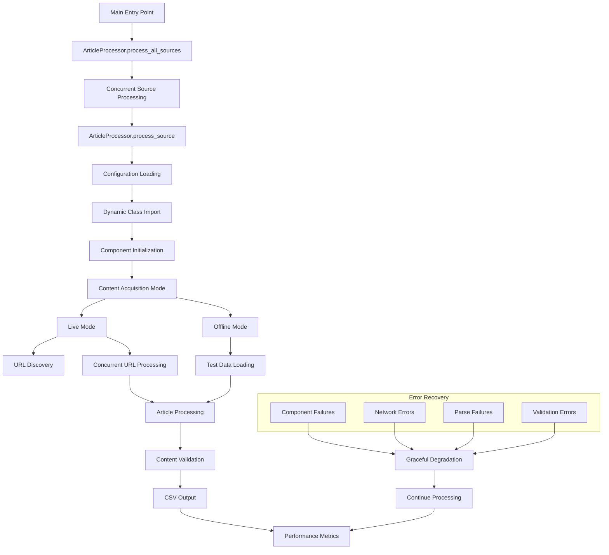
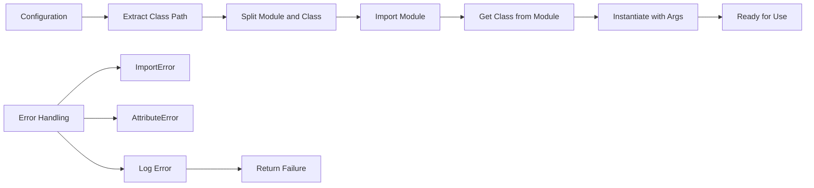
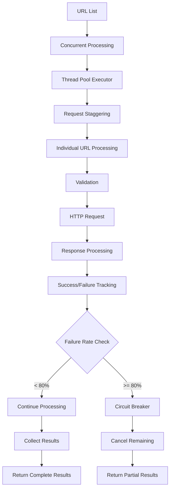
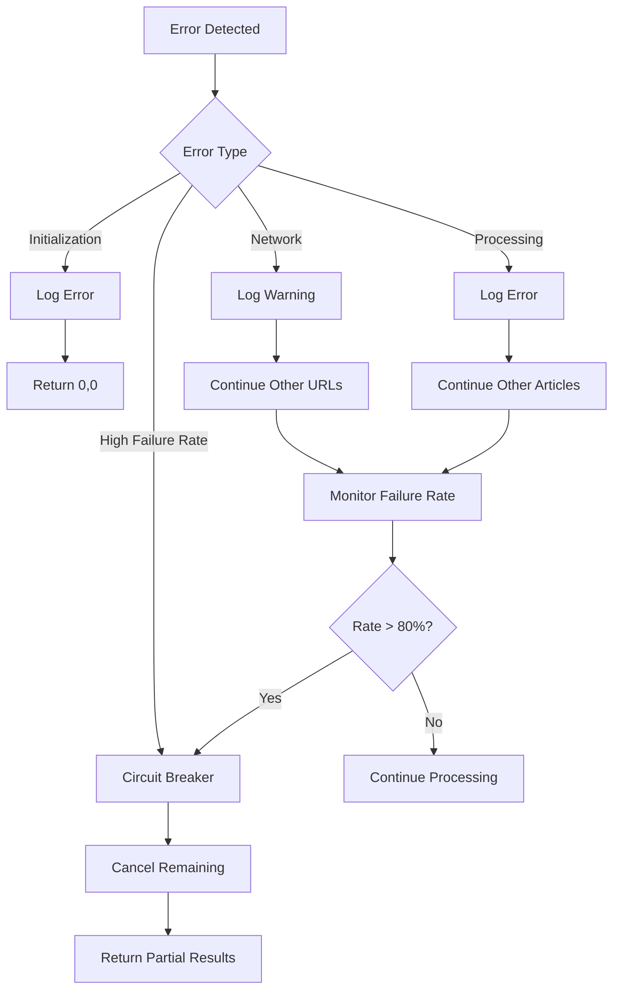
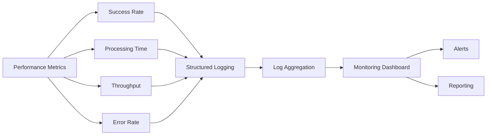
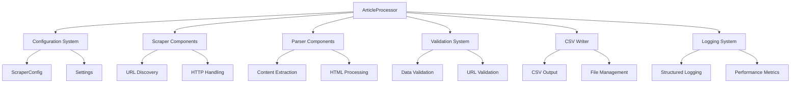

# Processor - Core Orchestration System

> [!abstract] Overview
> The Processor is the central orchestrator that coordinates the entire article scraping pipeline. It manages concurrent processing, dynamic class loading, error handling, and the complete flow from URL discovery to CSV output. This document provides comprehensive understanding of the core processing system architecture and implementation.

## Table of Contents
- [[#Architecture Overview|Architecture Overview]]
- [[#Core ArticleProcessor Class|Core ArticleProcessor Class]]
- [[#Dynamic Class Loading|Dynamic Class Loading]]
- [[#Source Processing Pipeline|Source Processing Pipeline]]
- [[#Concurrent Processing|Concurrent Processing]]
- [[#Live vs Offline Modes|Live vs Offline Modes]]
- [[#Error Handling and Recovery|Error Handling and Recovery]]
- [[#Performance Monitoring|Performance Monitoring]]
- [[#Integration with Components|Integration with Components]]
- [[#Testing and Debugging|Testing and Debugging]]

---

## Architecture Overview

> [!info] Processor System Design
> The processor acts as the central command center, orchestrating all components through a well-defined pipeline with concurrent processing, error recovery, and comprehensive monitoring.



### Core Responsibilities

> [!tip] What the Processor Does
> 1. **Configuration Management**: Load and validate scraper/parser configurations
> 2. **Dynamic Loading**: Import classes at runtime based on configuration
> 3. **Pipeline Orchestration**: Coordinate the complete processing flow
> 4. **Concurrent Processing**: Manage multiple URLs and sources simultaneously
> 5. **Mode Management**: Handle both live scraping and offline testing
> 6. **Error Recovery**: Implement circuit breakers and graceful degradation
> 7. **Performance Monitoring**: Track processing metrics and success rates
> 8. **Resource Management**: Control thread pools and memory usage

### Processing Flow

```mermaid
sequenceDiagram
    participant Main as Main Entry
    participant Processor as ArticleProcessor
    participant ClassLoader as Dynamic Importer
    participant Scraper as URL Scraper
    participant Parser as Article Parser
    participant Validator as Data Validator
    participant Writer as CSV Writer
    
    Main->>Processor: process_all_sources()
    Processor->>Processor: Setup concurrent processing
    loop For Each Source
        Processor->>Processor: process_source(config)
    Processor->>Processor: Validate config
    Processor->>ClassLoader: import_class(scraper_class)
    ClassLoader->>Processor: Return scraper class
    Processor->>ClassLoader: import_class(parser_class)
    ClassLoader->>Processor: Return parser class
    
    Processor->>Processor: Initialize components
    
    alt Live Mode
        Processor->>Scraper: get_article_urls()
        Scraper->>Processor: Return URL list
        Processor->>Processor: Process URLs concurrently
        loop Each URL
            Processor->>Parser: get_soup_from_url(url)
            Parser->>Processor: Return BeautifulSoup
        end
    else Offline Mode
        Processor->>Parser: get_test_sources_from_directory()
        Parser->>Processor: Return test data
    end
    
    loop Each Article
        Processor->>Parser: parse_article(soup)
        Parser->>Processor: Return parsed data
        Processor->>Validator: validate_article_data(data)
        Validator->>Processor: Return validated data
        Processor->>Writer: write to CSV
    end
    
    Processor->>Main: Return (processed, attempted)
```

---

## Core ArticleProcessor Class

The `ArticleProcessor` class is the main orchestrator that coordinates all scraping operations:

### Class Structure

```python
class ArticleProcessor:
    """
    Main processor class that coordinates scraping and parsing operations.
    
    Features:
    - Concurrent processing of multiple news sources
    - Duplicate detection and prevention
    - Both live and offline testing modes
    """
    
    @staticmethod
    def import_class(class_path: str) -> type:
        """Dynamically import a class from a string path."""
        
    @classmethod
    def process_all_sources(cls) -> Tuple[int, int]:
        """
        Main entry point - processes all configured sources concurrently.
        
        Returns:
            Tuple of (total_processed, total_attempted) across all sources
        """
        
    @classmethod
    def process_source(cls, config: ScraperConfig) -> Tuple[int, int]:
        """Process a single news source from URL discovery to CSV output."""
        
    @staticmethod
    def _get_live_sources_with_recovery(scraper, parser, source_name) -> List[Tuple]:
        """Handle live URL fetching with concurrent processing and recovery."""
        
    @staticmethod
    def _get_test_sources(parser, source_name) -> List[Tuple]:
        """Load test files from the test_data directory."""
        
    @staticmethod
    def _process_article_with_recovery(parser, soup, source_identifier, source_name) -> bool:
        """Process individual article with error recovery."""
```

### Key Design Patterns

> [!note] Design Patterns Used
> - **Factory Pattern**: Dynamic class loading based on configuration
> - **Template Method**: Consistent processing pipeline across all sources
> - **Strategy Pattern**: Different processing strategies for live vs offline
> - **Circuit Breaker**: Fail-fast when too many errors occur
> - **Observer Pattern**: Comprehensive logging and monitoring

---

## Dynamic Class Loading

The processor uses dynamic class loading to support configuration-driven architecture:

### Implementation Details

```python
@staticmethod
def import_class(class_path: str) -> type:
    """
    Dynamically import a class from a string path.
    
    This method enables configuration-driven class loading, allowing
    the system to instantiate scrapers and parsers based on string
    configurations rather than hardcoded imports.
    
    Args:
        class_path: Fully qualified class path (e.g., 'module.submodule.ClassName')
        
    Returns:
        The imported class object ready for instantiation
        
    Raises:
        ImportError: If the module cannot be imported
        AttributeError: If the class doesn't exist in the module
    """
    module_path, class_name = class_path.rsplit(".", 1)
    module = importlib.import_module(module_path)
    return getattr(module, class_name)
```

### Configuration-Driven Loading

The system loads classes based on configuration from `website_parser_scrapers_config.py`:

```python
# Example configuration
ScraperConfig(
    name="Slate.fr",
    enabled=True,
    scraper_class="scrapers.slate_fr_scraper.SlateFrURLScraper",
    parser_class="parsers.slate_fr_parser.SlateFrArticleParser",
    scraper_kwargs={"debug": True},
    parser_kwargs={"delay": 2.0}
)
```

### Dynamic Loading Process



### Error Handling in Dynamic Loading

```python
try:
    ScraperClass = cls.import_class(config.scraper_class)
    ParserClass = cls.import_class(config.parser_class)
    scraper = ScraperClass(**(config.scraper_kwargs or {}))
    parser = ParserClass(**(config.parser_kwargs or {}))
    
except Exception as e:
    logger.error("Component initialization failed", extra_data={
        "source": config.name,
        "scraper_class": config.scraper_class,
        "parser_class": config.parser_class,
        "error": str(e)
    }, exc_info=True)
    return 0, 0
```

---

## Source Processing Pipeline

The main processing pipeline handles the complete flow from configuration to output:

### Pipeline Stages

> [!example]- Complete Processing Pipeline
> ```
> 1. CONFIGURATION VALIDATION
>    ├── Check if source is enabled
>    ├── Validate scraper/parser class paths
>    └── Setup logging context
> 
> 2. COMPONENT INITIALIZATION
>    ├── Dynamic class loading
>    ├── Component instantiation
>    ├── Error handling for failures
>    └── Resource allocation
> 
> 3. CONTENT ACQUISITION
>    ├── Mode determination (live/offline)
>    ├── URL discovery or test data loading
>    ├── Concurrent processing setup
>    └── Rate limiting and delays
> 
> 4. ARTICLE PROCESSING
>    ├── HTML parsing with BeautifulSoup
>    ├── Content extraction
>    ├── Data validation
>    └── CSV output
> 
> 5. PERFORMANCE MONITORING
>    ├── Success rate calculation
>    ├── Processing time tracking
>    ├── Resource usage monitoring
>    └── Comprehensive logging
> ```

### Processing Logic Flow

```python
@classmethod
def process_source(cls, config: ScraperConfig) -> Tuple[int, int]:
    """Main processing pipeline for a single news source."""
    
    # 1. Configuration validation
    if not config.enabled:
        logger.info("Source processing skipped", extra_data={
            "source": config.name,
            "reason": "disabled"
        })
        return 0, 0
    
    # 2. Component initialization
    logger.info("Starting source processing", extra_data={
        "source": config.name,
        "scraper_class": config.scraper_class,
        "parser_class": config.parser_class
    })
    start_time = time.time()
    
    try:
        ScraperClass = cls.import_class(config.scraper_class)
        ParserClass = cls.import_class(config.parser_class)
        scraper = ScraperClass(**(config.scraper_kwargs or {}))
        parser = ParserClass(**(config.parser_kwargs or {}))
    except Exception as e:
        logger.error("Component initialization failed", extra_data={
            "source": config.name,
            "error": str(e)
        }, exc_info=True)
        return 0, 0
    
    # 3. Content acquisition
    sources = (
        cls._get_test_sources(parser, config.name)
        if OFFLINE
        else cls._get_live_sources_with_recovery(scraper, parser, config.name)
    )
    
    if not sources:
        logger.warning("No content sources found", extra_data={
            "source": config.name,
            "mode": "offline" if OFFLINE else "live"
        })
        return 0, 0
    
    # 4. Article processing
    processed_count = 0
    total_attempted = len(sources)
    
    for soup, source_identifier in sources:
        if soup and cls._process_article_with_recovery(
            parser, soup, source_identifier, config.name
        ):
            processed_count += 1
    
    # 5. Performance monitoring
    elapsed_time = time.time() - start_time
    success_rate = (processed_count / total_attempted * 100) if total_attempted > 0 else 0
    
    logger.info("Source processing completed", extra_data={
        "source": config.name,
        "articles_processed": processed_count,
        "articles_attempted": total_attempted,
        "success_rate_percent": round(success_rate, 1),
        "processing_time_seconds": round(elapsed_time, 2)
    })
    
    return processed_count, total_attempted
```

---

## Concurrent Processing

The processor implements sophisticated concurrent processing for optimal performance:

### ThreadPoolExecutor Implementation

```python
@staticmethod
def _get_live_sources_with_recovery(
    scraper: Any, parser: Any, source_name: str
) -> List[Tuple[Optional[BeautifulSoup], str]]:
    """Handle live URL fetching with concurrent processing and recovery."""
    
    # Get URLs from scraper
    urls = scraper.get_article_urls()
    if not urls:
        logger.warning("URL discovery returned no results", extra_data={
            "source": source_name,
            "scraper_class": scraper.__class__.__name__
        })
        return []
    
    # Configure concurrent processing
    max_concurrent_urls = min(len(urls), 3)  # Limit concurrent requests
    base_delay = parser.delay if hasattr(parser, "delay") else 1.0
    
    def fetch_single_url(url_info):
        i, url = url_info
        try:
            # Validate URL
            validated_url = DataValidator.validate_url(url)
            if not validated_url:
                return None, url, "invalid"
            
            # Stagger requests to avoid overwhelming servers
            if i > 0:
                time.sleep(base_delay * (i % 3))
            
            # Fetch content
            soup = parser.get_soup_from_url(validated_url)
            return soup, validated_url, "success" if soup else "failed"
            
        except Exception as e:
            logger.warning("URL processing error", extra_data={
                "url": url,
                "source": source_name,
                "error": str(e)
            }, exc_info=True)
            return None, url, str(e)
    
    # Process URLs concurrently
    soup_sources = []
    failed_count = 0
    
    with ThreadPoolExecutor(max_workers=max_concurrent_urls) as executor:
        future_to_url = {
            executor.submit(fetch_single_url, (i, url)): url
            for i, url in enumerate(urls)
        }
        
        for future in as_completed(future_to_url):
            try:
                soup, processed_url, status = future.result()
                soup_sources.append((soup, processed_url))
                
                if status != "success":
                    failed_count += 1
                    
                    # Circuit breaker: Early termination if too many failures
                    if failed_count >= 5 and failed_count / len(soup_sources) > 0.8:
                        logger.warning("Early termination due to high failure rate", extra_data={
                            "source": source_name,
                            "failed_count": failed_count,
                            "failure_rate_percent": round(failed_count / len(soup_sources) * 100, 1)
                        })
                        # Cancel remaining futures
                        for remaining_future in future_to_url:
                            if not remaining_future.done():
                                remaining_future.cancel()
                        break
                        
            except Exception as e:
                logger.error("Concurrent URL processing error", extra_data={
                    "source": source_name,
                    "error": str(e)
                }, exc_info=True)
                failed_count += 1
    
    return soup_sources
```

### Concurrency Control Features

> [!note] Concurrency Features
> - **Thread Pool Management**: Limits concurrent requests per source
> - **Request Staggering**: Spreads requests over time to avoid rate limiting
> - **Circuit Breaker**: Terminates early if failure rate exceeds threshold
> - **Resource Limits**: Controls memory usage and connection pooling
> - **Graceful Shutdown**: Properly cancels pending requests on failure

### Performance Optimization



---

## Live vs Offline Modes

The processor supports two distinct operating modes for different use cases:

### Mode Selection

```python
sources = (
    cls._get_test_sources(parser, config.name)
    if OFFLINE
    else cls._get_live_sources_with_recovery(scraper, parser, config.name)
)
```

### Live Mode Operation

> [!example] Live Mode Flow
> ```
> 1. URL Discovery
>    ├── Call scraper.get_article_urls()
>    ├── Validate discovered URLs
>    └── Prepare for concurrent processing
> 
> 2. Concurrent URL Processing
>    ├── ThreadPoolExecutor with limited workers
>    ├── Request staggering with delays
>    ├── Individual URL fetching
>    └── Circuit breaker monitoring
> 
> 3. Content Retrieval
>    ├── HTTP requests to article URLs
>    ├── BeautifulSoup parsing
>    ├── Error handling for network issues
>    └── Response validation
> 
> 4. Performance Monitoring
>    ├── Success rate tracking
>    ├── Failure rate monitoring
>    ├── Early termination triggers
>    └── Resource usage tracking
> ```

### Offline Mode Operation

```python
@staticmethod
def _get_test_sources(
    parser: Any, source_name: str
) -> List[Tuple[Optional[BeautifulSoup], str]]:
    """Load test files from the test_data directory."""
    return parser.get_test_sources_from_directory(source_name)
```

> [!example] Offline Mode Flow
> ```
> 1. Test Data Discovery
>    ├── Scan test_data/raw_url_soup/ directory
>    ├── Locate files matching source name
>    └── Validate file formats
> 
> 2. Local File Processing
>    ├── Load cached HTML files
>    ├── Create BeautifulSoup objects
>    ├── Simulate URL identifiers
>    └── Prepare for parsing
> 
> 3. Consistent Processing
>    ├── Same parsing pipeline as live mode
>    ├── Identical validation steps
>    ├── Same CSV output format
>    └── Performance metrics collection
> ```

### Mode Comparison

| Feature | Live Mode | Offline Mode |
|---------|-----------|--------------|
| **Data Source** | Live web scraping | Cached test files |
| **Network Dependency** | Required | None |
| **Processing Speed** | ~60 seconds | ~10 seconds |
| **Concurrency** | ThreadPoolExecutor | Sequential |
| **Error Types** | Network, parsing, validation | Parsing, validation |
| **Development Use** | Production, integration testing | Unit testing, debugging |
| **Reliability** | Variable (network dependent) | Consistent |

---

## Error Handling and Recovery

The processor implements comprehensive error handling with multiple recovery strategies:

### Error Categories

> [!warning] Error Types and Handling
> 1. **Component Initialization Errors**
>    - Missing classes or modules
>    - Invalid configuration parameters
>    - Import failures
>    - Resource allocation errors
> 
> 2. **Network and HTTP Errors**
>    - Connection timeouts
>    - HTTP status errors
>    - DNS resolution failures
>    - Rate limiting responses
> 
> 3. **Content Processing Errors**
>    - HTML parsing failures
>    - Content extraction errors
>    - Data validation failures
>    - CSV writing errors
> 
> 4. **Concurrent Processing Errors**
>    - Thread pool failures
>    - Future cancellation errors
>    - Resource exhaustion
>    - Deadlock prevention

### Recovery Strategies

#### 1. Component Initialization Recovery

```python
try:
    ScraperClass = cls.import_class(config.scraper_class)
    ParserClass = cls.import_class(config.parser_class)
    scraper = ScraperClass(**(config.scraper_kwargs or {}))
    parser = ParserClass(**(config.parser_kwargs or {}))
    
except Exception as e:
    logger.error("Component initialization failed", extra_data={
        "source": config.name,
        "scraper_class": config.scraper_class,
        "parser_class": config.parser_class,
        "error": str(e)
    }, exc_info=True)
    return 0, 0  # Fail fast for initialization errors
```

#### 2. Article Processing Recovery

```python
@staticmethod
def _process_article_with_recovery(
    parser: Any, soup: BeautifulSoup, source_identifier: str, source_name: str
) -> bool:
    """Process individual article with error recovery."""
    
    def process_article():
        # Attempt parsing
        parsed_content = parser.parse_article(soup)
        if not parsed_content:
            raise ValueError(f"No content extracted from {source_identifier}")
        
        # Validate content
        validated_content = DataValidator.validate_article_data(parsed_content)
        if not validated_content:
            raise ValueError(f"Article validation failed for {source_identifier}")
        
        # Write to CSV
        parser.to_csv(validated_content, source_identifier)
        return True
    
    try:
        return process_article()
    except Exception as e:
        logger.error("Article processing failed", extra_data={
            "source": source_name,
            "article_url": source_identifier,
            "error": str(e)
        }, exc_info=True)
        return False  # Continue processing other articles
```

#### 3. Circuit Breaker Implementation

```python
# Circuit breaker logic in concurrent processing
if failed_count >= 5 and failed_count / len(soup_sources) > 0.8:
    current_failure_rate = (failed_count / len(soup_sources) * 100)
    logger.warning("Early termination due to high failure rate", extra_data={
        "source": source_name,
        "failed_count": failed_count,
        "processed_count": len(soup_sources),
        "failure_rate_percent": round(current_failure_rate, 1),
        "threshold_percent": 80
    })
    
    # Cancel remaining futures
    for remaining_future in future_to_url:
        if not remaining_future.done():
            remaining_future.cancel()
    break
```

### Error Recovery Flow



---

## Performance Monitoring

The processor includes comprehensive performance monitoring and metrics collection:

### Performance Metrics

> [!info] Collected Metrics
> - **Processing Time**: Total time for source processing
> - **Success Rate**: Percentage of successfully processed articles
> - **Articles Per Second**: Processing throughput
> - **Failure Rate**: Percentage of failed processing attempts
> - **Resource Usage**: Memory and CPU utilization
> - **Network Performance**: Request success/failure rates
> - **Concurrency Metrics**: Thread pool utilization

### Metrics Collection Implementation

```python
# Performance tracking in process_source
start_time = time.time()

# ... processing logic ...

elapsed_time = time.time() - start_time
success_rate = (processed_count / total_attempted * 100) if total_attempted > 0 else 0

logger.info("Source processing completed", extra_data={
    "source": config.name,
    "articles_processed": processed_count,
    "articles_attempted": total_attempted,
    "success_rate_percent": round(success_rate, 1),
    "processing_time_seconds": round(elapsed_time, 2),
    "articles_per_second": round(processed_count / elapsed_time if elapsed_time > 0 else 0, 2)
})
```

### Performance Monitoring Dashboard



### Health Check Indicators

> [!note] Health Indicators
> - **Success Rate > 70%**: Healthy operation
> - **Processing Time < 120s**: Acceptable performance
> - **Failure Rate < 30%**: Normal error levels
> - **Circuit Breaker Trips**: Investigate source issues
> - **Zero Articles Processed**: Check source availability

---

## Integration with Components

The processor integrates with all system components through well-defined interfaces:

### Component Integration Map



### Interface Contracts

#### 1. Scraper Interface

```python
# Expected scraper interface
class ScrapeInterface:
    def get_article_urls(self, max_articles: int = 8) -> List[str]:
        """Return list of article URLs from homepage."""
        pass
```

#### 2. Parser Interface

```python
# Expected parser interface
class ParserInterface:
    def parse_article(self, soup: BeautifulSoup) -> Optional[Dict[str, Any]]:
        """Extract article content from HTML."""
        pass
    
    def get_soup_from_url(self, url: str) -> Optional[BeautifulSoup]:
        """Fetch and parse HTML from URL."""
        pass
    
    def get_test_sources_from_directory(self, source_name: str) -> List[Tuple]:
        """Load test data files."""
        pass
    
    def to_csv(self, data: dict, source_identifier: str) -> None:
        """Write processed data to CSV."""
        pass
```

#### 3. Validation Interface

```python
# Expected validator interface
class ValidatorInterface:
    @staticmethod
    def validate_url(url: str) -> Optional[str]:
        """Validate and normalize URL."""
        pass
    
    @staticmethod
    def validate_article_data(data: dict) -> Optional[dict]:
        """Validate extracted article data."""
        pass
```

### Integration Testing

The processor includes integration testing to verify component interactions:

```python
def test_processor_integration():
    """Test complete processor integration."""
    config = ScraperConfig(
        name="Test Source",
        enabled=True,
        scraper_class="test_scrapers.TestScraper",
        parser_class="test_parsers.TestParser"
    )
    
    processed, attempted = ArticleProcessor.process_source(config)
    
    assert processed > 0
    assert attempted > 0
    assert processed <= attempted
```

---

## Testing and Debugging

The processor includes comprehensive testing and debugging capabilities:

### Test Categories

> [!example] Test Coverage
> ```
> 1. UNIT TESTS
>    ├── Dynamic class loading
>    ├── Configuration validation
>    ├── Error handling paths
>    └── Performance metrics
> 
> 2. INTEGRATION TESTS
>    ├── End-to-end processing
>    ├── Component interactions
>    ├── Concurrent processing
>    └── Mode switching
> 
> 3. PERFORMANCE TESTS
>    ├── Throughput measurement
>    ├── Resource usage monitoring
>    ├── Concurrent load testing
>    └── Memory leak detection
> 
> 4. FAILURE TESTS
>    ├── Network failure simulation
>    ├── Component failure testing
>    ├── Circuit breaker validation
>    └── Recovery mechanism testing
> ```

### Debugging Features

#### 1. Comprehensive Logging

```python
logger = get_structured_logger(__name__)

# Context-aware logging throughout processing
logger.info("Starting source processing", extra_data={
    "source": config.name,
    "scraper_class": config.scraper_class,
    "parser_class": config.parser_class
})

logger.error("Component initialization failed", extra_data={
    "source": config.name,
    "scraper_class": config.scraper_class,
    "parser_class": config.parser_class,
    "error": str(e)
}, exc_info=True)
```

#### 2. Performance Profiling

```python
# Built-in performance tracking
start_time = time.time()
# ... processing ...
elapsed_time = time.time() - start_time

logger.info("Source processing completed", extra_data={
    "source": config.name,
    "processing_time_seconds": round(elapsed_time, 2),
    "articles_per_second": round(processed_count / elapsed_time, 2)
})
```

#### 3. Debug Mode Support

```python
# Debug mode enables additional logging
if DEBUG:
    logger.debug("Processing article", extra_data={
        "url": source_identifier,
        "soup_length": len(str(soup)),
        "parser_class": parser.__class__.__name__
    })
```

### Testing Utilities

#### 1. Test Data Management

```python
# Offline mode uses test data
def _get_test_sources(parser: Any, source_name: str) -> List[Tuple]:
    """Load test files from the test_data directory."""
    return parser.get_test_sources_from_directory(source_name)
```

#### 2. Mock Component Testing

```python
# Test with mock components
class MockScraper:
    def get_article_urls(self, max_articles=8):
        return ["http://example.com/article1", "http://example.com/article2"]

class MockParser:
    def parse_article(self, soup):
        return {"title": "Test", "content": "Test content"}
```

#### 3. Performance Benchmarking

```python
# Benchmark different processing strategies
def benchmark_processing_modes():
    """Compare live vs offline processing performance."""
    
    # Test offline mode
    start_time = time.time()
    offline_results = process_with_offline_mode()
    offline_time = time.time() - start_time
    
    # Test live mode
    start_time = time.time()
    live_results = process_with_live_mode()
    live_time = time.time() - start_time
    
    print(f"Offline: {offline_time:.2f}s, Live: {live_time:.2f}s")
```

### Troubleshooting Guide

> [!tip] Common Issues and Solutions
> 1. **Component Import Failures**
>    - Check class path strings in configuration
>    - Verify module exists and is importable
>    - Check for circular imports
> 
> 2. **High Failure Rates**
>    - Review network connectivity
>    - Check rate limiting settings
>    - Validate scraper selectors
> 
> 3. **Performance Issues**
>    - Monitor thread pool size
>    - Check memory usage patterns
>    - Review concurrent request limits
> 
> 4. **Circuit Breaker Activation**
>    - Investigate source availability
>    - Check error patterns in logs
>    - Review failure rate thresholds

---

## Conclusion

The Processor system serves as the **central nervous system** of the French article scraper, orchestrating all components through a sophisticated pipeline that balances performance, reliability, and maintainability.

**Key Strengths**:
- ✅ **Modular Architecture**: Clear separation of concerns with well-defined interfaces
- ✅ **Concurrent Processing**: Efficient parallel processing with resource management
- ✅ **Error Resilience**: Comprehensive error handling and recovery mechanisms
- ✅ **Performance Monitoring**: Detailed metrics and health monitoring
- ✅ **Flexible Configuration**: Dynamic class loading supports easy extension
- ✅ **Dual Mode Support**: Seamless switching between live and offline operation

**Technical Highlights**:
- **ThreadPoolExecutor**: Manages concurrent URL processing with configurable limits
- **Circuit Breaker Pattern**: Prevents cascade failures with automatic recovery
- **Dynamic Class Loading**: Enables configuration-driven architecture
- **Structured Logging**: Comprehensive monitoring and debugging capabilities
- **Performance Metrics**: Real-time tracking of processing efficiency

The processor's design enables the system to handle production workloads while maintaining developer-friendly features for testing and debugging. Its robust error handling ensures graceful degradation under adverse conditions, while the performance monitoring provides visibility into system health and operation efficiency.

This architecture serves as a foundation for scaling the system to handle additional news sources, implementing advanced processing features, and adapting to changing requirements while maintaining reliability and performance.