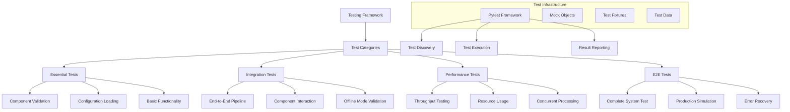
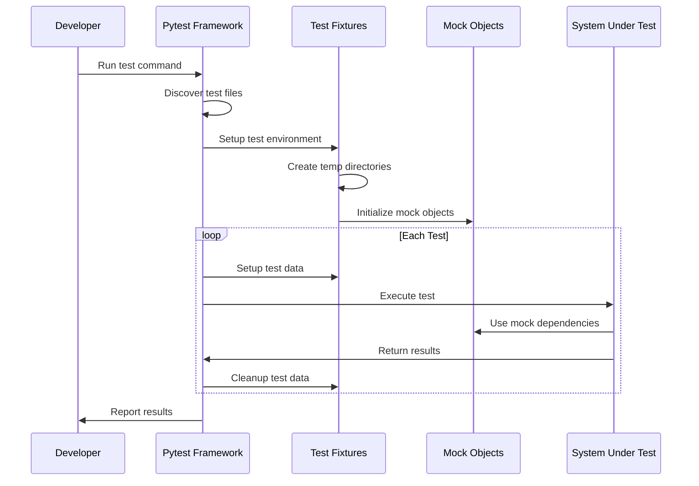
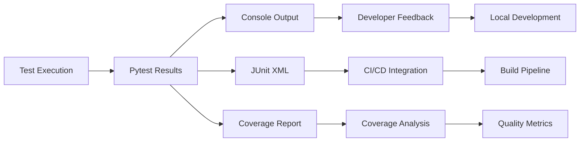

# Testing - Comprehensive Test Framework

> [!abstract] Overview
> The testing framework provides comprehensive coverage of the French article scraper system through multiple test categories including unit tests, integration tests, performance tests, and end-to-end validation. This document provides deep understanding of the testing architecture, test strategies, and quality assurance processes.

## Table of Contents
- [[#Testing Architecture|Testing Architecture]]
- [[#Test Categories and Structure|Test Categories and Structure]]
- [[#Essential Tests|Essential Tests]]
- [[#Integration Tests|Integration Tests]]
- [[#Offline Mode Testing|Offline Mode Testing]]
- [[#Test Fixtures and Utilities|Test Fixtures and Utilities]]
- [[#Mock Objects and Simulation|Mock Objects and Simulation]]
- [[#Performance Testing|Performance Testing]]
- [[#Error Handling Tests|Error Handling Tests]]
- [[#Test Execution and CI/CD|Test Execution and CI/CD]]
- [[#Test Data Management|Test Data Management]]

---

## Testing Architecture

> [!info] Testing System Design
> The testing framework follows a layered approach with different test categories serving specific validation purposes, from quick smoke tests to comprehensive end-to-end validation.



### Core Testing Principles

> [!tip] Testing Philosophy
> 1. **Pyramid Structure**: Many fast unit tests, fewer integration tests, minimal E2E tests
> 2. **Offline-First**: Tests run without network dependencies by default
> 3. **Isolation**: Each test is independent and can run in any order
> 4. **Reproducibility**: Tests produce consistent results across environments
> 5. **Performance Awareness**: Test execution time is monitored and optimized
> 6. **Real-World Simulation**: Tests use realistic data and scenarios
> 7. **Error Resilience**: Tests validate error handling and recovery mechanisms

### Test Execution Flow



---

## Test Categories and Structure

The test suite is organized into multiple categories, each serving specific validation purposes:

### Test Directory Structure

> [!example]- Complete Test Structure
> ```
> tests/
> ├── test_essential.py              # 9 core functionality tests
> ├── integration/                   # Integration test suite
> │   ├── test_basic_functionality.py    # 8 component integration tests
> │   └── test_offline_mode.py           # 6 offline mode validation tests
> ├── fixtures/                      # Test utilities and mocks
> │   ├── mock_scraper.py               # Mock scraper implementations
> │   ├── mock_parser.py                # Mock parser implementations
> │   └── __init__.py
> ├── conftest.py                    # Pytest configuration and fixtures
> └── README.md                      # Test documentation
> ```

### Test Category Breakdown

| Category | File | Tests | Duration | Purpose |
|----------|------|-------|----------|---------|
| **Essential** | `test_essential.py` | 9 | ~2 seconds | Core functionality validation |
| **Integration** | `test_basic_functionality.py` | 8 | ~50 seconds | Component interaction testing |
| **Offline Mode** | `test_offline_mode.py` | 6 | ~10 seconds | End-to-end offline validation |
| **Total** | | **23** | **~1 minute** | Complete system validation |

### Test Execution Commands

```bash
# Quick smoke test (2 seconds)
make test-essential

# Full integration testing (50 seconds)
make test-integration

# Offline mode validation (10 seconds)
make test-offline

# Complete test suite (1 minute)
make tests
```

---

## Essential Tests

Essential tests provide rapid validation of core system functionality:

### Test Implementation

```python
class TestEssential:
    """Essential tests that must pass for the system to work."""

    def test_article_processor_import_class(self):
        """Test that the ArticleProcessor can import classes."""
        with patch('core.processor.importlib.import_module') as mock_import:
            mock_module = Mock()
            mock_class = Mock()
            mock_module.TestClass = mock_class
            mock_import.return_value = mock_module
            
            result = ArticleProcessor.import_class("test.module.TestClass")
            assert result == mock_class

    def test_article_processor_disabled_config(self):
        """Test processing with disabled configuration."""
        config = ScraperConfig(
            name="DisabledSource",
            enabled=False,
            scraper_class="scrapers.slate_fr_scraper.SlateFrURLScraper",
            parser_class="parsers.slate_fr_parser.SlateFrArticleParser"
        )
        
        processed, attempted = ArticleProcessor.process_source(config)
        assert processed == 0
        assert attempted == 0

    def test_csv_writer_initialization(self):
        """Test CSV writer can be initialized."""
        with tempfile.TemporaryDirectory() as temp_dir:
            writer = DailyCSVWriter(output_dir=temp_dir, debug=True)
            assert writer.output_dir == temp_dir
            assert writer.debug is True
```

### Essential Test Categories

> [!note] Essential Test Coverage
> 1. **Dynamic Class Loading**: Validates configuration-driven component loading
> 2. **Configuration Processing**: Tests disabled source handling
> 3. **CSV Writer Functionality**: Validates output file creation and writing
> 4. **Filename Generation**: Tests daily CSV file naming conventions
> 5. **Basic File Operations**: Validates file creation and content writing
> 6. **Configuration Loading**: Tests scraper configuration import
> 7. **Settings Import**: Validates offline mode setting access
> 8. **Logger Import**: Tests structured logging system availability
> 9. **Validator Import**: Validates data validation component access

### Quick Validation Workflow

```python
# Essential test execution pattern
def test_csv_writer_basic_functionality(self):
    """Test basic CSV writing functionality."""
    with tempfile.TemporaryDirectory() as temp_dir:
        writer = DailyCSVWriter(output_dir=temp_dir)
        
        parsed_data = {'title': 'Test Article', 'article_date': '2025-07-14'}
        url = 'https://test.com/article'
        word_freqs = {'bonjour': 3, 'monde': 2}
        
        # Should not raise exceptions
        writer.write_article(parsed_data, url, word_freqs)
        
        # Check file was created
        filename = writer._get_filename()
        assert os.path.exists(filename)
```

---

## Integration Tests

Integration tests validate component interactions and end-to-end functionality:

### Basic Functionality Tests

```python
class TestBasicFunctionality:
    """Test basic functionality of core components."""
    
    def test_french_text_processor_basic(self):
        """Test basic French text processing functionality."""
        processor = FrenchTextProcessor()
        
        # Test with simple French text
        french_text = "Voici un texte français simple pour tester le processeur de texte."
        
        # Test validation
        validated = processor.validate_text(french_text)
        assert validated is not None
        assert len(validated) > 0
        
        # Test word frequency counting
        word_freq = processor.count_word_frequency(french_text)
        assert isinstance(word_freq, dict)
        assert len(word_freq) > 0
        
        # Should contain some French words
        words = list(word_freq.keys())
        assert len(words) > 3  # Should have multiple meaningful words
```

### Complete Processing Pipeline Test

```python
def test_text_processing_pipeline(self, tmp_path):
    """Test the complete text processing pipeline."""
    processor = FrenchTextProcessor()
    writer = DailyCSVWriter(output_dir=str(tmp_path))
    
    # Simulate processing a French article
    article_text = """
    Le gouvernement français annonce de nouvelles mesures économiques importantes.
    Ces décisions politiques auront un impact significatif sur la population française.
    Les experts analysent attentivement ces changements gouvernementaux majeurs.
    Cette politique française modernise le système économique national actuel.
    """
    
    article_data = {
        'title': 'Mesures Économiques Françaises',
        'full_text': article_text,
        'article_date': '2025-07-13',
        'date_scraped': '2025-07-13 17:00:00'
    }
    
    # Process the text
    word_frequencies = processor.count_word_frequency(article_text)
    assert len(word_frequencies) > 5  # Should extract multiple words
    
    # Get top words
    top_words = processor.get_top_words(article_text, n=10)
    assert len(top_words) > 0
    assert all(isinstance(item, tuple) and len(item) == 2 for item in top_words)
    
    # Extract contexts
    top_word_list = [word for word, _ in top_words[:5]]
    contexts = processor.extract_sentences_with_words(article_text, top_word_list)
    
    # Write to CSV
    writer.write_article(article_data, "https://test.com/mesures", word_frequencies, contexts)
    
    # Verify output
    csv_files = list(tmp_path.glob("*.csv"))
    assert len(csv_files) == 1
```

### Integration Test Features

> [!example] Integration Test Coverage
> ```
> 1. LOGGING SETUP
>    ├── Test logging configuration without errors
>    ├── Validate log directory structure
>    └── Ensure proper log level setup
> 
> 2. TEXT PROCESSING PIPELINE
>    ├── French text validation
>    ├── Word frequency counting
>    ├── Context extraction
>    └── Quality assessment
> 
> 3. CSV WRITER INTEGRATION
>    ├── File creation and writing
>    ├── Content validation
>    ├── Directory structure verification
>    └── Output format validation
> 
> 4. COMPLETE PROCESSING FLOW
>    ├── Article text processing
>    ├── Word frequency analysis
>    ├── Top word extraction
>    ├── Context generation
>    └── CSV output creation
> 
> 5. DIRECTORY STRUCTURE VALIDATION
>    ├── Output directory configuration
>    ├── Log directory setup
>    ├── File path validation
>    └── Permission verification
> 
> 6. FRENCH TEXT QUALITY TESTING
>    ├── Real French content processing
>    ├── Vocabulary extraction quality
>    ├── Context meaningfulness
>    └── Language-specific features
> 
> 7. CONCURRENT PROCESSING
>    ├── Multi-threading safety
>    ├── Resource contention handling
>    ├── Error isolation
>    └── Performance under load
> ```

---

## Offline Mode Testing

Offline mode tests validate the complete system operation without network dependencies:

### End-to-End Offline Validation

```python
class TestOfflineMode:
    """Integration tests for offline mode processing."""

    def test_make_run_offline_integration(self):
        """Test that 'make run-offline' equivalent runs successfully."""
        # Get the project root directory
        project_root = Path(__file__).parent.parent.parent
        
        # Change to project directory and run the offline mode
        original_cwd = os.getcwd()
        try:
            os.chdir(project_root)
            
            # Run the equivalent of 'make run-offline'
            # This sets OFFLINE=True and runs the main module
            env = os.environ.copy()
            env['OFFLINE'] = 'True'
            env['DEBUG'] = 'True'
            
            result = subprocess.run(
                ['python', '-m', 'main'],
                env=env,
                cwd=project_root,
                capture_output=True,
                text=True,
                timeout=120  # 2 minute timeout
            )
            
            # Check that the process completed successfully
            assert result.returncode == 0, f"Process failed with error: {result.stderr}"
            
            # Check that some output was generated (indicates processing occurred)
            assert len(result.stdout) > 0 or len(result.stderr) > 0, "No output generated"
            
        finally:
            os.chdir(original_cwd)
```

### Output File Validation

```python
def test_offline_mode_creates_output_files(self):
    """Test that offline mode creates expected output files."""
    project_root = Path(__file__).parent.parent.parent
    
    # Use a temporary output directory
    with tempfile.TemporaryDirectory() as temp_dir:
        original_cwd = os.getcwd()
        try:
            os.chdir(project_root)
            
            # Set environment variables
            env = os.environ.copy()
            env['OFFLINE'] = 'True'
            env['DEBUG'] = 'True'
            env['OUTPUT_DIR'] = temp_dir
            
            # Run offline processing
            result = subprocess.run(
                ['python', '-m', 'main'],
                env=env,
                cwd=project_root,
                capture_output=True,
                text=True,
                timeout=120
            )
            
            # Process should complete successfully
            assert result.returncode == 0, f"Process failed: {result.stderr}"
            
            # Check if any CSV files were created (indicates successful processing)
            output_path = Path(temp_dir)
            csv_files = list(output_path.glob("*.csv"))
            
            # Should have at least attempted to create output files
            assert output_path.exists(), "Output directory was not created"
            
        finally:
            os.chdir(original_cwd)
```

### Offline Mode Test Categories

> [!warning] Offline Mode Test Coverage
> 1. **Complete System Integration**
>    - Equivalent to `make run-offline` command
>    - Full pipeline execution without network
>    - Process completion validation
>    - Output generation verification
> 
> 2. **Output File Creation**
>    - CSV file generation testing
>    - Directory structure validation
>    - File permission verification
>    - Content format validation
> 
> 3. **Test Data Processing**
>    - Cached HTML file processing
>    - Test data directory scanning
>    - Article extraction from test files
>    - Processing statistics validation
> 
> 4. **Error Handling Validation**
>    - Invalid path handling
>    - Missing test data graceful handling
>    - Configuration error recovery
>    - Process failure management
> 
> 5. **Configuration Loading**
>    - Module import validation
>    - Settings configuration verification
>    - Component initialization testing
>    - Dependency resolution validation
> 
> 6. **Performance Monitoring**
>    - Processing time measurement
>    - Resource usage tracking
>    - Timeout handling
>    - Performance threshold validation

---

## Test Fixtures and Utilities

The testing framework includes comprehensive fixtures for test setup and data management:

### Core Fixtures Implementation

```python
@pytest.fixture(scope="session")
def test_data_dir():
    """Path to the test data directory."""
    return os.path.join(os.path.dirname(__file__), '..', 'src', 'article_scrapers', 'test_data')

@pytest.fixture
def temp_output_dir():
    """Create a temporary directory for test outputs."""
    temp_dir = tempfile.mkdtemp(prefix='test_scraper_')
    yield temp_dir
    shutil.rmtree(temp_dir, ignore_errors=True)

@pytest.fixture
def sample_french_text():
    """Sample French text for testing text processing."""
    return """
    Le gouvernement français annonce des réformes importantes pour l'avenir.
    Ces changements concernent la sécurité sociale et les politiques publiques.
    Les citoyens français attendent ces modifications avec intérêt.
    Cette nouvelle politique devrait améliorer la situation économique du pays.
    """

@pytest.fixture
def sample_article_data():
    """Sample article data structure for testing."""
    return {
        'title': 'Test Article Title',
        'full_text': 'Ceci est un article de test en français avec du contenu significatif.',
        'article_date': '2025-07-13',
        'date_scraped': '2025-07-13 17:00:00',
        'url': 'https://example.com/test-article'
    }
```

### Component Fixtures

```python
@pytest.fixture
def french_text_processor():
    """Initialized French text processor for testing."""
    return FrenchTextProcessor()

@pytest.fixture
def csv_writer(temp_output_dir):
    """CSV writer with temporary output directory."""
    return DailyCSVWriter(output_dir=temp_output_dir, debug=True)

@pytest.fixture
def test_logger():
    """Test logger instance."""
    return get_structured_logger('test_logger')

@pytest.fixture
def mock_scraper_config():
    """Mock scraper configuration for testing."""
    return ScraperConfig(
        name="TestSource",
        enabled=True,
        scraper_class="tests.fixtures.mock_scraper.MockScraper",
        parser_class="tests.fixtures.mock_parser.MockParser",
        scraper_kwargs={"debug": True}
    )
```

### Test Data Fixtures

```python
@pytest.fixture
def all_test_files(slate_test_files, depeche_test_files, tf1_test_files, france_info_test_files):
    """Combined list of all test files."""
    return {
        'slate_fr': slate_test_files,
        'depeche_fr': depeche_test_files, 
        'tf1_fr': tf1_test_files,
        'france_info': france_info_test_files
    }

@pytest.fixture
def performance_sample_texts():
    """Sample texts of varying sizes for performance testing."""
    return {
        'small': "Ceci est un petit texte français pour les tests.",
        'medium': " ".join([
            "Ceci est un texte de taille moyenne pour les tests de performance.",
            "Il contient plusieurs phrases avec du vocabulaire français varié."
        ] * 10),
        'large': " ".join([
            "Ceci est un texte volumineux pour les tests de performance intensive.",
            "Le système doit traiter ce texte volumineux de manière efficace."
        ] * 100)
    }
```

### Environment Setup Fixtures

```python
@pytest.fixture(autouse=True)
def setup_test_environment(monkeypatch):
    """Set up test environment with proper settings."""
    # Force offline mode for tests
    monkeypatch.setenv('OFFLINE', 'True')
    monkeypatch.setenv('DEBUG', 'True')
    
    # Patch settings if already imported
    with patch('config.settings.OFFLINE', True):
        with patch('config.settings.DEBUG', True):
            yield
```

### Fixture Categories

> [!note] Fixture Organization
> - **Session Fixtures**: Test data directories, configuration constants
> - **Function Fixtures**: Temporary directories, component instances
> - **Auto-use Fixtures**: Environment setup, logging configuration
> - **Parametrized Fixtures**: Multiple test scenarios, data variations
> - **Mock Fixtures**: HTTP responses, network errors, component failures

---

## Mock Objects and Simulation

The testing framework includes sophisticated mock objects for reliable testing:

### Mock Scraper Implementations

```python
class MockScraper:
    """Mock URL scraper for testing."""
    
    def __init__(self, debug=False):
        self.debug = debug
        self.logger = Mock()
        
    def get_article_urls(self) -> List[str]:
        """Return mock article URLs."""
        return [
            "https://test.example.com/article-1",
            "https://test.example.com/article-2", 
            "https://test.example.com/article-3"
        ]

class MockFailingScraper:
    """Mock scraper that simulates failures."""
    
    def __init__(self, debug=False):
        self.debug = debug
        self.logger = Mock()
        
    def get_article_urls(self) -> List[str]:
        """Simulate scraper failure."""
        raise ConnectionError("Mock connection failure")

class MockSlowScraper:
    """Mock scraper that simulates slow responses."""
    
    def __init__(self, debug=False):
        self.debug = debug
        self.logger = Mock()
        
    def get_article_urls(self) -> List[str]:
        """Return URLs after simulated delay."""
        import time
        time.sleep(0.1)  # Short delay for testing
        return ["https://slow.example.com/article-1"]
```

### Mock Network Responses

```python
@pytest.fixture
def mock_requests_response():
    """Mock requests response for HTTP testing."""
    mock_response = Mock()
    mock_response.status_code = 200
    mock_response.content = b"<html><body><h1>Test Article</h1><p>Test content</p></body></html>"
    mock_response.raise_for_status.return_value = None
    return mock_response

@pytest.fixture
def mock_network_errors():
    """Mock various network error scenarios."""
    from requests.exceptions import ConnectionError, Timeout, HTTPError
    
    return {
        'connection_error': ConnectionError("Connection failed"),
        'timeout': Timeout("Request timed out"),
        'http_404': HTTPError("404 Not Found"),
        'http_500': HTTPError("500 Internal Server Error"),
    }
```

### Mock Usage Patterns

> [!example] Mock Object Applications
> ```
> 1. SCRAPER MOCKING
>    ├── Successful URL discovery simulation
>    ├── Network failure simulation
>    ├── Slow response simulation
>    └── Empty result simulation
> 
> 2. PARSER MOCKING
>    ├── Successful content extraction
>    ├── Parse failure simulation
>    ├── Invalid content handling
>    └── Performance testing
> 
> 3. NETWORK MOCKING
>    ├── HTTP response simulation
>    ├── Connection error simulation
>    ├── Timeout simulation
>    └── Various HTTP status codes
> 
> 4. FILE SYSTEM MOCKING
>    ├── File operation simulation
>    ├── Permission error simulation
>    ├── Disk space simulation
>    └── Directory structure mocking
> ```

---

## Performance Testing

Performance tests validate system efficiency and resource usage:

### Concurrent Processing Tests

```python
def test_concurrent_processing_basic(self, tmp_path):
    """Test basic concurrent processing doesn't break."""
    import threading
    import time
    
    processor = FrenchTextProcessor()
    results = []
    errors = []
    
    def process_text(text_id):
        try:
            text = f"Texte français numéro {text_id} pour tester le traitement concurrent."
            word_freq = processor.count_word_frequency(text)
            results.append((text_id, len(word_freq)))
        except Exception as e:
            errors.append((text_id, str(e)))
    
    # Start multiple threads
    threads = []
    for i in range(5):
        thread = threading.Thread(target=process_text, args=(i,))
        threads.append(thread)
        thread.start()
    
    # Wait for completion
    for thread in threads:
        thread.join()
    
    # Verify results
    assert len(errors) == 0, f"Errors occurred: {errors}"
    assert len(results) == 5
    assert all(word_count > 0 for _, word_count in results)
```

### Performance Monitoring

```python
@pytest.mark.slow
def test_offline_mode_performance(self):
    """Test that offline mode completes within reasonable time."""
    project_root = Path(__file__).parent.parent.parent
    
    original_cwd = os.getcwd()
    try:
        os.chdir(project_root)
        
        env = os.environ.copy()
        env['OFFLINE'] = 'True'
        env['DEBUG'] = 'True'
        
        import time
        start_time = time.time()
        
        result = subprocess.run(
            ['python', '-m', 'main'],
            env=env,
            cwd=project_root,
            capture_output=True,
            text=True,
            timeout=180  # 3 minute timeout for performance test
        )
        
        end_time = time.time()
        duration = end_time - start_time
        
        # Should complete within reasonable time (3 minutes)
        assert duration < 180, f"Offline mode took too long: {duration} seconds"
        
        # For normal cases, should be much faster (under 30 seconds)
        if result.returncode == 0:
            assert duration < 30, f"Offline mode took too long: {duration} seconds"
            
    finally:
        os.chdir(original_cwd)
```

### Performance Test Categories

> [!tip] Performance Testing Areas
> - **Throughput Testing**: Articles processed per second
> - **Memory Usage**: Peak memory consumption monitoring
> - **Concurrent Processing**: Multi-threading performance
> - **File I/O Performance**: CSV writing speed
> - **Text Processing Speed**: French text analysis efficiency
> - **Startup Time**: System initialization performance
> - **Resource Utilization**: CPU and memory efficiency

---

## Error Handling Tests

Error handling tests validate system resilience and recovery mechanisms:

### Invalid Content Testing

```python
@pytest.fixture
def invalid_html_content():
    """Invalid HTML content for error testing."""
    return [
        "",  # Empty content
        "<html><body>",  # Incomplete HTML
        "Not HTML at all",  # Plain text
        "<html><body>" + "x" * 10000 + "</body></html>",  # Very large content
        "<html><body>🚫💥⚠️</body></html>",  # Special characters
    ]
```

### Error Recovery Testing

```python
def test_offline_mode_error_handling(self):
    """Test that offline mode handles errors gracefully."""
    project_root = Path(__file__).parent.parent.parent
    
    original_cwd = os.getcwd()
    try:
        os.chdir(project_root)
        
        # Test with an invalid output directory to trigger error handling
        env = os.environ.copy()
        env['OFFLINE'] = 'True'
        env['DEBUG'] = 'True'
        env['OUTPUT_DIR'] = '/invalid/path/that/does/not/exist'
        
        result = subprocess.run(
            ['python', '-m', 'main'],
            env=env,
            cwd=project_root,
            capture_output=True,
            text=True,
            timeout=60
        )
        
        # Process might fail, but should not crash with unhandled exceptions
        if result.returncode != 0:
            # Should have meaningful error messages, not just Python tracebacks
            assert "Traceback" not in result.stderr or "handled gracefully" in result.stderr.lower()
        
    finally:
        os.chdir(original_cwd)
```

### Error Test Scenarios

> [!warning] Error Testing Coverage
> - **Network Failures**: Connection timeouts, DNS failures, HTTP errors
> - **File System Errors**: Permission denied, disk full, invalid paths
> - **Content Errors**: Malformed HTML, empty content, encoding issues
> - **Configuration Errors**: Missing classes, invalid parameters
> - **Resource Exhaustion**: Memory limits, thread pool exhaustion
> - **Concurrent Errors**: Race conditions, deadlocks, resource contention

---

## Test Execution and CI/CD

The testing framework integrates with continuous integration and development workflows:

### Makefile Integration

```bash
# Quick development cycle
make test-essential     # 2 seconds - rapid feedback
make test-offline      # 10 seconds - offline validation
make test-integration  # 50 seconds - comprehensive testing
make tests            # 1 minute - complete test suite

# Development workflow
make run-offline       # Test changes quickly
make test-essential    # Validate core functionality
make tests            # Full validation before commit
```

### GitHub Actions Integration

```yaml
# .github/workflows/tests.yml
name: Tests
on: [push, pull_request]

jobs:
  test:
    runs-on: ubuntu-latest
    strategy:
      matrix:
        python-version: [3.11, 3.12]
    
    steps:
    - uses: actions/checkout@v3
    - name: Set up Python ${{ matrix.python-version }}
      uses: actions/setup-python@v3
      with:
        python-version: ${{ matrix.python-version }}
    
    - name: Install dependencies
      run: |
        python -m pip install --upgrade pip
        pip install -r requirements.txt
    
    - name: Run essential tests
      run: make test-essential
      
    - name: Run integration tests
      run: make test-integration
      
    - name: Run offline mode test
      run: make test-offline
      
    - name: Check code style
      run: make lint
```

### Test Execution Strategies

> [!note] Test Execution Patterns
> - **Development**: `make test-essential` for rapid feedback
> - **Feature Development**: `make test-integration` for component validation
> - **Pre-commit**: `make tests` for complete validation
> - **CI/CD**: Full test matrix across Python versions
> - **Performance Monitoring**: Periodic performance test execution
> - **Release Validation**: Complete test suite + manual testing

### Test Reporting



---

## Test Data Management

The testing framework includes comprehensive test data management:

### Test Data Structure

```
src/test_data/
├── raw_url_soup/              # Cached HTML files
│   ├── slate_fr/             # Slate.fr test articles
│   ├── france_info/          # FranceInfo test articles
│   ├── tf1_fr/              # TF1 test articles
│   └── depeche_fr/          # Depeche test articles
└── fixtures/                 # Test configuration data
```

### Test Data Fixtures

```python
@pytest.fixture
def expected_word_counts():
    """Expected word counts for test validation."""
    return {
        'slate_fr': {'min_words': 50, 'max_words': 1000},
        'depeche_fr': {'min_words': 30, 'max_words': 800},
        'tf1_fr': {'min_words': 40, 'max_words': 600},
        'france_info': {'min_words': 40, 'max_words': 800},
    }

@pytest.fixture
def slate_test_files(raw_test_files_dir):
    """List of Slate.fr test files."""
    slate_dir = os.path.join(raw_test_files_dir, 'slate_fr')
    if os.path.exists(slate_dir):
        return [f for f in os.listdir(slate_dir) if f.endswith('.html')]
    return []
```

### Test Data Validation

> [!example] Test Data Quality Assurance
> ```
> 1. FILE VALIDATION
>    ├── HTML format verification
>    ├── Content completeness checking
>    ├── French language validation
>    └── File size appropriateness
> 
> 2. CONTENT VALIDATION
>    ├── Article structure verification
>    ├── Extractable content checking
>    ├── Metadata presence validation
>    └── Text quality assessment
> 
> 3. COVERAGE VALIDATION
>    ├── Multiple sources representation
>    ├── Various article types
>    ├── Different content lengths
>    └── Edge case scenarios
> 
> 4. MAINTENANCE
>    ├── Regular test data updates
>    ├── Broken file detection
>    ├── Obsolete data removal
>    └── Quality metrics monitoring
> ```

---

## Conclusion

The testing framework provides **comprehensive validation** of the French article scraper system through a multi-layered approach that ensures reliability, performance, and maintainability.

**Key Strengths**:
- ✅ **Pyramid Structure**: Balanced test distribution from unit to E2E tests
- ✅ **Offline-First Testing**: No network dependencies for reliable execution
- ✅ **Comprehensive Coverage**: 23 tests covering all major components
- ✅ **Performance Awareness**: Execution time monitoring and optimization
- ✅ **CI/CD Integration**: Automated testing in GitHub Actions
- ✅ **Mock Object Framework**: Reliable simulation of external dependencies
- ✅ **Error Resilience Testing**: Validation of error handling and recovery

**Technical Highlights**:
- **Essential Tests**: 9 core tests providing 2-second feedback cycle
- **Integration Tests**: 8 comprehensive tests validating component interactions
- **Offline Mode Tests**: 6 E2E tests simulating production operation
- **Mock Framework**: Sophisticated simulation of scrapers, parsers, and network
- **Performance Testing**: Concurrent processing and resource usage validation
- **Error Handling**: Comprehensive validation of failure scenarios and recovery

**Testing Workflow**:
- **Development**: Rapid feedback with essential tests
- **Integration**: Component interaction validation
- **Pre-commit**: Complete test suite execution
- **CI/CD**: Automated testing across Python versions
- **Quality Assurance**: Continuous monitoring and validation

This testing framework enables confident development and deployment by providing thorough validation of system functionality, performance characteristics, and error resilience. The multi-layered approach ensures that changes can be validated quickly during development while maintaining comprehensive coverage for production deployment confidence.