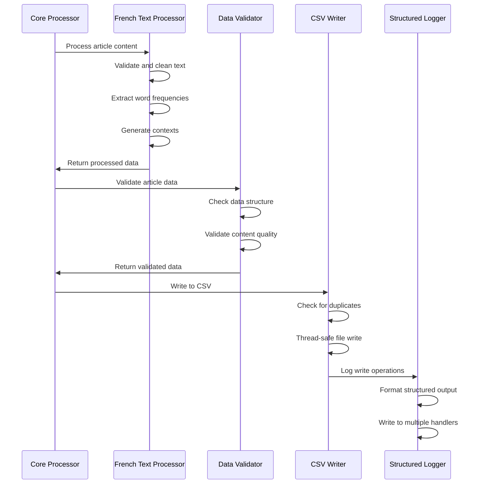
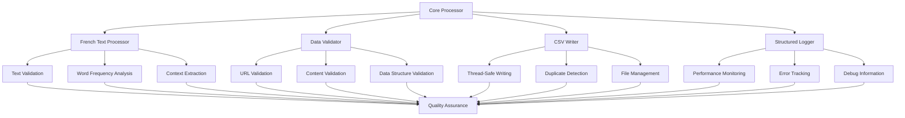

# Utils - Support Infrastructure System

> [!abstract] Overview
> The Utils module provides essential support infrastructure for the French article scraper system. It includes specialized utilities for CSV output, French text processing, data validation, structured logging, and HTML downloading. This document provides comprehensive understanding of each utility component and their integration within the system.

## Table of Contents
- [[#Architecture Overview|Architecture Overview]]
- [[#CSV Writer System|CSV Writer System]]
- [[#French Text Processor|French Text Processor]]
- [[#Data Validation System|Data Validation System]]
- [[#Structured Logging Framework|Structured Logging Framework]]
- [[#HTML Downloader Utility|HTML Downloader Utility]]
- [[#Logging Configuration|Logging Configuration]]
- [[#Component Integration|Component Integration]]
- [[#Performance Optimization|Performance Optimization]]
- [[#Error Handling and Recovery|Error Handling and Recovery]]

---

## Architecture Overview

> [!info] Utils System Design
> The Utils module provides a comprehensive support infrastructure with specialized components for data processing, output management, validation, and system monitoring.

```mermaid
graph TD
    A[Utils Module] --> B[CSV Writer System]
    A --> C[French Text Processor]
    A --> D[Data Validation System]
    A --> E[Structured Logging Framework]
    A --> F[HTML Downloader Utility]
    A --> G[Logging Configuration]
    
    B --> H[Thread-Safe CSV Output]
    B --> I[Daily File Management]
    B --> J[Duplicate Detection]
    
    C --> K[French Language Processing]
    C --> L[Word Frequency Analysis]
    C --> M[Context Extraction]
    
    D --> N[URL Validation]
    D --> O[Data Structure Validation]
    D --> P[Content Quality Assessment]
    
    E --> Q[Structured JSON Logging]
    E --> R[Human-Readable Console Output]
    E --> S[Performance Monitoring]
    
    F --> T[Test Data Generation]
    F --> U[HTML Content Caching]
    F --> V[Offline Mode Support]
    
    G --> W[Component-Specific Levels]
    G --> X[Debug Mode Configuration]
    G --> Y[Backward Compatibility]
    
    subgraph "Core Integration"
        Z[Thread Safety]
        AA[Error Recovery]
        BB[Performance Metrics]
        CC[Quality Assurance]
    end
    
    Z --> DD[System Reliability]
    AA --> DD
    BB --> DD
    CC --> DD
```



### Core Responsibilities

> [!tip] Utils Module Functions
> 1. **Data Output Management**: Thread-safe CSV writing with duplicate detection
> 2. **French Language Processing**: Specialized text analysis for French content
> 3. **Data Validation**: Comprehensive validation of URLs, content, and data structures
> 4. **Structured Logging**: Advanced logging with JSON output and performance tracking
> 5. **HTML Management**: Test data generation and content caching
> 6. **Configuration Management**: Logging setup and component-specific configuration
> 7. **Quality Assurance**: Content validation and spam detection
> 8. **Performance Monitoring**: Resource usage tracking and optimization

### Module Integration Flow



---

## CSV Writer System

The CSV Writer provides thread-safe output management with sophisticated features:

### Core Implementation

```python
class DailyCSVWriter:
    """Handles writing article word frequency data to daily CSV files."""
    
    # Class-level lock for thread safety during concurrent writes
    _write_lock = threading.Lock()

    def __init__(self, output_dir=None, debug=None):
        self.logger = get_structured_logger(self.__class__.__name__)
        
        # Set default output directory to src/output
        if output_dir is None:
            current_dir = os.path.dirname(os.path.abspath(__file__))
            output_dir = os.path.join(current_dir, "..", "output")
        
        self.output_dir = output_dir
        os.makedirs(self.output_dir, exist_ok=True)
        self.filename = self._get_filename()
        self.existing_keys = self._load_existing_keys()
        self.debug = DEBUG if debug is None else debug
```

### Key Features

> [!example] CSV Writer Capabilities
> ```
> 1. THREAD-SAFE OPERATIONS
>    ├── Class-level locks for concurrent access
>    ├── Atomic file operations
>    ├── Safe backup and restore mechanisms
>    └── Deadlock prevention
> 
> 2. DAILY FILE MANAGEMENT
>    ├── Automatic filename generation (YYYY-MM-DD.csv)
>    ├── Directory creation and management
>    ├── File rollover at midnight
>    └── Existing file detection
> 
> 3. DUPLICATE DETECTION
>    ├── In-memory key tracking
>    ├── Title + URL based deduplication
>    ├── Startup key loading from existing files
>    └── Performance-optimized lookups
> 
> 4. DATA VALIDATION
>    ├── Word frequency validation
>    ├── Content length limits
>    ├── Type checking and sanitization
>    └── Error recovery mechanisms
> 
> 5. BACKUP AND RECOVERY
>    ├── Automatic file backup before writes
>    ├── Rollback on write failures
>    ├── Corruption protection
>    └── Data integrity verification
> ```

### Thread-Safe Write Operations

```python
def write_article(
    self,
    parsed_data: dict,
    url: str,
    word_freqs: dict,
    word_contexts: Optional[dict] = None,
) -> None:
    """Write article data to CSV with full thread safety and validation."""
    
    # Validate input data
    if not word_freqs or not isinstance(word_freqs, dict):
        self.logger.warning(
            f"No valid word frequencies for {parsed_data.get('title', 'Unknown')}"
        )
        return

    # Validate word frequencies
    valid_freqs = {}
    for word, freq in word_freqs.items():
        if (
            isinstance(word, str)
            and isinstance(freq, (int, float))
            and freq > 0
            and len(word.strip()) >= 2
        ):
            valid_freqs[word.strip()] = int(freq)

    if not valid_freqs:
        self.logger.warning(
            f"No valid word frequencies after validation for {parsed_data.get('title', 'Unknown')}"
        )
        return

    # Duplicate detection
    key = f"{parsed_data['title']}:{url}"
    if key in self.existing_keys:
        if self.debug:
            self.logger.warning(
                f"Skipping duplicate: '{parsed_data['title']}' from {url}"
            )
        return

    backup_filename = f"{self.filename}.backup"

    # Use class-level lock to prevent concurrent file access issues
    with self._write_lock:
        file_exists = os.path.isfile(self.filename)

        try:
            # Create backup
            if file_exists:
                import shutil
                shutil.copy2(self.filename, backup_filename)

            # Write data
            with open(self.filename, mode="a", newline="", encoding="utf-8") as f:
                writer = csv.DictWriter(f, fieldnames=CSV_FIELDS)
                if not file_exists:
                    writer.writeheader()

                rows_written = 0
                for word, freq in valid_freqs.items():
                    try:
                        # Get context for this word
                        context = word_contexts.get(word, "") if word_contexts else ""

                        writer.writerow({
                            "word": str(word)[:100],  # Truncate long words
                            "context": str(context)[:500],  # Truncate long contexts
                            "source": str(url)[:500],
                            "article_date": parsed_data.get("article_date", ""),
                            "scraped_date": parsed_data.get("date_scraped", ""),
                            "title": str(parsed_data["title"])[:200],  # Truncate long titles
                            "frequency": int(freq) if isinstance(freq, (int, float)) else 1,
                        })
                        rows_written += 1
                    except (ValueError, TypeError) as e:
                        self.logger.warning(f"Skipping invalid word '{word}': {e}")

            if self.debug:
                self.logger.info(
                    f"Wrote {rows_written} word frequencies for '{parsed_data['title']}'"
                )
            self.existing_keys.add(key)

            # Clean up backup
            if os.path.exists(backup_filename):
                os.remove(backup_filename)

        except Exception as e:
            self.logger.error(f"Error writing CSV: {e}")
            # Restore backup on failure
            if os.path.exists(backup_filename):
                import shutil
                shutil.move(backup_filename, self.filename)
```

### CSV Output Format

| Field | Type | Description | Max Length |
|-------|------|-------------|------------|
| `word` | string | Extracted French word | 100 chars |
| `context` | string | Sentence containing the word | 500 chars |
| `source` | string | Article URL | 500 chars |
| `article_date` | string | Publication date (YYYY-MM-DD) | - |
| `scraped_date` | string | Processing timestamp | - |
| `title` | string | Article title | 200 chars |
| `frequency` | integer | Word occurrence count | - |

### Error Handling and Recovery

```python
# Comprehensive error handling with backup restoration
except PermissionError:
    self.logger.error(f"Permission denied writing to {self.filename}")
except OSError as e:
    self.logger.error(f"File system error writing CSV: {e}")
    if os.path.exists(backup_filename):
        import shutil
        shutil.move(backup_filename, self.filename)
        self.logger.info("Restored backup file")
except Exception as e:
    self.logger.error(f"Unexpected error writing '{parsed_data['title']}' to CSV: {e}")
    if os.path.exists(backup_filename):
        import shutil
        shutil.move(backup_filename, self.filename)
```

---

## French Text Processor

The French Text Processor provides sophisticated language-specific text analysis:

### Core Architecture

```python
class FrenchTextProcessor:
    """
    Advanced French text processor for news article analysis.
    
    Features:
    - French-specific accent normalization
    - Comprehensive stopword filtering
    - Junk word pattern detection
    - Word frequency analysis
    - Sentence context extraction
    - Text validation and spam detection
    - Configurable word length limits
    """
    
    def __init__(self):
        """Initialize with French stopwords and junk patterns."""
        self.french_stopwords = {
            # 134 common French stopwords
            "le", "la", "les", "un", "une", "des", "du", "de", "au", "aux",
            "je", "tu", "il", "elle", "nous", "vous", "ils", "elles",
            # ... comprehensive stopword list
        }
        self.min_word_length = 3
        self.max_word_length = 50
        self.junk_patterns = get_junk_patterns()
        self.logger = get_structured_logger(self.__class__.__name__)
```

### Text Validation Pipeline

```python
def validate_text(self, text: str) -> Optional[str]:
    """
    Validate input text for processing suitability.
    
    Validation criteria:
    - Minimum 10 characters and 5 words
    - Maximum 1MB size limit
    - At least 30% unique words (spam detection)
    - At least 50% alphabetic characters
    """
    if not text or not isinstance(text, str):
        return None

    text = text.strip()
    if len(text) < 10:
        return None

    if len(text) > 1000000:  # 1MB limit
        return None

    word_count = len(text.split())
    if word_count < 5:
        return None

    # Check for excessive repetition (spam detection)
    words = text.lower().split()
    unique_ratio = len(set(words)) / len(words)
    if unique_ratio < 0.3:  # Less than 30% unique words
        self.logger.debug("Text validation failed: low uniqueness", extra_data={
            "text_length": len(text),
            "word_count": len(words),
            "unique_ratio": round(unique_ratio, 3),
            "threshold": 0.3,
            "reason": "spam_detection"
        })
        return None

    # Check for excessive non-alphabetic content
    alpha_chars = sum(1 for c in text if c.isalpha())
    alpha_ratio = alpha_chars / len(text)
    if alpha_ratio < 0.5:  # Less than 50% alphabetic
        self.logger.debug("Text validation failed: low alphabetic content", extra_data={
            "text_length": len(text),
            "alpha_chars": alpha_chars,
            "alpha_ratio": round(alpha_ratio, 3),
            "threshold": 0.5,
            "reason": "non_alphabetic_content"
        })
        return None

    return text
```

### French Text Cleaning

```python
def clean_text(self, text: str) -> str:
    """
    Clean and normalize French text for processing.
    
    Processing steps:
    1. Convert to lowercase
    2. Unicode normalization (NFD)
    3. French accent replacement (à→a, é→e, etc.)
    4. Character filtering (keep only alphanumeric, spaces, apostrophes)
    5. Whitespace normalization
    """
    if not text:
        return ""

    text = text.lower()
    text = unicodedata.normalize("NFD", text)

    # Optimized accent replacement
    text = re.sub(r"[àâä]", "a", text)
    text = re.sub(r"[éèêë]", "e", text)
    text = re.sub(r"[îï]", "i", text)
    text = re.sub(r"[ôö]", "o", text)
    text = re.sub(r"[ûüù]", "u", text)
    text = re.sub(r"[ÿ]", "y", text)

    # Single regex for character filtering
    text = re.sub(r"[^a-z0-9\s\'-]", " ", text)
    text = re.sub(r"\s+", " ", text).strip()

    return text
```

### Advanced Tokenization

```python
def tokenize_french_text(self, text: str) -> List[str]:
    """
    Tokenize French text into meaningful words for analysis.
    
    Filtering criteria:
    - Minimum 4 characters after cleaning
    - Not purely numeric or mostly numeric
    - Not in junk word patterns
    - Not a French stopword
    - Contains alphabetic characters
    - Passes length requirements
    """
    if not text:
        return []

    words = []
    for word in text.split():
        word_clean = word.strip().lower()

        # Skip if word is too short (less than 4 characters)
        if len(word_clean) < 4:
            continue

        # Skip if word is only numbers
        if word_clean.isdigit():
            continue

        # Skip if word is mostly numbers
        if sum(c.isdigit() for c in word_clean) / max(1, len(word_clean)) > 0.6:
            continue

        # Skip junk words using external configuration
        if word_clean in self.junk_patterns:
            continue

        # Skip if word contains only punctuation
        if not any(c.isalpha() for c in word_clean):
            continue

        # Clean the word
        word_clean = re.sub(r"[^\w\s]", "", word_clean)
        word_clean = unicodedata.normalize("NFD", word_clean)
        word_clean = "".join(c for c in word_clean if not unicodedata.combining(c))

        # Skip stopwords
        if word_clean in self.french_stopwords:
            continue

        # Skip if word is too short after cleaning
        if len(word_clean) < 4:
            continue

        if word_clean:
            words.append(word_clean)

    return words
```

### Word Frequency Analysis

```python
def count_word_frequency(self, text: str) -> Dict[str, int]:
    """
    Analyze text and return meaningful word frequency counts.
    
    Processing pipeline:
    1. Text validation (spam detection, size limits)
    2. Text cleaning (normalization, accent removal)
    3. Tokenization (filtering junk words, stopwords)
    4. Frequency counting with outlier detection
    5. Suspicious frequency filtering (max 10% of total)
    """
    validated_text = self.validate_text(text)
    if not validated_text:
        return {}

    cleaned_text = self.clean_text(validated_text)
    words = self.tokenize_french_text(cleaned_text)

    if not words:
        self.logger.debug("Word frequency analysis returned empty", extra_data={
            "text_length": len(validated_text) if validated_text else 0,
            "reason": "no_valid_words_after_tokenization"
        })
        return {}

    word_counts = dict(Counter(words))

    # Remove words that appear suspiciously often (likely parsing errors)
    total_words = sum(word_counts.values())
    max_frequency = max(total_words * 0.1, 10)  # Max 10% of total or 10 occurrences

    filtered_words = {
        word: count for word, count in word_counts.items() if count <= max_frequency
    }
    
    filtered_count = len(word_counts) - len(filtered_words)
    if filtered_count > 0:
        self.logger.debug("Filtered suspicious high-frequency words", extra_data={
            "original_word_count": len(word_counts),
            "filtered_word_count": len(filtered_words),
            "removed_count": filtered_count,
            "max_frequency_threshold": max_frequency
        })
        
    return filtered_words
```

### Context Extraction

```python
def extract_sentences_with_words(
    self, original_text: str, words: List[str]
) -> Dict[str, str]:
    """
    Extract sentence contexts for specific words from the original text.
    
    Context processing:
    - Splits text on French sentence boundaries (. ! ?)
    - Removes newlines, hashtags, and extra whitespace
    - Limits context length to 200 characters
    - Excludes numeric-heavy words from context extraction
    - Returns first found context for each word
    """
    import string

    if not original_text or not words:
        return {}

    # Split text into sentences (French sentence endings)
    sentence_pattern = r"(?<=[.!?])\s+"
    sentences = re.split(sentence_pattern, original_text)

    word_contexts = {}
    for sentence in sentences:
        # Remove newlines and extra spaces
        clean_sentence = " ".join(sentence.split())
        # Remove hashtags and triple quotes
        clean_sentence = clean_sentence.replace("##", "").replace('"""', "")
        # Remove leading/trailing punctuation and whitespace
        clean_sentence = clean_sentence.strip(string.punctuation + " \"'\n\t")
        if len(clean_sentence) < 10:
            continue
        cleaned_for_match = self.clean_text(clean_sentence)
        sentence_words = cleaned_for_match.split()
        for word in words:
            # Exclude words that are only numbers or mostly numbers
            if (
                word.isdigit()
                or sum(c.isdigit() for c in word) / max(1, len(word)) > 0.6
            ):
                continue
            if word in sentence_words and word not in word_contexts:
                word_contexts[word] = clean_sentence[:200]  # Limit context length
    return word_contexts
```

### French Text Processing Features

> [!note] Language-Specific Features
> - **Accent Normalization**: Converts à→a, é→e, î→i, ô→o, û→u, ÿ→y
> - **Stopword Filtering**: 134 common French stopwords (le, la, les, de, du, etc.)
> - **Junk Pattern Detection**: Filters parsing artifacts and noise
> - **Spam Detection**: Identifies repetitive or low-quality content
> - **Context Extraction**: Finds meaningful sentence contexts for vocabulary
> - **Quality Assessment**: Validates text suitability for analysis

---

## Data Validation System

The Data Validation System ensures data quality and integrity:

### Core Validation Classes

```python
class DataValidator:
    """Comprehensive data validation for French article scraper."""
    
    @staticmethod
    def validate_url(url: str) -> Optional[str]:
        """Validate and normalize URL format."""
        if not url or not isinstance(url, str):
            return None

        url = url.strip()
        if len(url) < 10 or len(url) > 2000:
            return None

        try:
            parsed = urlparse(url)
            if not parsed.scheme or not parsed.netloc:
                return None

            if parsed.scheme not in ["http", "https"]:
                return None

            # Basic domain validation
            if not re.match(r"^[a-zA-Z0-9.-]+\.[a-zA-Z]{2,}$", parsed.netloc):
                return None

            return url
        except Exception:
            return None
```

### Title Validation

```python
@staticmethod
def validate_title(title: str) -> Optional[str]:
    """Validate article title for quality and format."""
    if not title or not isinstance(title, str):
        return None

    title = title.strip()
    if len(title) < 5 or len(title) > 500:
        return None

    # Check for reasonable character composition
    if not re.search(r"[a-zA-ZàâäéèêëîïôöûüùÿçÀÂÄÉÈÊËÎÏÔÖÛÜÙŸÇ]", title):
        return None

    return title
```

### Date Validation

```python
@staticmethod
def validate_date(date_str: str) -> Optional[str]:
    """Validate and normalize date format."""
    if not date_str or not isinstance(date_str, str):
        return datetime.now().strftime("%Y-%m-%d")

    date_str = date_str.strip()

    # Try common date formats
    date_formats = [
        "%Y-%m-%d",
        "%d/%m/%Y",
        "%m/%d/%Y",
        "%Y-%m-%d %H:%M:%S",
        "%d-%m-%Y",
    ]

    for fmt in date_formats:
        try:
            parsed_date = datetime.strptime(date_str, fmt)
            # Reject dates too far in future or past
            now = datetime.now()
            if parsed_date.year < 2020 or parsed_date > now:
                continue
            return parsed_date.strftime("%Y-%m-%d")
        except ValueError:
            continue

    # Default to today if parsing fails
    return datetime.now().strftime("%Y-%m-%d")
```

### Comprehensive Article Validation

```python
@staticmethod
def validate_article_data(data: Dict[str, Any]) -> Dict[str, Any]:
    """Comprehensive validation of article data structure."""
    if not isinstance(data, dict):
        return {}

    validated = {}

    # Required fields with validation
    title = DataValidator.validate_title(data.get("title", ""))
    if not title:
        return {}  # Reject articles without valid titles
    validated["title"] = title

    full_text = data.get("full_text", "")
    if not full_text or len(full_text.strip()) < 50:
        return {}  # Reject articles with insufficient content
    validated["full_text"] = full_text.strip()

    # Optional fields with defaults
    validated["article_date"] = DataValidator.validate_date(
        data.get("article_date", "")
    )
    validated["date_scraped"] = datetime.now().strftime("%Y-%m-%d %H:%M:%S")

    # Clean and limit other fields
    for field in ["author", "category", "summary"]:
        value = data.get(field, "")
        if isinstance(value, str) and value.strip():
            validated[field] = value.strip()[:200]  # Limit length

    return validated
```

### Validation Rules

> [!warning] Data Validation Criteria
> - **URL Validation**: Length 10-2000 chars, valid HTTP/HTTPS scheme, proper domain format
> - **Title Validation**: Length 5-500 chars, contains French characters, non-empty
> - **Date Validation**: Multiple format support, year range 2020-present, fallback to current date
> - **Content Validation**: Minimum 50 characters, string type, stripped whitespace
> - **Field Length Limits**: Author/category/summary limited to 200 characters
> - **Data Structure**: Must be valid dictionary with required fields

---

## Structured Logging Framework

The Structured Logging Framework provides advanced logging capabilities:

### Core Logging Architecture

```python
class StructuredFormatter(logging.Formatter):
    """
    Custom formatter that outputs structured JSON logs for machine parsing.
    
    Includes timestamp, level, module, message, and any additional context
    provided through the 'extra' parameter.
    """
    
    def format(self, record: logging.LogRecord) -> str:
        """Format log record as structured JSON."""
        log_data = {
            "timestamp": datetime.datetime.now(datetime.timezone.utc).isoformat() + "Z",
            "level": record.levelname,
            "logger": record.name,
            "message": record.getMessage(),
            "module": record.module,
            "function": record.funcName,
            "line": record.lineno,
        }
        
        # Add any extra context provided
        if hasattr(record, 'extra_data'):
            log_data.update(record.extra_data)
            
        # Add exception info if present
        if record.exc_info:
            log_data["exception"] = self.formatException(record.exc_info)
            
        return json.dumps(log_data, ensure_ascii=False)
```

### Human-Readable Console Formatting

```python
class HumanFormatter(logging.Formatter):
    """
    Human-readable formatter for console output during development.
    
    Provides colored output, clear formatting, and context information.
    """
    
    # ANSI color codes for different log levels
    COLORS = {
        'DEBUG': '\033[36m',    # Cyan
        'INFO': '\033[32m',     # Green
        'WARNING': '\033[33m',  # Yellow
        'ERROR': '\033[31m',    # Red
        'CRITICAL': '\033[35m', # Magenta
        'RESET': '\033[0m'      # Reset
    }
    
    def format(self, record: logging.LogRecord) -> str:
        """Format log record for human readability."""
        color = self.COLORS.get(record.levelname, '')
        reset = self.COLORS['RESET']
        
        # Format timestamp
        timestamp = datetime.datetime.fromtimestamp(record.created).strftime('%Y-%m-%d %H:%M:%S')
        
        # Base format with color
        formatted = f"{color}[{record.levelname}]{reset} "
        formatted += f"{timestamp} | "
        formatted += f"{record.name} | "
        formatted += f"{record.getMessage()}"
        
        # Add context if available
        if hasattr(record, 'extra_data') and record.extra_data:
            context_items = []
            for key, value in record.extra_data.items():
                if isinstance(value, (str, int, float, bool)):
                    context_items.append(f"{key}={value}")
            if context_items:
                formatted += f" | {' '.join(context_items)}"
            
        return formatted
```

### Enhanced Logger Class

```python
class StructuredLogger:
    """
    Enhanced logger with structured output.
    
    Wraps the standard Python logger with additional functionality for
    structured logging and context management.
    """
    
    def __init__(self, name: str, logger: logging.Logger):
        self.name = name
        self.logger = logger
        self._context: Dict[str, Any] = {}
        
    def add_context(self, **kwargs) -> None:
        """Add persistent context to all log messages."""
        self._context.update(kwargs)
        
    def clear_context(self) -> None:
        """Clear all persistent context."""
        self._context.clear()
        
    def _log_with_context(self, level: int, message: str, 
                         extra_data: Optional[Dict] = None, **kwargs) -> None:
        """Internal method to log with context and extra data."""
        combined_extra = self._context.copy()
        if extra_data:
            combined_extra.update(extra_data)
            
        if combined_extra:
            kwargs['extra'] = {'extra_data': combined_extra}
            
        self.logger.log(level, message, **kwargs)
```

### Log Configuration System

```python
class LogConfig:
    """Centralized logging configuration for the application."""
    
    @staticmethod
    def setup_logging(
        log_level: Union[str, int] = None,
        enable_file_logging: bool = True,
        log_directory: str = None,
        enable_structured_logging: bool = True,
        console_format: str = "human"
    ) -> None:
        """Setup comprehensive logging configuration."""
        
        # Determine log level
        if log_level is None:
            log_level = logging.DEBUG if DEBUG else logging.INFO
        elif isinstance(log_level, str):
            log_level = getattr(logging, log_level.upper())
            
        # Clear any existing handlers
        root_logger = logging.getLogger()
        root_logger.handlers.clear()
        root_logger.setLevel(log_level)
        
        # Setup console handler
        console_handler = logging.StreamHandler(sys.stdout)
        console_handler.setLevel(log_level)
        
        if console_format == "structured":
            console_handler.setFormatter(StructuredFormatter())
        else:
            console_handler.setFormatter(HumanFormatter())
            
        root_logger.addHandler(console_handler)
        
        # Setup file handlers if enabled
        if enable_file_logging:
            LogConfig._setup_file_handlers(root_logger, log_directory, 
                                         enable_structured_logging, log_level)
```

### Logging Features

> [!info] Advanced Logging Capabilities
> - **Structured JSON Output**: Machine-parseable logs for analysis
> - **Human-Readable Console**: Colored output with context information
> - **Multiple File Handlers**: Main log, error log, performance log
> - **Rotating Files**: Size-based rotation with backup retention
> - **Context Management**: Persistent context across log messages
> - **Performance Tracking**: Built-in performance metrics
> - **Component-Specific Levels**: Different verbosity per component

---

## HTML Downloader Utility

The HTML Downloader provides test data generation and content caching:

### Core Implementation

```python
def download_html(url, save_path, headers=None, overwrite=False):
    """
    Downloads an HTML page and saves it to a local file.
    
    Args:
        url: URL to download
        save_path: Local file path to save content
        headers: Optional HTTP headers
        overwrite: Whether to overwrite existing files
    """
    if not overwrite and os.path.exists(save_path):
        print(f"File already exists at: {save_path}")
        return False

    try:
        response = requests.get(url, headers=headers)
        response.raise_for_status()
        with open(save_path, "w", encoding="utf-8") as file:
            file.write(response.text)
        print(f"HTML downloaded and saved to: {save_path}")
        return True
    except requests.exceptions.RequestException as e:
        print(f"Failed to download HTML from {url}. Error: {e}")
        return False
    except Exception as e:
        print(f"An unexpected error occurred: {e}")
        return False
```

### Test Data Generation

```python
# Automated test data generation for multiple sources
test_urls = {
    "slate_fr": [
        "https://www.slate.fr/monde/regle-baillon-mondial-trump-entraver-acces-avortement",
        "https://www.slate.fr/monde/canada-quelque-chose-mysterieux-tue-grands-requins-blancs",
        "https://www.slate.fr/monde/europe-dissuasion-nuclaire-russie-angleterre-france",
        "https://www.slate.fr/sciences/civilisation-alien-vacarme-radar-aeroport-signaux",
    ],
    "depeche_fr": [
        "https://www.ladepeche.fr/2025/07/12/intemperies-dans-le-lot-des-fils-electriques",
        "https://www.ladepeche.fr/2025/07/13/tyrolienne-au-dessus-du-lot-2-km-de-cordes",
        "https://www.ladepeche.fr/2025/04/16/icone-de-la-tendance-cette-paire-de-nike",
        "https://www.ladepeche.fr/2025/01/17/fendez-jusqua-100-buches-par-heure-avec-ce",
    ],
    "france_info": [
        "https://www.franceinfo.fr/france/nouvelle-caledonie-iles-loyaute/nouvelle-caledonie",
        "https://www.franceinfo.fr/societe/armee-securite-defense/infographie-de-32-milliards",
        "https://www.franceinfo.fr/france/nouvelle-caledonie/creation-d-un-etat-de-nouvelle",
        "https://www.franceinfo.fr/politique/elisabeth-borne-recadre-son-ministre-de-l"
    ],
    "tf1_fr": [
        "https://www.tf1info.fr/economie/comment-investir-son-argent-avec-un-cashback",
        "https://www.tf1info.fr/societe/les-astuces-pour-eviter-les-arnaques-en-ligne",
        "https://www.tf1info.fr/societe/vous-voulez-savoir-si-quelqu-un-vous-ment-voici",
        "https://www.tf1info.fr/politique/pas-d-armement-offensif-francois-bayrou-justifie",
    ],
}

# Automated download with proper directory structure
base_dir = "./src/test_data/raw_url_soup"
headers = {
    "User-Agent": "Mozilla/5.0 (Windows NT 10.0; Win64; x64) AppleWebKit/537.36"
}

for site_key, urls in test_urls.items():
    site_dir = os.path.join(base_dir, site_key)
    os.makedirs(site_dir, exist_ok=True)
    for url in urls:
        filename = url.split("/")[-1]
        if not filename.endswith(".html") and not filename.endswith(".php"):
            filename += ".html"
        save_path = os.path.join(site_dir, filename)
        success = download_html(url, save_path, headers=headers, overwrite=True)
```

### HTML Downloader Features

> [!example] HTML Downloader Capabilities
> - **Batch Download**: Multiple URLs from multiple sources
> - **Directory Management**: Automatic directory creation and organization
> - **File Naming**: Intelligent filename generation from URLs
> - **Error Handling**: Comprehensive error handling and reporting
> - **Overwrite Protection**: Prevents accidental file overwriting
> - **Header Support**: Custom HTTP headers for requests
> - **Test Data Generation**: Automated test data creation for offline mode

---

## Logging Configuration

The Logging Configuration module provides enhanced setup and compatibility:

### Enhanced Setup Function

```python
def setup_logging(
    level: Union[str, int] = logging.INFO,
    use_structured: bool = True,
    enable_file_logging: bool = True,
    console_format: str = "human",
    log_directory: Optional[str] = None
) -> None:
    """
    Setup enhanced logging configuration with backward compatibility.
    
    Features:
    - Structured JSON logging for machine parsing
    - Human-readable console output for development
    - Rotating log files with size limits
    - Performance tracking capabilities
    - Context-aware logging
    - Component-specific log levels
    """
    # Determine default log level based on configuration
    if level is None:
        level = logging.DEBUG if DEBUG else logging.INFO
    elif isinstance(level, str):
        level = getattr(logging, level.upper())
    
    # Use the structured logging system
    LogConfig.setup_logging(
        log_level=level,
        enable_file_logging=enable_file_logging,
        log_directory=log_directory,
        enable_structured_logging=use_structured,
        console_format=console_format
    )
    
    # Setup component-specific log levels
    _setup_component_log_levels()
```

### Component-Specific Configuration

```python
def _setup_component_log_levels() -> None:
    """Setup appropriate log levels for different components."""
    component_levels: Dict[str, Union[str, int]] = {
        # Core processing - more verbose in debug mode
        "article_scrapers.core.processor": logging.DEBUG if DEBUG else logging.INFO,
        
        # Text processing - moderate verbosity
        "article_scrapers.utils.french_text_processor": logging.INFO,
        
        # CSV writing - less verbose unless debugging
        "article_scrapers.utils.csv_writer": logging.WARNING if not DEBUG else logging.INFO,
        
        # Parsers - moderate verbosity
        "article_scrapers.parsers": logging.INFO,
        
        # Scrapers - moderate verbosity  
        "article_scrapers.scrapers": logging.INFO,
        
        # External libraries - quiet unless errors
        "urllib3": logging.WARNING,
        "requests": logging.WARNING,
        "urllib3.connectionpool": logging.WARNING,
    }
    
    configure_component_logging(component_levels)
```

### Debug Mode Configuration

```python
def configure_debug_mode(enabled: bool = True) -> None:
    """
    Configure enhanced debug mode with detailed logging.
    
    When enabled, provides:
    - DEBUG level for all components
    - Detailed performance logging
    - HTTP request/response logging
    - Text processing pipeline details
    """
    if enabled:
        # Set debug level for all application components
        debug_components: Dict[str, Union[str, int]] = {
            "article_scrapers": logging.DEBUG,
            "article_scrapers.core": logging.DEBUG,
            "article_scrapers.parsers": logging.DEBUG,
            "article_scrapers.scrapers": logging.DEBUG,
            "article_scrapers.utils": logging.DEBUG,
        }
        
        # Enable HTTP debugging for network issues
        debug_components.update({
            "urllib3": logging.DEBUG,
            "requests": logging.DEBUG,
            "urllib3.connectionpool": logging.DEBUG,
        })
    else:
        # Normal operation levels
        normal_components: Dict[str, Union[str, int]] = {
            "article_scrapers": logging.INFO,
            "urllib3": logging.WARNING,
            "requests": logging.WARNING,
        }
        debug_components = normal_components
    
    configure_component_logging(debug_components)
```

---

## Component Integration

The Utils module integrates seamlessly with all system components:

### Integration Architecture



### Usage Patterns

> [!tip] Integration Examples
> ```python
> # Text processing integration
> processor = FrenchTextProcessor()
> validated_text = processor.validate_text(raw_content)
> if validated_text:
>     frequencies = processor.count_word_frequency(validated_text)
>     contexts = processor.extract_sentences_with_words(raw_content, list(frequencies.keys()))
> 
> # Data validation integration
> validator = DataValidator()
> clean_url = validator.validate_url(raw_url)
> validated_data = validator.validate_article_data(article_data)
> 
> # CSV writing integration
> writer = DailyCSVWriter()
> writer.write_article(validated_data, clean_url, frequencies, contexts)
> 
> # Logging integration
> logger = get_structured_logger(__name__)
> logger.info("Processing completed", extra_data={
>     "articles_processed": count,
>     "processing_time": elapsed_time
> })
> ```

---

## Performance Optimization

The Utils module includes numerous performance optimizations:

### Optimization Strategies

> [!note] Performance Features
> - **Compiled Regex Patterns**: Pre-compiled patterns for French text processing
> - **Efficient Data Structures**: Optimized for lookup and filtering operations
> - **Thread-Safe Operations**: Minimal locking with maximum concurrency
> - **Memory Management**: Bounded memory usage with size limits
> - **Caching**: In-memory caching of frequently accessed data
> - **Batch Operations**: Efficient bulk processing capabilities
> - **Lazy Loading**: On-demand resource initialization

### Memory Management

```python
# Text validation with memory limits
if len(text) > 1000000:  # 1MB limit
    return None

# Word frequency filtering with bounds
max_frequency = max(total_words * 0.1, 10)  # Max 10% of total or 10 occurrences

# Context length limiting
word_contexts[word] = clean_sentence[:200]  # Limit context length

# CSV field truncation
"word": str(word)[:100],  # Truncate long words
"context": str(context)[:500],  # Truncate long contexts
"title": str(parsed_data["title"])[:200],  # Truncate long titles
```

### Concurrency Optimization

```python
# Thread-safe CSV writing
class DailyCSVWriter:
    _write_lock = threading.Lock()  # Class-level lock
    
    def write_article(self, ...):
        with self._write_lock:  # Minimal critical section
            # Atomic file operations
            pass

# Efficient duplicate detection
def _load_existing_keys(self) -> set:
    """Load existing article keys to prevent duplicates."""
    existing = set()  # O(1) lookup
    # ... load from file
    return existing
```

---

## Error Handling and Recovery

The Utils module implements comprehensive error handling:

### Error Recovery Patterns

> [!warning] Error Handling Strategies
> - **Graceful Degradation**: Continue processing despite individual failures
> - **Automatic Retry**: Retry failed operations with exponential backoff
> - **Backup and Restore**: Automatic backup before risky operations
> - **Validation Chains**: Multiple validation layers with fallbacks
> - **Resource Cleanup**: Proper cleanup of temporary resources
> - **Error Logging**: Comprehensive error context for debugging

### Recovery Examples

```python
# CSV Writer backup and recovery
try:
    # Create backup before write
    if file_exists:
        shutil.copy2(self.filename, backup_filename)
    
    # Perform write operation
    # ... write logic
    
    # Clean up backup on success
    if os.path.exists(backup_filename):
        os.remove(backup_filename)
        
except Exception as e:
    self.logger.error(f"Error writing CSV: {e}")
    # Restore backup on failure
    if os.path.exists(backup_filename):
        shutil.move(backup_filename, self.filename)

# Text processor validation fallbacks
def validate_text(self, text: str) -> Optional[str]:
    """Multiple validation checks with early returns."""
    if not text or not isinstance(text, str):
        return None  # Fail fast
    
    # Progressive validation with logging
    if unique_ratio < 0.3:
        self.logger.debug("Text validation failed: low uniqueness")
        return None
        
    if alpha_ratio < 0.5:
        self.logger.debug("Text validation failed: low alphabetic content")
        return None
        
    return text  # Success
```

---

## Conclusion

The Utils module provides **essential infrastructure** that enables the French article scraper system to operate reliably, efficiently, and maintainably. Through specialized components for data processing, validation, logging, and output management, it forms the backbone of the entire system.

**Key Strengths**:
- ✅ **Thread-Safe Operations**: Reliable concurrent processing with proper locking
- ✅ **French Language Specialization**: Optimized for French text processing
- ✅ **Comprehensive Validation**: Multi-layer validation with quality assurance
- ✅ **Advanced Logging**: Structured output with performance monitoring
- ✅ **Data Quality Assurance**: Spam detection and content validation
- ✅ **Error Resilience**: Comprehensive error handling and recovery
- ✅ **Performance Optimization**: Memory management and efficient algorithms

**Technical Highlights**:
- **CSV Writer**: Thread-safe output with duplicate detection and backup recovery
- **French Text Processor**: Specialized processing with 134 stopwords and accent normalization
- **Data Validator**: Comprehensive validation for URLs, titles, dates, and content
- **Structured Logger**: JSON output with human-readable console formatting
- **HTML Downloader**: Automated test data generation and caching
- **Logging Configuration**: Component-specific levels with debug mode support

**Integration Benefits**:
- **Modular Design**: Each component has clear responsibilities and interfaces
- **Quality Assurance**: Multiple validation layers ensure data integrity
- **Performance Monitoring**: Built-in metrics and performance tracking
- **Developer Experience**: Human-readable logging and comprehensive error messages
- **Production Ready**: Robust error handling and recovery mechanisms

This comprehensive utils infrastructure enables the French article scraper to handle production workloads while maintaining high data quality standards and providing excellent developer experience for debugging and maintenance.