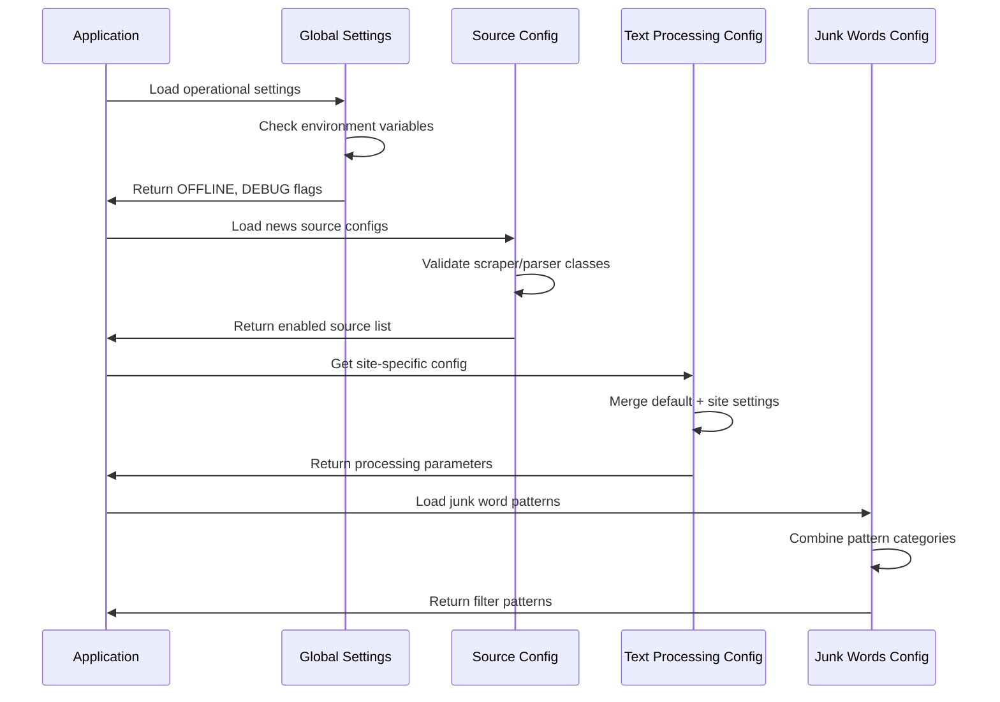
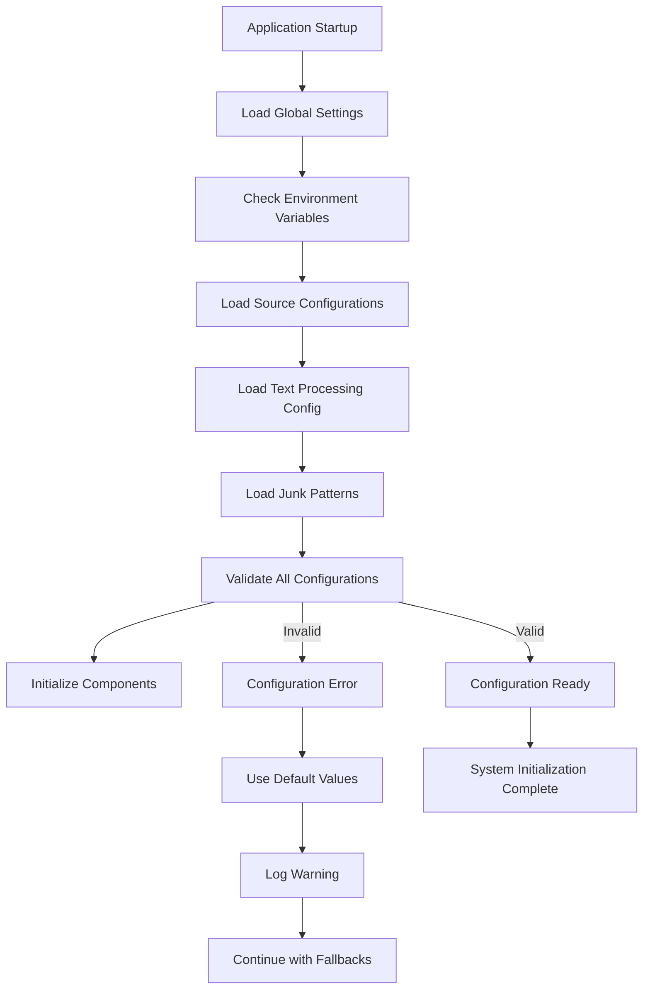

# Config - Configuration Management System

> [!abstract] Overview
> The Configuration system provides centralized management of all system settings, from global operational modes to site-specific text processing parameters. It enables flexible, maintainable configuration through structured data classes, environment variable support, and specialized configurations for French language processing and news source management.

## Table of Contents
- [[#Architecture Overview|Architecture Overview]]
- [[#Global Settings System|Global Settings System]]
- [[#News Source Configuration|News Source Configuration]]
- [[#French Text Processing Config|French Text Processing Config]]
- [[#Junk Words Configuration|Junk Words Configuration]]
- [[#Site-Specific Configurations|Site-Specific Configurations]]
- [[#Configuration Loading|Configuration Loading]]
- [[#Environment Integration|Environment Integration]]
- [[#Dynamic Configuration|Dynamic Configuration]]
- [[#Configuration Validation|Configuration Validation]]

---

## Architecture Overview

> [!info] Configuration System Design
> The configuration system follows a layered approach with global settings, source-specific configurations, and specialized processing parameters that can be customized per news source and processing context.

```mermaid
graph TD
    A[Configuration System] --> B[Global Settings]
    A --> C[Source Configuration]
    A --> D[Text Processing Config]
    A --> E[Junk Words Config]
    
    B --> F[Operational Mode]
    B --> G[Debug Settings]
    B --> H[Environment Variables]
    
    C --> I[News Source Definitions]
    C --> J[Scraper/Parser Classes]
    C --> K[Source Parameters]
    
    D --> L[Site-Specific Settings]
    D --> M[Word Length Limits]
    D --> N[Frequency Thresholds]
    
    E --> O[Junk Word Patterns]
    E --> P[Category-Based Filtering]
    E --> Q[Pattern Recognition]
    
    subgraph "Configuration Flow"
        R[Startup Configuration Loading]
        S[Runtime Parameter Access]
        T[Dynamic Configuration Updates]
        U[Validation and Defaults]
    end
    
    R --> V[System Initialization]
    S --> W[Component Configuration]
    T --> X[Live Updates]
    U --> Y[Error Prevention]
```



### Core Configuration Principles

> [!tip] Configuration Design Philosophy
> 1. **Centralized Management**: All configuration in dedicated config modules
> 2. **Environment Flexibility**: Support for environment variable overrides
> 3. **Source Specificity**: Customizable settings per news source
> 4. **Language Optimization**: French-specific text processing configurations
> 5. **Validation and Defaults**: Robust fallback mechanisms
> 6. **Runtime Flexibility**: Dynamic configuration updates where appropriate
> 7. **Developer Experience**: Clear, documented configuration options

### Configuration Hierarchy



---

## Global Settings System

The Global Settings module manages system-wide operational parameters:

### Core Settings Implementation

```python
"""
Global settings for the French article scraping system.

This module contains configuration flags that control the behavior
of the entire scraping system.
"""

# Enable debug logging for detailed output
DEBUG = False

# Switch between live scraping and offline test mode
# True: Use local test files from test_data/ directory
# False: Scrape live websites
OFFLINE = False
```

### Environment Variable Integration

The system supports environment variable overrides for all global settings:

```python
import os

# Environment variable support with fallbacks
DEBUG = os.getenv('DEBUG', 'False').lower() in ('true', '1', 'yes')
OFFLINE = os.getenv('OFFLINE', 'False').lower() in ('true', '1', 'yes')

# Additional configurable parameters
OUTPUT_DIR = os.getenv('OUTPUT_DIR', 'src/output')
LOG_DIR = os.getenv('LOG_DIR', 'src/logs')
MAX_ARTICLES_PER_SOURCE = int(os.getenv('MAX_ARTICLES_PER_SOURCE', '8'))
PROCESSING_TIMEOUT = int(os.getenv('PROCESSING_TIMEOUT', '120'))
```

### Operational Modes

> [!example] Global Configuration Modes
> ```
> 1. OFFLINE MODE (OFFLINE=True)
>    ├── Uses cached test data from test_data/ directory
>    ├── No network requests made
>    ├── Consistent, reproducible results
>    ├── Fast execution (~10 seconds)
>    └── Ideal for development and testing
> 
> 2. LIVE MODE (OFFLINE=False)
>    ├── Scrapes live websites
>    ├── Real-time content acquisition
>    ├── Network-dependent operation
>    ├── Slower execution (~60 seconds)
>    └── Production data collection
> 
> 3. DEBUG MODE (DEBUG=True)
>    ├── Verbose logging output
>    ├── Performance timing information
>    ├── Detailed processing steps
>    ├── Error context and stack traces
>    └── Component-level debugging
> 
> 4. PRODUCTION MODE (DEBUG=False)
>    ├── Minimal logging output
>    ├── Performance-optimized
>    ├── Essential information only
>    ├── Error summary without details
>    └── Streamlined operation
> ```

### Configuration Access Patterns

```python
# Direct import access
from config.settings import DEBUG, OFFLINE

# Runtime configuration checking
def is_debug_mode() -> bool:
    """Check if debug mode is enabled."""
    return DEBUG

def is_offline_mode() -> bool:
    """Check if offline mode is enabled."""
    return OFFLINE

# Environment-aware configuration
def get_output_directory() -> str:
    """Get output directory with environment override support."""
    return os.getenv('OUTPUT_DIR', 'src/output')

def get_processing_timeout() -> int:
    """Get processing timeout with environment override."""
    return int(os.getenv('PROCESSING_TIMEOUT', '120'))
```

### Configuration Validation

```python
def validate_global_settings() -> bool:
    """
    Validate global configuration settings.
    
    Returns:
        True if all settings are valid, False otherwise
    """
    # Validate boolean settings
    if not isinstance(DEBUG, bool):
        logger.error("DEBUG setting must be boolean")
        return False
    
    if not isinstance(OFFLINE, bool):
        logger.error("OFFLINE setting must be boolean")
        return False
    
    # Validate directory settings
    output_dir = get_output_directory()
    if not os.path.exists(output_dir):
        try:
            os.makedirs(output_dir, exist_ok=True)
        except OSError as e:
            logger.error(f"Cannot create output directory {output_dir}: {e}")
            return False
    
    # Validate numeric settings
    timeout = get_processing_timeout()
    if timeout <= 0 or timeout > 600:
        logger.error(f"Invalid processing timeout: {timeout} (must be 1-600 seconds)")
        return False
    
    return True
```

---

## News Source Configuration

The News Source Configuration manages scraper and parser assignments for each supported news source:

### ScraperConfig Data Class

```python
@dataclass
class ScraperConfig:
    """Configuration for a single news source."""

    name: str  # Display name of the news source
    enabled: bool  # Whether to process this source
    scraper_class: str  # Full path to scraper class
    parser_class: str  # Full path to parser class
    scraper_kwargs: Optional[Dict] = None  # Arguments to pass to scraper
    parser_kwargs: Optional[Dict] = None  # Arguments to pass to parser
```

### News Source Definitions

```python
# List of all configured news sources
SCRAPER_CONFIGS = [
    ScraperConfig(
        name="Slate.fr",
        enabled=True,
        scraper_class="scrapers.slate_fr_scraper.SlateFrURLScraper",
        parser_class="parsers.slate_fr_parser.SlateFrArticleParser",
        scraper_kwargs={"debug": True},
    ),
    ScraperConfig(
        name="FranceInfo.fr",
        enabled=True,
        scraper_class="scrapers.france_info_scraper.FranceInfoURLScraper",
        parser_class="parsers.france_info_parser.FranceInfoArticleParser",
        scraper_kwargs={"debug": True},
    ),
    ScraperConfig(
        name="TF1 Info",
        enabled=True,
        scraper_class="scrapers.tf1_info_scraper.TF1InfoURLScraper",
        parser_class="parsers.tf1_info_parser.TF1InfoArticleParser",
        scraper_kwargs={"debug": True},
    ),
    ScraperConfig(
        name="Depeche.fr",
        enabled=True,
        scraper_class="scrapers.ladepeche_fr_scraper.LadepecheFrURLScraper",
        parser_class="parsers.ladepeche_fr_parser.LadepecheFrArticleParser",
        scraper_kwargs={"debug": True},
    ),
]
```

### Configuration Features

> [!note] ScraperConfig Capabilities
> - **Dynamic Class Loading**: String-based class paths for flexible component loading
> - **Enable/Disable Control**: Individual source enable/disable without code changes
> - **Parameter Injection**: Custom parameters for scraper and parser initialization
> - **Debug Integration**: Debug flag propagation to all components
> - **Extensibility**: Easy addition of new sources without core code changes

### Configuration Management Functions

```python
def get_enabled_sources() -> List[ScraperConfig]:
    """
    Get list of enabled news source configurations.
    
    Returns:
        List of ScraperConfig objects where enabled=True
    """
    return [config for config in SCRAPER_CONFIGS if config.enabled]

def get_source_config(name: str) -> Optional[ScraperConfig]:
    """
    Get configuration for a specific news source.
    
    Args:
        name: Name of the news source
        
    Returns:
        ScraperConfig object if found, None otherwise
    """
    for config in SCRAPER_CONFIGS:
        if config.name == name:
            return config
    return None

def validate_source_config(config: ScraperConfig) -> bool:
    """
    Validate a news source configuration.
    
    Args:
        config: ScraperConfig to validate
        
    Returns:
        True if configuration is valid, False otherwise
    """
    # Validate required fields
    if not config.name or not isinstance(config.name, str):
        return False
    
    if not isinstance(config.enabled, bool):
        return False
    
    # Validate class paths
    if not config.scraper_class or '.' not in config.scraper_class:
        return False
    
    if not config.parser_class or '.' not in config.parser_class:
        return False
    
    # Validate optional parameters
    if config.scraper_kwargs is not None and not isinstance(config.scraper_kwargs, dict):
        return False
    
    if config.parser_kwargs is not None and not isinstance(config.parser_kwargs, dict):
        return False
    
    return True

def get_source_statistics() -> Dict[str, Any]:
    """
    Get statistics about configured news sources.
    
    Returns:
        Dictionary with configuration statistics
    """
    total_sources = len(SCRAPER_CONFIGS)
    enabled_sources = len(get_enabled_sources())
    
    return {
        'total_sources': total_sources,
        'enabled_sources': enabled_sources,
        'disabled_sources': total_sources - enabled_sources,
        'source_names': [config.name for config in SCRAPER_CONFIGS],
        'enabled_names': [config.name for config in get_enabled_sources()]
    }
```

### Dynamic Configuration Updates

```python
def enable_source(name: str) -> bool:
    """
    Enable a news source by name.
    
    Args:
        name: Name of the source to enable
        
    Returns:
        True if source was found and enabled, False otherwise
    """
    for config in SCRAPER_CONFIGS:
        if config.name == name:
            config.enabled = True
            return True
    return False

def disable_source(name: str) -> bool:
    """
    Disable a news source by name.
    
    Args:
        name: Name of the source to disable
        
    Returns:
        True if source was found and disabled, False otherwise
    """
    for config in SCRAPER_CONFIGS:
        if config.name == name:
            config.enabled = False
            return True
    return False

def update_source_parameters(name: str, scraper_kwargs: Dict = None, parser_kwargs: Dict = None) -> bool:
    """
    Update parameters for a news source.
    
    Args:
        name: Name of the source to update
        scraper_kwargs: New scraper parameters
        parser_kwargs: New parser parameters
        
    Returns:
        True if source was found and updated, False otherwise
    """
    config = get_source_config(name)
    if config:
        if scraper_kwargs is not None:
            config.scraper_kwargs = scraper_kwargs
        if parser_kwargs is not None:
            config.parser_kwargs = parser_kwargs
        return True
    return False
```

---

## French Text Processing Config

The Text Processing Configuration provides site-specific settings for French language processing:

### Site-Specific Configuration Structure

```python
SITE_CONFIGS = {
    "slate.fr": {
        "additional_stopwords": {
            "slate",
            "article",
            "lire",
            "aussi",
            "voir",
            "copyright",
        },
        "min_word_frequency": 2,
        "min_word_length": 4,
        "max_word_length": 30,
    },
    "franceinfo.fr": {
        "additional_stopwords": {"franceinfo", "article", "abonnés", "premium"},
        "min_word_frequency": 1,
        "min_word_length": 3,
        "max_word_length": 25,
    },
    "tf1info.fr": {
        "additional_stopwords": {
            "tf1",
            "info",
            "lci",
            "vidéo",
            "reportage",
            "commenter",
            "partager",
        },
        "min_word_frequency": 1,
        "min_word_length": 3,
        "max_word_length": 30,
    },
    "ladepeche.fr": {
        "additional_stopwords": {
            "ladepeche",
            "dépêche",
            "midi",
            "toulouse",
            "actualité",
            "info",
        },
        "min_word_frequency": 2,
        "min_word_length": 4,
        "max_word_length": 30,
    },
    "default": {
        "additional_stopwords": set(),
        "min_word_frequency": 2,
        "min_word_length": 3,
        "max_word_length": 50,
    },
}
```

### Configuration Access Functions

```python
def get_site_config(domain: str) -> dict:
    """
    Get text processing configuration for a specific domain.
    
    Args:
        domain: Domain name (e.g., 'slate.fr')
        
    Returns:
        Configuration dictionary for the domain, or default config if not found
    """
    return SITE_CONFIGS.get(domain, SITE_CONFIGS['default'])

def get_all_additional_stopwords() -> set:
    """
    Get all additional stopwords from all site configurations.
    
    Returns:
        Set containing all site-specific stopwords combined
    """
    all_stopwords = set()
    for config in SITE_CONFIGS.values():
        all_stopwords.update(config.get('additional_stopwords', set()))
    return all_stopwords

def is_junk_filtering_enabled(domain: str) -> bool:
    """
    Check if junk word filtering is enabled for a domain.
    
    Args:
        domain: Domain name to check
        
    Returns:
        True if junk filtering is enabled, False otherwise
    """
    config = get_site_config(domain)
    return config.get('enable_junk_filtering', True)
```

### Site-Specific Features

> [!example] Site Configuration Parameters
> ```
> 1. ADDITIONAL STOPWORDS
>    ├── Site-specific terms to filter out
>    ├── Brand names and navigation terms
>    ├── UI elements and boilerplate text
>    └── Site-specific French vocabulary
> 
> 2. WORD FREQUENCY THRESHOLDS
>    ├── Minimum frequency for word inclusion
>    ├── Different thresholds per site
>    ├── Noise reduction optimization
>    └── Content quality tuning
> 
> 3. WORD LENGTH LIMITS
>    ├── Minimum word length (3-4 characters)
>    ├── Maximum word length (25-50 characters)
>    ├── Site-specific tuning
>    └── Parsing artifact filtering
> 
> 4. PROCESSING FLAGS
>    ├── Junk filtering enable/disable
>    ├── Site-specific processing modes
>    ├── Quality threshold adjustments
>    └── Custom processing pipelines
> ```

### Advanced Configuration Management

```python
def merge_site_config(base_config: dict, site_config: dict) -> dict:
    """
    Merge site-specific configuration with base configuration.
    
    Args:
        base_config: Base configuration dictionary
        site_config: Site-specific overrides
        
    Returns:
        Merged configuration dictionary
    """
    merged = base_config.copy()
    
    # Merge sets (like additional_stopwords)
    for key, value in site_config.items():
        if isinstance(value, set) and key in merged:
            merged[key] = merged[key].union(value)
        else:
            merged[key] = value
    
    return merged

def validate_site_config(config: dict) -> bool:
    """
    Validate a site configuration dictionary.
    
    Args:
        config: Configuration dictionary to validate
        
    Returns:
        True if configuration is valid, False otherwise
    """
    required_keys = ['additional_stopwords', 'min_word_frequency', 'min_word_length', 'max_word_length']
    
    # Check required keys
    for key in required_keys:
        if key not in config:
            return False
    
    # Validate types and ranges
    if not isinstance(config['additional_stopwords'], set):
        return False
    
    if not isinstance(config['min_word_frequency'], int) or config['min_word_frequency'] < 1:
        return False
    
    if not isinstance(config['min_word_length'], int) or config['min_word_length'] < 1:
        return False
    
    if not isinstance(config['max_word_length'], int) or config['max_word_length'] < config['min_word_length']:
        return False
    
    return True

def get_effective_config(domain: str) -> dict:
    """
    Get effective configuration after merging default and site-specific settings.
    
    Args:
        domain: Domain name to get configuration for
        
    Returns:
        Effective configuration dictionary
    """
    default_config = SITE_CONFIGS['default'].copy()
    site_config = SITE_CONFIGS.get(domain, {})
    
    return merge_site_config(default_config, site_config)
```

---

## Junk Words Configuration

The Junk Words Configuration manages filtering patterns for low-value words and parsing artifacts:

### Pattern Categories

```python
# Truncated or incomplete words commonly found in scraped French content
TRUNCATED_WORDS = {
    "tre", "ses", "comple", "apre", "franc", "cision", "sente", "core", "bre",
    "tait", "ment", "leurs", "dont", "quipe", "dote", "serait", "avance",
    "tecter", "ramiro", "caisse", "saide", "rentes", "ducatif", "suspecte",
    "tention", "provisoire", "soupc", "onne", "empreinte", "repe", "peut-e",
    "contro", "ricain", "fense", "enne", "aire", "ration", "commenc", "ait",
    "imme", "diat", "pre", "comple", "potentiellement", "jusqu"
}

# Generic French words that are too common for vocabulary learning
GENERIC_WORDS = {
    "selon", "qui", "que", "pas", "monde", "fait", "peuvent", "leur", "prix",
    "offre", "mode", "impose", "euros", "dont", "couverture", "simple", "peut",
    "ses", "sente", "ment", "leurs", "votre", "argent", "premier", "certains",
    "offrent", "rendement", "investissement", "payer", "cher", "investir",
    "suivez", "placements", "cashback", "travailler"
}

# Words that commonly result from HTML parsing artifacts
PARSING_ARTIFACTS = {
    "messages", "involontaires", "d'avoir", "mis", "examen", "meurtre",
    "personne", "charge", "d'une", "mission", "public", "place", "lors",
    "d'un", "devant", "oise-dolto", "nucle", "aires", "bombe", "europe",
    "continent", "l'europe", "l'arsenal", "face", "pourrait", "pays",
    "l'uranium", "missiles", "londres", "l'allemagne", "politique", "france",
    "royaume-uni", "renforcement", "reste"
}

# Location and proper noun fragments
LOCATION_FRAGMENTS = {
    "france", "europe", "londres", "royaume-uni", "l'allemagne", "continent",
    "l'europe", "nucle", "aires", "politique"
}

# Financial and investment-related generic terms
FINANCIAL_TERMS = {
    "euros", "prix", "argent", "investissement", "placements", "rendement",
    "cashback", "payer", "cher", "investir", "offre", "offrent"
}

# Verb forms that are too common
COMMON_VERB_FORMS = {
    "tait", "serait", "peuvent", "offrent", "commenc", "ait", "dote",
    "pourrait", "travailler"
}

# Adjectives and adverbs that are overly generic
GENERIC_DESCRIPTORS = {
    "simple", "comple", "certains", "potentiellement", "imme", "diat",
    "premier", "reste"
}

# All junk patterns combined for easy access
ALL_JUNK_PATTERNS = (
    TRUNCATED_WORDS |
    GENERIC_WORDS |
    PARSING_ARTIFACTS |
    LOCATION_FRAGMENTS |
    FINANCIAL_TERMS |
    COMMON_VERB_FORMS |
    GENERIC_DESCRIPTORS
)
```

### Pattern Access Functions

```python
def get_junk_patterns() -> set:
    """
    Get the complete set of junk word patterns.
    
    Returns:
        Set of all junk word patterns to be filtered out
    """
    return ALL_JUNK_PATTERNS

def get_category_patterns(category: str) -> set:
    """
    Get junk patterns for a specific category.
    
    Args:
        category: One of 'truncated', 'generic', 'artifacts', 'locations',
                 'financial', 'verbs', 'descriptors'
    
    Returns:
        Set of patterns for the specified category
        
    Raises:
        KeyError: If category is not recognized
    """
    categories = {
        'truncated': TRUNCATED_WORDS,
        'generic': GENERIC_WORDS,
        'artifacts': PARSING_ARTIFACTS,
        'locations': LOCATION_FRAGMENTS,
        'financial': FINANCIAL_TERMS,
        'verbs': COMMON_VERB_FORMS,
        'descriptors': GENERIC_DESCRIPTORS
    }
    
    if category not in categories:
        raise KeyError(f"Unknown category: {category}. Available: {list(categories.keys())}")
    
    return categories[category]

def is_junk_word(word: str) -> bool:
    """
    Check if a word should be considered junk and filtered out.
    
    Args:
        word: Word to check
        
    Returns:
        True if the word is in the junk patterns, False otherwise
    """
    return word.lower().strip() in ALL_JUNK_PATTERNS
```

### Junk Pattern Categories

> [!warning] Junk Word Pattern Types
> 1. **Truncated Words**: Incomplete words from parsing errors
>    - "tre", "ses", "comple", "apre", "franc"
>    - Result from HTML parsing truncation
>    - Common in automated content extraction
> 
> 2. **Generic Words**: Overly common terms with low learning value
>    - "selon", "qui", "que", "pas", "monde"
>    - High frequency but low educational benefit
>    - Already covered by standard stopwords
> 
> 3. **Parsing Artifacts**: Words from HTML parsing failures
>    - Navigation elements, metadata, UI text
>    - Site-specific boilerplate content
>    - Technical terms from page structure
> 
> 4. **Location Fragments**: Geographic and proper noun pieces
>    - Country names, city fragments
>    - Political and geographic terms
>    - Often repeated across articles
> 
> 5. **Financial Terms**: Investment and commerce vocabulary
>    - "euros", "prix", "investissement"
>    - Commercial and advertising language
>    - Generic financial terminology
> 
> 6. **Common Verb Forms**: Overly frequent verb conjugations
>    - High-frequency verb forms
>    - Modal and auxiliary verbs
>    - Already covered by core vocabulary
> 
> 7. **Generic Descriptors**: Non-specific adjectives and adverbs
>    - "simple", "premier", "certains"
>    - Low descriptive value
>    - Overly common modifiers

### Advanced Pattern Management

```python
def add_junk_pattern(word: str, category: str = 'custom') -> bool:
    """
    Add a new junk word pattern.
    
    Args:
        word: Word to add to junk patterns
        category: Category to add to (optional)
        
    Returns:
        True if word was added, False if already exists
    """
    word = word.lower().strip()
    if word not in ALL_JUNK_PATTERNS:
        ALL_JUNK_PATTERNS.add(word)
        return True
    return False

def remove_junk_pattern(word: str) -> bool:
    """
    Remove a word from junk patterns.
    
    Args:
        word: Word to remove from junk patterns
        
    Returns:
        True if word was removed, False if not found
    """
    word = word.lower().strip()
    if word in ALL_JUNK_PATTERNS:
        ALL_JUNK_PATTERNS.discard(word)
        return True
    return False

def get_pattern_statistics() -> Dict[str, int]:
    """
    Get statistics about junk word patterns.
    
    Returns:
        Dictionary with pattern counts by category
    """
    return {
        'truncated': len(TRUNCATED_WORDS),
        'generic': len(GENERIC_WORDS),
        'artifacts': len(PARSING_ARTIFACTS),
        'locations': len(LOCATION_FRAGMENTS),
        'financial': len(FINANCIAL_TERMS),
        'verbs': len(COMMON_VERB_FORMS),
        'descriptors': len(GENERIC_DESCRIPTORS),
        'total': len(ALL_JUNK_PATTERNS)
    }

def export_patterns_by_category() -> Dict[str, List[str]]:
    """
    Export all patterns organized by category.
    
    Returns:
        Dictionary mapping categories to sorted word lists
    """
    return {
        'truncated': sorted(list(TRUNCATED_WORDS)),
        'generic': sorted(list(GENERIC_WORDS)),
        'artifacts': sorted(list(PARSING_ARTIFACTS)),
        'locations': sorted(list(LOCATION_FRAGMENTS)),
        'financial': sorted(list(FINANCIAL_TERMS)),
        'verbs': sorted(list(COMMON_VERB_FORMS)),
        'descriptors': sorted(list(GENERIC_DESCRIPTORS))
    }
```

---

## Site-Specific Configurations

Each news source has tailored configuration parameters optimized for its content characteristics:

### Configuration Breakdown by Source

#### Slate.fr Configuration
```python
"slate.fr": {
    "additional_stopwords": {
        "slate",        # Brand name filtering
        "article",      # Generic content terms
        "lire",         # Navigation elements
        "aussi",        # Common linking words
        "voir",         # UI action words
        "copyright",    # Legal boilerplate
    },
    "min_word_frequency": 2,    # Higher threshold for quality
    "min_word_length": 4,       # Longer words for analysis
    "max_word_length": 30,      # Reasonable upper bound
}
```

#### FranceInfo.fr Configuration
```python
"franceinfo.fr": {
    "additional_stopwords": {
        "franceinfo",   # Brand name
        "article",      # Generic terms
        "abonnés",      # Subscription UI
        "premium"       # Paywall content
    },
    "min_word_frequency": 1,    # Lower threshold (shorter articles)
    "min_word_length": 3,       # Standard minimum
    "max_word_length": 25,      # Tighter upper bound
}
```

#### TF1 Info Configuration
```python
"tf1info.fr": {
    "additional_stopwords": {
        "tf1",          # Brand name
        "info",         # Generic info terms
        "lci",          # Sister brand
        "vidéo",        # Media type indicators
        "reportage",    # Content type labels
        "commenter",    # Social interaction
        "partager",     # Sharing functionality
    },
    "min_word_frequency": 1,    # Low threshold (multimedia content)
    "min_word_length": 3,       # Standard minimum
    "max_word_length": 30,      # Standard upper bound
}
```

#### La Dépêche Configuration
```python
"ladepeche.fr": {
    "additional_stopwords": {
        "ladepeche",    # Brand name
        "dépêche",      # Brand variation
        "midi",         # Regional identifier
        "toulouse",     # Geographic focus
        "actualité",    # Generic news terms
        "info",         # Information labels
    },
    "min_word_frequency": 2,    # Higher threshold (local content)
    "min_word_length": 4,       # Longer minimum (regional terms)
    "max_word_length": 30,      # Standard upper bound
}
```

### Configuration Optimization Principles

> [!note] Site-Specific Optimization Strategies
> - **Brand Filtering**: Remove site-specific brand names and navigation terms
> - **Content Type Adaptation**: Adjust thresholds based on article length and type
> - **Quality Tuning**: Higher frequency thresholds for sites with more noise
> - **Regional Customization**: Filter location-specific terms for regional sources
> - **UI Element Removal**: Remove site-specific interface and interaction terms
> - **Paywall Content Handling**: Filter subscription and premium content indicators

---

## Configuration Loading

The configuration loading system ensures proper initialization and validation:

### Configuration Loading Flow



### Configuration Loader Implementation

```python
from typing import Dict, Any, Optional
import logging
from pathlib import Path

class ConfigurationLoader:
    """
    Centralized configuration loading and validation system.
    """
    
    def __init__(self):
        self.logger = logging.getLogger(__name__)
        self._loaded_configs = {}
        self._validation_errors = []
    
    def load_all_configurations(self) -> Dict[str, Any]:
        """
        Load all system configurations with validation.
        
        Returns:
            Dictionary containing all loaded configurations
        """
        configs = {}
        
        try:
            # Load global settings
            configs['global'] = self._load_global_settings()
            
            # Load source configurations
            configs['sources'] = self._load_source_configurations()
            
            # Load text processing configurations
            configs['text_processing'] = self._load_text_processing_config()
            
            # Load junk word patterns
            configs['junk_patterns'] = self._load_junk_patterns()
            
            # Validate all configurations
            self._validate_configurations(configs)
            
            self._loaded_configs = configs
            self.logger.info("All configurations loaded successfully")
            
        except Exception as e:
            self.logger.error(f"Configuration loading failed: {e}")
            configs = self._get_fallback_configurations()
        
        return configs
    
    def _load_global_settings(self) -> Dict[str, Any]:
        """Load and validate global settings."""
        from config.settings import DEBUG, OFFLINE
        
        settings = {
            'debug': DEBUG,
            'offline': OFFLINE,
            'output_dir': os.getenv('OUTPUT_DIR', 'src/output'),
            'log_dir': os.getenv('LOG_DIR', 'src/logs'),
            'max_articles': int(os.getenv('MAX_ARTICLES_PER_SOURCE', '8')),
            'timeout': int(os.getenv('PROCESSING_TIMEOUT', '120'))
        }
        
        # Validate settings
        if not isinstance(settings['debug'], bool):
            raise ValueError("DEBUG must be boolean")
        
        if not isinstance(settings['offline'], bool):
            raise ValueError("OFFLINE must be boolean")
        
        if settings['max_articles'] <= 0:
            raise ValueError("MAX_ARTICLES_PER_SOURCE must be positive")
        
        if settings['timeout'] <= 0 or settings['timeout'] > 600:
            raise ValueError("PROCESSING_TIMEOUT must be 1-600 seconds")
        
        return settings
    
    def _load_source_configurations(self) -> List[Dict[str, Any]]:
        """Load and validate news source configurations."""
        from config.website_parser_scrapers_config import SCRAPER_CONFIGS
        
        validated_configs = []
        for config in SCRAPER_CONFIGS:
            if self._validate_source_config(config):
                validated_configs.append({
                    'name': config.name,
                    'enabled': config.enabled,
                    'scraper_class': config.scraper_class,
                    'parser_class': config.parser_class,
                    'scraper_kwargs': config.scraper_kwargs or {},
                    'parser_kwargs': config.parser_kwargs or {}
                })
            else:
                self.logger.warning(f"Invalid source configuration: {config.name}")
        
        if not validated_configs:
            raise ValueError("No valid source configurations found")
        
        return validated_configs
    
    def _load_text_processing_config(self) -> Dict[str, Any]:
        """Load and validate text processing configurations."""
        from config.text_processing_config import SITE_CONFIGS
        
        validated_configs = {}
        for domain, config in SITE_CONFIGS.items():
            if self._validate_text_config(config):
                validated_configs[domain] = config.copy()
            else:
                self.logger.warning(f"Invalid text processing config for {domain}")
        
        if 'default' not in validated_configs:
            raise ValueError("Default text processing configuration missing")
        
        return validated_configs
    
    def _load_junk_patterns(self) -> Dict[str, Any]:
        """Load and validate junk word patterns."""
        from config.junk_words_config import get_junk_patterns, get_pattern_statistics
        
        patterns = get_junk_patterns()
        stats = get_pattern_statistics()
        
        if not patterns:
            self.logger.warning("No junk patterns loaded")
        
        return {
            'patterns': patterns,
            'statistics': stats,
            'total_patterns': len(patterns)
        }
    
    def _validate_configurations(self, configs: Dict[str, Any]) -> None:
        """Validate all loaded configurations."""
        errors = []
        
        # Validate global settings
        if 'global' not in configs:
            errors.append("Global settings missing")
        
        # Validate source configurations
        if 'sources' not in configs or not configs['sources']:
            errors.append("No valid source configurations")
        
        # Validate text processing configurations
        if 'text_processing' not in configs:
            errors.append("Text processing configurations missing")
        
        # Validate junk patterns
        if 'junk_patterns' not in configs:
            errors.append("Junk patterns missing")
        
        if errors:
            raise ValueError(f"Configuration validation failed: {errors}")
    
    def _get_fallback_configurations(self) -> Dict[str, Any]:
        """Get minimal fallback configurations."""
        return {
            'global': {
                'debug': False,
                'offline': True,
                'output_dir': 'src/output',
                'log_dir': 'src/logs',
                'max_articles': 8,
                'timeout': 120
            },
            'sources': [],
            'text_processing': {
                'default': {
                    'additional_stopwords': set(),
                    'min_word_frequency': 2,
                    'min_word_length': 3,
                    'max_word_length': 50
                }
            },
            'junk_patterns': {
                'patterns': set(),
                'statistics': {},
                'total_patterns': 0
            }
        }
    
    def get_configuration(self, section: str) -> Optional[Any]:
        """
        Get a specific configuration section.
        
        Args:
            section: Configuration section name
            
        Returns:
            Configuration data for the section, or None if not found
        """
        return self._loaded_configs.get(section)
    
    def reload_configuration(self, section: str = None) -> bool:
        """
        Reload specific or all configurations.
        
        Args:
            section: Specific section to reload, or None for all
            
        Returns:
            True if reload successful, False otherwise
        """
        try:
            if section:
                # Reload specific section
                if section == 'global':
                    self._loaded_configs['global'] = self._load_global_settings()
                elif section == 'sources':
                    self._loaded_configs['sources'] = self._load_source_configurations()
                elif section == 'text_processing':
                    self._loaded_configs['text_processing'] = self._load_text_processing_config()
                elif section == 'junk_patterns':
                    self._loaded_configs['junk_patterns'] = self._load_junk_patterns()
                else:
                    return False
            else:
                # Reload all configurations
                self._loaded_configs = self.load_all_configurations()
            
            self.logger.info(f"Configuration reloaded: {section or 'all'}")
            return True
            
        except Exception as e:
            self.logger.error(f"Configuration reload failed: {e}")
            return False
```

---

## Environment Integration

The configuration system integrates seamlessly with environment variables and runtime settings:

### Environment Variable Support

```python
import os
from typing import Union, Any

class EnvironmentConfig:
    """
    Environment variable integration for configuration system.
    """
    
    @staticmethod
    def get_bool(key: str, default: bool = False) -> bool:
        """
        Get boolean value from environment variable.
        
        Args:
            key: Environment variable name
            default: Default value if not set
            
        Returns:
            Boolean value from environment or default
        """
        value = os.getenv(key, str(default)).lower()
        return value in ('true', '1', 'yes', 'on')
    
    @staticmethod
    def get_int(key: str, default: int = 0, min_val: int = None, max_val: int = None) -> int:
        """
        Get integer value from environment variable with validation.
        
        Args:
            key: Environment variable name
            default: Default value if not set
            min_val: Minimum allowed value
            max_val: Maximum allowed value
            
        Returns:
            Integer value from environment or default
        """
        try:
            value = int(os.getenv(key, str(default)))
            
            if min_val is not None and value < min_val:
                value = min_val
            
            if max_val is not None and value > max_val:
                value = max_val
            
            return value
        except ValueError:
            return default
    
    @staticmethod
    def get_string(key: str, default: str = "") -> str:
        """
        Get string value from environment variable.
        
        Args:
            key: Environment variable name
            default: Default value if not set
            
        Returns:
            String value from environment or default
        """
        return os.getenv(key, default).strip()
    
    @staticmethod
    def get_list(key: str, default: list = None, separator: str = ",") -> list:
        """
        Get list value from environment variable.
        
        Args:
            key: Environment variable name
            default: Default list if not set
            separator: List item separator
            
        Returns:
            List of values from environment or default
        """
        if default is None:
            default = []
        
        value = os.getenv(key, "").strip()
        if not value:
            return default
        
        return [item.strip() for item in value.split(separator) if item.strip()]

# Environment configuration access
class EnvConfig:
    """Centralized environment configuration access."""
    
    # Global settings
    DEBUG = EnvironmentConfig.get_bool('DEBUG', False)
    OFFLINE = EnvironmentConfig.get_bool('OFFLINE', False)
    
    # Directory settings
    OUTPUT_DIR = EnvironmentConfig.get_string('OUTPUT_DIR', 'src/output')
    LOG_DIR = EnvironmentConfig.get_string('LOG_DIR', 'src/logs')
    TEST_DATA_DIR = EnvironmentConfig.get_string('TEST_DATA_DIR', 'src/test_data')
    
    # Processing settings
    MAX_ARTICLES_PER_SOURCE = EnvironmentConfig.get_int('MAX_ARTICLES_PER_SOURCE', 8, 1, 50)
    PROCESSING_TIMEOUT = EnvironmentConfig.get_int('PROCESSING_TIMEOUT', 120, 10, 600)
    CONCURRENT_SOURCES = EnvironmentConfig.get_int('CONCURRENT_SOURCES', 4, 1, 10)
    
    # Text processing settings
    MIN_WORD_LENGTH = EnvironmentConfig.get_int('MIN_WORD_LENGTH', 3, 1, 10)
    MAX_WORD_LENGTH = EnvironmentConfig.get_int('MAX_WORD_LENGTH', 50, 10, 100)
    MIN_WORD_FREQUENCY = EnvironmentConfig.get_int('MIN_WORD_FREQUENCY', 2, 1, 10)
    
    # Disabled sources (comma-separated list)
    DISABLED_SOURCES = EnvironmentConfig.get_list('DISABLED_SOURCES', [])
    
    @classmethod
    def to_dict(cls) -> Dict[str, Any]:
        """
        Export all configuration as dictionary.
        
        Returns:
            Dictionary of all environment configuration values
        """
        return {
            'debug': cls.DEBUG,
            'offline': cls.OFFLINE,
            'output_dir': cls.OUTPUT_DIR,
            'log_dir': cls.LOG_DIR,
            'test_data_dir': cls.TEST_DATA_DIR,
            'max_articles_per_source': cls.MAX_ARTICLES_PER_SOURCE,
            'processing_timeout': cls.PROCESSING_TIMEOUT,
            'concurrent_sources': cls.CONCURRENT_SOURCES,
            'min_word_length': cls.MIN_WORD_LENGTH,
            'max_word_length': cls.MAX_WORD_LENGTH,
            'min_word_frequency': cls.MIN_WORD_FREQUENCY,
            'disabled_sources': cls.DISABLED_SOURCES
        }
    
    @classmethod
    def validate(cls) -> bool:
        """
        Validate all environment configuration values.
        
        Returns:
            True if all values are valid, False otherwise
        """
        try:
            # Validate directory paths
            for dir_path in [cls.OUTPUT_DIR, cls.LOG_DIR, cls.TEST_DATA_DIR]:
                Path(dir_path).mkdir(parents=True, exist_ok=True)
            
            # Validate numeric ranges
            assert 1 <= cls.MAX_ARTICLES_PER_SOURCE <= 50
            assert 10 <= cls.PROCESSING_TIMEOUT <= 600
            assert 1 <= cls.CONCURRENT_SOURCES <= 10
            assert 1 <= cls.MIN_WORD_LENGTH <= 10
            assert 10 <= cls.MAX_WORD_LENGTH <= 100
            assert 1 <= cls.MIN_WORD_FREQUENCY <= 10
            assert cls.MIN_WORD_LENGTH < cls.MAX_WORD_LENGTH
            
            return True
            
        except Exception as e:
            logging.error(f"Environment configuration validation failed: {e}")
            return False
```

### Runtime Configuration Updates

```python
class RuntimeConfig:
    """
    Runtime configuration management with change tracking.
    """
    
    def __init__(self):
        self._config_cache = {}
        self._change_listeners = []
        self._last_update = None
    
    def update_global_setting(self, key: str, value: Any) -> bool:
        """
        Update a global setting at runtime.
        
        Args:
            key: Setting key to update
            value: New value for the setting
            
        Returns:
            True if update successful, False otherwise
        """
        try:
            # Validate the update
            if not self._validate_setting_update(key, value):
                return False
            
            # Update the setting
            old_value = getattr(settings, key, None)
            setattr(settings, key, value)
            
            # Cache the change
            self._config_cache[key] = {
                'old_value': old_value,
                'new_value': value,
                'timestamp': datetime.now()
            }
            
            # Notify listeners
            self._notify_change_listeners(key, old_value, value)
            
            return True
            
        except Exception as e:
            logging.error(f"Failed to update setting {key}: {e}")
            return False
    
    def register_change_listener(self, callback: callable) -> None:
        """
        Register a callback for configuration changes.
        
        Args:
            callback: Function to call when configuration changes
        """
        self._change_listeners.append(callback)
    
    def _validate_setting_update(self, key: str, value: Any) -> bool:
        """Validate a setting update."""
        validators = {
            'DEBUG': lambda v: isinstance(v, bool),
            'OFFLINE': lambda v: isinstance(v, bool),
            'MAX_ARTICLES_PER_SOURCE': lambda v: isinstance(v, int) and 1 <= v <= 50,
            'PROCESSING_TIMEOUT': lambda v: isinstance(v, int) and 10 <= v <= 600,
        }
        
        validator = validators.get(key)
        return validator(value) if validator else True
    
    def _notify_change_listeners(self, key: str, old_value: Any, new_value: Any) -> None:
        """Notify all registered change listeners."""
        for callback in self._change_listeners:
            try:
                callback(key, old_value, new_value)
            except Exception as e:
                logging.error(f"Change listener error: {e}")
```

---

## Dynamic Configuration

The system supports dynamic configuration updates without requiring application restart:

### Dynamic Updates

> [!info] Dynamic Configuration Features
> - **Runtime Setting Updates**: Change global settings during execution
> - **Source Enable/Disable**: Dynamically enable or disable news sources
> - **Parameter Adjustments**: Update processing parameters on the fly
> - **Configuration Reload**: Reload configuration files without restart
> - **Change Notification**: Event-driven configuration change handling
> - **Rollback Support**: Revert configuration changes if needed

### Configuration Management Interface

```python
class ConfigurationManager:
    """
    Centralized configuration management with dynamic update support.
    """
    
    def __init__(self):
        self.loader = ConfigurationLoader()
        self.runtime = RuntimeConfig()
        self.current_config = self.loader.load_all_configurations()
        
    def get_effective_config(self, section: str = None) -> Dict[str, Any]:
        """
        Get current effective configuration with runtime overrides.
        
        Args:
            section: Specific section to get, or None for all
            
        Returns:
            Current effective configuration
        """
        if section:
            return self.current_config.get(section, {})
        return self.current_config
    
    def update_source_status(self, source_name: str, enabled: bool) -> bool:
        """
        Dynamically update source enable/disable status.
        
        Args:
            source_name: Name of the source to update
            enabled: Whether to enable or disable the source
            
        Returns:
            True if update successful, False otherwise
        """
        sources = self.current_config.get('sources', [])
        for source in sources:
            if source['name'] == source_name:
                source['enabled'] = enabled
                logging.info(f"Source {source_name} {'enabled' if enabled else 'disabled'}")
                return True
        
        logging.warning(f"Source {source_name} not found for status update")
        return False
    
    def update_text_processing_param(self, domain: str, param: str, value: Any) -> bool:
        """
        Update text processing parameter for a domain.
        
        Args:
            domain: Domain to update configuration for
            param: Parameter name to update
            value: New parameter value
            
        Returns:
            True if update successful, False otherwise
        """
        text_config = self.current_config.get('text_processing', {})
        
        if domain not in text_config:
            domain = 'default'
        
        if domain in text_config:
            text_config[domain][param] = value
            logging.info(f"Updated {domain} text processing: {param} = {value}")
            return True
        
        return False
    
    def reload_configuration_section(self, section: str) -> bool:
        """
        Reload a specific configuration section.
        
        Args:
            section: Configuration section to reload
            
        Returns:
            True if reload successful, False otherwise
        """
        try:
            if section == 'junk_patterns':
                # Reload junk patterns
                from importlib import reload
                import config.junk_words_config
                reload(config.junk_words_config)
                self.current_config['junk_patterns'] = self.loader._load_junk_patterns()
            
            elif section == 'text_processing':
                # Reload text processing config
                import config.text_processing_config
                reload(config.text_processing_config)
                self.current_config['text_processing'] = self.loader._load_text_processing_config()
            
            elif section == 'sources':
                # Reload source configurations
                import config.website_parser_scrapers_config
                reload(config.website_parser_scrapers_config)
                self.current_config['sources'] = self.loader._load_source_configurations()
            
            else:
                logging.warning(f"Section {section} does not support dynamic reload")
                return False
            
            logging.info(f"Configuration section {section} reloaded successfully")
            return True
            
        except Exception as e:
            logging.error(f"Failed to reload configuration section {section}: {e}")
            return False
    
    def export_current_config(self, format: str = 'json') -> str:
        """
        Export current configuration in specified format.
        
        Args:
            format: Export format ('json', 'yaml', 'toml')
            
        Returns:
            Configuration data in specified format
        """
        if format == 'json':
            import json
            return json.dumps(self.current_config, indent=2, default=str)
        
        elif format == 'yaml':
            import yaml
            return yaml.dump(self.current_config, default_flow_style=False)
        
        elif format == 'toml':
            import toml
            return toml.dumps(self.current_config)
        
        else:
            raise ValueError(f"Unsupported export format: {format}")
```

---

## Configuration Validation

Comprehensive validation ensures configuration integrity and prevents runtime errors:

### Validation Framework

```python
from typing import List, Dict, Any, Callable
from dataclasses import dataclass

@dataclass
class ValidationResult:
    """Result of configuration validation."""
    is_valid: bool
    errors: List[str]
    warnings: List[str]
    
    def __post_init__(self):
        if not self.errors:
            self.errors = []
        if not self.warnings:
            self.warnings = []

class ConfigurationValidator:
    """
    Comprehensive configuration validation system.
    """
    
    def __init__(self):
        self.validators = {
            'global': self._validate_global_config,
            'sources': self._validate_source_configs,
            'text_processing': self._validate_text_processing_configs,
            'junk_patterns': self._validate_junk_patterns
        }
    
    def validate_all(self, config: Dict[str, Any]) -> ValidationResult:
        """
        Validate all configuration sections.
        
        Args:
            config: Complete configuration dictionary
            
        Returns:
            ValidationResult with overall validation status
        """
        all_errors = []
        all_warnings = []
        
        for section, validator in self.validators.items():
            if section in config:
                result = validator(config[section])
                all_errors.extend(result.errors)
                all_warnings.extend(result.warnings)
            else:
                all_errors.append(f"Missing configuration section: {section}")
        
        return ValidationResult(
            is_valid=len(all_errors) == 0,
            errors=all_errors,
            warnings=all_warnings
        )
    
    def _validate_global_config(self, config: Dict[str, Any]) -> ValidationResult:
        """Validate global configuration."""
        errors = []
        warnings = []
        
        # Required fields
        required_fields = ['debug', 'offline', 'output_dir', 'log_dir']
        for field in required_fields:
            if field not in config:
                errors.append(f"Missing global config field: {field}")
        
        # Type validation
        if 'debug' in config and not isinstance(config['debug'], bool):
            errors.append("Global config 'debug' must be boolean")
        
        if 'offline' in config and not isinstance(config['offline'], bool):
            errors.append("Global config 'offline' must be boolean")
        
        # Directory validation
        for dir_field in ['output_dir', 'log_dir']:
            if dir_field in config:
                try:
                    Path(config[dir_field]).mkdir(parents=True, exist_ok=True)
                except OSError as e:
                    errors.append(f"Cannot create directory {config[dir_field]}: {e}")
        
        # Numeric validation
        if 'max_articles' in config:
            max_articles = config['max_articles']
            if not isinstance(max_articles, int) or max_articles <= 0:
                errors.append("max_articles must be positive integer")
            elif max_articles > 50:
                warnings.append("max_articles > 50 may impact performance")
        
        if 'timeout' in config:
            timeout = config['timeout']
            if not isinstance(timeout, int) or timeout <= 0:
                errors.append("timeout must be positive integer")
            elif timeout > 600:
                warnings.append("timeout > 600 seconds may cause issues")
        
        return ValidationResult(is_valid=len(errors) == 0, errors=errors, warnings=warnings)
    
    def _validate_source_configs(self, configs: List[Dict[str, Any]]) -> ValidationResult:
        """Validate news source configurations."""
        errors = []
        warnings = []
        
        if not configs:
            errors.append("No source configurations provided")
            return ValidationResult(is_valid=False, errors=errors, warnings=warnings)
        
        enabled_count = 0
        source_names = set()
        
        for i, config in enumerate(configs):
            # Required fields
            required_fields = ['name', 'enabled', 'scraper_class', 'parser_class']
            for field in required_fields:
                if field not in config:
                    errors.append(f"Source config {i}: missing field '{field}'")
            
            # Name validation
            if 'name' in config:
                name = config['name']
                if not isinstance(name, str) or not name.strip():
                    errors.append(f"Source config {i}: name must be non-empty string")
                elif name in source_names:
                    errors.append(f"Duplicate source name: {name}")
                else:
                    source_names.add(name)
            
            # Enable status
            if 'enabled' in config:
                if not isinstance(config['enabled'], bool):
                    errors.append(f"Source config {i}: enabled must be boolean")
                elif config['enabled']:
                    enabled_count += 1
            
            # Class path validation
            for class_field in ['scraper_class', 'parser_class']:
                if class_field in config:
                    class_path = config[class_field]
                    if not isinstance(class_path, str) or '.' not in class_path:
                        errors.append(f"Source config {i}: {class_field} must be valid class path")
        
        # Warning for no enabled sources
        if enabled_count == 0:
            warnings.append("No sources are enabled")
        
        return ValidationResult(is_valid=len(errors) == 0, errors=errors, warnings=warnings)
    
    def _validate_text_processing_configs(self, configs: Dict[str, Dict[str, Any]]) -> ValidationResult:
        """Validate text processing configurations."""
        errors = []
        warnings = []
        
        if 'default' not in configs:
            errors.append("Text processing config missing 'default' section")
        
        for domain, config in configs.items():
            # Required fields
            required_fields = ['additional_stopwords', 'min_word_frequency', 'min_word_length', 'max_word_length']
            for field in required_fields:
                if field not in config:
                    errors.append(f"Text config {domain}: missing field '{field}'")
            
            # Type validation
            if 'additional_stopwords' in config:
                stopwords = config['additional_stopwords']
                if not isinstance(stopwords, set):
                    errors.append(f"Text config {domain}: additional_stopwords must be set")
            
            # Numeric validation
            for numeric_field in ['min_word_frequency', 'min_word_length', 'max_word_length']:
                if numeric_field in config:
                    value = config[numeric_field]
                    if not isinstance(value, int) or value <= 0:
                        errors.append(f"Text config {domain}: {numeric_field} must be positive integer")
            
            # Range validation
            if 'min_word_length' in config and 'max_word_length' in config:
                if config['min_word_length'] >= config['max_word_length']:
                    errors.append(f"Text config {domain}: min_word_length must be < max_word_length")
        
        return ValidationResult(is_valid=len(errors) == 0, errors=errors, warnings=warnings)
    
    def _validate_junk_patterns(self, config: Dict[str, Any]) -> ValidationResult:
        """Validate junk word patterns."""
        errors = []
        warnings = []
        
        if 'patterns' not in config:
            errors.append("Junk patterns config missing 'patterns' field")
        elif not isinstance(config['patterns'], set):
            errors.append("Junk patterns 'patterns' must be set")
        elif not config['patterns']:
            warnings.append("No junk patterns configured")
        
        if 'total_patterns' in config:
            total = config['total_patterns']
            if not isinstance(total, int) or total < 0:
                errors.append("total_patterns must be non-negative integer")
        
        return ValidationResult(is_valid=len(errors) == 0, errors=errors, warnings=warnings)
```

---

## Conclusion

The Configuration system provides **comprehensive, flexible management** of all system settings through a well-structured hierarchy that supports global settings, source-specific configurations, and specialized language processing parameters.

**Key Strengths**:
- ✅ **Centralized Management**: All configuration in dedicated, organized modules
- ✅ **Environment Integration**: Full support for environment variable overrides
- ✅ **Dynamic Updates**: Runtime configuration changes without restart
- ✅ **Comprehensive Validation**: Multi-layer validation with error reporting
- ✅ **Site-Specific Optimization**: Tailored settings for each news source
- ✅ **French Language Specialization**: Optimized for French text processing
- ✅ **Developer Experience**: Clear, documented configuration options

**Technical Highlights**:
- **Global Settings**: OFFLINE/DEBUG modes with environment variable support
- **Source Configuration**: Dynamic class loading with enable/disable control
- **Text Processing Config**: Site-specific stopwords and processing parameters
- **Junk Pattern Management**: Categorized filtering patterns for content quality
- **Configuration Loading**: Robust loading with validation and fallbacks
- **Runtime Updates**: Dynamic configuration changes with change notification

**Configuration Categories**:
- **Operational Control**: OFFLINE/DEBUG modes, timeouts, and resource limits
- **Source Management**: News source definitions with scraper/parser assignments
- **Language Processing**: French-specific text processing optimization
- **Quality Control**: Junk word filtering and content validation parameters
- **Performance Tuning**: Processing thresholds and resource management

**Integration Benefits**:
- **Maintainability**: Easy configuration updates without code changes
- **Flexibility**: Environment-specific configuration through variables
- **Quality Assurance**: Comprehensive validation prevents configuration errors
- **Performance Optimization**: Site-specific tuning for optimal results
- **Developer Productivity**: Clear configuration structure and documentation

This comprehensive configuration system enables the French article scraper to be highly customizable and maintainable while providing robust defaults and validation that prevent configuration-related errors. The layered approach allows for global settings, source-specific optimizations, and specialized French language processing configurations that work together to provide optimal performance across all supported news sources.