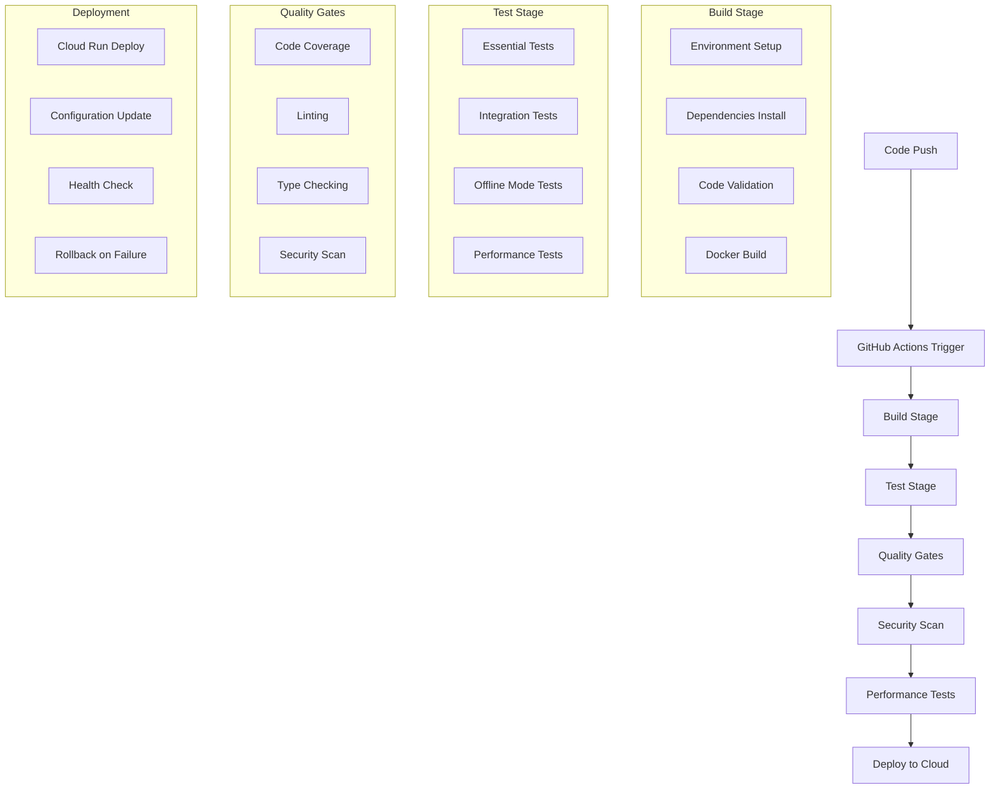

# CI/CD Pipeline - Continuous Integration and Deployment

> [!abstract] Overview
> This document provides comprehensive guidance on running and interpreting the CI/CD pipeline for the French article scraper system. It covers GitHub Actions workflows, local CI/CD simulation, fixing pipeline failures, and cloud deployment strategies.

## Table of Contents
- [[#Pipeline Overview|Pipeline Overview]]
- [[#GitHub Actions Workflows|GitHub Actions Workflows]]
- [[#Local CI/CD Simulation|Local CI/CD Simulation]]
- [[#Pipeline Jobs and Stages|Pipeline Jobs and Stages]]
- [[#Interpreting Build Results|Interpreting Build Results]]
- [[#Fixing Pipeline Failures|Fixing Pipeline Failures]]
- [[#Deployment Strategies|Deployment Strategies]]
- [[#Performance and Quality Gates|Performance and Quality Gates]]
- [[#Security and Compliance|Security and Compliance]]
- [[#Monitoring and Alerts|Monitoring and Alerts]]

---

## Pipeline Overview

### CI/CD Architecture

The French article scraper uses a multi-stage CI/CD pipeline designed for reliability and rapid deployment:



### Pipeline Triggers

**Automatic Triggers**:
- Push to `main` branch
- Pull request creation/updates
- Scheduled runs (daily for production health checks)

**Manual Triggers**:
- Workflow dispatch for emergency deployments
- Tag-based releases
- Hotfix deployments

---

## GitHub Actions Workflows

### Main Workflow Configuration

Located at `.github/workflows/ci-cd.yml`:

```yaml
name: CI/CD Pipeline

on:
  push:
    branches: [ main, develop ]
  pull_request:
    branches: [ main ]
  schedule:
    - cron: '0 2 * * *'  # Daily at 2 AM UTC
  workflow_dispatch:

jobs:
  test:
    runs-on: ubuntu-latest
    strategy:
      matrix:
        python-version: [3.11, 3.12]
    
    steps:
    - name: Checkout code
      uses: actions/checkout@v4
    
    - name: Set up Python ${{ matrix.python-version }}
      uses: actions/setup-python@v4
      with:
        python-version: ${{ matrix.python-version }}
    
    - name: Cache dependencies
      uses: actions/cache@v3
      with:
        path: ~/.cache/pip
        key: ${{ runner.os }}-pip-${{ hashFiles('**/requirements.txt') }}
        restore-keys: |
          ${{ runner.os }}-pip-
    
    - name: Install dependencies
      run: |
        python -m pip install --upgrade pip
        pip install -r requirements.txt
        pip install -r requirements-dev.txt
    
    - name: Run linting
      run: |
        ruff check src/
        ruff format --check src/
    
    - name: Run type checking
      run: |
        mypy src/ --ignore-missing-imports
    
    - name: Run essential tests
      run: |
        pytest tests/test_essential.py -v --cov=src --cov-report=xml
    
    - name: Run integration tests
      run: |
        pytest tests/integration/ -v
    
    - name: Run offline mode tests
      run: |
        pytest tests/integration/test_offline_mode.py -v
    
    - name: Upload coverage to Codecov
      uses: codecov/codecov-action@v3
      with:
        file: ./coverage.xml
        flags: unittests
        name: codecov-umbrella
    
    - name: Performance test
      run: |
        OFFLINE=True DEBUG=True timeout 120 python -m main
    
    - name: Security scan
      run: |
        bandit -r src/ -f json -o security-report.json
    
    - name: Upload test results
      uses: actions/upload-artifact@v3
      if: always()
      with:
        name: test-results-${{ matrix.python-version }}
        path: |
          coverage.xml
          security-report.json
          pytest-results.xml

  build:
    needs: test
    runs-on: ubuntu-latest
    if: github.ref == 'refs/heads/main'
    
    steps:
    - name: Checkout code
      uses: actions/checkout@v4
    
    - name: Set up Docker Buildx
      uses: docker/setup-buildx-action@v3
    
    - name: Login to Container Registry
      uses: docker/login-action@v3
      with:
        registry: ghcr.io
        username: ${{ github.actor }}
        password: ${{ secrets.GITHUB_TOKEN }}
    
    - name: Build and push Docker image
      uses: docker/build-push-action@v5
      with:
        context: .
        push: true
        tags: |
          ghcr.io/${{ github.repository }}:latest
          ghcr.io/${{ github.repository }}:${{ github.sha }}
        cache-from: type=gha
        cache-to: type=gha,mode=max
    
    - name: Test Docker image
      run: |
        docker run --rm \
          -e OFFLINE=True \
          -e DEBUG=True \
          ghcr.io/${{ github.repository }}:latest \
          timeout 60 python -m main

  deploy:
    needs: [test, build]
    runs-on: ubuntu-latest
    if: github.ref == 'refs/heads/main'
    environment: production
    
    steps:
    - name: Checkout code
      uses: actions/checkout@v4
    
    - name: Setup Google Cloud CLI
      uses: google-github-actions/setup-gcloud@v1
      with:
        service_account_key: ${{ secrets.GCP_SA_KEY }}
        project_id: ${{ secrets.GCP_PROJECT_ID }}
    
    - name: Configure Docker for GCP
      run: gcloud auth configure-docker
    
    - name: Deploy to Cloud Run
      run: |
        gcloud run deploy french-scraper \
          --image ghcr.io/${{ github.repository }}:${{ github.sha }} \
          --platform managed \
          --region us-central1 \
          --set-env-vars OFFLINE=False,DEBUG=False \
          --memory 512Mi \
          --cpu 1 \
          --max-instances 1 \
          --timeout 900 \
          --allow-unauthenticated
    
    - name: Health check
      run: |
        # Wait for deployment to be ready
        sleep 30
        
        # Get service URL
        SERVICE_URL=$(gcloud run services describe french-scraper \
          --platform managed \
          --region us-central1 \
          --format 'value(status.url)')
        
        # Health check (if endpoint exists)
        curl -f $SERVICE_URL/health || echo "No health endpoint"
    
    - name: Rollback on failure
      if: failure()
      run: |
        echo "Deployment failed, rolling back..."
        # Get previous revision
        PREVIOUS_REVISION=$(gcloud run revisions list \
          --service french-scraper \
          --platform managed \
          --region us-central1 \
          --format 'value(metadata.name)' \
          --limit 2 | tail -1)
        
        # Rollback to previous revision
        gcloud run services update-traffic french-scraper \
          --to-revisions $PREVIOUS_REVISION=100 \
          --platform managed \
          --region us-central1
```

### Additional Workflows

#### Pull Request Workflow

`.github/workflows/pr-check.yml`:

```yaml
name: Pull Request Check

on:
  pull_request:
    branches: [ main ]

jobs:
  pr-check:
    runs-on: ubuntu-latest
    
    steps:
    - name: Checkout code
      uses: actions/checkout@v4
    
    - name: Set up Python
      uses: actions/setup-python@v4
      with:
        python-version: 3.11
    
    - name: Install dependencies
      run: |
        python -m pip install --upgrade pip
        pip install -r requirements.txt
        pip install -r requirements-dev.txt
    
    - name: Run essential tests only
      run: |
        pytest tests/test_essential.py -v
    
    - name: Check for breaking changes
      run: |
        # Test offline mode still works
        OFFLINE=True DEBUG=True timeout 30 python -m main
    
    - name: Comment on PR
      uses: actions/github-script@v6
      if: always()
      with:
        script: |
          const fs = require('fs');
          const path = require('path');
          
          // Read test results
          const testResults = "Tests completed. Check Actions tab for details.";
          
          github.rest.issues.createComment({
            issue_number: context.issue.number,
            owner: context.repo.owner,
            repo: context.repo.repo,
            body: `## PR Check Results\n\n${testResults}`
          });
```

#### Scheduled Health Check

`.github/workflows/health-check.yml`:

```yaml
name: Daily Health Check

on:
  schedule:
    - cron: '0 6 * * *'  # Daily at 6 AM UTC

jobs:
  health-check:
    runs-on: ubuntu-latest
    
    steps:
    - name: Checkout code
      uses: actions/checkout@v4
    
    - name: Test production deployment
      run: |
        # Test if scraper sources are still working
        curl -f https://www.slate.fr || echo "Slate.fr unreachable"
        curl -f https://www.franceinfo.fr || echo "FranceInfo unreachable"
        curl -f https://www.tf1info.fr || echo "TF1Info unreachable"
        curl -f https://www.ladepeche.fr || echo "Depeche unreachable"
    
    - name: Run smoke test
      run: |
        # Basic smoke test
        python -c "
        from scrapers.slate_fr_scraper import SlateFrURLScraper
        scraper = SlateFrURLScraper()
        urls = scraper.get_article_urls(max_articles=1)
        print(f'Smoke test: {len(urls)} URLs found')
        assert len(urls) > 0
        "
    
    - name: Notify on failure
      if: failure()
      uses: 8398a7/action-slack@v3
      with:
        status: failure
        text: 'Daily health check failed!'
      env:
        SLACK_WEBHOOK_URL: ${{ secrets.SLACK_WEBHOOK_URL }}
```

---

## Local CI/CD Simulation

### Local Testing Commands

Simulate the CI/CD pipeline locally before pushing:

```bash
# Create local CI/CD script
cat > scripts/local-ci.sh << 'EOF'
#!/bin/bash
set -e

echo "=== Local CI/CD Simulation ==="

# 1. Environment setup
echo "1. Setting up environment..."
python -m venv venv
source venv/bin/activate
pip install -r requirements.txt
pip install -r requirements-dev.txt

# 2. Code quality checks
echo "2. Running code quality checks..."
ruff check src/
ruff format --check src/
mypy src/ --ignore-missing-imports

# 3. Essential tests
echo "3. Running essential tests..."
pytest tests/test_essential.py -v

# 4. Integration tests
echo "4. Running integration tests..."
pytest tests/integration/ -v

# 5. Offline mode test
echo "5. Running offline mode test..."
OFFLINE=True DEBUG=True timeout 60 python -m main

# 6. Performance test
echo "6. Running performance test..."
time OFFLINE=True python -m main

# 7. Security scan
echo "7. Running security scan..."
bandit -r src/ -f json -o security-report.json

# 8. Docker build test
echo "8. Testing Docker build..."
docker build -t french-scraper-local .
docker run --rm -e OFFLINE=True -e DEBUG=True french-scraper-local timeout 30 python -m main

echo "=== Local CI/CD Completed Successfully ==="
EOF

chmod +x scripts/local-ci.sh
```

### Pre-commit Hooks

Set up pre-commit hooks to catch issues early:

```bash
# Install pre-commit
pip install pre-commit

# Create .pre-commit-config.yaml
cat > .pre-commit-config.yaml << 'EOF'
repos:
  - repo: https://github.com/pre-commit/pre-commit-hooks
    rev: v4.4.0
    hooks:
      - id: trailing-whitespace
      - id: end-of-file-fixer
      - id: check-yaml
      - id: check-added-large-files
      - id: check-merge-conflict
  
  - repo: https://github.com/astral-sh/ruff-pre-commit
    rev: v0.1.6
    hooks:
      - id: ruff
        args: [--fix, --exit-non-zero-on-fix]
      - id: ruff-format
  
  - repo: https://github.com/pre-commit/mirrors-mypy
    rev: v1.7.1
    hooks:
      - id: mypy
        args: [--ignore-missing-imports]
        additional_dependencies: [types-requests]
  
  - repo: local
    hooks:
      - id: essential-tests
        name: Essential Tests
        entry: pytest tests/test_essential.py -v
        language: system
        pass_filenames: false
        always_run: true
EOF

# Install pre-commit hooks
pre-commit install
```

### Local Environment Setup

```bash
# Create development environment script
cat > scripts/setup-dev.sh << 'EOF'
#!/bin/bash
set -e

echo "Setting up development environment..."

# 1. Create virtual environment
python -m venv venv
source venv/bin/activate

# 2. Install dependencies
pip install -r requirements.txt
pip install -r requirements-dev.txt

# 3. Install pre-commit hooks
pre-commit install

# 4. Create necessary directories
mkdir -p src/output src/logs

# 5. Run initial test
echo "Running initial test..."
OFFLINE=True DEBUG=True python -m main

echo "Development environment ready!"
echo "Activate with: source venv/bin/activate"
EOF

chmod +x scripts/setup-dev.sh
```

---

## Pipeline Jobs and Stages

### Stage 1: Build and Setup

**Purpose**: Prepare the environment and validate basic setup

**Key Actions**:
- Python environment setup
- Dependency installation
- Cache management
- Environment validation

**Success Criteria**:
- All dependencies installed successfully
- Python version compatibility confirmed
- Configuration files valid

**Failure Scenarios**:
```bash
# Common failures and fixes
ERROR: Could not find a version that satisfies the requirement...
# Fix: Update requirements.txt with correct versions

ERROR: This environment is externally managed
# Fix: Use virtual environment
python -m venv venv && source venv/bin/activate

ERROR: Permission denied
# Fix: Check file permissions
chmod +x scripts/*.sh
```

### Stage 2: Code Quality and Linting

**Purpose**: Ensure code quality and consistency

**Tools Used**:
- `ruff` for linting and formatting
- `mypy` for type checking
- `bandit` for security scanning

**Quality Gates**:
```bash
# Linting checks
ruff check src/                    # Code style and errors
ruff format --check src/           # Formatting consistency
mypy src/ --ignore-missing-imports # Type checking

# Security scanning
bandit -r src/ -f json -o security-report.json
```

**Common Issues**:
```python
# Fix common linting issues
# E501: Line too long
# Solution: Break long lines
long_string = (
    "This is a very long string that needs to be "
    "broken across multiple lines for readability"
)

# F401: Unused import
# Solution: Remove unused imports or use __all__
from typing import List, Dict  # Remove unused imports

# E203: Whitespace before ':'
# Solution: Remove extra whitespace
my_dict = {"key": "value"}  # Correct
my_dict = {"key" : "value"}  # Incorrect
```

### Stage 3: Testing

**Purpose**: Validate functionality across different scenarios

**Test Categories**:
1. **Essential Tests** (2 seconds)
   - Core functionality validation
   - Configuration loading
   - Basic component initialization

2. **Integration Tests** (50 seconds)
   - Component interaction testing
   - End-to-end workflow validation
   - Text processing pipeline

3. **Offline Mode Tests** (10 seconds)
   - Test data processing
   - Offline mode functionality
   - Output file generation

**Test Execution**:
```bash
# Run tests with proper timing
timeout 30 pytest tests/test_essential.py -v
timeout 120 pytest tests/integration/ -v
timeout 60 pytest tests/integration/test_offline_mode.py -v
```

### Stage 4: Performance and Security

**Purpose**: Ensure performance standards and security compliance

**Performance Tests**:
```bash
# Performance benchmarks
time OFFLINE=True python -m main  # Should complete in <30 seconds
memory_profiler python -m main    # Should use <200MB peak

# Load testing
for i in {1..5}; do
    echo "Run $i"
    time OFFLINE=True python -m main
done
```

**Security Scanning**:
```bash
# Security checks
bandit -r src/ -f json -o security-report.json
safety check                      # Check for known vulnerabilities
pip-audit                         # Alternative vulnerability scanner
```

### Stage 5: Build and Deploy

**Purpose**: Create deployable artifacts and deploy to production

**Docker Build**:
```bash
# Build optimized Docker image
docker build -t french-scraper:latest .

# Test Docker image
docker run --rm -e OFFLINE=True -e DEBUG=True french-scraper:latest

# Push to registry
docker tag french-scraper:latest ghcr.io/username/french-scraper:latest
docker push ghcr.io/username/french-scraper:latest
```

**Cloud Deployment**:
```bash
# Deploy to Google Cloud Run
gcloud run deploy french-scraper \
  --image ghcr.io/username/french-scraper:latest \
  --platform managed \
  --region us-central1 \
  --set-env-vars OFFLINE=False,DEBUG=False \
  --memory 512Mi \
  --cpu 1 \
  --max-instances 1 \
  --timeout 900 \
  --allow-unauthenticated
```

---

## Interpreting Build Results

### GitHub Actions Dashboard

**Accessing Results**:
1. Go to repository → Actions tab
2. Click on specific workflow run
3. Expand job details
4. Review step-by-step execution

**Status Indicators**:
- ✅ **Success**: All tests passed, deployment successful
- ❌ **Failure**: Tests failed or deployment error
- ⚠️ **Warning**: Tests passed but with warnings
- 🔄 **In Progress**: Currently running
- ⏸️ **Cancelled**: Manually cancelled or timed out

### Test Results Analysis

**Coverage Reports**:
```bash
# View coverage report
pytest tests/ --cov=src --cov-report=html
open htmlcov/index.html

# Coverage thresholds
# Minimum acceptable: 70%
# Target: 80%
# Excellent: 90%+
```

**Performance Metrics**:
```bash
# Expected performance benchmarks
Essential Tests: < 5 seconds
Integration Tests: < 60 seconds
Offline Mode Test: < 30 seconds
Full Pipeline: < 5 minutes
```

**Quality Metrics**:
```bash
# Code quality indicators
Linting errors: 0
Type errors: 0
Security issues: 0 (high/medium)
Code complexity: < 10 (cyclomatic complexity)
```

### Failure Analysis

**Common Failure Patterns**:

1. **Import Errors**:
   ```
   Error: ModuleNotFoundError: No module named 'scrapers'
   Cause: Python path or working directory issues
   Fix: Ensure running from project root with python -m main
   ```

2. **Test Failures**:
   ```
   Error: AssertionError in test_csv_writer_initialization
   Cause: Missing dependencies or configuration
   Fix: Check test environment and dependencies
   ```

3. **Timeout Errors**:
   ```
   Error: Job exceeded maximum execution time
   Cause: Network issues or infinite loops
   Fix: Increase timeout or optimize code
   ```

4. **Resource Errors**:
   ```
   Error: Out of memory or disk space
   Cause: Large data processing or memory leaks
   Fix: Optimize memory usage or increase resources
   ```

### Success Metrics

**Pipeline Health Indicators**:
- Build success rate: >95%
- Test success rate: >98%
- Deployment success rate: >90%
- Average build time: <5 minutes

**Quality Metrics**:
- Code coverage: >80%
- Security scan: No high/medium issues
- Performance: Within acceptable limits
- Documentation: Up to date

---

## Fixing Pipeline Failures

### Quick Fix Strategies

**1. Immediate Actions**:
```bash
# Check recent changes
git log --oneline -10

# Identify failing component
# Look at GitHub Actions logs

# Test locally
scripts/local-ci.sh

# Fix and test
# Make changes
git add .
git commit -m "Fix pipeline issue"
git push
```

**2. Rollback Strategy**:
```bash
# If critical issue, rollback
git revert HEAD
git push

# Or reset to last known good commit
git reset --hard <last-good-commit>
git push --force-with-lease
```

### Specific Failure Scenarios

#### Test Failures

**Essential Tests Failing**:
```bash
# Debug essential tests
pytest tests/test_essential.py -v -s

# Common fixes
# 1. Update configuration
# 2. Fix import paths
# 3. Update test data
# 4. Check dependencies
```

**Integration Tests Failing**:
```bash
# Debug integration tests
pytest tests/integration/ -v -s --tb=short

# Common fixes
# 1. Update test data
# 2. Fix component interactions
# 3. Check network connectivity
# 4. Update selectors
```

**Offline Mode Tests Failing**:
```bash
# Debug offline mode
OFFLINE=True DEBUG=True python -m main

# Common fixes
# 1. Update test data files
# 2. Fix file paths
# 3. Check test data format
# 4. Update parser logic
```

#### Build Failures

**Docker Build Failing**:
```bash
# Debug Docker build
docker build -t french-scraper-debug .

# Common fixes
# 1. Update Dockerfile
# 2. Fix dependency versions
# 3. Check base image
# 4. Update requirements.txt
```

**Deployment Failures**:
```bash
# Debug deployment
gcloud run deploy french-scraper \
  --image ghcr.io/username/french-scraper:latest \
  --platform managed \
  --region us-central1

# Common fixes
# 1. Check cloud credentials
# 2. Update service configuration
# 3. Fix environment variables
# 4. Check resource limits
```

### Systematic Debugging

**1. Isolate the Problem**:
```bash
# Test individual components
python -c "from scrapers.slate_fr_scraper import SlateFrURLScraper; print('OK')"
python -c "from utils.csv_writer import DailyCSVWriter; print('OK')"

# Test specific functionality
OFFLINE=True DEBUG=True python -m main
```

**2. Check Dependencies**:
```bash
# Verify all dependencies installed
pip list
pip check

# Update dependencies if needed
pip install -r requirements.txt --upgrade
```

**3. Test Environment**:
```bash
# Check Python version
python --version

# Check environment variables
env | grep -E "(DEBUG|OFFLINE|PYTHONPATH)"

# Check file permissions
ls -la src/output/
```

**4. Progressive Testing**:
```bash
# Test progressively
make test-essential     # 2 seconds
make test-integration   # 50 seconds
make test-offline       # 10 seconds
make tests              # Full suite
```

---

## Deployment Strategies

### Blue-Green Deployment

**Concept**: Maintain two identical production environments

```bash
# Deploy to staging (green)
gcloud run deploy french-scraper-staging \
  --image ghcr.io/username/french-scraper:latest \
  --platform managed \
  --region us-central1

# Test staging
curl -f https://french-scraper-staging-url.com/health

# Switch traffic to staging (now becomes production)
gcloud run services update-traffic french-scraper \
  --to-revisions french-scraper-staging=100

# Keep old version as backup
```

### Canary Deployment

**Concept**: Gradually roll out to percentage of traffic

```bash
# Deploy new version
gcloud run deploy french-scraper \
  --image ghcr.io/username/french-scraper:latest \
  --platform managed \
  --region us-central1 \
  --no-traffic

# Route 10% traffic to new version
gcloud run services update-traffic french-scraper \
  --to-revisions new-revision=10,old-revision=90

# Monitor metrics, then increase traffic
gcloud run services update-traffic french-scraper \
  --to-revisions new-revision=50,old-revision=50

# Finally route all traffic
gcloud run services update-traffic french-scraper \
  --to-revisions new-revision=100
```

### Rolling Deployment

**Concept**: Gradually replace instances

```bash
# For Kubernetes deployment
kubectl set image deployment/french-scraper \
  french-scraper=ghcr.io/username/french-scraper:latest

# Monitor rollout
kubectl rollout status deployment/french-scraper

# Rollback if needed
kubectl rollout undo deployment/french-scraper
```

### Deployment Checklist

**Pre-deployment**:
- [ ] All tests passing
- [ ] Code reviewed and approved
- [ ] Documentation updated
- [ ] Performance benchmarks met
- [ ] Security scan passed
- [ ] Backup plan ready

**During deployment**:
- [ ] Monitor deployment logs
- [ ] Check application metrics
- [ ] Verify health checks
- [ ] Test critical functionality
- [ ] Monitor error rates

**Post-deployment**:
- [ ] Verify application functionality
- [ ] Check performance metrics
- [ ] Monitor logs for errors
- [ ] Validate data output
- [ ] Document deployment notes

---

## Performance and Quality Gates

### Performance Benchmarks

**Response Time Benchmarks**:
```bash
# Expected execution times
Essential Tests: < 5 seconds
Integration Tests: < 60 seconds
Offline Mode Test: < 30 seconds
Full Scraping Cycle: < 120 seconds
```

**Memory Usage Benchmarks**:
```bash
# Memory usage limits
Peak Memory: < 200MB
Average Memory: < 100MB
Memory Leaks: None detected
```

**Throughput Benchmarks**:
```bash
# Processing throughput
Articles per minute: > 20
URLs per minute: > 50
Words processed per minute: > 10,000
```

### Quality Gates Configuration

**Code Quality Gates**:
```yaml
# .github/workflows/quality-gates.yml
quality_gates:
  code_coverage:
    minimum: 80%
    target: 85%
  
  complexity:
    max_cyclomatic: 10
    max_cognitive: 15
  
  security:
    allowed_severity: ["low"]
    max_issues: 5
  
  performance:
    max_execution_time: 120s
    max_memory_usage: 200MB
```

**Automated Quality Checks**:
```bash
# Quality gate script
#!/bin/bash
set -e

# Check code coverage
coverage run -m pytest tests/
coverage report --fail-under=80

# Check complexity
radon cc src/ --max B

# Check security
bandit -r src/ -ll

# Check performance
timeout 120 python -m main
```

### Gate Failure Handling

**Quality Gate Failures**:
1. **Coverage Below Threshold**:
   ```bash
   # Add more tests
   pytest tests/ --cov=src --cov-report=html
   # Identify uncovered code
   open htmlcov/index.html
   ```

2. **Performance Regression**:
   ```bash
   # Profile performance
   python -m cProfile -o profile.stats main.py
   # Analyze bottlenecks
   python -c "import pstats; pstats.Stats('profile.stats').sort_stats('cumulative').print_stats(10)"
   ```

3. **Security Issues**:
   ```bash
   # Fix security issues
   bandit -r src/ -f json -o security-report.json
   # Address high/medium severity issues
   ```

---

## Security and Compliance

### Security Scanning

**Automated Security Checks**:
```yaml
# Security scanning in pipeline
security:
  steps:
    - name: Dependency vulnerability scan
      run: |
        pip install safety
        safety check
    
    - name: Code security scan
      run: |
        bandit -r src/ -f json -o security-report.json
    
    - name: Secret detection
      run: |
        git-secrets --scan
    
    - name: Container security scan
      run: |
        docker run --rm -v $(pwd):/app clair-scanner
```

**Security Checklist**:
- [ ] No hardcoded credentials
- [ ] Secure environment variable handling
- [ ] Input validation implemented
- [ ] SQL injection prevention
- [ ] XSS prevention
- [ ] CSRF protection
- [ ] Secure HTTP headers
- [ ] Dependency vulnerabilities addressed

### Compliance Requirements

**Data Protection**:
- GDPR compliance for EU data
- Data retention policies
- Secure data transmission
- Access logging and monitoring

**Code Quality Standards**:
- Code review required
- Automated testing mandatory
- Documentation requirements
- Security scanning required

---

## Monitoring and Alerts

### Pipeline Monitoring

**GitHub Actions Monitoring**:
```yaml
# Monitoring workflow
name: Pipeline Monitoring

on:
  workflow_run:
    workflows: ["CI/CD Pipeline"]
    types: [completed]

jobs:
  monitor:
    runs-on: ubuntu-latest
    
    steps:
    - name: Check pipeline status
      run: |
        if [ "${{ github.event.workflow_run.conclusion }}" == "failure" ]; then
          echo "Pipeline failed!"
          # Send alert
        fi
    
    - name: Collect metrics
      run: |
        # Collect build metrics
        echo "Build duration: ${{ github.event.workflow_run.duration }}"
        echo "Build status: ${{ github.event.workflow_run.conclusion }}"
```

**Application Monitoring**:
```python
# Add to main.py
import time
import logging

def monitor_execution():
    start_time = time.time()
    
    try:
        # Main execution
        result = main()
        
        # Log success metrics
        execution_time = time.time() - start_time
        logging.info(f"Execution successful in {execution_time:.2f}s")
        
    except Exception as e:
        # Log failure metrics
        execution_time = time.time() - start_time
        logging.error(f"Execution failed after {execution_time:.2f}s: {e}")
        raise

if __name__ == "__main__":
    monitor_execution()
```

### Alert Configuration

**Slack Notifications**:
```yaml
# Slack notification on failure
- name: Notify on failure
  if: failure()
  uses: 8398a7/action-slack@v3
  with:
    status: failure
    fields: repo,message,commit,author,action,eventName,ref,workflow
    text: 'Pipeline failed!'
  env:
    SLACK_WEBHOOK_URL: ${{ secrets.SLACK_WEBHOOK_URL }}
```

**Email Notifications**:
```yaml
# Email notification
- name: Send email on failure
  if: failure()
  uses: dawidd6/action-send-mail@v3
  with:
    server_address: smtp.gmail.com
    server_port: 465
    username: ${{ secrets.EMAIL_USERNAME }}
    password: ${{ secrets.EMAIL_PASSWORD }}
    subject: Pipeline Failure Alert
    to: team@company.com
    from: ci-cd@company.com
    body: |
      Pipeline failed for commit ${{ github.sha }}
      
      Repository: ${{ github.repository }}
      Branch: ${{ github.ref }}
      Author: ${{ github.actor }}
      
      Check the logs at: ${{ github.server_url }}/${{ github.repository }}/actions/runs/${{ github.run_id }}
```

### Health Checks

**Application Health Endpoint**:
```python
# Add to main.py
from flask import Flask, jsonify

app = Flask(__name__)

@app.route('/health')
def health_check():
    """Health check endpoint for monitoring."""
    try:
        # Test core functionality
        from config.settings import DEBUG, OFFLINE
        from utils.csv_writer import DailyCSVWriter
        
        # Basic validation
        writer = DailyCSVWriter()
        
        return jsonify({
            'status': 'healthy',
            'timestamp': datetime.now().isoformat(),
            'version': get_version(),
            'config': {
                'debug': DEBUG,
                'offline': OFFLINE
            }
        })
        
    except Exception as e:
        return jsonify({
            'status': 'unhealthy',
            'error': str(e),
            'timestamp': datetime.now().isoformat()
        }), 500

if __name__ == '__main__':
    # Run health check server if requested
    if len(sys.argv) > 1 and sys.argv[1] == 'health':
        app.run(host='0.0.0.0', port=8080)
    else:
        main()
```

**External Health Monitoring**:
```bash
# External health check script
#!/bin/bash
set -e

# Check application health
curl -f http://your-app-url/health

# Check output files
if [ -f "src/output/$(date +%Y-%m-%d).csv" ]; then
    echo "✓ Output file exists"
else
    echo "✗ Output file missing"
    exit 1
fi

# Check log files
if [ -f "src/logs/app.log" ]; then
    echo "✓ Log file exists"
else
    echo "✗ Log file missing"
    exit 1
fi
```

---

## Troubleshooting CI/CD Issues

### Common Pipeline Problems

**1. Workflow Not Triggering**:
```yaml
# Check workflow triggers
on:
  push:
    branches: [ main ]  # Make sure branch name matches
  pull_request:
    branches: [ main ]
```

**2. Permission Issues**:
```yaml
# Add necessary permissions
permissions:
  contents: read
  packages: write
  deployments: write
```

**3. Secret Not Available**:
```bash
# Check secret configuration in GitHub
# Settings -> Secrets and variables -> Actions
# Ensure secret names match exactly
```

### Debugging Steps

**1. Local Reproduction**:
```bash
# Run exact commands from CI
python -m pip install --upgrade pip
pip install -r requirements.txt
pytest tests/test_essential.py -v
```

**2. Check Logs**:
```bash
# Download logs from GitHub Actions
# Or add debug output to workflow
- name: Debug environment
  run: |
    echo "Python version: $(python --version)"
    echo "Working directory: $(pwd)"
    echo "Files: $(ls -la)"
    echo "Environment: $(env | grep -E '(DEBUG|OFFLINE)')"
```

**3. Incremental Testing**:
```bash
# Test each step individually
pytest tests/test_essential.py::TestEssential::test_csv_writer_initialization -v
```

---

## Best Practices

### CI/CD Best Practices

1. **Fast Feedback**: Essential tests run first
2. **Fail Fast**: Stop on first critical failure
3. **Parallel Execution**: Run tests in parallel when possible
4. **Caching**: Cache dependencies and build artifacts
5. **Minimal Dependencies**: Only install what's needed
6. **Secure Secrets**: Use GitHub Secrets for sensitive data
7. **Monitoring**: Monitor pipeline health and performance

### Development Workflow

1. **Feature Branch**: Create feature branch for changes
2. **Local Testing**: Run `scripts/local-ci.sh` before push
3. **Pull Request**: Create PR for code review
4. **CI Validation**: Ensure CI passes before merge
5. **Deployment**: Automatic deployment on merge to main

### Maintenance

1. **Regular Updates**: Update dependencies and tools
2. **Performance Monitoring**: Track build times and success rates
3. **Security Updates**: Keep security tools updated
4. **Documentation**: Keep CI/CD documentation current

---

## Cross-References

- [[04-Testing]] - Testing framework and test execution
- [[09-Troubleshooting]] - Common issues and solutions
- [[11-Project-Maintenance]] - Maintenance procedures
- [[00-System-Architecture]] - System overview and components
- [[08-Adding-News-Source]] - Adding new components to CI/CD