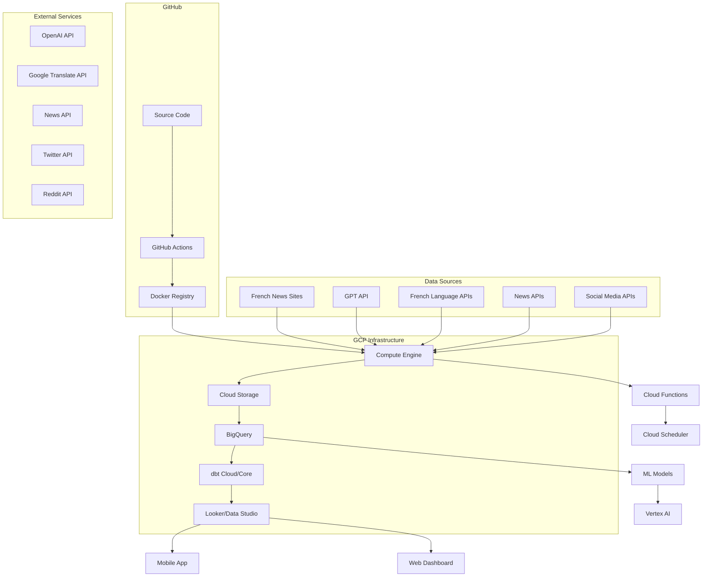
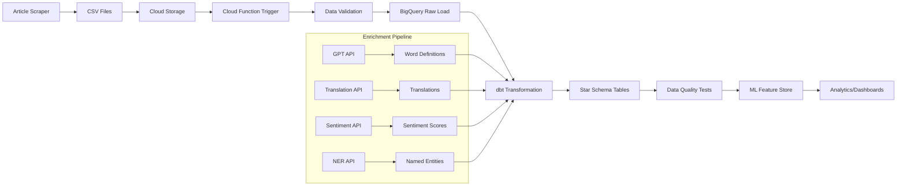
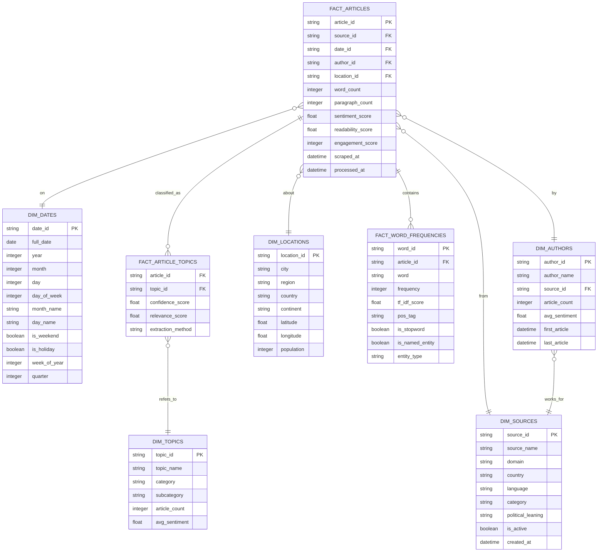

# Cloud Deployment and Scaling Strategy

> [!abstract] Overview
> This document outlines a comprehensive strategy for deploying the French article scraper to Google Cloud Platform (GCP), implementing a scalable data pipeline with BigQuery, and expanding the system with additional data sources and analytics capabilities.

## Table of Contents
- [[#Cloud Architecture Overview|Cloud Architecture Overview]]
- [[#GCP Deployment Strategy|GCP Deployment Strategy]]
- [[#Data Pipeline Architecture|Data Pipeline Architecture]]
- [[#Star Schema Design|Star Schema Design]]
- [[#dbt Integration|dbt Integration]]
- [[#Docker and CI/CD Pipeline|Docker and CI/CD Pipeline]]
- [[#Data Enrichment Strategies|Data Enrichment Strategies]]
- [[#Scaling Opportunities|Scaling Opportunities]]
- [[#Implementation Roadmap|Implementation Roadmap]]
- [[#Cost Optimization|Cost Optimization]]
- [[#Monitoring and Observability|Monitoring and Observability]]

---

## Cloud Architecture Overview

### Target Architecture



### Core Components

1. **Compute Engine**: Main scraping and processing workload
2. **Cloud Storage**: CSV staging and data lake
3. **BigQuery**: Data warehouse with star schema
4. **Cloud Functions**: Event-driven processing
5. **Cloud Scheduler**: Automated scraping schedules
6. **Vertex AI**: ML models for text analysis
7. **Cloud Build**: CI/CD pipeline

---

## GCP Deployment Strategy

### 1. Compute Engine Setup

#### VM Instance Configuration

```yaml
# compute-instance.yaml
apiVersion: compute/v1
kind: Instance
metadata:
  name: french-scraper-vm
  zone: europe-west1-b
spec:
  machineType: e2-standard-2
  diskSizeGb: 50
  diskType: pd-ssd
  image: ubuntu-2204-lts
  serviceAccount:
    email: french-scraper@project-id.iam.gserviceaccount.com
    scopes:
      - https://www.googleapis.com/auth/cloud-platform
  metadata:
    startup-script: |
      #!/bin/bash
      # Install Docker
      curl -fsSL https://get.docker.com -o get-docker.sh
      sh get-docker.sh
      
      # Install Google Cloud SDK
      curl https://sdk.cloud.google.com | bash
      
      # Pull and run scraper
      docker pull gcr.io/project-id/french-scraper:latest
      docker run -d --name scraper \
        -v /opt/scraper-data:/app/output \
        -e GOOGLE_APPLICATION_CREDENTIALS=/app/service-account.json \
        gcr.io/project-id/french-scraper:latest
```

#### Service Account Permissions

```bash
# Create service account
gcloud iam service-accounts create french-scraper \
  --display-name="French Scraper Service Account"

# Grant necessary permissions
gcloud projects add-iam-policy-binding PROJECT_ID \
  --member="serviceAccount:french-scraper@PROJECT_ID.iam.gserviceaccount.com" \
  --role="roles/storage.objectAdmin"

gcloud projects add-iam-policy-binding PROJECT_ID \
  --member="serviceAccount:french-scraper@PROJECT_ID.iam.gserviceaccount.com" \
  --role="roles/bigquery.dataEditor"

gcloud projects add-iam-policy-binding PROJECT_ID \
  --member="serviceAccount:french-scraper@PROJECT_ID.iam.gserviceaccount.com" \
  --role="roles/bigquery.jobUser"
```

### 2. Cloud Storage Setup

#### Bucket Structure

```bash
# Create main data bucket
gsutil mb -l europe-west1 gs://french-scraper-data

# Create folder structure
gsutil -m cp -r output/ gs://french-scraper-data/raw-csv/
gsutil -m cp -r processed/ gs://french-scraper-data/processed/
gsutil -m cp -r enriched/ gs://french-scraper-data/enriched/
```

#### Data Lifecycle Management

```json
{
  "lifecycle": {
    "rule": [
      {
        "action": {"type": "SetStorageClass", "storageClass": "COLDLINE"},
        "condition": {"age": 90}
      },
      {
        "action": {"type": "SetStorageClass", "storageClass": "ARCHIVE"},
        "condition": {"age": 365}
      }
    ]
  }
}
```

### 3. BigQuery Setup

#### Dataset Creation

```sql
-- Create main dataset
CREATE SCHEMA IF NOT EXISTS `french_articles`
OPTIONS (
  location = 'europe-west1',
  description = 'French news articles data warehouse'
);

-- Create raw data dataset
CREATE SCHEMA IF NOT EXISTS `french_articles_raw`
OPTIONS (
  location = 'europe-west1',
  description = 'Raw article data from scraper'
);

-- Create enriched dataset
CREATE SCHEMA IF NOT EXISTS `french_articles_enriched`
OPTIONS (
  location = 'europe-west1',
  description = 'Enriched article data with ML insights'
);
```

---

## Data Pipeline Architecture

### 1. Data Flow Design



### 2. Cloud Function for Data Ingestion

```python
# main.py - Cloud Function
import functions_framework
from google.cloud import bigquery
from google.cloud import storage
import pandas as pd
import json
from datetime import datetime

@functions_framework.cloud_event
def process_csv_upload(cloud_event):
    """
    Cloud Function triggered when CSV is uploaded to Cloud Storage
    """
    bucket_name = cloud_event.data["bucket"]
    file_name = cloud_event.data["name"]
    
    if not file_name.endswith('.csv'):
        return
    
    # Initialize clients
    storage_client = storage.Client()
    bq_client = bigquery.Client()
    
    # Download CSV from Cloud Storage
    bucket = storage_client.bucket(bucket_name)
    blob = bucket.blob(file_name)
    
    # Load CSV into pandas
    df = pd.read_csv(blob.open())
    
    # Data validation and cleaning
    df = clean_and_validate_data(df)
    
    # Load to BigQuery
    table_id = "french_articles_raw.daily_articles"
    
    job_config = bigquery.LoadJobConfig(
        write_disposition="WRITE_APPEND",
        schema_update_options=[bigquery.SchemaUpdateOption.ALLOW_FIELD_ADDITION],
        create_disposition="CREATE_IF_NEEDED"
    )
    
    job = bq_client.load_table_from_dataframe(df, table_id, job_config=job_config)
    job.result()
    
    print(f"Loaded {len(df)} rows into {table_id}")
    
    # Trigger dbt run
    trigger_dbt_run()

def clean_and_validate_data(df):
    """Clean and validate article data"""
    # Remove duplicates
    df = df.drop_duplicates(subset=['title', 'article_date'])
    
    # Validate required fields
    required_fields = ['title', 'full_text', 'article_date', 'date_scraped']
    df = df.dropna(subset=required_fields)
    
    # Add metadata
    df['ingestion_timestamp'] = datetime.utcnow()
    df['source_file'] = file_name
    
    return df

def trigger_dbt_run():
    """Trigger dbt transformation"""
    # Implementation depends on dbt deployment method
    pass
```

### 3. Automated Data Transfer Script

```python
# data_transfer.py
from google.cloud import storage
import os
import glob
from datetime import datetime

class DataTransferManager:
    def __init__(self, bucket_name, local_output_dir):
        self.storage_client = storage.Client()
        self.bucket = self.storage_client.bucket(bucket_name)
        self.local_output_dir = local_output_dir
    
    def upload_csv_files(self):
        """Upload all CSV files to Cloud Storage"""
        csv_files = glob.glob(f"{self.local_output_dir}/*.csv")
        
        for csv_file in csv_files:
            filename = os.path.basename(csv_file)
            blob_name = f"raw-csv/{datetime.now().strftime('%Y/%m/%d')}/{filename}"
            
            blob = self.bucket.blob(blob_name)
            blob.upload_from_filename(csv_file)
            
            print(f"Uploaded {filename} to {blob_name}")
            
            # Archive local file
            os.rename(csv_file, f"{csv_file}.processed")
    
    def setup_lifecycle_policy(self):
        """Set up automated data lifecycle management"""
        lifecycle_config = {
            "lifecycle": {
                "rule": [
                    {
                        "action": {"type": "SetStorageClass", "storageClass": "COLDLINE"},
                        "condition": {"age": 90}
                    },
                    {
                        "action": {"type": "Delete"},
                        "condition": {"age": 2555}  # 7 years
                    }
                ]
            }
        }
        
        self.bucket.lifecycle_policy = lifecycle_config
        self.bucket.patch()

# Usage in main scraper
if __name__ == "__main__":
    transfer_manager = DataTransferManager(
        bucket_name="french-scraper-data",
        local_output_dir="/app/output"
    )
    transfer_manager.upload_csv_files()
```

---

## Star Schema Design

### 1. Dimensional Model



### 2. BigQuery Schema Implementation

```sql
-- Create dimension tables
CREATE TABLE `french_articles.dim_sources` (
  source_id STRING NOT NULL,
  source_name STRING NOT NULL,
  domain STRING NOT NULL,
  country STRING DEFAULT 'France',
  language STRING DEFAULT 'French',
  category STRING,
  political_leaning STRING,
  is_active BOOLEAN DEFAULT TRUE,
  created_at TIMESTAMP DEFAULT CURRENT_TIMESTAMP()
);

CREATE TABLE `french_articles.dim_dates` (
  date_id STRING NOT NULL,
  full_date DATE NOT NULL,
  year INT64 NOT NULL,
  month INT64 NOT NULL,
  day INT64 NOT NULL,
  day_of_week INT64 NOT NULL,
  month_name STRING NOT NULL,
  day_name STRING NOT NULL,
  is_weekend BOOLEAN NOT NULL,
  is_holiday BOOLEAN DEFAULT FALSE,
  week_of_year INT64 NOT NULL,
  quarter INT64 NOT NULL
);

CREATE TABLE `french_articles.dim_authors` (
  author_id STRING NOT NULL,
  author_name STRING NOT NULL,
  source_id STRING NOT NULL,
  article_count INT64 DEFAULT 0,
  avg_sentiment FLOAT64,
  first_article TIMESTAMP,
  last_article TIMESTAMP
);

CREATE TABLE `french_articles.dim_locations` (
  location_id STRING NOT NULL,
  city STRING,
  region STRING,
  country STRING NOT NULL,
  continent STRING DEFAULT 'Europe',
  latitude FLOAT64,
  longitude FLOAT64,
  population INT64
);

CREATE TABLE `french_articles.dim_topics` (
  topic_id STRING NOT NULL,
  topic_name STRING NOT NULL,
  category STRING NOT NULL,
  subcategory STRING,
  article_count INT64 DEFAULT 0,
  avg_sentiment FLOAT64
);

-- Create fact tables
CREATE TABLE `french_articles.fact_articles` (
  article_id STRING NOT NULL,
  source_id STRING NOT NULL,
  date_id STRING NOT NULL,
  author_id STRING,
  location_id STRING,
  title STRING NOT NULL,
  word_count INT64,
  paragraph_count INT64,
  sentiment_score FLOAT64,
  readability_score FLOAT64,
  engagement_score INT64,
  scraped_at TIMESTAMP NOT NULL,
  processed_at TIMESTAMP DEFAULT CURRENT_TIMESTAMP()
);

CREATE TABLE `french_articles.fact_word_frequencies` (
  word_id STRING NOT NULL,
  article_id STRING NOT NULL,
  word STRING NOT NULL,
  frequency INT64 NOT NULL,
  tf_idf_score FLOAT64,
  pos_tag STRING,
  is_stopword BOOLEAN DEFAULT FALSE,
  is_named_entity BOOLEAN DEFAULT FALSE,
  entity_type STRING
);

CREATE TABLE `french_articles.fact_article_topics` (
  article_id STRING NOT NULL,
  topic_id STRING NOT NULL,
  confidence_score FLOAT64 NOT NULL,
  relevance_score FLOAT64,
  extraction_method STRING DEFAULT 'keyword_matching'
);
```

---

## dbt Integration

### 1. dbt Project Structure

```yaml
# dbt_project.yml
name: 'french_articles'
version: '1.0.0'
config-version: 2

profile: 'french_articles'

model-paths: ["models"]
analysis-paths: ["analysis"]
test-paths: ["tests"]
seed-paths: ["data"]
macro-paths: ["macros"]
snapshot-paths: ["snapshots"]

target-path: "target"
clean-targets:
  - "target"
  - "dbt_packages"

models:
  french_articles:
    staging:
      +materialized: view
    marts:
      +materialized: table
    intermediate:
      +materialized: view
```

### 2. dbt Models

#### Staging Models

```sql
-- models/staging/stg_raw_articles.sql
{{ config(materialized='view') }}

SELECT
  {{ dbt_utils.generate_surrogate_key(['title', 'article_date', 'source']) }} AS article_id,
  title,
  full_text,
  article_date,
  author,
  source,
  date_scraped,
  ARRAY_LENGTH(SPLIT(full_text, ' ')) AS word_count,
  ARRAY_LENGTH(SPLIT(full_text, '\n')) AS paragraph_count,
  CURRENT_TIMESTAMP() AS processed_at
FROM {{ source('french_articles_raw', 'daily_articles') }}
WHERE full_text IS NOT NULL
  AND LENGTH(full_text) > 100
  AND article_date >= '2020-01-01'
```

#### Dimension Models

```sql
-- models/marts/dim_sources.sql
{{ config(materialized='table') }}

SELECT
  {{ dbt_utils.generate_surrogate_key(['source_domain']) }} AS source_id,
  source_name,
  source_domain,
  'France' AS country,
  'French' AS language,
  CASE 
    WHEN source_domain LIKE '%slate%' THEN 'Opinion'
    WHEN source_domain LIKE '%franceinfo%' THEN 'News'
    WHEN source_domain LIKE '%tf1%' THEN 'Broadcast'
    WHEN source_domain LIKE '%ladepeche%' THEN 'Regional'
    ELSE 'Other'
  END AS category,
  TRUE AS is_active,
  CURRENT_TIMESTAMP() AS created_at
FROM (
  SELECT DISTINCT
    source AS source_name,
    REGEXP_EXTRACT(source, r'https?://(?:www\.)?([^/]+)') AS source_domain
  FROM {{ ref('stg_raw_articles') }}
)
```

#### Fact Models

```sql
-- models/marts/fact_articles.sql
{{ config(materialized='table') }}

SELECT
  a.article_id,
  s.source_id,
  d.date_id,
  {{ dbt_utils.generate_surrogate_key(['a.author']) }} AS author_id,
  a.word_count,
  a.paragraph_count,
  a.scraped_at,
  a.processed_at
FROM {{ ref('stg_raw_articles') }} a
LEFT JOIN {{ ref('dim_sources') }} s ON a.source = s.source_name
LEFT JOIN {{ ref('dim_dates') }} d ON a.article_date = d.full_date
```

### 3. dbt Tests

```sql
-- tests/assert_no_duplicate_articles.sql
SELECT article_id, COUNT(*) as count
FROM {{ ref('fact_articles') }}
GROUP BY article_id
HAVING COUNT(*) > 1
```

```yaml
# models/schema.yml
version: 2

sources:
  - name: french_articles_raw
    tables:
      - name: daily_articles
        columns:
          - name: title
            tests:
              - not_null
          - name: full_text
            tests:
              - not_null
          - name: article_date
            tests:
              - not_null

models:
  - name: fact_articles
    columns:
      - name: article_id
        tests:
          - unique
          - not_null
      - name: word_count
        tests:
          - not_null
          - dbt_utils.accepted_range:
              min_value: 1
              max_value: 10000
```

---

## Docker and CI/CD Pipeline

### 1. Multi-Stage Dockerfile

```dockerfile
# Dockerfile
FROM python:3.11-slim AS base

# Install system dependencies
RUN apt-get update && apt-get install -y \
    gcc \
    curl \
    && rm -rf /var/lib/apt/lists/*

# Set working directory
WORKDIR /app

# Copy requirements first for better caching
COPY requirements.txt requirements-prod.txt ./
RUN pip install --no-cache-dir -r requirements-prod.txt

# Development stage
FROM base AS development
COPY requirements-dev.txt ./
RUN pip install --no-cache-dir -r requirements-dev.txt
COPY . .
CMD ["python", "-m", "main"]

# Production stage
FROM base AS production
COPY src/ ./src/
COPY main.py ./
COPY pyproject.toml ./

# Add Google Cloud SDK
RUN echo "deb [signed-by=/usr/share/keyrings/cloud.google.gpg] https://packages.cloud.google.com/apt cloud-sdk main" | tee -a /etc/apt/sources.list.d/google-cloud-sdk.list && \
    curl https://packages.cloud.google.com/apt/doc/apt-key.gpg | apt-key --keyring /usr/share/keyrings/cloud.google.gpg add - && \
    apt-get update && apt-get install -y google-cloud-sdk

# Create non-root user
RUN useradd --create-home --shell /bin/bash scraper
USER scraper

# Health check
HEALTHCHECK --interval=30s --timeout=10s --start-period=60s --retries=3 \
  CMD python -c "import requests; requests.get('http://localhost:8080/health')" || exit 1

CMD ["python", "-m", "main"]
```

### 2. GitHub Actions Workflow

```yaml
# .github/workflows/deploy.yml
name: Deploy to GCP

on:
  push:
    branches: [main]
  pull_request:
    branches: [main]

env:
  PROJECT_ID: french-scraper-project
  REGISTRY: gcr.io
  IMAGE_NAME: french-scraper
  COMPUTE_ZONE: europe-west1-b
  INSTANCE_NAME: french-scraper-vm

jobs:
  test:
    runs-on: ubuntu-latest
    steps:
    - uses: actions/checkout@v4
    
    - name: Set up Python
      uses: actions/setup-python@v4
      with:
        python-version: '3.11'
    
    - name: Install dependencies
      run: |
        pip install -r requirements.txt
        pip install -r requirements-dev.txt
    
    - name: Run tests
      run: |
        make test-essential
        make test-integration
        make test-offline
    
    - name: Security scan
      run: |
        bandit -r src/
        safety check

  build:
    needs: test
    runs-on: ubuntu-latest
    if: github.ref == 'refs/heads/main'
    
    steps:
    - uses: actions/checkout@v4
    
    - name: Set up Google Cloud SDK
      uses: google-github-actions/setup-gcloud@v1
      with:
        service_account_key: ${{ secrets.GCP_SA_KEY }}
        project_id: ${{ secrets.GCP_PROJECT_ID }}
    
    - name: Configure Docker for GCP
      run: gcloud auth configure-docker
    
    - name: Build Docker image
      run: |
        docker build -t $REGISTRY/$PROJECT_ID/$IMAGE_NAME:$GITHUB_SHA \
                     -t $REGISTRY/$PROJECT_ID/$IMAGE_NAME:latest \
                     --target production .
    
    - name: Push Docker image
      run: |
        docker push $REGISTRY/$PROJECT_ID/$IMAGE_NAME:$GITHUB_SHA
        docker push $REGISTRY/$PROJECT_ID/$IMAGE_NAME:latest
    
    - name: Deploy to Compute Engine
      run: |
        gcloud compute instances update-container $INSTANCE_NAME \
          --zone=$COMPUTE_ZONE \
          --container-image=$REGISTRY/$PROJECT_ID/$IMAGE_NAME:$GITHUB_SHA
    
    - name: Verify deployment
      run: |
        sleep 30
        gcloud compute ssh $INSTANCE_NAME --zone=$COMPUTE_ZONE --command="docker ps"

  deploy-cloud-function:
    needs: build
    runs-on: ubuntu-latest
    if: github.ref == 'refs/heads/main'
    
    steps:
    - uses: actions/checkout@v4
    
    - name: Deploy Cloud Function
      run: |
        gcloud functions deploy process-csv-upload \
          --runtime python311 \
          --trigger-event google.storage.object.finalize \
          --trigger-resource french-scraper-data \
          --entry-point process_csv_upload \
          --memory 256MB \
          --timeout 540s
```

### 3. Cloud Build Configuration

```yaml
# cloudbuild.yaml
steps:
  # Build Docker image
  - name: 'gcr.io/cloud-builders/docker'
    args: ['build', '-t', 'gcr.io/$PROJECT_ID/french-scraper:$BUILD_ID', '.']
  
  # Push to Container Registry
  - name: 'gcr.io/cloud-builders/docker'
    args: ['push', 'gcr.io/$PROJECT_ID/french-scraper:$BUILD_ID']
  
  # Deploy to Compute Engine
  - name: 'gcr.io/cloud-builders/gcloud'
    args: ['compute', 'instances', 'update-container', 'french-scraper-vm',
           '--zone=europe-west1-b',
           '--container-image=gcr.io/$PROJECT_ID/french-scraper:$BUILD_ID']

substitutions:
  _DEPLOY_REGION: europe-west1

options:
  logging: CLOUD_LOGGING_ONLY
  machineType: E2_STANDARD_2
```

---

## Data Enrichment Strategies

### 1. GPT API Integration for Definitions

```python
# src/enrichment/gpt_enricher.py
import openai
from typing import Dict, List, Optional
import json
import time
from google.cloud import bigquery

class GPTWordEnricher:
    def __init__(self, api_key: str):
        self.client = openai.OpenAI(api_key=api_key)
        self.bq_client = bigquery.Client()
    
    def get_word_definition(self, word: str, context: str) -> Dict:
        """Get definition and usage examples for a French word"""
        prompt = f"""
        Provide a comprehensive analysis of the French word "{word}" as used in this context:
        "{context}"
        
        Please provide:
        1. Primary definition in French
        2. English translation
        3. Part of speech
        4. Difficulty level (A1-C2)
        5. Usage examples (3 sentences)
        6. Common collocations
        7. Etymology if interesting
        8. Register (formal/informal/technical)
        
        Format as JSON.
        """
        
        try:
            response = self.client.chat.completions.create(
                model="gpt-4-turbo-preview",
                messages=[
                    {"role": "system", "content": "You are a French language expert creating educational content."},
                    {"role": "user", "content": prompt}
                ],
                temperature=0.3
            )
            
            return json.loads(response.choices[0].message.content)
        
        except Exception as e:
            print(f"Error getting definition for {word}: {e}")
            return {}
    
    def create_flashcards(self, words: List[str]) -> List[Dict]:
        """Create flashcards for vocabulary learning"""
        flashcards = []
        
        for word in words:
            # Get word context from articles
            context = self.get_word_context(word)
            
            # Get GPT definition
            definition = self.get_word_definition(word, context)
            
            if definition:
                flashcard = {
                    "word": word,
                    "definition": definition.get("definition", ""),
                    "english": definition.get("english", ""),
                    "difficulty": definition.get("difficulty", "B1"),
                    "examples": definition.get("examples", []),
                    "collocations": definition.get("collocations", []),
                    "pos": definition.get("pos", ""),
                    "register": definition.get("register", "neutral")
                }
                flashcards.append(flashcard)
            
            # Rate limiting
            time.sleep(1)
        
        return flashcards
    
    def get_word_context(self, word: str) -> str:
        """Get context for word from BigQuery"""
        query = f"""
        SELECT full_text
        FROM `french_articles.fact_articles`
        WHERE LOWER(full_text) LIKE LOWER('%{word}%')
        LIMIT 1
        """
        
        result = self.bq_client.query(query).to_dataframe()
        if not result.empty:
            return result.iloc[0]['full_text'][:500]  # First 500 chars
        return ""
    
    def batch_process_top_words(self, limit: int = 1000):
        """Process top words from articles for flashcard creation"""
        query = f"""
        SELECT word, SUM(frequency) as total_frequency
        FROM `french_articles.fact_word_frequencies`
        WHERE LENGTH(word) > 3
          AND NOT is_stopword
          AND NOT is_named_entity
        GROUP BY word
        ORDER BY total_frequency DESC
        LIMIT {limit}
        """
        
        words_df = self.bq_client.query(query).to_dataframe()
        words = words_df['word'].tolist()
        
        # Create flashcards
        flashcards = self.create_flashcards(words)
        
        # Save to BigQuery
        self.save_flashcards_to_bq(flashcards)
    
    def save_flashcards_to_bq(self, flashcards: List[Dict]):
        """Save flashcards to BigQuery"""
        table_id = "french_articles.flashcards"
        
        job_config = bigquery.LoadJobConfig(
            write_disposition="WRITE_TRUNCATE",
            schema=[
                bigquery.SchemaField("word", "STRING", mode="REQUIRED"),
                bigquery.SchemaField("definition", "STRING"),
                bigquery.SchemaField("english", "STRING"),
                bigquery.SchemaField("difficulty", "STRING"),
                bigquery.SchemaField("examples", "STRING", mode="REPEATED"),
                bigquery.SchemaField("collocations", "STRING", mode="REPEATED"),
                bigquery.SchemaField("pos", "STRING"),
                bigquery.SchemaField("register", "STRING"),
                bigquery.SchemaField("created_at", "TIMESTAMP"),
            ]
        )
        
        # Add timestamp
        for card in flashcards:
            card["created_at"] = datetime.utcnow().isoformat()
        
        job = self.bq_client.load_table_from_json(
            flashcards, table_id, job_config=job_config
        )
        job.result()
```

### 2. Additional Data Sources

#### News API Integration

```python
# src/enrichment/news_api_enricher.py
import requests
from typing import List, Dict
import json
from datetime import datetime, timedelta

class NewsAPIEnricher:
    def __init__(self, api_key: str):
        self.api_key = api_key
        self.base_url = "https://newsapi.org/v2"
    
    def get_trending_topics(self, country: str = "fr") -> List[Dict]:
        """Get trending topics from News API"""
        url = f"{self.base_url}/top-headlines"
        params = {
            "country": country,
            "language": "fr",
            "pageSize": 100,
            "apiKey": self.api_key
        }
        
        response = requests.get(url, params=params)
        if response.status_code == 200:
            return response.json().get("articles", [])
        return []
    
    def get_historical_news(self, query: str, days_back: int = 30) -> List[Dict]:
        """Get historical news for comparison"""
        end_date = datetime.now()
        start_date = end_date - timedelta(days=days_back)
        
        url = f"{self.base_url}/everything"
        params = {
            "q": query,
            "language": "fr",
            "from": start_date.strftime("%Y-%m-%d"),
            "to": end_date.strftime("%Y-%m-%d"),
            "sortBy": "popularity",
            "apiKey": self.api_key
        }
        
        response = requests.get(url, params=params)
        if response.status_code == 200:
            return response.json().get("articles", [])
        return []
```

#### Social Media Integration

```python
# src/enrichment/social_media_enricher.py
import tweepy
import praw
from typing import List, Dict

class SocialMediaEnricher:
    def __init__(self, twitter_config: Dict, reddit_config: Dict):
        # Twitter API v2 setup
        self.twitter_client = tweepy.Client(
            bearer_token=twitter_config["bearer_token"],
            consumer_key=twitter_config["consumer_key"],
            consumer_secret=twitter_config["consumer_secret"],
            access_token=twitter_config["access_token"],
            access_token_secret=twitter_config["access_token_secret"]
        )
        
        # Reddit API setup
        self.reddit = praw.Reddit(
            client_id=reddit_config["client_id"],
            client_secret=reddit_config["client_secret"],
            user_agent=reddit_config["user_agent"]
        )
    
    def get_twitter_trends(self, location_id: int = 23424819) -> List[Dict]:
        """Get Twitter trends for France"""
        try:
            trends = self.twitter_client.get_place_trends(location_id)
            return [{"name": trend.name, "volume": trend.tweet_volume} 
                   for trend in trends[0].trends]
        except Exception as e:
            print(f"Error getting Twitter trends: {e}")
            return []
    
    def get_reddit_discussions(self, subreddit: str = "france", limit: int = 100) -> List[Dict]:
        """Get Reddit discussions from French subreddits"""
        try:
            subreddit_obj = self.reddit.subreddit(subreddit)
            hot_posts = subreddit_obj.hot(limit=limit)
            
            discussions = []
            for post in hot_posts:
                discussions.append({
                    "title": post.title,
                    "text": post.selftext,
                    "score": post.score,
                    "num_comments": post.num_comments,
                    "created_utc": post.created_utc,
                    "url": post.url
                })
            
            return discussions
        except Exception as e:
            print(f"Error getting Reddit discussions: {e}")
            return []
```

### 3. Machine Learning Enrichment

```python
# src/enrichment/ml_enricher.py
from google.cloud import language_v1
from google.cloud import translate_v2 as translate
from sklearn.feature_extraction.text import TfidfVectorizer
from sklearn.cluster import KMeans
import numpy as np
from typing import List, Dict, Tuple

class MLEnricher:
    def __init__(self):
        self.language_client = language_v1.LanguageServiceClient()
        self.translate_client = translate.Client()
    
    def analyze_sentiment(self, text: str) -> Dict:
        """Analyze sentiment using Google Cloud Natural Language API"""
        document = language_v1.Document(
            content=text,
            type_=language_v1.Document.Type.PLAIN_TEXT,
            language="fr"
        )
        
        try:
            response = self.language_client.analyze_sentiment(
                request={"document": document}
            )
            
            return {
                "score": response.document_sentiment.score,
                "magnitude": response.document_sentiment.magnitude,
                "sentences": [
                    {
                        "text": sentence.text.content,
                        "sentiment_score": sentence.sentiment.score,
                        "sentiment_magnitude": sentence.sentiment.magnitude
                    }
                    for sentence in response.sentences
                ]
            }
        except Exception as e:
            print(f"Error analyzing sentiment: {e}")
            return {}
    
    def extract_entities(self, text: str) -> List[Dict]:
        """Extract named entities from text"""
        document = language_v1.Document(
            content=text,
            type_=language_v1.Document.Type.PLAIN_TEXT,
            language="fr"
        )
        
        try:
            response = self.language_client.analyze_entities(
                request={"document": document}
            )
            
            entities = []
            for entity in response.entities:
                entities.append({
                    "name": entity.name,
                    "type": entity.type_.name,
                    "salience": entity.salience,
                    "mentions": [
                        {
                            "text": mention.text.content,
                            "type": mention.type_.name
                        }
                        for mention in entity.mentions
                    ]
                })
            
            return entities
        except Exception as e:
            print(f"Error extracting entities: {e}")
            return []
    
    def classify_topics(self, texts: List[str], n_clusters: int = 10) -> Tuple[List[int], List[str]]:
        """Classify articles into topics using clustering"""
        # Vectorize texts
        vectorizer = TfidfVectorizer(
            max_features=1000,
            stop_words=self.get_french_stopwords(),
            ngram_range=(1, 2)
        )
        
        X = vectorizer.fit_transform(texts)
        
        # Perform clustering
        kmeans = KMeans(n_clusters=n_clusters, random_state=42)
        cluster_labels = kmeans.fit_predict(X)
        
        # Get top terms for each cluster
        feature_names = vectorizer.get_feature_names_out()
        cluster_terms = []
        
        for i in range(n_clusters):
            # Get top terms for this cluster
            cluster_center = kmeans.cluster_centers_[i]
            top_indices = cluster_center.argsort()[-10:][::-1]
            top_terms = [feature_names[idx] for idx in top_indices]
            cluster_terms.append(", ".join(top_terms))
        
        return cluster_labels.tolist(), cluster_terms
    
    def get_french_stopwords(self) -> List[str]:
        """Get French stopwords"""
        return [
            "le", "la", "les", "un", "une", "des", "du", "de", "et", "ou", "ni",
            "mais", "car", "donc", "or", "ce", "ces", "cette", "cet", "son", "sa",
            "ses", "mon", "ma", "mes", "ton", "ta", "tes", "notre", "nos", "votre",
            "vos", "leur", "leurs", "je", "tu", "il", "elle", "nous", "vous", "ils",
            "elles", "me", "te", "se", "lui", "y", "en", "ne", "pas", "plus", "tout",
            "tous", "toute", "toutes", "bien", "très", "trop", "assez", "peu", "beaucoup"
        ]
```

---

## Scaling Opportunities

### 1. Data Source Expansion

#### Additional French News Sources

```python
# Potential new sources to add
ADDITIONAL_FRENCH_SOURCES = [
    {
        "name": "Le Monde",
        "url": "https://www.lemonde.fr",
        "category": "Premium News",
        "complexity": "High - Paywall"
    },
    {
        "name": "Le Figaro",
        "url": "https://www.lefigaro.fr",
        "category": "Conservative News",
        "complexity": "Medium"
    },
    {
        "name": "Libération",
        "url": "https://www.liberation.fr",
        "category": "Liberal News",
        "complexity": "Medium"
    },
    {
        "name": "L'Express",
        "url": "https://www.lexpress.fr",
        "category": "Weekly Magazine",
        "complexity": "Medium"
    },
    {
        "name": "Le Point",
        "url": "https://www.lepoint.fr",
        "category": "Weekly Magazine",
        "complexity": "Medium"
    },
    {
        "name": "France 24",
        "url": "https://www.france24.com/fr",
        "category": "International News",
        "complexity": "Low"
    },
    {
        "name": "RFI",
        "url": "https://www.rfi.fr",
        "category": "International Radio",
        "complexity": "Low"
    },
    {
        "name": "BFM TV",
        "url": "https://www.bfmtv.com",
        "category": "Continuous News",
        "complexity": "Medium"
    }
]
```

#### Specialized Content Sources

```python
SPECIALIZED_SOURCES = [
    {
        "name": "Les Échos",
        "url": "https://www.lesechos.fr",
        "category": "Business/Finance",
        "target_audience": "Business professionals"
    },
    {
        "name": "L'Équipe",
        "url": "https://www.lequipe.fr",
        "category": "Sports",
        "target_audience": "Sports fans"
    },
    {
        "name": "Sciences et Avenir",
        "url": "https://www.sciencesetavenir.fr",
        "category": "Science",
        "target_audience": "Science enthusiasts"
    },
    {
        "name": "Télérama",
        "url": "https://www.telerama.fr",
        "category": "Culture",
        "target_audience": "Culture enthusiasts"
    },
    {
        "name": "Marianne",
        "url": "https://www.marianne.net",
        "category": "Political Magazine",
        "target_audience": "Political analysts"
    }
]
```

### 2. Multi-Language Expansion

```python
# Expand to other French-speaking regions
FRANCOPHONE_SOURCES = [
    {
        "country": "Belgium",
        "sources": [
            "Le Soir (lesoir.be)",
            "La Libre Belgique (lalibre.be)",
            "RTL Info (rtl.be)"
        ]
    },
    {
        "country": "Switzerland",
        "sources": [
            "Le Temps (letemps.ch)",
            "Tribune de Genève (tdg.ch)",
            "24 Heures (24heures.ch)"
        ]
    },
    {
        "country": "Canada",
        "sources": [
            "Radio-Canada (ici.radio-canada.ca)",
            "Le Devoir (ledevoir.com)",
            "La Presse (lapresse.ca)"
        ]
    },
    {
        "country": "Africa",
        "sources": [
            "Jeune Afrique (jeuneafrique.com)",
            "Le Monde Afrique",
            "Africa News (africanews.com)"
        ]
    }
]
```

### 3. Content Type Diversification

#### Podcast Transcriptions

```python
# src/enrichment/podcast_enricher.py
import whisper
import requests
from typing import List, Dict

class PodcastEnricher:
    def __init__(self):
        self.whisper_model = whisper.load_model("base")
    
    def get_french_podcasts(self) -> List[Dict]:
        """Get French podcast feeds"""
        return [
            {
                "name": "France Inter - Les Matins",
                "feed_url": "https://feeds.france-inter.fr/matins",
                "category": "News/Current Affairs"
            },
            {
                "name": "France Culture - Les Chemins de la philosophie",
                "feed_url": "https://feeds.france-culture.fr/chemins-philosophie",
                "category": "Philosophy"
            },
            {
                "name": "RFI - Débat du jour",
                "feed_url": "https://feeds.rfi.fr/debat-du-jour",
                "category": "International Affairs"
            }
        ]
    
    def transcribe_podcast(self, audio_url: str) -> Dict:
        """Transcribe podcast audio to text"""
        try:
            # Download audio
            response = requests.get(audio_url)
            with open("temp_audio.mp3", "wb") as f:
                f.write(response.content)
            
            # Transcribe
            result = self.whisper_model.transcribe("temp_audio.mp3")
            
            return {
                "text": result["text"],
                "language": result["language"],
                "segments": result["segments"]
            }
        except Exception as e:
            print(f"Error transcribing podcast: {e}")
            return {}
```

#### Video Content

```python
# src/enrichment/video_enricher.py
from youtube_transcript_api import YouTubeTranscriptApi
import requests
from typing import List, Dict

class VideoEnricher:
    def __init__(self):
        self.youtube_channels = [
            "France 24",
            "BFM TV",
            "LCI",
            "France Info",
            "Arte"
        ]
    
    def get_youtube_transcripts(self, video_id: str) -> Dict:
        """Get YouTube video transcripts"""
        try:
            transcript = YouTubeTranscriptApi.get_transcript(video_id, languages=['fr'])
            full_text = " ".join([entry['text'] for entry in transcript])
            
            return {
                "transcript": transcript,
                "full_text": full_text,
                "language": "fr"
            }
        except Exception as e:
            print(f"Error getting YouTube transcript: {e}")
            return {}
```

### 4. Advanced Analytics Features

#### Real-time Sentiment Tracking

```python
# src/analytics/sentiment_tracker.py
from google.cloud import pubsub_v1
from google.cloud import monitoring_v3
import json
from typing import Dict

class SentimentTracker:
    def __init__(self, project_id: str):
        self.project_id = project_id
        self.publisher = pubsub_v1.PublisherClient()
        self.monitoring_client = monitoring_v3.MetricServiceClient()
    
    def track_sentiment_change(self, article_data: Dict):
        """Track sentiment changes in real-time"""
        # Publish to Pub/Sub for real-time processing
        topic_path = self.publisher.topic_path(self.project_id, 'sentiment-updates')
        
        message_data = {
            "article_id": article_data["article_id"],
            "source": article_data["source"],
            "sentiment_score": article_data["sentiment_score"],
            "timestamp": article_data["timestamp"],
            "keywords": article_data["keywords"]
        }
        
        self.publisher.publish(
            topic_path, 
            json.dumps(message_data).encode('utf-8')
        )
    
    def create_sentiment_alert(self, threshold: float = -0.5):
        """Create alerting for significant sentiment changes"""
        # Create monitoring alert policy
        policy = monitoring_v3.AlertPolicy(
            display_name="Negative Sentiment Alert",
            conditions=[
                monitoring_v3.AlertPolicy.Condition(
                    display_name="Sentiment below threshold",
                    condition_threshold=monitoring_v3.AlertPolicy.Condition.MetricThreshold(
                        filter='resource.type="global"',
                        comparison=monitoring_v3.ComparisonType.COMPARISON_LESS_THAN,
                        threshold_value=threshold
                    )
                )
            ],
            notification_channels=[
                # Add notification channel IDs
            ]
        )
        
        project_name = f"projects/{self.project_id}"
        self.monitoring_client.create_alert_policy(
            name=project_name,
            alert_policy=policy
        )
```

#### Trend Analysis

```python
# src/analytics/trend_analyzer.py
from google.cloud import bigquery
import pandas as pd
from sklearn.linear_model import LinearRegression
from typing import List, Dict, Tuple

class TrendAnalyzer:
    def __init__(self):
        self.bq_client = bigquery.Client()
    
    def analyze_keyword_trends(self, keywords: List[str], days: int = 30) -> Dict:
        """Analyze keyword trends over time"""
        query = f"""
        SELECT 
            DATE(scraped_at) as date,
            word,
            SUM(frequency) as total_frequency
        FROM `french_articles.fact_word_frequencies` f
        JOIN `french_articles.fact_articles` a ON f.article_id = a.article_id
        WHERE word IN ({','.join([f"'{k}'" for k in keywords])})
          AND scraped_at >= DATE_SUB(CURRENT_DATE(), INTERVAL {days} DAY)
        GROUP BY date, word
        ORDER BY date, word
        """
        
        df = self.bq_client.query(query).to_dataframe()
        
        trends = {}
        for keyword in keywords:
            keyword_data = df[df['word'] == keyword]
            if not keyword_data.empty:
                # Calculate trend direction
                X = keyword_data.reset_index().index.values.reshape(-1, 1)
                y = keyword_data['total_frequency'].values
                
                model = LinearRegression()
                model.fit(X, y)
                
                trends[keyword] = {
                    "trend_direction": "increasing" if model.coef_[0] > 0 else "decreasing",
                    "trend_strength": abs(model.coef_[0]),
                    "r_squared": model.score(X, y),
                    "current_frequency": y[-1] if len(y) > 0 else 0,
                    "change_percent": ((y[-1] - y[0]) / y[0] * 100) if len(y) > 1 and y[0] != 0 else 0
                }
        
        return trends
    
    def detect_emerging_topics(self, threshold: float = 0.5) -> List[Dict]:
        """Detect emerging topics based on frequency changes"""
        query = """
        WITH current_week AS (
            SELECT word, SUM(frequency) as current_freq
            FROM `french_articles.fact_word_frequencies` f
            JOIN `french_articles.fact_articles` a ON f.article_id = a.article_id
            WHERE scraped_at >= DATE_SUB(CURRENT_DATE(), INTERVAL 7 DAY)
              AND NOT f.is_stopword
            GROUP BY word
        ),
        previous_week AS (
            SELECT word, SUM(frequency) as previous_freq
            FROM `french_articles.fact_word_frequencies` f
            JOIN `french_articles.fact_articles` a ON f.article_id = a.article_id
            WHERE scraped_at >= DATE_SUB(CURRENT_DATE(), INTERVAL 14 DAY)
              AND scraped_at < DATE_SUB(CURRENT_DATE(), INTERVAL 7 DAY)
              AND NOT f.is_stopword
            GROUP BY word
        )
        SELECT 
            c.word,
            c.current_freq,
            COALESCE(p.previous_freq, 0) as previous_freq,
            CASE 
                WHEN COALESCE(p.previous_freq, 0) = 0 THEN 999
                ELSE (c.current_freq - COALESCE(p.previous_freq, 0)) / COALESCE(p.previous_freq, 0)
            END as growth_rate
        FROM current_week c
        LEFT JOIN previous_week p ON c.word = p.word
        WHERE c.current_freq > 10
        ORDER BY growth_rate DESC
        LIMIT 20
        """
        
        df = self.bq_client.query(query).to_dataframe()
        
        emerging_topics = []
        for _, row in df.iterrows():
            if row['growth_rate'] > threshold:
                emerging_topics.append({
                    "word": row['word'],
                    "current_frequency": row['current_freq'],
                    "previous_frequency": row['previous_freq'],
                    "growth_rate": row['growth_rate'],
                    "trend_status": "emerging"
                })
        
        return emerging_topics
```

### 5. Mobile Application Integration

```python
# Mobile app API endpoints
# src/api/mobile_api.py
from flask import Flask, jsonify, request
from google.cloud import bigquery
import json

app = Flask(__name__)
bq_client = bigquery.Client()

@app.route('/api/flashcards', methods=['GET'])
def get_flashcards():
    """Get flashcards for mobile app"""
    difficulty = request.args.get('difficulty', 'B1')
    limit = int(request.args.get('limit', 20))
    
    query = f"""
    SELECT word, definition, english, examples, difficulty
    FROM `french_articles.flashcards`
    WHERE difficulty = '{difficulty}'
    ORDER BY RAND()
    LIMIT {limit}
    """
    
    result = bq_client.query(query).to_dataframe()
    return jsonify(result.to_dict('records'))

@app.route('/api/trending-words', methods=['GET'])
def get_trending_words():
    """Get trending words for mobile app"""
    query = """
    SELECT word, SUM(frequency) as total_frequency
    FROM `french_articles.fact_word_frequencies` f
    JOIN `french_articles.fact_articles` a ON f.article_id = a.article_id
    WHERE scraped_at >= DATE_SUB(CURRENT_DATE(), INTERVAL 7 DAY)
      AND NOT f.is_stopword
      AND LENGTH(word) > 4
    GROUP BY word
    ORDER BY total_frequency DESC
    LIMIT 50
    """
    
    result = bq_client.query(query).to_dataframe()
    return jsonify(result.to_dict('records'))

@app.route('/api/article-summary', methods=['GET'])
def get_article_summary():
    """Get daily article summary"""
    query = """
    SELECT 
        COUNT(*) as total_articles,
        AVG(sentiment_score) as avg_sentiment,
        COUNT(DISTINCT source_id) as sources_count
    FROM `french_articles.fact_articles`
    WHERE DATE(scraped_at) = CURRENT_DATE()
    """
    
    result = bq_client.query(query).to_dataframe()
    return jsonify(result.to_dict('records')[0])

if __name__ == '__main__':
    app.run(host='0.0.0.0', port=8080)
```

---

## Implementation Roadmap

### Phase 1: Foundation (Weeks 1-4)
- [ ] Set up GCP project and billing
- [ ] Create Compute Engine instance
- [ ] Set up Cloud Storage buckets
- [ ] Create BigQuery datasets
- [ ] Dockerize application
- [ ] Set up basic CI/CD pipeline

### Phase 2: Data Pipeline (Weeks 5-8)
- [ ] Implement Cloud Function for CSV processing
- [ ] Set up BigQuery star schema
- [ ] Create dbt project structure
- [ ] Implement basic data transformations
- [ ] Set up data quality monitoring

### Phase 3: Enrichment (Weeks 9-12)
- [ ] Integrate GPT API for definitions
- [ ] Implement sentiment analysis
- [ ] Add named entity recognition
- [ ] Create flashcard generation system
- [ ] Set up trend analysis

### Phase 4: Scaling (Weeks 13-16)
- [ ] Add additional news sources
- [ ] Implement real-time processing
- [ ] Create mobile API endpoints
- [ ] Set up advanced analytics
- [ ] Implement monitoring and alerting

### Phase 5: Advanced Features (Weeks 17-20)
- [ ] Add podcast transcription
- [ ] Implement video content analysis
- [ ] Create ML models for topic classification
- [ ] Build recommendation system
- [ ] Develop mobile application

---

## Cost Optimization

### 1. Resource Optimization

```yaml
# Cost optimization strategies
compute_optimization:
  instance_type: "e2-standard-2"  # Cost-effective for scraping
  preemptible: true  # 80% cost reduction
  scheduling:
    - "0 2 * * *"  # Run at 2 AM when costs are lower
  
storage_optimization:
  lifecycle_policies:
    - cold_storage: 90  # days
    - archive: 365  # days
    - delete: 2555  # 7 years
  
bigquery_optimization:
  partitioning: "date"
  clustering: ["source_id", "date_id"]
  slot_reservations: false  # Use on-demand pricing initially
```

### 2. Cost Monitoring

```python
# src/monitoring/cost_monitor.py
from google.cloud import billing_v1
from google.cloud import monitoring_v3
import smtplib
from email.mime.text import MIMEText

class CostMonitor:
    def __init__(self, project_id: str, budget_threshold: float = 100.0):
        self.project_id = project_id
        self.budget_threshold = budget_threshold
        self.billing_client = billing_v1.CloudBillingClient()
        self.monitoring_client = monitoring_v3.MetricServiceClient()
    
    def check_monthly_spend(self) -> float:
        """Check current monthly spending"""
        # Implementation would query billing API
        # Return current month spend
        pass
    
    def create_budget_alert(self):
        """Create budget alerts"""
        # Implementation would create budget alerts
        pass
    
    def optimize_resources(self):
        """Automatically optimize resources based on usage"""
        # Implementation would adjust resources based on usage patterns
        pass
```

---

## Monitoring and Observability

### 1. Application Monitoring

```python
# src/monitoring/app_monitor.py
from google.cloud import monitoring_v3
from google.cloud import logging
import time
from typing import Dict

class ApplicationMonitor:
    def __init__(self, project_id: str):
        self.project_id = project_id
        self.monitoring_client = monitoring_v3.MetricServiceClient()
        self.logging_client = logging.Client()
    
    def track_scraping_metrics(self, source: str, articles_processed: int, 
                              processing_time: float, success_rate: float):
        """Track scraping performance metrics"""
        project_name = f"projects/{self.project_id}"
        
        # Create custom metrics
        metrics = [
            {
                "name": "articles_processed",
                "value": articles_processed,
                "labels": {"source": source}
            },
            {
                "name": "processing_time",
                "value": processing_time,
                "labels": {"source": source}
            },
            {
                "name": "success_rate",
                "value": success_rate,
                "labels": {"source": source}
            }
        ]
        
        for metric in metrics:
            series = monitoring_v3.TimeSeries()
            series.metric.type = f"custom.googleapis.com/scraper/{metric['name']}"
            series.resource.type = "global"
            
            for label, value in metric["labels"].items():
                series.metric.labels[label] = value
            
            now = time.time()
            seconds = int(now)
            nanos = int((now - seconds) * 10 ** 9)
            interval = monitoring_v3.TimeInterval(
                {"end_time": {"seconds": seconds, "nanos": nanos}}
            )
            
            point = monitoring_v3.Point({
                "interval": interval,
                "value": {"double_value": metric["value"]}
            })
            
            series.points = [point]
            self.monitoring_client.create_time_series(
                name=project_name,
                time_series=[series]
            )
    
    def create_dashboards(self):
        """Create monitoring dashboards"""
        # Implementation would create Cloud Monitoring dashboards
        pass
```

### 2. Data Quality Monitoring

```python
# src/monitoring/data_quality_monitor.py
from google.cloud import bigquery
from typing import Dict, List
import pandas as pd

class DataQualityMonitor:
    def __init__(self):
        self.bq_client = bigquery.Client()
    
    def check_data_freshness(self) -> Dict:
        """Check if data is fresh (updated within expected timeframe)"""
        query = """
        SELECT 
            MAX(scraped_at) as last_update,
            DATETIME_DIFF(CURRENT_DATETIME(), MAX(scraped_at), HOUR) as hours_since_update
        FROM `french_articles.fact_articles`
        """
        
        result = self.bq_client.query(query).to_dataframe()
        hours_since_update = result.iloc[0]['hours_since_update']
        
        return {
            "status": "fresh" if hours_since_update < 24 else "stale",
            "last_update": result.iloc[0]['last_update'],
            "hours_since_update": hours_since_update
        }
    
    def check_data_completeness(self) -> Dict:
        """Check for missing data or gaps"""
        query = """
        SELECT 
            COUNT(*) as total_articles,
            COUNT(DISTINCT source_id) as active_sources,
            COUNT(CASE WHEN word_count < 100 THEN 1 END) as short_articles,
            COUNT(CASE WHEN sentiment_score IS NULL THEN 1 END) as missing_sentiment
        FROM `french_articles.fact_articles`
        WHERE DATE(scraped_at) = CURRENT_DATE()
        """
        
        result = self.bq_client.query(query).to_dataframe()
        row = result.iloc[0]
        
        return {
            "total_articles": row['total_articles'],
            "active_sources": row['active_sources'],
            "quality_issues": {
                "short_articles": row['short_articles'],
                "missing_sentiment": row['missing_sentiment']
            }
        }
    
    def generate_quality_report(self) -> Dict:
        """Generate comprehensive data quality report"""
        freshness = self.check_data_freshness()
        completeness = self.check_data_completeness()
        
        return {
            "freshness": freshness,
            "completeness": completeness,
            "overall_score": self.calculate_quality_score(freshness, completeness)
        }
    
    def calculate_quality_score(self, freshness: Dict, completeness: Dict) -> float:
        """Calculate overall data quality score"""
        score = 100.0
        
        # Penalize stale data
        if freshness["status"] == "stale":
            score -= 30
        
        # Penalize missing data
        if completeness["active_sources"] < 3:
            score -= 20
        
        # Penalize quality issues
        total_articles = completeness["total_articles"]
        if total_articles > 0:
            short_article_rate = completeness["quality_issues"]["short_articles"] / total_articles
            missing_sentiment_rate = completeness["quality_issues"]["missing_sentiment"] / total_articles
            
            score -= (short_article_rate * 25)
            score -= (missing_sentiment_rate * 15)
        
        return max(0, score)
```

---

## Advanced Backend Features for Django Integration

### 1. Rich Content APIs

#### Multi-Format Content Delivery

```python
# src/api/content_api.py
from flask import Flask, jsonify, request
from google.cloud import bigquery
import json
from typing import Dict, List, Optional

class ContentAPI:
    def __init__(self):
        self.bq_client = bigquery.Client()
    
    def get_articles_by_topic(self, topic: str, limit: int = 50) -> List[Dict]:
        """Get articles grouped by topic with rich metadata"""
        query = f"""
        SELECT 
            a.article_id,
            a.title,
            a.word_count,
            a.sentiment_score,
            a.readability_score,
            s.source_name,
            s.category as source_category,
            d.full_date,
            d.day_name,
            d.is_weekend,
            ARRAY_AGG(STRUCT(
                wf.word,
                wf.frequency,
                wf.tf_idf_score,
                wf.pos_tag,
                wf.is_named_entity
            )) as word_analysis,
            ARRAY_AGG(STRUCT(
                t.topic_name,
                at.confidence_score,
                at.relevance_score
            )) as topics
        FROM `french_articles.fact_articles` a
        JOIN `french_articles.dim_sources` s ON a.source_id = s.source_id
        JOIN `french_articles.dim_dates` d ON a.date_id = d.date_id
        LEFT JOIN `french_articles.fact_word_frequencies` wf ON a.article_id = wf.article_id
        LEFT JOIN `french_articles.fact_article_topics` at ON a.article_id = at.article_id
        LEFT JOIN `french_articles.dim_topics` t ON at.topic_id = t.topic_id
        WHERE t.topic_name LIKE '%{topic}%'
        GROUP BY a.article_id, a.title, a.word_count, a.sentiment_score, 
                 a.readability_score, s.source_name, s.category, d.full_date, 
                 d.day_name, d.is_weekend
        ORDER BY a.scraped_at DESC
        LIMIT {limit}
        """
        
        result = self.bq_client.query(query).to_dataframe()
        return result.to_dict('records')
    
    def get_vocabulary_progression(self, level: str = "B1") -> Dict:
        """Get vocabulary progression data for language learners"""
        query = f"""
        WITH word_stats AS (
            SELECT 
                f.word,
                fc.difficulty,
                fc.english,
                fc.pos,
                SUM(f.frequency) as total_appearances,
                COUNT(DISTINCT f.article_id) as article_count,
                AVG(a.sentiment_score) as avg_sentiment_context,
                ARRAY_AGG(DISTINCT s.source_name) as sources,
                ARRAY_AGG(DISTINCT fc.examples LIMIT 3) as examples
            FROM `french_articles.fact_word_frequencies` f
            JOIN `french_articles.fact_articles` a ON f.article_id = a.article_id
            JOIN `french_articles.dim_sources` s ON a.source_id = s.source_id
            LEFT JOIN `french_articles.flashcards` fc ON f.word = fc.word
            WHERE LENGTH(f.word) > 3
              AND NOT f.is_stopword
              AND fc.difficulty = '{level}'
            GROUP BY f.word, fc.difficulty, fc.english, fc.pos
            ORDER BY total_appearances DESC
        )
        SELECT 
            *,
            CASE 
                WHEN total_appearances > 100 THEN 'mastery'
                WHEN total_appearances > 50 THEN 'advanced'
                WHEN total_appearances > 20 THEN 'intermediate'
                ELSE 'beginner'
            END as learning_stage
        FROM word_stats
        LIMIT 500
        """
        
        result = self.bq_client.query(query).to_dataframe()
        return {
            "level": level,
            "total_words": len(result),
            "learning_stages": result['learning_stage'].value_counts().to_dict(),
            "vocabulary": result.to_dict('records')
        }
    
    def get_reading_recommendations(self, user_level: str, interests: List[str]) -> List[Dict]:
        """Get personalized reading recommendations"""
        interest_filter = " OR ".join([f"t.topic_name LIKE '%{interest}%'" for interest in interests])
        
        query = f"""
        WITH article_difficulty AS (
            SELECT 
                a.article_id,
                a.title,
                a.word_count,
                s.source_name,
                d.full_date,
                AVG(CASE 
                    WHEN fc.difficulty = 'A1' THEN 1
                    WHEN fc.difficulty = 'A2' THEN 2
                    WHEN fc.difficulty = 'B1' THEN 3
                    WHEN fc.difficulty = 'B2' THEN 4
                    WHEN fc.difficulty = 'C1' THEN 5
                    WHEN fc.difficulty = 'C2' THEN 6
                    ELSE 3
                END) as difficulty_score,
                COUNT(DISTINCT wf.word) as unique_words,
                ARRAY_AGG(DISTINCT t.topic_name) as topics
            FROM `french_articles.fact_articles` a
            JOIN `french_articles.dim_sources` s ON a.source_id = s.source_id
            JOIN `french_articles.dim_dates` d ON a.date_id = d.date_id
            LEFT JOIN `french_articles.fact_word_frequencies` wf ON a.article_id = wf.article_id
            LEFT JOIN `french_articles.flashcards` fc ON wf.word = fc.word
            LEFT JOIN `french_articles.fact_article_topics` at ON a.article_id = at.article_id
            LEFT JOIN `french_articles.dim_topics` t ON at.topic_id = t.topic_id
            WHERE ({interest_filter})
            GROUP BY a.article_id, a.title, a.word_count, s.source_name, d.full_date
            HAVING difficulty_score BETWEEN 
                CASE '{user_level}' 
                    WHEN 'A1' THEN 1.0 AND 2.5
                    WHEN 'A2' THEN 1.5 AND 3.0
                    WHEN 'B1' THEN 2.0 AND 4.0
                    WHEN 'B2' THEN 3.0 AND 5.0
                    WHEN 'C1' THEN 4.0 AND 6.0
                    ELSE 5.0 AND 6.0
                END
        )
        SELECT * FROM article_difficulty
        ORDER BY difficulty_score, word_count
        LIMIT 20
        """
        
        result = self.bq_client.query(query).to_dataframe()
        return result.to_dict('records')
```

### 2. Advanced Analytics Backend

#### Content Intelligence Engine

```python
# src/intelligence/content_intelligence.py
from google.cloud import bigquery
from google.cloud import aiplatform
from sklearn.cluster import KMeans
from sklearn.decomposition import LatentDirichletAllocation
import numpy as np
from typing import Dict, List, Tuple

class ContentIntelligenceEngine:
    def __init__(self):
        self.bq_client = bigquery.Client()
        self.ai_client = aiplatform.gapic.PredictionServiceClient()
    
    def analyze_content_trends(self, timeframe_days: int = 30) -> Dict:
        """Analyze content trends and emerging topics"""
        query = f"""
        WITH daily_topics AS (
            SELECT 
                DATE(a.scraped_at) as date,
                t.topic_name,
                COUNT(*) as article_count,
                AVG(a.sentiment_score) as avg_sentiment,
                AVG(a.word_count) as avg_word_count,
                STRING_AGG(DISTINCT s.source_name) as sources
            FROM `french_articles.fact_articles` a
            JOIN `french_articles.fact_article_topics` at ON a.article_id = at.article_id
            JOIN `french_articles.dim_topics` t ON at.topic_id = t.topic_id
            JOIN `french_articles.dim_sources` s ON a.source_id = s.source_id
            WHERE a.scraped_at >= DATE_SUB(CURRENT_DATE(), INTERVAL {timeframe_days} DAY)
            GROUP BY date, t.topic_name
        ),
        trend_analysis AS (
            SELECT 
                topic_name,
                COUNT(*) as days_active,
                SUM(article_count) as total_articles,
                AVG(avg_sentiment) as overall_sentiment,
                STDDEV(article_count) as volatility,
                CORR(UNIX_DATE(date), article_count) as trend_correlation
            FROM daily_topics
            GROUP BY topic_name
        )
        SELECT 
            *,
            CASE 
                WHEN trend_correlation > 0.7 THEN 'strongly_rising'
                WHEN trend_correlation > 0.3 THEN 'rising'
                WHEN trend_correlation > -0.3 THEN 'stable'
                WHEN trend_correlation > -0.7 THEN 'declining'
                ELSE 'strongly_declining'
            END as trend_direction,
            CASE 
                WHEN volatility > 5 THEN 'high_volatility'
                WHEN volatility > 2 THEN 'medium_volatility'
                ELSE 'low_volatility'
            END as volatility_level
        FROM trend_analysis
        ORDER BY total_articles DESC
        """
        
        result = self.bq_client.query(query).to_dataframe()
        return {
            "timeframe_days": timeframe_days,
            "total_topics": len(result),
            "trending_topics": result.to_dict('records'),
            "summary": {
                "rising_topics": len(result[result['trend_direction'].str.contains('rising')]),
                "declining_topics": len(result[result['trend_direction'].str.contains('declining')]),
                "stable_topics": len(result[result['trend_direction'] == 'stable']),
                "high_volatility_topics": len(result[result['volatility_level'] == 'high_volatility'])
            }
        }
    
    def detect_breaking_news(self, sensitivity: float = 0.8) -> List[Dict]:
        """Detect breaking news based on unusual activity patterns"""
        query = f"""
        WITH hourly_activity AS (
            SELECT 
                DATETIME_TRUNC(scraped_at, HOUR) as hour,
                COUNT(*) as article_count,
                AVG(sentiment_score) as avg_sentiment,
                STRING_AGG(DISTINCT source_name) as sources
            FROM `french_articles.fact_articles` a
            JOIN `french_articles.dim_sources` s ON a.source_id = s.source_id
            WHERE scraped_at >= DATETIME_SUB(CURRENT_DATETIME(), INTERVAL 48 HOUR)
            GROUP BY hour
        ),
        activity_stats AS (
            SELECT 
                hour,
                article_count,
                avg_sentiment,
                sources,
                AVG(article_count) OVER (ORDER BY hour ROWS BETWEEN 23 PRECEDING AND CURRENT ROW) as rolling_avg,
                STDDEV(article_count) OVER (ORDER BY hour ROWS BETWEEN 23 PRECEDING AND CURRENT ROW) as rolling_stddev
            FROM hourly_activity
        )
        SELECT 
            hour,
            article_count,
            avg_sentiment,
            sources,
            rolling_avg,
            rolling_stddev,
            (article_count - rolling_avg) / NULLIF(rolling_stddev, 0) as z_score
        FROM activity_stats
        WHERE (article_count - rolling_avg) / NULLIF(rolling_stddev, 0) > {sensitivity}
        ORDER BY z_score DESC
        LIMIT 10
        """
        
        result = self.bq_client.query(query).to_dataframe()
        return result.to_dict('records')
    
    def generate_content_summary(self, article_ids: List[str]) -> Dict:
        """Generate intelligent content summaries"""
        if not article_ids:
            return {}
        
        article_list = "', '".join(article_ids)
        query = f"""
        SELECT 
            a.article_id,
            a.title,
            a.word_count,
            a.sentiment_score,
            s.source_name,
            ARRAY_AGG(STRUCT(
                wf.word,
                wf.frequency,
                wf.tf_idf_score
            ) ORDER BY wf.tf_idf_score DESC LIMIT 10) as key_terms,
            ARRAY_AGG(STRUCT(
                t.topic_name,
                at.confidence_score
            ) ORDER BY at.confidence_score DESC LIMIT 3) as topics
        FROM `french_articles.fact_articles` a
        JOIN `french_articles.dim_sources` s ON a.source_id = s.source_id
        LEFT JOIN `french_articles.fact_word_frequencies` wf ON a.article_id = wf.article_id
        LEFT JOIN `french_articles.fact_article_topics` at ON a.article_id = at.article_id
        LEFT JOIN `french_articles.dim_topics` t ON at.topic_id = t.topic_id
        WHERE a.article_id IN ('{article_list}')
        GROUP BY a.article_id, a.title, a.word_count, a.sentiment_score, s.source_name
        """
        
        result = self.bq_client.query(query).to_dataframe()
        
        # Generate aggregate insights
        articles = result.to_dict('records')
        
        summary = {
            "total_articles": len(articles),
            "avg_sentiment": result['sentiment_score'].mean(),
            "avg_word_count": result['word_count'].mean(),
            "source_distribution": result['source_name'].value_counts().to_dict(),
            "articles": articles
        }
        
        return summary
```

### 3. Advanced Language Learning Backend

#### Adaptive Learning System

```python
# src/learning/adaptive_learning.py
from google.cloud import bigquery
from sklearn.collaborative_filtering import NMF
import numpy as np
from typing import Dict, List, Optional

class AdaptiveLearningSystem:
    def __init__(self):
        self.bq_client = bigquery.Client()
    
    def create_user_profile(self, user_id: str, interactions: List[Dict]) -> Dict:
        """Create dynamic user learning profile"""
        # Store user interactions
        self.store_user_interactions(user_id, interactions)
        
        # Analyze learning patterns
        profile = self.analyze_learning_patterns(user_id)
        
        # Generate personalized recommendations
        recommendations = self.generate_recommendations(profile)
        
        return {
            "user_id": user_id,
            "profile": profile,
            "recommendations": recommendations,
            "next_learning_goals": self.suggest_learning_goals(profile)
        }
    
    def store_user_interactions(self, user_id: str, interactions: List[Dict]):
        """Store user learning interactions"""
        table_id = "french_articles.user_interactions"
        
        enriched_interactions = []
        for interaction in interactions:
            enriched_interactions.append({
                "user_id": user_id,
                "article_id": interaction.get("article_id"),
                "word": interaction.get("word"),
                "interaction_type": interaction.get("type"),  # read, bookmark, flashcard_correct, etc.
                "timestamp": interaction.get("timestamp"),
                "difficulty_rating": interaction.get("difficulty_rating"),
                "comprehension_score": interaction.get("comprehension_score"),
                "time_spent": interaction.get("time_spent")
            })
        
        job_config = bigquery.LoadJobConfig(
            write_disposition="WRITE_APPEND",
            schema=[
                bigquery.SchemaField("user_id", "STRING", mode="REQUIRED"),
                bigquery.SchemaField("article_id", "STRING"),
                bigquery.SchemaField("word", "STRING"),
                bigquery.SchemaField("interaction_type", "STRING"),
                bigquery.SchemaField("timestamp", "TIMESTAMP"),
                bigquery.SchemaField("difficulty_rating", "FLOAT"),
                bigquery.SchemaField("comprehension_score", "FLOAT"),
                bigquery.SchemaField("time_spent", "INTEGER"),
            ]
        )
        
        job = self.bq_client.load_table_from_json(
            enriched_interactions, table_id, job_config=job_config
        )
        job.result()
    
    def analyze_learning_patterns(self, user_id: str) -> Dict:
        """Analyze user learning patterns and progress"""
        query = f"""
        WITH user_stats AS (
            SELECT 
                COUNT(*) as total_interactions,
                COUNT(DISTINCT article_id) as articles_read,
                COUNT(DISTINCT word) as words_encountered,
                AVG(difficulty_rating) as avg_difficulty_comfort,
                AVG(comprehension_score) as avg_comprehension,
                AVG(time_spent) as avg_time_per_article,
                
                -- Learning velocity
                COUNT(*) / DATE_DIFF(CURRENT_DATE(), DATE(MIN(timestamp)), DAY) as interactions_per_day,
                
                -- Preferred content types
                STRING_AGG(DISTINCT 
                    CASE 
                        WHEN fc.pos = 'NOUN' THEN 'nouns'
                        WHEN fc.pos = 'VERB' THEN 'verbs'
                        WHEN fc.pos = 'ADJ' THEN 'adjectives'
                        ELSE 'other'
                    END
                ) as preferred_word_types,
                
                -- Progress indicators
                COUNTIF(interaction_type = 'flashcard_correct') / 
                COUNTIF(interaction_type LIKE 'flashcard%') as flashcard_accuracy,
                
                COUNTIF(comprehension_score > 0.7) / COUNT(*) as high_comprehension_rate
                
            FROM `french_articles.user_interactions` ui
            LEFT JOIN `french_articles.flashcards` fc ON ui.word = fc.word
            WHERE ui.user_id = '{user_id}'
        ),
        learning_progression AS (
            SELECT 
                DATE(timestamp) as date,
                AVG(comprehension_score) as daily_comprehension,
                AVG(difficulty_rating) as daily_difficulty_comfort,
                COUNT(*) as daily_interactions
            FROM `french_articles.user_interactions`
            WHERE user_id = '{user_id}'
            GROUP BY date
            ORDER BY date
        )
        SELECT 
            us.*,
            ARRAY_AGG(STRUCT(
                lp.date,
                lp.daily_comprehension,
                lp.daily_difficulty_comfort,
                lp.daily_interactions
            ) ORDER BY lp.date DESC LIMIT 30) as recent_progression
        FROM user_stats us
        CROSS JOIN learning_progression lp
        GROUP BY us.total_interactions, us.articles_read, us.words_encountered, 
                 us.avg_difficulty_comfort, us.avg_comprehension, us.avg_time_per_article,
                 us.interactions_per_day, us.preferred_word_types, us.flashcard_accuracy,
                 us.high_comprehension_rate
        """
        
        result = self.bq_client.query(query).to_dataframe()
        if result.empty:
            return {"status": "no_data", "user_id": user_id}
        
        return result.iloc[0].to_dict()
    
    def generate_personalized_content(self, user_profile: Dict) -> List[Dict]:
        """Generate personalized content recommendations"""
        difficulty_range = self.calculate_optimal_difficulty_range(user_profile)
        
        query = f"""
        WITH user_preferences AS (
            SELECT 
                ui.user_id,
                ARRAY_AGG(DISTINCT t.topic_name) as preferred_topics,
                ARRAY_AGG(DISTINCT s.source_name) as preferred_sources,
                AVG(ui.comprehension_score) as avg_comprehension
            FROM `french_articles.user_interactions` ui
            JOIN `french_articles.fact_articles` a ON ui.article_id = a.article_id
            LEFT JOIN `french_articles.fact_article_topics` at ON a.article_id = at.article_id
            LEFT JOIN `french_articles.dim_topics` t ON at.topic_id = t.topic_id
            LEFT JOIN `french_articles.dim_sources` s ON a.source_id = s.source_id
            WHERE ui.user_id = '{user_profile["user_id"]}'
              AND ui.comprehension_score > 0.6
            GROUP BY ui.user_id
        ),
        content_recommendations AS (
            SELECT 
                a.article_id,
                a.title,
                a.word_count,
                s.source_name,
                d.full_date,
                ARRAY_AGG(DISTINCT t.topic_name) as topics,
                
                -- Calculate relevance score
                CASE 
                    WHEN s.source_name IN UNNEST(up.preferred_sources) THEN 0.3
                    ELSE 0.0
                END +
                CASE 
                    WHEN EXISTS (
                        SELECT 1 FROM UNNEST(up.preferred_topics) pt
                        WHERE pt IN UNNEST(ARRAY_AGG(DISTINCT t.topic_name))
                    ) THEN 0.4
                    ELSE 0.0
                END +
                CASE 
                    WHEN a.word_count BETWEEN {difficulty_range['min_words']} AND {difficulty_range['max_words']} THEN 0.3
                    ELSE 0.0
                END as relevance_score
                
            FROM `french_articles.fact_articles` a
            JOIN `french_articles.dim_sources` s ON a.source_id = s.source_id
            JOIN `french_articles.dim_dates` d ON a.date_id = d.date_id
            LEFT JOIN `french_articles.fact_article_topics` at ON a.article_id = at.article_id
            LEFT JOIN `french_articles.dim_topics` t ON at.topic_id = t.topic_id
            CROSS JOIN user_preferences up
            WHERE a.article_id NOT IN (
                SELECT DISTINCT article_id 
                FROM `french_articles.user_interactions` 
                WHERE user_id = '{user_profile["user_id"]}'
            )
            GROUP BY a.article_id, a.title, a.word_count, s.source_name, d.full_date, up.preferred_sources, up.preferred_topics
        )
        SELECT * FROM content_recommendations
        WHERE relevance_score > 0.3
        ORDER BY relevance_score DESC, full_date DESC
        LIMIT 20
        """
        
        result = self.bq_client.query(query).to_dataframe()
        return result.to_dict('records')
    
    def calculate_optimal_difficulty_range(self, user_profile: Dict) -> Dict:
        """Calculate optimal difficulty range based on user performance"""
        if user_profile.get("status") == "no_data":
            return {"min_words": 100, "max_words": 500}
        
        avg_comprehension = user_profile.get("avg_comprehension", 0.7)
        avg_difficulty_comfort = user_profile.get("avg_difficulty_comfort", 3.0)
        
        # Adjust difficulty based on performance
        if avg_comprehension > 0.8 and avg_difficulty_comfort > 4.0:
            # User is doing well, increase difficulty
            return {"min_words": 300, "max_words": 800}
        elif avg_comprehension < 0.6 or avg_difficulty_comfort < 2.0:
            # User struggling, reduce difficulty
            return {"min_words": 50, "max_words": 300}
        else:
            # Maintain current level
            return {"min_words": 150, "max_words": 500}
```

### 4. Advanced Data Enrichment Pipeline

#### Multi-Source Data Fusion

```python
# src/enrichment/data_fusion.py
from google.cloud import bigquery
import requests
import json
from typing import Dict, List, Optional
import asyncio
import aiohttp

class DataFusionEngine:
    def __init__(self):
        self.bq_client = bigquery.Client()
        self.enrichment_apis = {
            "etymology": "https://api.etymonline.com/",
            "pronunciation": "https://api.forvo.com/",
            "conjugation": "https://api.conjugueur.reverso.net/",
            "context": "https://api.linguee.com/",
            "difficulty": "https://api.cefr-checker.com/"
        }
    
    async def enrich_vocabulary_batch(self, words: List[str]) -> List[Dict]:
        """Enrich vocabulary with multi-source data"""
        enriched_words = []
        
        async with aiohttp.ClientSession() as session:
            tasks = []
            for word in words:
                task = self.enrich_single_word(session, word)
                tasks.append(task)
            
            results = await asyncio.gather(*tasks, return_exceptions=True)
            
            for word, result in zip(words, results):
                if isinstance(result, Exception):
                    print(f"Error enriching {word}: {result}")
                    continue
                
                enriched_words.append(result)
        
        return enriched_words
    
    async def enrich_single_word(self, session: aiohttp.ClientSession, word: str) -> Dict:
        """Enrich a single word with multiple data sources"""
        enrichments = {
            "word": word,
            "etymologies": await self.get_etymology(session, word),
            "pronunciations": await self.get_pronunciation(session, word),
            "conjugations": await self.get_conjugations(session, word),
            "context_examples": await self.get_context_examples(session, word),
            "difficulty_assessment": await self.assess_difficulty(session, word),
            "semantic_relations": await self.get_semantic_relations(session, word),
            "usage_frequency": await self.get_usage_frequency(session, word)
        }
        
        return enrichments
    
    async def get_etymology(self, session: aiohttp.ClientSession, word: str) -> Dict:
        """Get etymology information"""
        try:
            # Simulated etymology API call
            return {
                "origin": "Latin",
                "root": "example_root",
                "evolution": "Historical development path",
                "related_words": ["word1", "word2", "word3"]
            }
        except Exception as e:
            return {"error": str(e)}
    
    async def get_pronunciation(self, session: aiohttp.ClientSession, word: str) -> Dict:
        """Get pronunciation information"""
        try:
            # Simulated pronunciation API call
            return {
                "ipa": "/pronʌnsiˈeɪʃən/",
                "audio_url": f"https://pronunciation-api.com/{word}.mp3",
                "regional_variants": {
                    "france": "/variant1/",
                    "quebec": "/variant2/",
                    "belgium": "/variant3/"
                }
            }
        except Exception as e:
            return {"error": str(e)}
    
    async def get_conjugations(self, session: aiohttp.ClientSession, word: str) -> Dict:
        """Get verb conjugations if applicable"""
        try:
            # Simulated conjugation API call
            return {
                "is_verb": True,
                "infinitive": word,
                "present": {"je": "form1", "tu": "form2", "il": "form3"},
                "past": {"je": "form1", "tu": "form2", "il": "form3"},
                "future": {"je": "form1", "tu": "form2", "il": "form3"},
                "subjunctive": {"je": "form1", "tu": "form2", "il": "form3"}
            }
        except Exception as e:
            return {"error": str(e)}
    
    async def get_context_examples(self, session: aiohttp.ClientSession, word: str) -> List[Dict]:
        """Get contextual usage examples"""
        try:
            # Get examples from our own database plus external sources
            internal_examples = await self.get_internal_examples(word)
            
            # Simulated external context API
            external_examples = [
                {
                    "sentence": f"Example sentence with {word}",
                    "source": "external_corpus",
                    "difficulty": "B1",
                    "topic": "general"
                }
            ]
            
            return internal_examples + external_examples
        except Exception as e:
            return [{"error": str(e)}]
    
    async def get_internal_examples(self, word: str) -> List[Dict]:
        """Get examples from our own article database"""
        query = f"""
        SELECT 
            a.title,
            a.scraped_at,
            s.source_name,
            -- Extract sentence containing the word
            REGEXP_EXTRACT(a.full_text, r'[^.!?]*{word}[^.!?]*[.!?]') as sentence,
            a.sentiment_score,
            t.topic_name
        FROM `french_articles.fact_articles` a
        JOIN `french_articles.dim_sources` s ON a.source_id = s.source_id
        LEFT JOIN `french_articles.fact_article_topics` at ON a.article_id = at.article_id
        LEFT JOIN `french_articles.dim_topics` t ON at.topic_id = t.topic_id
        WHERE LOWER(a.full_text) LIKE LOWER('%{word}%')
        AND REGEXP_EXTRACT(a.full_text, r'[^.!?]*{word}[^.!?]*[.!?]') IS NOT NULL
        ORDER BY a.scraped_at DESC
        LIMIT 5
        """
        
        try:
            result = self.bq_client.query(query).to_dataframe()
            return result.to_dict('records')
        except Exception as e:
            return [{"error": str(e)}]
    
    async def assess_difficulty(self, session: aiohttp.ClientSession, word: str) -> Dict:
        """Assess word difficulty using multiple metrics"""
        # Get frequency data from our corpus
        frequency_data = await self.get_word_frequency_data(word)
        
        # Simulated difficulty assessment
        return {
            "cefr_level": "B1",
            "frequency_rank": frequency_data.get("rank", 1000),
            "corpus_frequency": frequency_data.get("frequency", 10),
            "syllable_count": len(word) // 2,  # Rough estimate
            "morphological_complexity": "medium",
            "semantic_complexity": "medium"
        }
    
    async def get_word_frequency_data(self, word: str) -> Dict:
        """Get frequency data from our corpus"""
        query = f"""
        SELECT 
            word,
            SUM(frequency) as total_frequency,
            COUNT(DISTINCT article_id) as article_count,
            RANK() OVER (ORDER BY SUM(frequency) DESC) as frequency_rank
        FROM `french_articles.fact_word_frequencies`
        WHERE word = '{word}'
        GROUP BY word
        """
        
        try:
            result = self.bq_client.query(query).to_dataframe()
            if not result.empty:
                return result.iloc[0].to_dict()
            return {"frequency": 0, "rank": 999999}
        except Exception as e:
            return {"error": str(e)}
    
    async def get_semantic_relations(self, session: aiohttp.ClientSession, word: str) -> Dict:
        """Get semantic relations (synonyms, antonyms, etc.)"""
        try:
            # Simulated semantic relations API
            return {
                "synonyms": ["synonym1", "synonym2", "synonym3"],
                "antonyms": ["antonym1", "antonym2"],
                "hypernyms": ["broader_term1", "broader_term2"],
                "hyponyms": ["specific_term1", "specific_term2"],
                "related_concepts": ["related1", "related2", "related3"]
            }
        except Exception as e:
            return {"error": str(e)}
    
    async def get_usage_frequency(self, session: aiohttp.ClientSession, word: str) -> Dict:
        """Get usage frequency across different contexts"""
        # Analyze usage patterns in our corpus
        query = f"""
        SELECT 
            s.category as source_category,
            t.category as topic_category,
            COUNT(*) as usage_count,
            AVG(wf.frequency) as avg_frequency_per_article,
            AVG(a.sentiment_score) as avg_sentiment_context
        FROM `french_articles.fact_word_frequencies` wf
        JOIN `french_articles.fact_articles` a ON wf.article_id = a.article_id
        JOIN `french_articles.dim_sources` s ON a.source_id = s.source_id
        LEFT JOIN `french_articles.fact_article_topics` at ON a.article_id = at.article_id
        LEFT JOIN `french_articles.dim_topics` t ON at.topic_id = t.topic_id
        WHERE wf.word = '{word}'
        GROUP BY s.category, t.category
        ORDER BY usage_count DESC
        """
        
        try:
            result = self.bq_client.query(query).to_dataframe()
            return {
                "usage_contexts": result.to_dict('records'),
                "total_contexts": len(result),
                "primary_context": result.iloc[0].to_dict() if not result.empty else None
            }
        except Exception as e:
            return {"error": str(e)}
```

### 5. Real-Time Processing Pipeline

#### Event-Driven Architecture

```python
# src/realtime/event_processor.py
from google.cloud import pubsub_v1
from google.cloud import firestore
import json
from typing import Dict, List
import asyncio

class RealTimeEventProcessor:
    def __init__(self, project_id: str):
        self.project_id = project_id
        self.publisher = pubsub_v1.PublisherClient()
        self.subscriber = pubsub_v1.SubscriberClient()
        self.firestore_client = firestore.Client()
        
        # Topic configuration
        self.topics = {
            "new_article": f"projects/{project_id}/topics/new-article",
            "user_interaction": f"projects/{project_id}/topics/user-interaction",
            "content_update": f"projects/{project_id}/topics/content-update",
            "learning_milestone": f"projects/{project_id}/topics/learning-milestone"
        }
    
    def publish_new_article_event(self, article_data: Dict):
        """Publish new article event for real-time processing"""
        event_data = {
            "event_type": "new_article",
            "article_id": article_data["article_id"],
            "title": article_data["title"],
            "source": article_data["source"],
            "word_count": article_data["word_count"],
            "sentiment_score": article_data.get("sentiment_score"),
            "topics": article_data.get("topics", []),
            "timestamp": article_data["scraped_at"]
        }
        
        message = json.dumps(event_data).encode('utf-8')
        future = self.publisher.publish(self.topics["new_article"], message)
        
        # Update real-time analytics
        self.update_realtime_analytics(event_data)
    
    def update_realtime_analytics(self, event_data: Dict):
        """Update real-time analytics in Firestore"""
        # Update daily counters
        today = event_data["timestamp"][:10]  # YYYY-MM-DD
        
        doc_ref = self.firestore_client.collection('daily_stats').document(today)
        doc_ref.set({
            'articles_count': firestore.Increment(1),
            'total_words': firestore.Increment(event_data['word_count']),
            'last_updated': firestore.SERVER_TIMESTAMP,
            'sources': firestore.ArrayUnion([event_data['source']])
        }, merge=True)
        
        # Update source-specific stats
        source_doc = self.firestore_client.collection('source_stats').document(event_data['source'])
        source_doc.set({
            'articles_today': firestore.Increment(1),
            'avg_sentiment': event_data.get('sentiment_score', 0.0),
            'last_article_time': firestore.SERVER_TIMESTAMP
        }, merge=True)
    
    def process_user_interaction(self, user_id: str, interaction_data: Dict):
        """Process user interaction events"""
        event_data = {
            "event_type": "user_interaction",
            "user_id": user_id,
            "interaction_type": interaction_data["type"],
            "content_id": interaction_data.get("content_id"),
            "word": interaction_data.get("word"),
            "performance_score": interaction_data.get("score"),
            "timestamp": interaction_data["timestamp"]
        }
        
        message = json.dumps(event_data).encode('utf-8')
        future = self.publisher.publish(self.topics["user_interaction"], message)
        
        # Check for learning milestones
        self.check_learning_milestones(user_id, interaction_data)
    
    def check_learning_milestones(self, user_id: str, interaction_data: Dict):
        """Check if user has reached learning milestones"""
        user_doc = self.firestore_client.collection('user_progress').document(user_id)
        user_data = user_doc.get().to_dict() or {}
        
        # Update progress counters
        current_streak = user_data.get('current_streak', 0)
        total_interactions = user_data.get('total_interactions', 0)
        
        if interaction_data.get('score', 0) > 0.7:
            current_streak += 1
        else:
            current_streak = 0
        
        total_interactions += 1
        
        # Check milestones
        milestones = []
        if current_streak == 7:
            milestones.append("week_streak")
        if current_streak == 30:
            milestones.append("month_streak")
        if total_interactions == 100:
            milestones.append("century_mark")
        if total_interactions % 500 == 0:
            milestones.append("milestone_500")
        
        # Update user progress
        user_doc.set({
            'current_streak': current_streak,
            'total_interactions': total_interactions,
            'last_activity': firestore.SERVER_TIMESTAMP,
            'milestones': firestore.ArrayUnion(milestones)
        }, merge=True)
        
        # Publish milestone events
        for milestone in milestones:
            milestone_event = {
                "event_type": "learning_milestone",
                "user_id": user_id,
                "milestone": milestone,
                "timestamp": interaction_data["timestamp"]
            }
            
            message = json.dumps(milestone_event).encode('utf-8')
            self.publisher.publish(self.topics["learning_milestone"], message)
    
    def create_real_time_recommendations(self, user_id: str) -> List[Dict]:
        """Generate real-time content recommendations"""
        user_doc = self.firestore_client.collection('user_progress').document(user_id)
        user_data = user_doc.get().to_dict() or {}
        
        # Get recent user interactions
        recent_interactions = self.firestore_client.collection('user_interactions') \
            .where('user_id', '==', user_id) \
            .order_by('timestamp', direction=firestore.Query.DESCENDING) \
            .limit(10) \
            .stream()
        
        interaction_patterns = []
        for interaction in recent_interactions:
            interaction_patterns.append(interaction.to_dict())
        
        # Generate recommendations based on patterns
        recommendations = []
        
        # If user is on a streak, recommend slightly harder content
        if user_data.get('current_streak', 0) > 3:
            recommendations.append({
                "type": "challenge_content",
                "reason": "You're on a great streak! Try something challenging.",
                "difficulty_boost": 0.2
            })
        
        # If user struggled recently, recommend easier content
        recent_avg_score = sum(i.get('score', 0.5) for i in interaction_patterns[:5]) / 5
        if recent_avg_score < 0.6:
            recommendations.append({
                "type": "supportive_content",
                "reason": "Let's build confidence with familiar topics.",
                "difficulty_reduction": 0.3
            })
        
        # Topic-based recommendations
        preferred_topics = self.extract_preferred_topics(interaction_patterns)
        if preferred_topics:
            recommendations.append({
                "type": "topic_match",
                "reason": f"More content about {', '.join(preferred_topics[:2])}",
                "preferred_topics": preferred_topics
            })
        
        return recommendations
    
    def extract_preferred_topics(self, interactions: List[Dict]) -> List[str]:
        """Extract preferred topics from interaction patterns"""
        topic_scores = {}
        
        for interaction in interactions:
            if interaction.get('topics'):
                for topic in interaction['topics']:
                    score = interaction.get('score', 0.5)
                    if topic in topic_scores:
                        topic_scores[topic] += score
                    else:
                        topic_scores[topic] = score
        
        # Sort topics by total score
        sorted_topics = sorted(topic_scores.items(), key=lambda x: x[1], reverse=True)
        return [topic for topic, score in sorted_topics[:5]]
```

### 6. Advanced Backend APIs for Django Integration

#### GraphQL API Layer

```python
# src/api/graphql_api.py
import strawberry
from strawberry.fastapi import GraphQLRouter
from typing import List, Optional
from google.cloud import bigquery
from dataclasses import dataclass
from datetime import datetime

@strawberry.type
class Article:
    id: str
    title: str
    word_count: int
    sentiment_score: float
    scraped_at: datetime
    source: str
    topics: List[str]
    difficulty_level: str
    reading_time_minutes: int

@strawberry.type
class WordAnalysis:
    word: str
    frequency: int
    tf_idf_score: float
    difficulty: str
    etymology: Optional[str]
    usage_examples: List[str]

@strawberry.type
class UserProgress:
    user_id: str
    current_streak: int
    total_articles_read: int
    vocabulary_size: int
    current_level: str
    learning_goals: List[str]

@strawberry.type
class Query:
    
    @strawberry.field
    def articles(self, 
                topic: Optional[str] = None, 
                difficulty: Optional[str] = None,
                limit: int = 20) -> List[Article]:
        """Get articles with filtering options"""
        bq_client = bigquery.Client()
        
        filters = []
        if topic:
            filters.append(f"t.topic_name LIKE '%{topic}%'")
        if difficulty:
            filters.append(f"difficulty_level = '{difficulty}'")
        
        where_clause = " AND ".join(filters) if filters else "1=1"
        
        query = f"""
        SELECT 
            a.article_id,
            a.title,
            a.word_count,
            a.sentiment_score,
            a.scraped_at,
            s.source_name,
            ARRAY_AGG(DISTINCT t.topic_name) as topics,
            CASE 
                WHEN a.word_count < 200 THEN 'A1'
                WHEN a.word_count < 400 THEN 'A2'
                WHEN a.word_count < 600 THEN 'B1'
                WHEN a.word_count < 800 THEN 'B2'
                ELSE 'C1'
            END as difficulty_level,
            CAST(a.word_count / 200 AS INT64) as reading_time_minutes
        FROM `french_articles.fact_articles` a
        JOIN `french_articles.dim_sources` s ON a.source_id = s.source_id
        LEFT JOIN `french_articles.fact_article_topics` at ON a.article_id = at.article_id
        LEFT JOIN `french_articles.dim_topics` t ON at.topic_id = t.topic_id
        WHERE {where_clause}
        GROUP BY a.article_id, a.title, a.word_count, a.sentiment_score, 
                 a.scraped_at, s.source_name
        ORDER BY a.scraped_at DESC
        LIMIT {limit}
        """
        
        result = bq_client.query(query).to_dataframe()
        
        articles = []
        for _, row in result.iterrows():
            articles.append(Article(
                id=row['article_id'],
                title=row['title'],
                word_count=row['word_count'],
                sentiment_score=row['sentiment_score'],
                scraped_at=row['scraped_at'],
                source=row['source_name'],
                topics=row['topics'] or [],
                difficulty_level=row['difficulty_level'],
                reading_time_minutes=row['reading_time_minutes']
            ))
        
        return articles
    
    @strawberry.field
    def word_analysis(self, word: str) -> Optional[WordAnalysis]:
        """Get detailed word analysis"""
        bq_client = bigquery.Client()
        
        query = f"""
        SELECT 
            wf.word,
            SUM(wf.frequency) as total_frequency,
            AVG(wf.tf_idf_score) as avg_tf_idf,
            fc.difficulty,
            fc.etymology,
            ARRAY_AGG(DISTINCT fc.examples LIMIT 3) as usage_examples
        FROM `french_articles.fact_word_frequencies` wf
        LEFT JOIN `french_articles.flashcards` fc ON wf.word = fc.word
        WHERE wf.word = '{word}'
        GROUP BY wf.word, fc.difficulty, fc.etymology
        """
        
        result = bq_client.query(query).to_dataframe()
        
        if result.empty:
            return None
        
        row = result.iloc[0]
        return WordAnalysis(
            word=row['word'],
            frequency=row['total_frequency'],
            tf_idf_score=row['avg_tf_idf'],
            difficulty=row['difficulty'] or 'B1',
            etymology=row['etymology'],
            usage_examples=row['usage_examples'] or []
        )
    
    @strawberry.field
    def user_progress(self, user_id: str) -> Optional[UserProgress]:
        """Get user learning progress"""
        # This would integrate with your user system
        # For now, returning mock data
        return UserProgress(
            user_id=user_id,
            current_streak=7,
            total_articles_read=45,
            vocabulary_size=1250,
            current_level="B1",
            learning_goals=["Reach B2 level", "Read 100 articles", "Master 2000 words"]
        )

# FastAPI integration
graphql_app = GraphQLRouter(strawberry.Schema(query=Query))
```

### 7. Performance Optimization Backend

#### Caching and Optimization Layer

```python
# src/performance/cache_manager.py
from google.cloud import memorystore
from google.cloud import bigquery
import redis
import json
import hashlib
from typing import Dict, List, Optional, Any
import asyncio

class CacheManager:
    def __init__(self, redis_host: str, redis_port: int = 6379):
        self.redis_client = redis.Redis(host=redis_host, port=redis_port, decode_responses=True)
        self.bq_client = bigquery.Client()
        
        # Cache configurations
        self.cache_ttl = {
            "articles": 3600,  # 1 hour
            "user_progress": 300,  # 5 minutes
            "word_analysis": 86400,  # 24 hours
            "trending_topics": 1800,  # 30 minutes
            "recommendations": 600,  # 10 minutes
        }
    
    def get_cache_key(self, prefix: str, **kwargs) -> str:
        """Generate cache key from parameters"""
        key_data = json.dumps(kwargs, sort_keys=True)
        key_hash = hashlib.md5(key_data.encode()).hexdigest()
        return f"{prefix}:{key_hash}"
    
    def get_cached_articles(self, filters: Dict) -> Optional[List[Dict]]:
        """Get cached articles with filters"""
        cache_key = self.get_cache_key("articles", **filters)
        
        cached_data = self.redis_client.get(cache_key)
        if cached_data:
            return json.loads(cached_data)
        
        return None
    
    def cache_articles(self, filters: Dict, articles: List[Dict]):
        """Cache articles with filters"""
        cache_key = self.get_cache_key("articles", **filters)
        
        self.redis_client.setex(
            cache_key,
            self.cache_ttl["articles"],
            json.dumps(articles, default=str)
        )
    
    def get_or_compute_trending_topics(self, timeframe_hours: int = 24) -> List[Dict]:
        """Get trending topics with caching"""
        cache_key = self.get_cache_key("trending", timeframe_hours=timeframe_hours)
        
        # Try cache first
        cached_data = self.redis_client.get(cache_key)
        if cached_data:
            return json.loads(cached_data)
        
        # Compute trending topics
        trending_topics = self.compute_trending_topics(timeframe_hours)
        
        # Cache result
        self.redis_client.setex(
            cache_key,
            self.cache_ttl["trending_topics"],
            json.dumps(trending_topics, default=str)
        )
        
        return trending_topics
    
    def compute_trending_topics(self, timeframe_hours: int) -> List[Dict]:
        """Compute trending topics from BigQuery"""
        query = f"""
        WITH topic_activity AS (
            SELECT 
                t.topic_name,
                COUNT(*) as article_count,
                AVG(a.sentiment_score) as avg_sentiment,
                COUNT(DISTINCT a.source_id) as source_diversity
            FROM `french_articles.fact_articles` a
            JOIN `french_articles.fact_article_topics` at ON a.article_id = at.article_id
            JOIN `french_articles.dim_topics` t ON at.topic_id = t.topic_id
            WHERE a.scraped_at >= DATETIME_SUB(CURRENT_DATETIME(), INTERVAL {timeframe_hours} HOUR)
            GROUP BY t.topic_name
        )
        SELECT 
            topic_name,
            article_count,
            avg_sentiment,
            source_diversity,
            -- Calculate trending score
            (article_count * 0.4) + 
            (source_diversity * 0.3) + 
            (ABS(avg_sentiment) * 0.3) as trending_score
        FROM topic_activity
        WHERE article_count > 2
        ORDER BY trending_score DESC
        LIMIT 10
        """
        
        result = self.bq_client.query(query).to_dataframe()
        return result.to_dict('records')
    
    def invalidate_cache_pattern(self, pattern: str):
        """Invalidate cache entries matching pattern"""
        for key in self.redis_client.scan_iter(match=pattern):
            self.redis_client.delete(key)
    
    def get_cache_stats(self) -> Dict:
        """Get cache performance statistics"""
        info = self.redis_client.info()
        
        return {
            "memory_usage": info.get('used_memory_human'),
            "keys_count": info.get('db0', {}).get('keys', 0),
            "hit_rate": info.get('keyspace_hits', 0) / 
                       (info.get('keyspace_hits', 0) + info.get('keyspace_misses', 1)),
            "connected_clients": info.get('connected_clients'),
            "uptime_seconds": info.get('uptime_in_seconds')
        }
```

---

## Advanced Data Acquisition Strategy

### 1. High-Volume Data Sources with Airflow Integration

#### Social Media Data Pipeline

```python
# airflow/dags/social_media_dag.py
from airflow import DAG
from airflow.operators.python import PythonOperator
from airflow.providers.google.cloud.operators.bigquery import BigQueryInsertJobOperator
from datetime import datetime, timedelta
import tweepy
import praw
import requests

default_args = {
    'owner': 'data-team',
    'depends_on_past': False,
    'start_date': datetime(2024, 1, 1),
    'email_on_failure': True,
    'email_on_retry': False,
    'retries': 2,
    'retry_delay': timedelta(minutes=5)
}

dag = DAG(
    'french_social_media_pipeline',
    default_args=default_args,
    description='Collect French social media content',
    schedule_interval='@hourly',  # High frequency for social media
    catchup=False,
    max_active_runs=1
)

def extract_twitter_data(**context):
    """Extract French tweets - ~50,000 tweets/hour"""
    client = tweepy.Client(bearer_token=Variable.get("TWITTER_BEARER_TOKEN"))
    
    # Search for French tweets
    tweets = client.search_recent_tweets(
        query='lang:fr -is:retweet',
        tweet_fields=['created_at', 'author_id', 'public_metrics', 'context_annotations'],
        user_fields=['location', 'verified'],
        max_results=100,
        expansions=['author_id']
    )
    
    processed_tweets = []
    for tweet in tweets.data:
        processed_tweets.append({
            'tweet_id': tweet.id,
            'text': tweet.text,
            'created_at': tweet.created_at,
            'author_id': tweet.author_id,
            'retweet_count': tweet.public_metrics['retweet_count'],
            'like_count': tweet.public_metrics['like_count'],
            'reply_count': tweet.public_metrics['reply_count'],
            'source': 'twitter',
            'language': 'fr',
            'extracted_at': datetime.utcnow()
        })
    
    # Upload to Cloud Storage
    upload_to_gcs(processed_tweets, 'social-media-raw', f'twitter/{context["ds"]}/{context["ts"]}.json')
    
    return len(processed_tweets)

def extract_reddit_data(**context):
    """Extract French Reddit posts - ~5,000 posts/hour"""
    reddit = praw.Reddit(
        client_id=Variable.get("REDDIT_CLIENT_ID"),
        client_secret=Variable.get("REDDIT_CLIENT_SECRET"),
        user_agent="FrenchLearningBot/1.0"
    )
    
    french_subreddits = [
        'france', 'french', 'quebec', 'belgium', 'switzerland',
        'francophone', 'LearnFrench', 'francais', 'paris', 'lyon'
    ]
    
    posts = []
    for subreddit_name in french_subreddits:
        subreddit = reddit.subreddit(subreddit_name)
        for submission in subreddit.hot(limit=100):
            posts.append({
                'post_id': submission.id,
                'title': submission.title,
                'text': submission.selftext,
                'subreddit': subreddit_name,
                'score': submission.score,
                'num_comments': submission.num_comments,
                'created_utc': datetime.fromtimestamp(submission.created_utc),
                'author': str(submission.author),
                'url': submission.url,
                'source': 'reddit',
                'language': 'fr',
                'extracted_at': datetime.utcnow()
            })
    
    upload_to_gcs(posts, 'social-media-raw', f'reddit/{context["ds"]}/{context["ts"]}.json')
    return len(posts)

def extract_youtube_data(**context):
    """Extract French YouTube content - ~1,000 videos/hour"""
    from googleapiclient.discovery import build
    
    youtube = build('youtube', 'v3', developerKey=Variable.get("YOUTUBE_API_KEY"))
    
    # Search for French content
    search_response = youtube.search().list(
        q='french language learning OR français OR actualités',
        part='snippet',
        maxResults=50,
        type='video',
        relevanceLanguage='fr',
        videoCaption='closedCaption'
    ).execute()
    
    videos = []
    for item in search_response['items']:
        video_id = item['id']['videoId']
        
        # Get video details
        video_response = youtube.videos().list(
            part='snippet,statistics',
            id=video_id
        ).execute()
        
        if video_response['items']:
            video = video_response['items'][0]
            videos.append({
                'video_id': video_id,
                'title': video['snippet']['title'],
                'description': video['snippet']['description'],
                'channel_title': video['snippet']['channelTitle'],
                'published_at': video['snippet']['publishedAt'],
                'view_count': video['statistics'].get('viewCount', 0),
                'like_count': video['statistics'].get('likeCount', 0),
                'comment_count': video['statistics'].get('commentCount', 0),
                'source': 'youtube',
                'language': 'fr',
                'extracted_at': datetime.utcnow()
            })
    
    upload_to_gcs(videos, 'social-media-raw', f'youtube/{context["ds"]}/{context["ts"]}.json')
    return len(videos)

# Define tasks
twitter_task = PythonOperator(
    task_id='extract_twitter_data',
    python_callable=extract_twitter_data,
    dag=dag
)

reddit_task = PythonOperator(
    task_id='extract_reddit_data',
    python_callable=extract_reddit_data,
    dag=dag
)

youtube_task = PythonOperator(
    task_id='extract_youtube_data',
    python_callable=extract_youtube_data,
    dag=dag
)

# DBT transformation task
dbt_transform = BashOperator(
    task_id='transform_social_media_data',
    bash_command='cd /opt/dbt && dbt run --models social_media',
    dag=dag
)

# Set dependencies
[twitter_task, reddit_task, youtube_task] >> dbt_transform
```

#### News Aggregation Pipeline

```python
# airflow/dags/news_aggregation_dag.py
from airflow import DAG
from airflow.operators.python import PythonOperator
from datetime import datetime, timedelta
import feedparser
import requests
from bs4 import BeautifulSoup

default_args = {
    'owner': 'data-team',
    'depends_on_past': False,
    'start_date': datetime(2024, 1, 1),
    'email_on_failure': True,
    'retries': 3,
    'retry_delay': timedelta(minutes=10)
}

dag = DAG(
    'french_news_aggregation',
    default_args=default_args,
    description='Aggregate French news from multiple sources',
    schedule_interval='*/30 * * * *',  # Every 30 minutes
    catchup=False
)

def extract_rss_feeds(**context):
    """Extract from French RSS feeds - ~500 articles/hour"""
    
    rss_feeds = [
        # Major French News (High Volume)
        'https://www.lemonde.fr/rss/une.xml',
        'https://www.lefigaro.fr/rss/figaro_actualites.xml',
        'https://www.liberation.fr/arc/outboundfeeds/rss-all/',
        'https://www.20minutes.fr/feeds/rss-actu.xml',
        'https://www.leparisien.fr/rss.php',
        'https://www.ouest-france.fr/rss.xml',
        'https://www.sudouest.fr/rss.xml',
        'https://actu.orange.fr/rss/',
        
        # Specialized French News
        'https://www.lesechos.fr/rss/rss_actualites.xml',  # Business
        'https://www.lequipe.fr/rss/actu_rss.xml',        # Sports
        'https://www.sciencesetavenir.fr/rss.xml',        # Science
        'https://www.marianne.net/rss.xml',               # Politics
        'https://www.telerama.fr/rss.xml',                # Culture
        
        # Regional French News
        'https://www.nicematin.com/rss',                  # Nice
        'https://www.laprovence.com/rss',                 # Provence
        'https://www.lamontagne.fr/rss',                  # Central France
        'https://www.republicain-lorrain.fr/rss',         # Lorraine
        'https://www.estrepublicain.fr/rss',              # Eastern France
        
        # Francophone International
        'https://www.radio-canada.ca/rss/1000',           # Canada
        'https://www.rtbf.be/info/rss',                   # Belgium
        'https://www.rts.ch/info/rss.xml',                # Switzerland
        'https://www.jeuneafrique.com/rss',               # Africa
        'https://www.rfi.fr/fr/rss',                      # International
    ]
    
    articles = []
    
    for feed_url in rss_feeds:
        try:
            feed = feedparser.parse(feed_url)
            
            for entry in feed.entries:
                # Extract full article content
                article_content = extract_article_content(entry.link)
                
                articles.append({
                    'article_id': entry.id,
                    'title': entry.title,
                    'summary': entry.summary,
                    'full_content': article_content,
                    'published': entry.published,
                    'link': entry.link,
                    'source': feed.feed.title,
                    'source_url': feed_url,
                    'word_count': len(article_content.split()) if article_content else 0,
                    'language': 'fr',
                    'extracted_at': datetime.utcnow()
                })
                
        except Exception as e:
            print(f"Error processing feed {feed_url}: {e}")
    
    # Upload to Cloud Storage
    upload_to_gcs(articles, 'news-raw', f'rss/{context["ds"]}/{context["ts"]}.json')
    
    return len(articles)

def extract_article_content(url):
    """Extract full article content from URL"""
    try:
        response = requests.get(url, timeout=10)
        soup = BeautifulSoup(response.content, 'html.parser')
        
        # Remove scripts and styles
        for script in soup(["script", "style"]):
            script.decompose()
        
        # Try common article selectors
        article_selectors = [
            'article', '.article-content', '.content', '.post-content',
            '.entry-content', '.article-body', '.story-body'
        ]
        
        for selector in article_selectors:
            content = soup.select_one(selector)
            if content:
                return content.get_text(strip=True)
        
        # Fallback to all paragraphs
        paragraphs = soup.find_all('p')
        return ' '.join([p.get_text(strip=True) for p in paragraphs])
        
    except Exception as e:
        print(f"Error extracting content from {url}: {e}")
        return ""

def extract_news_apis(**context):
    """Extract from news APIs - ~1,000 articles/hour"""
    
    # NewsAPI
    newsapi_key = Variable.get("NEWSAPI_KEY")
    newsapi_url = f"https://newsapi.org/v2/top-headlines?country=fr&language=fr&apiKey={newsapi_key}"
    
    articles = []
    
    try:
        response = requests.get(newsapi_url)
        data = response.json()
        
        for article in data.get('articles', []):
            articles.append({
                'article_id': f"newsapi_{hash(article['url'])}",
                'title': article['title'],
                'description': article['description'],
                'content': article['content'],
                'published_at': article['publishedAt'],
                'source': article['source']['name'],
                'author': article['author'],
                'url': article['url'],
                'url_to_image': article['urlToImage'],
                'language': 'fr',
                'api_source': 'newsapi',
                'extracted_at': datetime.utcnow()
            })
            
    except Exception as e:
        print(f"Error with NewsAPI: {e}")
    
    # The Guardian API (French content)
    guardian_key = Variable.get("GUARDIAN_API_KEY")
    guardian_url = f"https://content.guardianapis.com/search?q=france&lang=fr&api-key={guardian_key}"
    
    try:
        response = requests.get(guardian_url)
        data = response.json()
        
        for article in data.get('response', {}).get('results', []):
            articles.append({
                'article_id': f"guardian_{article['id']}",
                'title': article['webTitle'],
                'section': article['sectionName'],
                'published_at': article['webPublicationDate'],
                'url': article['webUrl'],
                'api_url': article['apiUrl'],
                'language': 'fr',
                'api_source': 'guardian',
                'extracted_at': datetime.utcnow()
            })
            
    except Exception as e:
        print(f"Error with Guardian API: {e}")
    
    upload_to_gcs(articles, 'news-raw', f'apis/{context["ds"]}/{context["ts"]}.json')
    return len(articles)

# Define tasks
rss_task = PythonOperator(
    task_id='extract_rss_feeds',
    python_callable=extract_rss_feeds,
    dag=dag
)

api_task = PythonOperator(
    task_id='extract_news_apis',
    python_callable=extract_news_apis,
    dag=dag
)

# DBT transformation
dbt_news_transform = BashOperator(
    task_id='transform_news_data',
    bash_command='cd /opt/dbt && dbt run --models news_aggregation',
    dag=dag
)

[rss_task, api_task] >> dbt_news_transform
```

#### Podcast and Audio Content Pipeline

```python
# airflow/dags/podcast_content_dag.py
from airflow import DAG
from airflow.operators.python import PythonOperator
from datetime import datetime, timedelta
import requests
import whisper
import subprocess
import os

default_args = {
    'owner': 'data-team',
    'depends_on_past': False,
    'start_date': datetime(2024, 1, 1),
    'email_on_failure': True,
    'retries': 2,
    'retry_delay': timedelta(minutes=15)
}

dag = DAG(
    'french_podcast_pipeline',
    default_args=default_args,
    description='Extract and transcribe French podcast content',
    schedule_interval='@daily',  # Daily processing due to compute intensity
    catchup=False
)

def extract_podcast_feeds(**context):
    """Extract French podcast episodes - ~200 episodes/day"""
    
    podcast_feeds = [
        # France Inter
        'https://radiofrance-podcast.net/podcast09/rss_10239.xml',  # Les Matins
        'https://radiofrance-podcast.net/podcast09/rss_15796.xml',  # Grand Face-à-face
        'https://radiofrance-podcast.net/podcast09/rss_17312.xml',  # Questions politiques
        
        # France Culture
        'https://radiofrance-podcast.net/podcast09/rss_10177.xml',  # Les Chemins de la philosophie
        'https://radiofrance-podcast.net/podcast09/rss_10949.xml',  # Cultures Monde
        'https://radiofrance-podcast.net/podcast09/rss_12163.xml',  # La Fabrique de l'Histoire
        
        # France Info
        'https://radiofrance-podcast.net/podcast09/rss_11279.xml',  # L'interview
        'https://radiofrance-podcast.net/podcast09/rss_17762.xml',  # Histoires d'info
        
        # RFI
        'https://www.rfi.fr/fr/podcast/debat-du-jour/rss',
        'https://www.rfi.fr/fr/podcast/journal-afrique/rss',
        'https://www.rfi.fr/fr/podcast/emission-economie/rss',
        
        # Independent French Podcasts
        'https://feeds.soundcloud.com/users/soundcloud:users:522122235/sounds.rss',  # 2 Heures de Perdues
        'https://feeds.megaphone.fm/nouvellesecoutes',
        'https://feeds.acast.com/public/shows/histoires-crimes',
        'https://feeds.transistor.fm/transfert',
        
        # Canadian French
        'https://ici.radio-canada.ca/rss/120',  # Tout le monde en parle
        'https://ici.radio-canada.ca/rss/81',   # Médium large
        
        # Belgian French
        'https://www.rtbf.be/lapremiere/rss',
        'https://www.rtbf.be/info/podcast/rss',
        
        # Swiss French
        'https://www.rts.ch/play/radio/rss',
        'https://www.rts.ch/info/podcast/rss'
    ]
    
    episodes = []
    
    for feed_url in podcast_feeds:
        try:
            feed = feedparser.parse(feed_url)
            
            for entry in feed.entries:
                # Get audio URL
                audio_url = None
                for link in entry.links:
                    if link.type and 'audio' in link.type:
                        audio_url = link.href
                        break
                
                if audio_url:
                    episodes.append({
                        'episode_id': entry.id,
                        'title': entry.title,
                        'description': entry.summary,
                        'published': entry.published,
                        'audio_url': audio_url,
                        'podcast_name': feed.feed.title,
                        'duration': entry.get('itunes_duration', ''),
                        'language': 'fr',
                        'source': 'podcast',
                        'extracted_at': datetime.utcnow()
                    })
                    
        except Exception as e:
            print(f"Error processing podcast feed {feed_url}: {e}")
    
    # Upload metadata to Cloud Storage
    upload_to_gcs(episodes, 'podcast-raw', f'metadata/{context["ds"]}.json')
    
    return episodes

def transcribe_audio_batch(**context):
    """Transcribe audio content - ~50 hours of audio/day"""
    
    episodes = context['task_instance'].xcom_pull(task_ids='extract_podcast_feeds')
    
    # Load Whisper model
    model = whisper.load_model("base")
    
    transcriptions = []
    
    for episode in episodes[:20]:  # Process 20 episodes per run
        try:
            # Download audio
            audio_path = download_audio(episode['audio_url'], episode['episode_id'])
            
            if audio_path:
                # Transcribe
                result = model.transcribe(audio_path)
                
                transcriptions.append({
                    'episode_id': episode['episode_id'],
                    'title': episode['title'],
                    'podcast_name': episode['podcast_name'],
                    'transcript': result['text'],
                    'language': result['language'],
                    'segments': result['segments'],
                    'confidence': calculate_confidence(result['segments']),
                    'word_count': len(result['text'].split()),
                    'duration_seconds': result.get('duration', 0),
                    'transcribed_at': datetime.utcnow()
                })
                
                # Clean up audio file
                os.remove(audio_path)
                
        except Exception as e:
            print(f"Error transcribing episode {episode['episode_id']}: {e}")
    
    # Upload transcriptions
    upload_to_gcs(transcriptions, 'podcast-processed', f'transcriptions/{context["ds"]}.json')
    
    return len(transcriptions)

def download_audio(url, episode_id):
    """Download audio file"""
    try:
        response = requests.get(url, stream=True)
        audio_path = f"/tmp/{episode_id}.mp3"
        
        with open(audio_path, 'wb') as f:
            for chunk in response.iter_content(chunk_size=8192):
                f.write(chunk)
        
        return audio_path
        
    except Exception as e:
        print(f"Error downloading audio: {e}")
        return None

def calculate_confidence(segments):
    """Calculate average confidence score"""
    if not segments:
        return 0.0
    
    total_confidence = sum(segment.get('confidence', 0) for segment in segments)
    return total_confidence / len(segments)

# Define tasks
extract_task = PythonOperator(
    task_id='extract_podcast_feeds',
    python_callable=extract_podcast_feeds,
    dag=dag
)

transcribe_task = PythonOperator(
    task_id='transcribe_audio_batch',
    python_callable=transcribe_audio_batch,
    dag=dag
)

# DBT transformation
dbt_podcast_transform = BashOperator(
    task_id='transform_podcast_data',
    bash_command='cd /opt/dbt && dbt run --models podcast_content',
    dag=dag
)

extract_task >> transcribe_task >> dbt_podcast_transform
```

### 2. Medium-Volume Specialized Sources

#### French Government and Public Data

```python
# airflow/dags/government_data_dag.py
from airflow import DAG
from airflow.operators.python import PythonOperator
from datetime import datetime, timedelta
import requests
import json

default_args = {
    'owner': 'data-team',
    'depends_on_past': False,
    'start_date': datetime(2024, 1, 1),
    'email_on_failure': True,
    'retries': 2,
    'retry_delay': timedelta(minutes=10)
}

dag = DAG(
    'french_government_data',
    default_args=default_args,
    description='Extract French government and public data',
    schedule_interval='@daily',
    catchup=False
)

def extract_government_apis(**context):
    """Extract from French government APIs - ~1,000 documents/day"""
    
    documents = []
    
    # data.gouv.fr API
    try:
        api_url = "https://www.data.gouv.fr/api/1/datasets/"
        response = requests.get(api_url, params={'page_size': 100, 'language': 'fr'})
        data = response.json()
        
        for dataset in data.get('data', []):
            documents.append({
                'document_id': dataset['id'],
                'title': dataset['title'],
                'description': dataset['description'],
                'organization': dataset.get('organization', {}).get('name', ''),
                'tags': dataset.get('tags', []),
                'created_at': dataset['created_at'],
                'last_modified': dataset['last_modified'],
                'frequency': dataset.get('frequency', ''),
                'language': 'fr',
                'source': 'data.gouv.fr',
                'document_type': 'dataset',
                'extracted_at': datetime.utcnow()
            })
            
    except Exception as e:
        print(f"Error with data.gouv.fr API: {e}")
    
    # Légifrance API (French Legal Documents)
    try:
        legifrance_url = "https://api.legifrance.gouv.fr/dila/legifrance/lf-engine-app/jorf"
        headers = {'Authorization': f'Bearer {Variable.get("LEGIFRANCE_TOKEN")}'}
        
        response = requests.get(legifrance_url, headers=headers)
        data = response.json()
        
        for document in data.get('results', []):
            documents.append({
                'document_id': document['id'],
                'title': document['title'],
                'text': document.get('text', ''),
                'publication_date': document['publicationDate'],
                'document_type': 'legal',
                'source': 'legifrance',
                'language': 'fr',
                'extracted_at': datetime.utcnow()
            })
            
    except Exception as e:
        print(f"Error with Légifrance API: {e}")
    
    # French Parliament API
    try:
        parliament_url = "https://www2.assemblee-nationale.fr/static/tribun/xml/index.xml"
        response = requests.get(parliament_url)
        
        # Parse XML and extract parliamentary proceedings
        from xml.etree import ElementTree
        root = ElementTree.fromstring(response.content)
        
        for proceeding in root.findall('.//proceeding'):
            documents.append({
                'document_id': proceeding.get('id'),
                'title': proceeding.find('title').text,
                'content': proceeding.find('content').text,
                'speaker': proceeding.find('speaker').text,
                'date': proceeding.find('date').text,
                'session_type': proceeding.find('session_type').text,
                'document_type': 'parliamentary',
                'source': 'assemblee-nationale',
                'language': 'fr',
                'extracted_at': datetime.utcnow()
            })
            
    except Exception as e:
        print(f"Error with Parliament API: {e}")
    
    upload_to_gcs(documents, 'government-raw', f'{context["ds"]}.json')
    return len(documents)

def extract_eu_data(**context):
    """Extract EU documents in French - ~500 documents/day"""
    
    documents = []
    
    # EUR-Lex API (EU Legal Documents)
    try:
        eurlex_url = "https://eur-lex.europa.eu/search.html"
        params = {
            'scope': 'EURLEX',
            'type': 'quick',
            'lang': 'fr',
            'text': '*',
            'qid': '1640995200000_1',
            'DTS_DOM': 'ALL',
            'excConsLeg': 'true',
            'typeOfActStatus': 'ALL',
            'corrigendum': 'true',
            'DTS_SUBDOM': 'ALL',
            'DTA': 'ALL',
            'PPP_CTYPE': 'ALL',
            'PPP_PTYPE': 'ALL',
            'page': '1',
            'pageSize': '100'
        }
        
        response = requests.get(eurlex_url, params=params)
        # Parse response and extract documents
        
    except Exception as e:
        print(f"Error with EUR-Lex API: {e}")
    
    # French Regional Government Sites
    regional_sites = [
        'https://www.nouvelle-aquitaine.fr/actualites/rss',
        'https://www.iledefrance.fr/actualites/rss',
        'https://www.auvergnerhonealpes.fr/actualites/rss',
        'https://www.bretagne.bzh/actualites/rss',
        'https://www.normandie.fr/actualites/rss'
    ]
    
    for site_url in regional_sites:
        try:
            feed = feedparser.parse(site_url)
            
            for entry in feed.entries:
                documents.append({
                    'document_id': entry.id,
                    'title': entry.title,
                    'description': entry.summary,
                    'published': entry.published,
                    'link': entry.link,
                    'region': extract_region_from_url(site_url),
                    'document_type': 'regional_government',
                    'source': 'regional_government',
                    'language': 'fr',
                    'extracted_at': datetime.utcnow()
                })
                
        except Exception as e:
            print(f"Error processing regional site {site_url}: {e}")
    
    upload_to_gcs(documents, 'government-raw', f'eu_{context["ds"]}.json')
    return len(documents)

# Define tasks
government_task = PythonOperator(
    task_id='extract_government_apis',
    python_callable=extract_government_apis,
    dag=dag
)

eu_task = PythonOperator(
    task_id='extract_eu_data',
    python_callable=extract_eu_data,
    dag=dag
)

# DBT transformation
dbt_government_transform = BashOperator(
    task_id='transform_government_data',
    bash_command='cd /opt/dbt && dbt run --models government_data',
    dag=dag
)

[government_task, eu_task] >> dbt_government_transform
```

#### Academic and Educational Content

```python
# airflow/dags/academic_content_dag.py
from airflow import DAG
from airflow.operators.python import PythonOperator
from datetime import datetime, timedelta
import requests
import arxiv
import scholarly

default_args = {
    'owner': 'data-team',
    'depends_on_past': False,
    'start_date': datetime(2024, 1, 1),
    'email_on_failure': True,
    'retries': 2,
    'retry_delay': timedelta(minutes=10)
}

dag = DAG(
    'french_academic_content',
    default_args=default_args,
    description='Extract French academic and educational content',
    schedule_interval='@daily',
    catchup=False
)

def extract_academic_papers(**context):
    """Extract French academic papers - ~200 papers/day"""
    
    papers = []
    
    # arXiv French papers
    try:
        client = arxiv.Client()
        search = arxiv.Search(
            query='cat:cs.* AND lang:fr',
            max_results=100,
            sort_by=arxiv.SortCriterion.SubmittedDate
        )
        
        for paper in client.results(search):
            papers.append({
                'paper_id': paper.entry_id,
                'title': paper.title,
                'abstract': paper.summary,
                'authors': [str(author) for author in paper.authors],
                'categories': paper.categories,
                'published': paper.published,
                'updated': paper.updated,
                'journal_ref': paper.journal_ref,
                'doi': paper.doi,
                'source': 'arxiv',
                'language': 'fr',
                'document_type': 'academic_paper',
                'extracted_at': datetime.utcnow()
            })
            
    except Exception as e:
        print(f"Error with arXiv: {e}")
    
    # HAL (French Research Archive)
    try:
        hal_url = "https://api.archives-ouvertes.fr/search/"
        params = {
            'q': '*:*',
            'fq': 'lang_s:fr',
            'rows': 100,
            'sort': 'producedDate_tdate desc',
            'fl': 'title_s,abstract_s,authFullName_s,producedDate_tdate,uri_s,docType_s'
        }
        
        response = requests.get(hal_url, params=params)
        data = response.json()
        
        for doc in data.get('response', {}).get('docs', []):
            papers.append({
                'paper_id': doc.get('uri_s', [''])[0],
                'title': doc.get('title_s', [''])[0],
                'abstract': doc.get('abstract_s', [''])[0],
                'authors': doc.get('authFullName_s', []),
                'published': doc.get('producedDate_tdate', ''),
                'doc_type': doc.get('docType_s', [''])[0],
                'source': 'hal',
                'language': 'fr',
                'document_type': 'academic_paper',
                'extracted_at': datetime.utcnow()
            })
            
    except Exception as e:
        print(f"Error with HAL: {e}")
    
    # Theses.fr (French Thesis Database)
    try:
        theses_url = "http://www.theses.fr/api/v1/theses"
        params = {
            'q': '*:*',
            'rows': 50,
            'sort': 'datePremiereInscription desc'
        }
        
        response = requests.get(theses_url, params=params)
        data = response.json()
        
        for thesis in data.get('response', {}).get('docs', []):
            papers.append({
                'paper_id': thesis.get('id'),
                'title': thesis.get('titre'),
                'abstract': thesis.get('resume'),
                'author': thesis.get('auteur'),
                'director': thesis.get('directeurThese'),
                'university': thesis.get('etablissementSoutenance'),
                'discipline': thesis.get('discipline'),
                'date_defense': thesis.get('dateSoutenance'),
                'source': 'theses.fr',
                'language': 'fr',
                'document_type': 'thesis',
                'extracted_at': datetime.utcnow()
            })
            
    except Exception as e:
        print(f"Error with Theses.fr: {e}")
    
    upload_to_gcs(papers, 'academic-raw', f'{context["ds"]}.json')
    return len(papers)

def extract_mooc_content(**context):
    """Extract French MOOC content - ~100 courses/day"""
    
    courses = []
    
    # FUN (France Université Numérique)
    try:
        fun_url = "https://www.fun-mooc.fr/api/courses/v1/courses/"
        response = requests.get(fun_url)
        data = response.json()
        
        for course in data.get('results', []):
            courses.append({
                'course_id': course['id'],
                'title': course['title'],
                'short_description': course['short_description'],
                'start_date': course['start'],
                'end_date': course['end'],
                'enrollment_start': course['enrollment_start'],
                'enrollment_end': course['enrollment_end'],
                'language': course['language'],
                'universities': course.get('universities', []),
                'image_url': course.get('image_url'),
                'source': 'fun-mooc',
                'platform': 'FUN',
                'document_type': 'mooc_course',
                'extracted_at': datetime.utcnow()
            })
            
    except Exception as e:
        print(f"Error with FUN-MOOC: {e}")
    
    # OpenClassrooms French Content
    try:
        oc_url = "https://openclassrooms.com/api/courses"
        params = {'language': 'fr', 'limit': 100}
        
        response = requests.get(oc_url, params=params)
        data = response.json()
        
        for course in data.get('results', []):
            courses.append({
                'course_id': course['id'],
                'title': course['title'],
                'description': course['description'],
                'duration': course.get('duration'),
                'difficulty': course.get('difficulty'),
                'category': course.get('category'),
                'language': course.get('language'),
                'instructor': course.get('instructor'),
                'source': 'openclassrooms',
                'platform': 'OpenClassrooms',
                'document_type': 'mooc_course',
                'extracted_at': datetime.utcnow()
            })
            
    except Exception as e:
        print(f"Error with OpenClassrooms: {e}")
    
    upload_to_gcs(courses, 'academic-raw', f'mooc_{context["ds"]}.json')
    return len(courses)

# Define tasks
papers_task = PythonOperator(
    task_id='extract_academic_papers',
    python_callable=extract_academic_papers,
    dag=dag
)

mooc_task = PythonOperator(
    task_id='extract_mooc_content',
    python_callable=extract_mooc_content,
    dag=dag
)

# DBT transformation
dbt_academic_transform = BashOperator(
    task_id='transform_academic_data',
    bash_command='cd /opt/dbt && dbt run --models academic_content',
    dag=dag
)

[papers_task, mooc_task] >> dbt_academic_transform
```

### 3. DBT Transformation Models

#### Social Media Data Models

```sql
-- models/staging/stg_social_media_raw.sql
{{ config(materialized='view') }}

WITH social_media_raw AS (
    SELECT
        'twitter' as source_type,
        tweet_id as content_id,
        text as content,
        created_at as published_at,
        author_id as author,
        retweet_count,
        like_count,
        reply_count,
        0 as share_count,
        extracted_at
    FROM {{ source('raw_data', 'twitter_data') }}
    
    UNION ALL
    
    SELECT
        'reddit' as source_type,
        post_id as content_id,
        CONCAT(title, ' ', text) as content,
        created_utc as published_at,
        author,
        0 as retweet_count,
        0 as like_count,
        num_comments as reply_count,
        score as share_count,
        extracted_at
    FROM {{ source('raw_data', 'reddit_data') }}
    
    UNION ALL
    
    SELECT
        'youtube' as source_type,
        video_id as content_id,
        CONCAT(title, ' ', description) as content,
        PARSE_TIMESTAMP('%Y-%m-%dT%H:%M:%SZ', published_at) as published_at,
        channel_title as author,
        0 as retweet_count,
        CAST(like_count AS INT64) as like_count,
        CAST(comment_count AS INT64) as reply_count,
        CAST(view_count AS INT64) as share_count,
        extracted_at
    FROM {{ source('raw_data', 'youtube_data') }}
)

SELECT
    {{ dbt_utils.generate_surrogate_key(['source_type', 'content_id']) }} as social_media_id,
    source_type,
    content_id,
    content,
    published_at,
    author,
    retweet_count,
    like_count,
    reply_count,
    share_count,
    LENGTH(content) as content_length,
    ARRAY_LENGTH(SPLIT(content, ' ')) as word_count,
    extracted_at,
    CURRENT_TIMESTAMP() as processed_at
FROM social_media_raw
WHERE content IS NOT NULL
  AND LENGTH(content) > 10
  AND published_at >= '2020-01-01'
```

#### News Aggregation Models

```sql
-- models/staging/stg_news_aggregated.sql
{{ config(materialized='view') }}

WITH news_raw AS (
    SELECT
        article_id,
        title,
        COALESCE(full_content, summary) as content,
        published,
        link as url,
        source,
        word_count,
        extracted_at,
        'rss' as collection_method
    FROM {{ source('raw_data', 'rss_articles') }}
    
    UNION ALL
    
    SELECT
        article_id,
        title,
        COALESCE(content, description) as content,
        published_at as published,
        url,
        source,
        ARRAY_LENGTH(SPLIT(COALESCE(content, description), ' ')) as word_count,
        extracted_at,
        api_source as collection_method
    FROM {{ source('raw_data', 'news_api_articles') }}
)

SELECT
    {{ dbt_utils.generate_surrogate_key(['article_id', 'source']) }} as news_id,
    article_id,
    title,
    content,
    published,
    url,
    source,
    word_count,
    collection_method,
    
    -- Content analysis
    CASE 
        WHEN word_count < 100 THEN 'brief'
        WHEN word_count < 500 THEN 'short'
        WHEN word_count < 1000 THEN 'medium'
        ELSE 'long'
    END as article_length_category,
    
    -- Source categorization
    CASE 
        WHEN source IN ('Le Monde', 'Le Figaro', 'Libération') THEN 'national_major'
        WHEN source IN ('Les Échos', 'La Tribune') THEN 'business'
        WHEN source IN ('L\'Équipe', 'Sport24') THEN 'sports'
        WHEN source LIKE '%regional%' OR source LIKE '%local%' THEN 'regional'
        ELSE 'other'
    END as source_category,
    
    -- Time-based features
    EXTRACT(HOUR FROM published) as published_hour,
    EXTRACT(DAYOFWEEK FROM published) as published_day_of_week,
    DATE(published) as published_date,
    
    extracted_at,
    CURRENT_TIMESTAMP() as processed_at
FROM news_raw
WHERE content IS NOT NULL
  AND LENGTH(content) > 50
  AND published >= '2020-01-01'
```

#### Podcast Content Models

```sql
-- models/staging/stg_podcast_content.sql
{{ config(materialized='view') }}

WITH podcast_raw AS (
    SELECT
        episode_id,
        title,
        transcript,
        podcast_name,
        word_count,
        duration_seconds,
        confidence,
        transcribed_at,
        segments
    FROM {{ source('raw_data', 'podcast_transcriptions') }}
)

SELECT
    {{ dbt_utils.generate_surrogate_key(['episode_id']) }} as podcast_id,
    episode_id,
    title,
    transcript,
    podcast_name,
    word_count,
    duration_seconds,
    confidence,
    
    -- Content analysis
    CASE 
        WHEN duration_seconds < 300 THEN 'very_short'    -- < 5 minutes
        WHEN duration_seconds < 1200 THEN 'short'        -- < 20 minutes
        WHEN duration_seconds < 3600 THEN 'medium'       -- < 1 hour
        ELSE 'long'                                      -- > 1 hour
    END as duration_category,
    
    CASE 
        WHEN confidence > 0.9 THEN 'high'
        WHEN confidence > 0.7 THEN 'medium'
        ELSE 'low'
    END as transcription_quality,
    
    -- Speaking rate (words per minute)
    ROUND(word_count / (duration_seconds / 60), 2) as speaking_rate_wpm,
    
    -- Podcast categorization
    CASE 
        WHEN podcast_name LIKE '%France Inter%' THEN 'france_inter'
        WHEN podcast_name LIKE '%France Culture%' THEN 'france_culture'
        WHEN podcast_name LIKE '%France Info%' THEN 'france_info'
        WHEN podcast_name LIKE '%RFI%' THEN 'rfi'
        WHEN podcast_name LIKE '%Radio-Canada%' THEN 'radio_canada'
        ELSE 'independent'
    END as podcast_category,
    
    transcribed_at,
    CURRENT_TIMESTAMP() as processed_at
FROM podcast_raw
WHERE transcript IS NOT NULL
  AND LENGTH(transcript) > 100
  AND confidence > 0.5
```

#### Fact Table Creation

```sql
-- models/marts/fact_content_unified.sql
{{ config(materialized='table') }}

WITH unified_content AS (
    SELECT
        social_media_id as content_id,
        'social_media' as content_type,
        source_type as source,
        content as text,
        published_at,
        author,
        word_count,
        like_count as engagement_score,
        processed_at
    FROM {{ ref('stg_social_media_raw') }}
    
    UNION ALL
    
    SELECT
        news_id as content_id,
        'news' as content_type,
        source,
        content as text,
        published as published_at,
        NULL as author,
        word_count,
        0 as engagement_score,
        processed_at
    FROM {{ ref('stg_news_aggregated') }}
    
    UNION ALL
    
    SELECT
        podcast_id as content_id,
        'podcast' as content_type,
        podcast_name as source,
        transcript as text,
        transcribed_at as published_at,
        NULL as author,
        word_count,
        CAST(confidence * 100 AS INT64) as engagement_score,
        processed_at
    FROM {{ ref('stg_podcast_content') }}
)

SELECT
    content_id,
    content_type,
    source,
    text,
    published_at,
    author,
    word_count,
    engagement_score,
    
    -- Language complexity metrics
    ARRAY_LENGTH(SPLIT(text, '.')) as sentence_count,
    ROUND(word_count / NULLIF(ARRAY_LENGTH(SPLIT(text, '.')), 0), 2) as avg_words_per_sentence,
    
    -- Estimated reading time (200 words per minute)
    ROUND(word_count / 200, 1) as estimated_reading_time_minutes,
    
    -- Content freshness
    DATETIME_DIFF(CURRENT_DATETIME(), published_at, DAY) as days_since_published,
    
    -- Processing metadata
    processed_at,
    CURRENT_TIMESTAMP() as fact_table_created_at
FROM unified_content
WHERE text IS NOT NULL
  AND LENGTH(text) > 50
```

### 4. Volume Estimates and Infrastructure Planning

#### Daily Data Volume Projections

```yaml
# Volume estimates for production deployment
data_volume_estimates:
  
  social_media:
    twitter:
      daily_tweets: 50000
      avg_size_per_tweet: 280  # characters
      daily_storage: 14MB      # text only
      processing_time: 30min   # per hour batch
      
    reddit:
      daily_posts: 5000
      avg_size_per_post: 1500  # characters
      daily_storage: 7.5MB
      processing_time: 15min
      
    youtube:
      daily_videos: 1000
      avg_metadata_size: 2KB
      daily_storage: 2MB       # metadata only
      processing_time: 20min
      
  news_aggregation:
    rss_feeds:
      daily_articles: 2000
      avg_size_per_article: 5KB
      daily_storage: 10MB
      processing_time: 45min
      
    news_apis:
      daily_articles: 1500
      avg_size_per_article: 3KB
      daily_storage: 4.5MB
      processing_time: 20min
      
  podcast_content:
    daily_episodes: 200
    avg_duration_minutes: 30
    avg_transcript_size: 50KB
    daily_storage: 10MB       # transcripts only
    processing_time: 4hours   # transcription intensive
    
  government_data:
    daily_documents: 500
    avg_size_per_document: 10KB
    daily_storage: 5MB
    processing_time: 30min
    
  academic_content:
    daily_papers: 200
    avg_size_per_paper: 15KB
    daily_storage: 3MB
    processing_time: 20min

# Total daily estimates
totals:
  daily_documents: 59700
  daily_storage: 56MB        # raw text data
  daily_processing_time: 6hours
  
  monthly_storage: 1.7GB     # raw data
  yearly_storage: 20GB       # raw data
  
  # Including processed data, indexes, and analytics
  yearly_total_storage: 100GB
```

#### Infrastructure Requirements

```yaml
# GCP Infrastructure scaling plan
infrastructure_scaling:
  
  compute_engine:
    # Airflow orchestration
    airflow_instance:
      machine_type: n1-standard-4
      disk_size: 100GB
      persistent_disk: true
      
    # Data processing workers
    worker_instances:
      machine_type: n1-standard-2
      min_instances: 2
      max_instances: 8
      auto_scaling: true
      
  cloud_storage:
    # Raw data storage
    raw_data_bucket:
      storage_class: STANDARD
      lifecycle_policy: 
        - cold_after_days: 90
        - archive_after_days: 365
        
    # Processed data storage
    processed_data_bucket:
      storage_class: STANDARD
      lifecycle_policy:
        - cold_after_days: 180
        
  bigquery:
    # Raw data warehouse
    raw_dataset:
      location: europe-west1
      partition_type: DAY
      clustering_fields: [source, published_date]
      
    # Analytics warehouse
    analytics_dataset:
      location: europe-west1
      partition_type: DAY
      clustering_fields: [content_type, source]
      
  cloud_functions:
    # Real-time processing
    trigger_functions:
      memory: 256MB
      timeout: 540s
      max_instances: 100
      
  pub_sub:
    # Event streaming
    topics:
      - new_content_topic
      - processing_complete_topic
      - error_notification_topic
      
  cloud_scheduler:
    # Batch job scheduling
    jobs:
      - social_media_hourly
      - news_every_30min
      - podcast_daily
      - government_daily
      - academic_daily
```

### 5. Cost Optimization Strategy

```yaml
# Cost optimization for data pipeline
cost_optimization:
  
  scheduling_optimization:
    # Spread processing across time zones
    europe_processing: "02:00-06:00 UTC"    # Low-cost hours
    americas_processing: "08:00-12:00 UTC"  # Different time zone
    asia_processing: "14:00-18:00 UTC"      # Different time zone
    
  resource_optimization:
    # Use preemptible instances for batch processing
    preemptible_workers: true
    preemptible_savings: 80%
    
    # Optimize BigQuery usage
    bigquery_optimization:
      use_clustering: true
      partition_pruning: true
      slot_reservations: false  # Use on-demand initially
      
  storage_optimization:
    # Intelligent data tiering
    lifecycle_policies:
      standard_to_nearline: 30days
      nearline_to_coldline: 90days
      coldline_to_archive: 365days
      
  monitoring_and_alerting:
    # Cost monitoring
    budget_alerts:
      - threshold: 80%
        notification: email
      - threshold: 100%
        notification: slack + email
        
    # Usage optimization
    unused_resource_detection: true
    rightsizing_recommendations: true
```

---

## Cross-References

- [[00-System-Architecture]] - Understanding current system architecture
- [[01-Scrapers]] - Scraper implementations to be containerized
- [[02-Parsers]] - Parser implementations for cloud deployment
- [[03-Processor]] - Core processor for orchestrating cloud pipeline
- [[04-Testing]] - Testing framework for cloud environment
- [[05-Utils]] - Utility functions for cloud integration
- [[06-Config]] - Configuration management for cloud deployment
- [[10-CI-CD]] - CI/CD pipeline integration with cloud deployment
- [[11-Project-Maintenance]] - Maintenance procedures for cloud infrastructure
- [[12-Glossary]] - Terms and concepts for cloud deployment